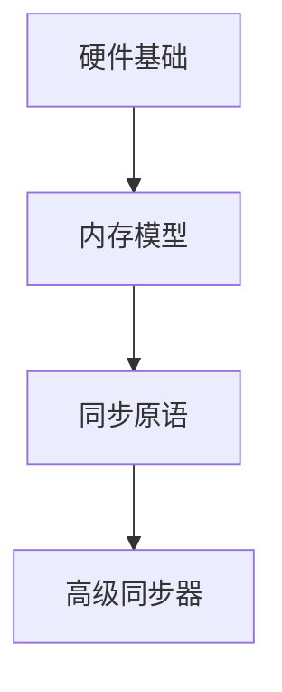

# Knowledge Base Schema

## 1. Purpose

This directory defines how an LLM should read this Hexo note repository and derive a separate, better-organized knowledge base from it.

The goal is not to rewrite the blog itself. The goal is to:

- treat existing blog notes as `raw` source material
- preserve the current Hexo writing workflow
- extract stable concepts, series structure, and cross-note links into a `wiki`
- avoid mixing generated knowledge pages back into the original post corpus by default

## 2. Repo Mapping

For this repository, the conceptual mapping is:

- `raw = source/`
- `raw posts = source/_posts/`
- `raw images = source/images/`
- `schema = source/schema/`
- `wiki = source/wiki/` or a sibling `wiki/` directory outside `source/`

Important:

- `source/` is the real raw root because the markdown and the images must be read together.
- `_posts/` is only the article subdirectory, not the full raw corpus.
- If `schema/` and `wiki/` stay under `source/`, Hexo may publish them unless they are excluded later.

## 3. Working Principles

When an LLM reads and organizes this repository, it should follow these rules:

1. `raw` is read-only unless the user explicitly asks to edit source notes.
2. `wiki` is a derived layer, not a replacement for the original posts.
3. Blog-post structure and knowledge-base structure are allowed to differ.
4. Images are part of the source context and should be considered when understanding a note.
5. The knowledge base should optimize for retrieval and conceptual clarity, not for blog chronology.

## 4. What The Current Corpus Looks Like

The current note set is already organized mostly as topic series rather than scattered daily notes.

Main source families:

- `Java-basic`
- `Java-advanced`
- `concurrency`
- `programmatic-ads`
- `llm-inference`

There are also a few top-level documents in `_posts/` that behave more like internal notes, writing guides, or project plans than public article series.

This means the knowledge-base design should be:

- series-aware
- concept-oriented
- tolerant of a few outlier documents

## 5. Raw Interpretation Rules

### 5.1 Source of truth

For each note, use the following priority when identifying what it is:

1. file path
2. front matter `title`
3. front matter `categories`
4. front matter `tags`
5. first `#` heading in the body
6. image references used inside the note

### 5.2 Series detection

For notes under `_posts/<series>/...`, treat `<series>` as the primary series bucket.

Examples:

- `_posts/Java-basic/...` -> series: `Java-basic`
- `_posts/concurrency/...` -> series: `concurrency`
- `_posts/programmatic-ads/...` -> series: `programmatic-ads`

### 5.3 Ordering

When a filename starts with a numeric prefix such as `01-`, `02-`, `23-`, that prefix is the canonical series order.

Do not rely only on the title text for ordering, because some titles may drift or contain inconsistent numbering.

### 5.4 Canonical title

Use this rule for canonical display title:

1. if front matter `title` is present and meaningful, use it
2. otherwise use the first level-1 heading
3. otherwise derive a readable title from the filename

Notes:

- Some `llm-inference` posts currently use slug-like titles such as `baseline-deployment` or `kvcache`.
- Some internal guide documents use placeholder-style titles.
- These should be normalized in the `wiki` layer even if the raw post remains unchanged.

### 5.5 Images

Images under `source/images/` are part of the raw source.

When summarizing or linking a note:

- preserve the image relationship
- note whether an image is explanatory, diagrammatic, or decorative
- prefer absolute image intent over exact markdown path style

The current corpus mixes `/images/...` and `images/...` references. Treat both as references into the same raw image pool.

## 6. What Belongs In Wiki

The `wiki` layer should not mirror every post one-to-one by default. It should capture stable knowledge objects.

Preferred page types:

- `wiki/index.md`: global entry page
- `wiki/series/<series>.md`: overview of one article series
- `wiki/concepts/<concept>.md`: one concept distilled from multiple posts
- `wiki/maps/<domain>.md`: topic map, learning path, or dependency graph
- `wiki/glossary/<term>.md`: short definition pages for repeated terms

Examples of good wiki objects:

- `Java memory model`
- `CAS`
- `Thread pool scheduling`
- `Programmatic advertising ecosystem`
- `LLM inference optimization techniques`

## 7. Blog Notes Vs Knowledge Pages

The two layers serve different purposes.

Raw blog notes are usually:

- reader-facing
- long-form
- narrative
- series-driven

Wiki pages should be:

- concise
- link-rich
- concept-first
- easy to update incrementally

If a raw article answers "teach me this topic from start to finish", a wiki page should answer:

- what is this
- where does it fit
- what is it related to
- which raw notes explain it best

## 8. How The LLM Uses This Wiki To Answer Questions

When a user asks a question about a topic covered by the wiki, the LLM picks a retrieval path based on the question type. The three layer types form a gradient from "fast lookup" to "deep read".

### The three retrieval paths

```
User asks a question
    │
    ├── "What is X?"
    │     → glossary layer (1-minute answer)
    │       ├── read glossary entry for definition + one-liner context
    │       ├── need more detail? → follow "深入阅读" to concept page
    │       └── need source code / full analysis? → follow "推荐回看原文" to _posts
    │
    ├── "How does X relate to Y?"
    │     → concept layer (5-minute deep read)
    │       ├── read both concept pages
    │       ├── follow "相关概念" wikilinks to trace the dependency graph
    │       ├── check map pages for architecture-level positioning
    │       └── cross-reference multiple concepts to answer comparison questions
    │
    └── "How do I learn this / see the big picture?"
          → map layer (bird's-eye view)
            ├── dependency graph → reading order
            ├── decision tree → scenario-based selection
            └── follow links from map into individual concepts
```

### Example: "What's the relationship between AQS and synchronized?"

The LLM would trace this path:

1. **glossary quick lookup** — Read `AQS.md` and `synchronized.md` glossary entries, confirming the core distinction: AQS is a framework, synchronized is a language built-in
2. **concept comparison** — The AQS concept page's architecture diagram shows both in their respective layers: `synchronized → Monitor → 锁升级` (JVM layer), `AQS → ReentrantLock → Condition` (JDK layer)
3. **map confirmation** — The concurrency map puts `synchronized · Monitor` and `CAS → ReentrantLock` as parallel branches in Layer 2, confirming they are two independent routes to the same problem
4. **cross-references** — "相关概念" links lead to `Object-Monitor` and `LockSupport`, connecting the JVM and JDK paths through shared primitives like `park/unpark`
5. **back to raw** — If the user needs source-level detail, concept pages' "推荐回看原文" point directly to posts 03, 09, 13, 19

The answer is then structured: first the conclusion (what relationship), then the mechanism (why they differ), then practical guidance (when to choose which).

### Rules for the LLM

When answering a domain question:

1. **Start shallow, go deep on demand.** Don't dump a full concept page at a glossary-level question.
2. **Use wikilinks as evidence.** "X is related to Y" should cite the actual link structure, not guess.
3. **Consult the map for positioning.** Placing a concept in its layer hierarchy adds context that a single concept page can't provide.
4. **Fall back to _posts_ for code and narrative.** Concept pages distill principles; raw posts contain step-by-step reasoning and code examples.
5. **Prefer domain subfolder filtering.** `path:"wiki/glossary/programmatic-ads"` scopes answers to one domain and avoids cross-domain confusion.

## 9. Special Handling For This Repo

### 8.1 Treat top-level outliers separately

Top-level files directly under `_posts/` that are not part of a series should be treated as one of:

- internal writing guide
- project plan
- standalone note

They should not automatically be merged into the same learning graph as the Java or ads series.

### 8.2 Prefer conceptual grouping over exact blog categories

Front matter `categories` and directory names are useful hints, but they should not be treated as the final ontology.

Example:

- `Java-basic/10-concurrency.md` belongs logically near the `concurrency` series
- `Java-advanced` and `Java-basic` should be connected as one broader Java knowledge tree

### 8.3 Preserve back-links to raw posts

Every wiki page should keep traceability back to the source notes it was derived from.

At minimum, store:

- source post path
- source title
- series name

## 10. Initial Taxonomy Direction

The first-pass taxonomy for this repository should be:

- `java`
- `java-concurrency`
- `java-backend-engineering`
- `programmatic-ads`
- `llm-systems`
- `writing-and-workflow`
- `project-plans`

This is a working taxonomy, not a fixed truth. It can evolve as the wiki grows.

## 11. Default LLM Behavior

Unless the user says otherwise, the LLM should:

- read from `source/`
- treat `_posts/` and `images/` as one raw corpus
- avoid editing raw notes while building the wiki
- produce structured derived pages in `wiki/`
- keep schema docs focused on rules, not content duplication

## 12. What We Actually Did In This Repo

The schema above describes the target model. This section records how it was actually applied in the current repository.

### 11.1 Implementation pattern used this time

The build process followed this sequence:

1. inspect `_posts/` and identify stable series buckets from directory structure
2. create one `wiki/series/<series>.md` page as the entry point for each major series
3. keep the series page focused on:
   - what this series is about
   - recommended reading order
   - concept entry links
   - back-links into `_posts/`
4. extract stable concepts into `wiki/concepts/<domain>/...`
5. connect concept pages to each other with Obsidian wikilinks
6. keep every concept page traceable back to one or more raw posts

This means the first wiki layer is not "all posts rewritten". It is:

- one navigation page per series
- one growing concept graph per domain
- stable links back to raw articles

### 11.2 Concrete example: `programmatic-ads`

The `programmatic-ads` series was used as the first fully expanded pilot.

The implementation shape is:

- `wiki/series/programmatic-ads.md` as the main hub
- `wiki/concepts/programmatic-ads/` as the concept cluster
- concept pages grouped around:
  - roles: `DSP`, `SSP`, `ADX`, `Ad Network`, `Ad Server`
  - trading: `RTB`, `OA`, `PMP`, `PD`, `PDB`, `Header Bidding`, `Waterfall`
  - protocol: `OpenRTB`, `Native Ads Spec`, `Deal ID`
  - metrics: `Impression`, `CPM`, `CTR`, `CPC`, `CVR`, `CPA`, `ROI`, `ROAS`, `LTV`, `eCPM`, `Fill Rate`, `Viewability`
  - helper platforms: `CMP`, `DMP`, `Analytics Platform`, `Ad Verification`

This domain was expanded gradually instead of being generated all at once.

The practical rule was:

- first create the hub page
- then create the biggest structural pages
- then fill in high-frequency concepts
- then connect missing metrics and protocol neighbors

That staged approach works better than generating dozens of isolated pages in one pass.

### 11.3 Naming and title normalization

The raw post filenames and titles are not always suitable as canonical knowledge-page names.

For the wiki layer, use normalized display names when the term has a standard industry form.

Examples:

- `openrtb` -> `OpenRTB`
- `dsp` -> `DSP`
- `ssp` -> `SSP`
- `adx` -> `ADX`

Rule:

- preserve the raw post as-is unless the user asks to edit it
- normalize only in the `wiki` layer
- use consistent file names and page titles so wikilinks stay stable

### 11.3.1 Wiki file naming convention

When creating wiki pages (concepts, glossary, series, maps), prefer Chinese names whenever the term has a widely-accepted Chinese form. Fall back to English or English abbreviations only when no natural Chinese equivalent exists.

| ✅ 优先中文 | ❌ 避免纯英文 |
|---|---|
| `死锁.md` | ~~`Deadlock.md`~~ |
| `内存屏障.md` | ~~`Memory-Barrier.md`~~ |
| `竞态条件.md` | ~~`Race-Condition.md`~~ |
| `线程饥饿.md` | ~~`Thread-Starvation.md`~~ |

| ✅ 保留英文缩写（无自然中文） | 原因 |
|---|---|
| `AQS.md` | 行业内通用缩写，无中文对应 |
| `CAS.md` | 同上 |
| `MESI.md` | 同上 |
| `JMM.md` | 同上 |
| `Happens-Before.md` | 同上 |
| `ReentrantLock.md` | 类名/API 名，非自然语言 |

The rule of thumb:

> 有自然中文名 → 用中文。只有英文缩写/类名/协议名 → 保留英文。

### 11.3.2 Rename tool

When a wiki page needs to be renamed, do **not** manually rename the file and fix wikilinks by hand — Obsidian will auto-recreate empty placeholder files at old paths from dangling references.

Use the helper script instead:

```bash
# Single rename
python3 schema/rename_wiki_page.py \
  wiki/glossary/concurrency/Deadlock.md \
  wiki/glossary/concurrency/死锁.md

# Preview impact first
python3 schema/rename_wiki_page.py \
  wiki/glossary/concurrency/Deadlock.md \
  wiki/glossary/concurrency/死锁.md \
  --dry-run

# Batch rename from a mapping file (one "old -> new" per line)
python3 schema/rename_wiki_page.py --batch mapping.txt
```

The script does three things atomically:

1. scans all `.md` files under `source/wiki/` for wikilinks pointing to the old name
2. updates every matching `[[old]]` and `[[old|alias]]` to the new name
3. renames the file itself, and updates its frontmatter `title` + first `# heading`

It does **not** touch `_posts/` (raw articles stay unchanged).

### 11.3.3 Link checker

After renames or bulk edits, verify no broken wikilinks remain:

```bash
# Check all wikilinks — report broken references + empty files
python3 schema/check_links.py --empty

# Delete empty auto-created placeholder files
python3 schema/check_links.py --fix
```

The script scans every `.md` file under `source/wiki/`, extracts all `[[wikilinks]]`, resolves each target to a real file path, and reports any that don't exist. It also flags 0-byte files — typically Obsidian auto-creating empty placeholders from dangling references before they're fixed.

A clean run outputs:
```
All wikilinks OK — no broken references, no empty files.
```

### 11.4 Maps and diagrams

Knowledge maps sit under `wiki/maps/<domain>.md` and serve as visual entry points — learning paths, ecosystem overviews, and decision trees. They should use **Mermaid** for diagrams instead of ASCII art, because Obsidian renders Mermaid natively.



Common diagram types for maps:

| 场景 | Mermaid 类型 | 例子 |
|------|-------------|------|
| 依赖关系 | `graph TD` | 并发 7 层概念依赖图 |
| 数据流 / 架构 | `graph LR` | 生态全景角色关系、Worker 执行模型 |
| 决策树 | `graph TD` | 交易模式决策树、故障排查速查 |
| 时序交互 | `sequenceDiagram` | OpenRTB Bid Request/Response |
| 漏斗 | `graph TD` | 广告指标漏斗 |

Rules for maps:

- one map per major domain (`java-concurrency`, `programmatic-ads`, etc.)
- prefer Mermaid over ASCII art — Obsidian renders it, and it stays readable in raw markdown
- link to both concepts and glossary, not just one
- include a recommended reading order referencing `_posts/`
- keep traceability: every concept on the map should have a clickable link

### 11.5 Link style used

The wiki used Obsidian wikilinks as the primary graph mechanism.

Preferred link behavior:

- series pages link to concept pages
- concept pages link to sibling concepts
- concept pages link back to relevant `_posts/...`
- avoid depending only on tags for graph structure

This repository currently benefits more from explicit concept links than from tag-driven graphs.

## 13. Notes And Cautions

### 12.1 Raw notes and wiki should not be mixed casually

Do not rewrite `_posts/` just because a cleaner concept page now exists in `wiki/`.

The separation is intentional:

- `_posts/` keeps writing order, narrative, and original voice
- `wiki/` keeps distilled concepts and graph-friendly structure

### 12.2 Obsidian graph behavior can be misleading at first

In Obsidian, any markdown file can appear as a node, even before a formal wiki structure is created.

This means:

- seeing a graph does not mean the wiki is already designed
- existing article-to-article links may already form a graph
- unresolved or mixed-format links can create confusing extra nodes

So graph appearance should be interpreted carefully.

### 12.3 How to separate article graph and concept graph

For this repository, the cleanest separation is by path filter.

Useful filters:

- `path:"wiki"` -> only derived knowledge pages
- `path:"_posts"` -> only raw articles
- `path:"wiki/concepts/programmatic-ads"` -> only one concept cluster
- `path:"wiki" path:"_posts"` -> mixed view when needed

This is safer than trying to infer the distinction from tags alone.

### 12.4 Tags are not enough for structural knowledge

Tags can create weak clustering, but they do not replace explicit semantic links.

Use tags for:

- rough grouping
- later coloring/filtering

Do not rely on tags alone for:

- learning paths
- concept hierarchy
- dependency structure

### 12.5 Avoid generating too many orphan pages

Every new concept page should ideally satisfy at least two of these:

- linked from a series page or map page
- linked to several sibling concepts
- linked back to one or more raw posts

If a page has no inbound or outbound structure, it adds noise more than value.

### 12.6 Prefer one domain subfolder per concept cluster

For domains that will grow, prefer:

- `wiki/concepts/programmatic-ads/...`
- `wiki/concepts/java-concurrency/...`

instead of putting every concept file flat under one directory.

This keeps graph filters and future maintenance much cleaner.

### 12.7 Hexo publishing risk

If `wiki/` and `schema/` remain under `source/`, Hexo may publish them unless excluded by configuration or theme rules.

That is acceptable for local knowledge work, but should be decided intentionally before public publishing.

### 12.8 Prefer local snapshot diff over full rescans

As the repository grows, do not re-read the whole raw corpus on every sync by default.

Instead, prefer a local snapshot workflow:

- save a baseline snapshot after a known-good wiki sync
- create a fresh snapshot before the next sync
- compare them locally with a script
- read only changed files and changed sections into model context

For this repository, the helper script is:

- `schema/wiki_snapshot.py`

And the workflow reference is:

- `schema/update-workflow.md`

## 14. OSC 8 Terminal Hyperlinks

When the LLM wants the user to open a local markdown file (raw post, wiki page, or schema doc) directly in Obsidian, it can output an **OSC 8 hyperlink** (supported by iTerm2, Warp, WezTerm, and most modern terminals):

```
\033]8;;file:///Users/zs.yuan/Documents/blogs/source/_posts/Java-basic/01-introduction.md\033\\click me\033]8;;\033\\
```

In bash / printf form:

```bash
printf '\e]8;;file://%s\e\\%s\e]8;;\e\\\n' \
  "/Users/zs.yuan/Documents/blogs/source/_posts/Java-basic/01-introduction.md" \
  "01-introduction.md"
```

**However**, when output via `printf` or `echo` in Claude Code, the raw escape sequences often appear as garbled text rather than a clickable link. This is because Claude Code may strip or mangle ANSI escape sequences before rendering.

**Preferred: Markdown link syntax** — simpler, works reliably in Claude Code:

```markdown
[display text](file:///absolute/path/to/file.md)
```

Example:

```markdown
[01-introduction.md](file:///Users/zs.yuan/Documents/blogs/source/_posts/Java-basic/01-introduction.md)
```

This renders as a clickable link in Claude Code's markdown output. When the system default handler for `.md` files is Obsidian, clicking opens the file directly in Obsidian.

Alternatively, Obsidian's native URI scheme can be used if the vault name is known:

```
obsidian://open?vault=blogs&file=_posts/Java-basic/01-introduction.md
```

Rules for the LLM:

- **Prefer markdown links** `[text](file:///path)` — most reliable in Claude Code; no escape sequence issues.
- **Avoid raw OSC 8 via printf/echo** — Claude Code may garble the ANSI escape sequences.
- **Always use absolute paths** with `file://` — relative paths (e.g. `wiki/concepts/Task-Systems.md`) do **not** resolve to clickable links in the terminal. Verified: neither relative-to-cwd nor relative-to-vault-root paths work.
- **Prefer `file://` over `obsidian://`** unless the vault name is explicitly known — `file://` works regardless of Obsidian configuration.

## 15. Concept Page Anti-Patterns — Lessons from Java-Basic

The following mistakes were made during the first attempt to build `wiki/concepts/java-basic/` and required a full rewrite. These rules exist to prevent the same mistakes from happening again.

### 15.1 One concept, one page — do not cram domains into single pages

❌ **Wrong (first attempt):** 8 pages, each packing an entire topic area.

| Bad page | What was crammed in |
|----------|---------------------|
| `JVM-内存与GC.md` | 堆、栈、方法区、类加载、双亲委派、GC 算法、回收器演进、OOM 排查 |
| `Spring-IoC-AOP.md` | IoC、DI、Bean 作用域、AOP、五种通知、Spring Boot 自动配置 |
| `面向对象编程.md` | 封装、继承、多态、抽象、Object 三件套、重写 vs 重载 |

✅ **Correct:** One page = one concept. Concurrency has `CAS.md` (only CAS), `AQS.md` (only AQS). Java-Basic's second attempt: 55 pages — 1 hub + 15 first-level + 39 second-level.

**Rule:** If you find yourself writing multiple `###` subsections that could each stand alone as a page, they should be separate pages.

### 15.2 Flat directory — do not create subdirectories per domain within a concept cluster

❌ **Wrong (first attempt):**
```
wiki/concepts/java-core/       ← 5 separate subdirectories
wiki/concepts/java-jvm/
wiki/concepts/java-spring/
wiki/concepts/java-persistence/
wiki/concepts/java-engineering/
```

✅ **Correct:**
```
wiki/concepts/java-basic/      ← single flat directory, 55 files
wiki/concepts/concurrency/     ← concurrency is the reference model
```

**Rule:** A concept cluster lives in one directory. Use `wiki/concepts/<domain>/` — exactly one level. Obsidian path filters and wikilinks are simpler this way.

### 15.3 解答式 writing — answer "why", not just "what"

❌ **Wrong (first attempt):** Textbook-style summaries. "定义 → 分类表格 → 罗列要点". Reads like a study guide.

✅ **Correct:** Each page explains the concept from multiple angles:

- **这一层回答什么问题** — the questions this concept exists to answer
- **它为什么必须存在** — the fundamental motivation
- **它在协调哪几层东西** — architectural positioning
- **它不是 XX** — correct common misconceptions first
- **为什么 XX 不够** — why the simpler approach fails
- Natural prose paragraphs, not bullet-point dumps

Tables are allowed but only to clarify comparisons — the surrounding text must explain why the comparison matters.

**Rule:** Write as if you're answering a colleague's question, not compiling a reference manual. The glossary already serves the "fast lookup" role.

### 15.4 Concept-to-concept links — the concept layer is self-referencing

❌ **Wrong (first attempt):** The `## 相关概念` section linked to `wiki/glossary/java-basic/xxx`.

```markdown
## 相关概念
- [[wiki/glossary/java-basic/堆|堆内存]]       ← wrong layer
- [[wiki/glossary/java-basic/垃圾回收|垃圾回收]]  ← wrong layer
```

✅ **Correct:** The concept layer links to sibling concept pages.

```markdown
## 相关概念
- [[wiki/concepts/java-basic/内存结构|内存结构]]
- [[wiki/concepts/java-basic/垃圾回收|垃圾回收]]
- [[wiki/concepts/java-basic/类加载|类加载]]
```

**Rule:** Glossary links point to glossary. Concept links point to concept. Series links point to series. Keep layers cleanly separated — the retrieval paths in section 8 depend on this.

### 15.5 Staged build order

The correct build order, validated by the Java-Basic rebuild:

```
1. Read all raw posts, extract titles and section headings
2. Design first-level concept breakdown (10-15 nodes)
3. Create the hub page (Java-Basic-概念总图.md) FIRST
4. Create first-level pages, each as a sub-hub with "这层的主要分支" linking to planned sub-pages
5. User reviews and approves the skeleton
6. Create second-level pages, one concept per file
7. Update first-level pages' "这层的主要分支" to link to newly created sub-pages
8. Add cross-links between sibling concept pages
9. Update series page and map page to point to the new structure
10. Run link checker, verify zero broken references
```

**Anti-pattern:** Do NOT start by creating second-level pages without a hub. Do NOT build the glossary before the concept structure is approved. Do NOT mass-generate pages in parallel without user sign-off on the skeleton first.

## 16. Next Schema Files

After this README, the next useful schema files are:

- `schema/taxonomy.md`: controlled topic hierarchy
- `schema/frontmatter-rules.md`: normalized metadata rules
- `schema/wiki-page-types.md`: templates for series, concept, glossary, and map pages
- `schema/ingestion-rules.md`: how to interpret filenames, headings, and image links
- `schema/rename_wiki_page.py`: rename wiki pages and auto-update all wikilinks
- `schema/check_links.py`: scan all wikilinks and report broken references / empty files
