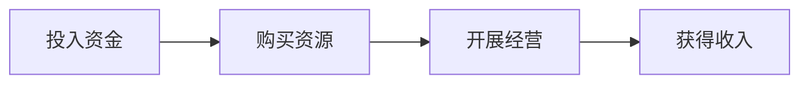
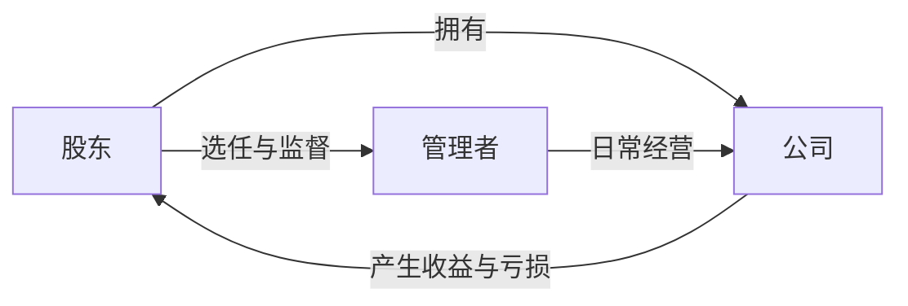
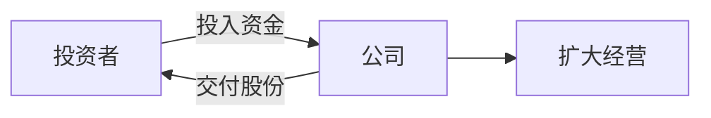
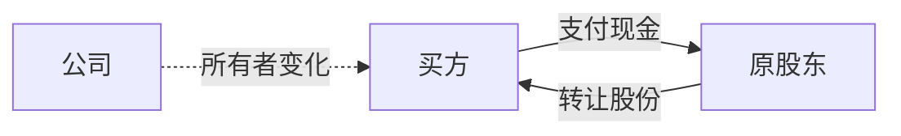
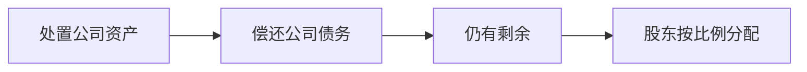

---

title: 从零开始理解股票：从公司所有权到市场价格
date: 2026-07-19
tags:

 - 股票
 - 投资基础
 - 经济学入门

categories:

 - 经济学基础

---

很多人第一次接触股票，看到的是股票软件里不断变化的价格：今天上涨，明天下跌，有人买入，有人卖出。于是股票很容易被理解成一种可以低买高卖的数字商品。

但股票并不是凭空产生的交易筹码。每一只股票背后，首先是一家真实经营的公司。公司需要资金，于是把一部分所有权交给投资者；投资者获得股份后，既可能分享公司发展带来的收益，也要承担公司经营失败的风险。

本文从一家准备扩张的奶茶公司开始，逐步解释所有权、股份、股票、股东、上市、股价、分红、市值和估值之间的关系。读完以后，至少应该能够回答一个基础问题：购买一只股票时，究竟买到了什么？

## 1、公司为什么需要别人的钱

### 1.1 公司经营需要先投入资金

假设小林经营着一家奶茶店。

顾客购买奶茶后，公司可以获得收入，但在收到顾客的钱之前，公司已经需要支付许多费用，例如：

* 租赁店铺；
* 装修门店；
* 购买机器和原材料；
* 支付员工工资；
* 进行宣传和推广。

也就是说，公司经营通常不是先赚钱再花钱，而是先投入一笔资金，购买经营需要的资源，再通过销售商品或服务把钱赚回来。

如果奶茶店经营良好，获得的收入高于房租、工资和原料等成本，公司就产生了利润。

但公司想扩大时，需要的资金会更多。

小林现在只有一家店，希望再开十家新店。每家店都要装修、购买设备并提前招聘员工，总共需要100万元，而小林自己只有20万元。

这时，经营能力并不能立刻解决资金问题。即使新店未来可能赚钱，今天仍然需要先拿出开店的钱。

### 1.2 公司缺钱时有两种基本选择

小林可以向银行借80万元，也可以找别人投资80万元。

这两种方式都会让公司获得资金，但背后的关系完全不同。

| 方式 | 对方提供什么    | 公司付出什么      |
| -- | --------- | ----------- |
| 借款 | 暂时借给公司一笔钱 | 将来归还本金并支付利息 |
| 投资 | 把资金长期投入公司 | 交出公司的一部分所有权 |

如果银行借钱给公司，银行通常不会因此成为奶茶公司的所有者。公司经营得好不好，原则上都要按照合同还款。

如果小明投入80万元，并获得奶茶公司的一部分所有权，他就不只是把钱借给公司，而是成为公司的共同拥有者。

这就引出了理解股票前最重要的概念：什么是所有权？

## 2、什么是公司的所有权

### 2.1 所有权表示某个东西属于谁

假设你购买了一台电脑。

这台电脑属于你，通常意味着你可以决定：

* 自己使用；
* 借给别人；
* 出售；
* 赠送；
* 不允许别人擅自拿走。

这些权利并不是电脑本身的一个零件，而是你和这台电脑之间的一种关系：这台电脑归你所有，你有权依法决定如何处理它。

这种关系就叫所有权。

公司的所有权也是类似的。区别在于，公司不是一件静止的物品，而是一个持续经营、拥有资产、产生收入并承担债务的组织。

### 2.2 拥有公司的一部分意味着什么

如果小林拥有奶茶公司的全部所有权，那么公司发展得好，主要收益归小林；公司经营失败，小林拥有的公司也会贬值。

小明投入资金后，假设双方约定：

* 小林拥有公司60%；
* 小明拥有公司40%。

这时，他们共同拥有这家公司。

小明拥有40%，不是说店里的40%桌子归他、40%奶茶机器归他，而是说他按照40%的比例拥有整家公司。

这部分所有权通常会影响几件事：

* 公司分配利润时，他可能获得相应收益；
* 公司作出重大决定时，他可能拥有一定投票权；
* 公司整体变得更值钱时，他拥有的部分也可能升值；
* 公司经营失败时，他投入的价值也可能损失。

因此，投资者投入的资金不是免费交给公司，而是用资金换取了一部分公司的所有权。

### 2.3 股东不一定亲自经营公司

拥有公司和每天经营公司并不是同一件事。

公司规模较小时，小林既可能是股东，也是每天管理门店的人。但公司规模扩大、股东人数增加以后，不可能由所有股东一起决定每家店购买多少牛奶、招聘哪个店员。

公司里会逐渐出现三个不同角色：

股东是公司的所有者；管理者负责具体经营；公司则是拥有资金、设备并开展业务的主体。

一个人可能同时承担多个角色，但这些角色本身并不相同。

## 3、怎样记录每个人拥有多少公司

### 3.1 为什么需要把所有权切成许多份

如果奶茶公司只有小林和小明两个股东，直接记录60%和40%并不困难。

但以后公司可能有几十个、几百个甚至几十万个股东。每个人投入的金额不同，拥有的比例也不同。公司需要一种统一的方式，准确记录每个人拥有多少。

于是，公司可以把全部所有权划分成许多相同的小份。

假设奶茶公司一共分成100股：

* 小林持有60股；
* 小明持有40股。

这里的每一份就叫作一股。

> 股，是公司所有权被划分后的一份。

如果一家公司总共有100股，你持有10股，那么你拥有公司的10%。

如果公司总共有1亿股，你持有100股，那么你拥有的比例就是一亿分之一左右。

### 3.2 股票和“股”有什么区别

“股”表示公司所有权的一份，但还需要有记录证明这些股份属于谁。

过去可能使用纸质凭证，现在通常记录在电子账户和公司股东名册中。用于证明或记录一个人持有股份的凭证，就是股票。

| 概念 | 含义               |
| -- | ---------------- |
| 股  | 公司所有权的一份         |
| 股票 | 证明或记录某人持有这些股份的凭证 |
| 股东 | 持有公司股份的人         |

日常生活中，人们通常不会严格区分“股”和“股票”。

例如，“我买了100股某公司的股票”，意思是你获得了这家公司100份很小的所有权，并且这些股份记录在你的账户中。

### 3.3 一股不是公司的一件具体物品

假设奶茶公司有十家门店、五十台机器和一百万元现金。

你持有1%的股份，并不表示某一家门店的1%墙壁或者某一台机器的1%归你单独使用。

你拥有的是对整家公司按比例计算的一部分权益。

公司购买新设备、关闭旧门店或者更换经营地点，不需要把某件设备单独交给你。你的股份始终对应整家公司的一部分，而不是某件具体物品。

### 3.4 普通股和优先股有什么不同

我们平时讨论上市公司股票时，通常默认指普通股。

普通股通常包含几项基本关系：

* 分享公司可能进行的分红；
* 参与部分重大事项投票；
* 公司发展时分享价值增长；
* 公司失败时承担股份贬值的风险。

有些公司还可能发行优先股。

优先股的“优先”，主要体现在分红和公司清算时，它通常排在普通股之前。但优先股通常会减少部分投票权，收益方式也可能更加固定。

需要注意，优先股仍然是股权，不是银行存款。公司如果连债务都无法偿还，优先股也可能遭受损失。

## 4、公司为什么要发行股票

### 4.1 公司用所有权换取发展资金

小林的奶茶公司需要100万元扩张资金，但自己只有20万元。

小明愿意投入80万元，条件是获得公司40%的股份。

这个过程可以理解为：

公司获得了发展需要的资金，投资者获得了公司的一部分所有权。

公司把新的股份交给投资者，以换取资金，这个过程叫发行股票。

### 4.2 发行股票和借钱的区别

假设公司向银行借80万元。

即使新店经营不佳，公司仍然需要按照合同偿还本金和利息。银行主要关心公司能否还钱，不一定能够分享公司未来大幅增长的收益。

如果小明用80万元购买股份，公司通常不需要像归还贷款一样，在固定日期把80万元退给小明。

但小明也没有获得“保证收回80万元”的承诺。他获得的是公司40%的所有权。公司发展得好，这部分所有权可能升值；公司经营失败，这80万元也可能全部损失。

因此：

* 债权人获得的是公司还钱的承诺；
* 股东获得的是公司的一部分所有权。

股东承担的风险通常更大，但也可能分享更大的增长收益。

### 4.3 投资者第一次购买股票时，钱去了哪里

公司发行一批新股票时，投资者支付的钱会进入公司。

例如，奶茶公司新发行100万股，每股10元，投资者全部购买，公司就可能获得1000万元资金。

这笔钱属于公司，可以用于：

* 新建门店；
* 购买设备；
* 研发新产品；
* 偿还公司债务；
* 补充日常经营资金。

这里发生的是公司与投资者之间的交换：

> 投资者把钱交给公司，公司把新发行的股份交给投资者。

### 4.4 股票后来再次卖出时，钱去了哪里

小明持有奶茶公司40%的股份。几年后，小明急需现金，决定把股份卖给小红。

小红把钱交给小明，小明把股份转给小红。

这次交易中，公司一般不会再次收到这笔钱。公司原来获得的80万元，可能早已被用于开店和经营。

变化只是：

* 原来小明拥有40%；
* 后来小红拥有40%。

因此要区分两种情况：

| 交易         | 钱进入哪里  |
| ---------- | ------ |
| 公司发行新股票    | 进入公司   |
| 股东之间交易已有股票 | 进入卖方股东 |

## 5、股票价格为什么会变化

### 5.1 股票价格不是公司长期规定的

公司第一次发行股票时，会确定一个发行价格。

但股票进入公开市场后，交易价格不再由公司每天决定，而是由市场中的买方和卖方不断报价形成。

假设有人想买一股奶茶公司的股票：

* 买家A最多愿意支付10元；
* 买家B最多愿意支付11元；
* 买家C最多愿意支付12元。

同时，卖方最低愿意接受的价格分别是：

* 卖家A最低接受12元；
* 卖家B最低接受12.5元；
* 卖家C最低接受13元。

当愿意支付12元的买家遇到愿意接受12元的卖家时，交易就可以发生。12元也就成为这笔交易的成交价。

### 5.2 每个买家和卖家都有自己的预期

卖家不愿意按当前价格出售，通常是因为他认为股票以后可能更值钱，或者当前价格低于自己愿意接受的最低价格。

买家愿意提高报价，则可能是因为他认为即使以更高的价格买入，未来仍然有获利空间。

因此，股价的直接形成过程是：

* 买方不断提出愿意支付的价格；
* 卖方不断提出愿意接受的价格；
* 双方价格相遇时完成交易。

如果很多人都想买，但愿意出售的人较少，买家可能需要提高价格才能买到，股价更容易上涨。

如果很多人急着卖，但买家很少，卖方可能需要降低价格，股价更容易下跌。

这里的“更容易”不等于“必然”。因为市场里同时存在大量买家和卖家，每个人的资金、判断和交易时间都不同。

### 5.3 股票价格反映的是市场估值

假设奶茶公司刚成立时只有一家店，每年利润10万元。

几年后，公司已经有十家店，每年利润100万元。即使小明当初只花了80万元获得股份，后来其他人也可能愿意支付更高价格购买。

原因不是股票自己产生了价值，而是股票背后对应的公司已经发生变化。

市场中的投资者会考虑：

* 公司现在能赚多少钱；
* 未来可能赚多少钱；
* 公司拥有多少资产；
* 公司欠了多少债务；
* 公司可能面临哪些风险。

然后决定自己愿意用多少钱购买股份。

因此，股票价格不是公司的营收，也不是公司账户里的现金，而是市场参与者目前愿意为这部分公司所有权支付的价格。

### 5.4 公司赚钱为什么不一定上涨

假设市场原本预计奶茶公司今年利润为100万元。

如果公司最终利润也是100万元，虽然公司确实赚钱了，但结果与市场预期相同，股票价格未必明显上涨。

如果实际利润为120万元，表现超过预期，投资者可能提高对公司的判断，股价更可能上涨。

如果实际利润为80万元，公司仍然盈利，但低于原来的100万元预期，股价反而可能下跌。

股票市场经常比较的是：

> 实际经营结果，与市场原来已经形成的预期。

因此：

* 公司盈利，不代表股价一定上涨；
* 公司亏损，也不代表股价当天一定下跌；
* 实际结果超过预期，股价通常更容易上涨；
* 实际结果低于预期，股价通常更容易下跌。

但市场还会同时考虑未来计划、行业变化和风险，因此任何单一条件都不能保证股价一定朝某个方向变化。

## 6、股东怎样从股票中获得收益

### 6.1 以更高价格卖出股票

假设你用10元购买一股奶茶公司的股票，后来以15元卖出。

你获得的价格差是5元。

这部分收益来自其他投资者后来愿意用更高价格购买你的股份。

但在你真正卖出之前，15元只是当前市场价格。如果第二天价格跌回8元，你账户里原来显示的盈利也会消失。

因此：

* 没有卖出时的账面盈利叫浮盈；
* 没有卖出时的账面亏损叫浮亏；
* 真正卖出后，收益或损失才被实现。

### 6.2 公司把部分利润分给股东

公司经营获得利润后，可以决定拿出一部分分配给股东，这叫分红。

假设奶茶公司一共有100万股，决定拿出100万元分红。

平均到每一股，就是每股分红1元。

* 持有1股，获得1元；
* 持有100股，获得100元；
* 持有10万股，获得10万元。

因此，分红不是每个股东平均分，而是每一股获得相同金额。持有的股份越多，获得的分红越多。

### 6.3 公司赚钱后为什么不一定全部分掉

公司今年赚了100万元，可以有两种主要处理方式：

* 把利润分给股东；
* 把利润留在公司继续经营。

如果公司把钱用于开新店，而新店未来能产生更多利润，那么公司整体可能变得更值钱。股东虽然没有立刻拿到现金，但持有的是一家规模更大的公司。

反过来，如果管理者用这笔钱开了一批持续亏损的门店，公司价值可能下降。

因此，不分红本身不是好事，也不是坏事。关键问题是：

> 公司留下来的利润，能否创造出更多价值？

### 6.4 分红不是凭空增加的财富

假设一股股票价值10元，公司决定每股分红1元。

公司把1元现金支付给股东后，公司自身少了这1元现金。在其他情况不变时，股票价格会相应反映公司资产的减少。

理论上可能出现：

* 分红前，股票价值约10元；
* 分红后，股票价值约9元；
* 股东同时收到1元现金。

股东仍然拥有约10元总价值，而不是凭空多出1元。

现实中的股票价格还会受到当天市场交易影响，不一定刚好下降1元，但分红不是免费创造财富，这个基本关系不变。

### 6.5 股票投资的总收益

判断一笔股票投资最终赚了多少，不能只看股票价格，还要考虑收到的分红。

假设：

* 100元买入；
* 105元卖出；
* 持有期间收到3元分红。

总收益是8元，总收益率为8%。

因此：

> 股票总收益，来自股价变化和分红两部分。

## 7、公司、股东和债务之间是什么关系

### 7.1 公司和股东不是同一个钱包

小林创办奶茶公司后，公司可能拥有：

* 公司银行账户里的现金；
* 奶茶机器；
* 原材料和库存；
* 门店装修和其他资产。

小林个人则可能拥有：

* 自己的工资和存款；
* 自己购买的电脑；
* 自己名下的房屋。

即使小林是公司股东，公司财产和小林个人财产原则上仍然是两套不同的财产。

公司借的钱，首先是公司的债务；公司赚的钱，也首先属于公司，而不是股东可以随意从账户里拿走的个人现金。

### 7.2 什么是有限责任

假设小林成立公司时承诺投入10万元。

公司后来经营失败，欠下100万元。

公司要先用自己的全部财产偿还债务。如果公司拥有30万元现金和设备，就要把这些财产用于偿债。

但在正常履行出资义务的情况下，小林通常不需要把自己的全部个人财产拿出来，替公司偿还剩余70万元。

这就是有限责任的基本含义：

> 公司以自己的全部财产承担公司债务；股东通常只在自己承诺出资的范围内承担责任。

“有限”限制的是股东个人承担公司债务的范围，不是说公司只需要偿还有限的钱。

### 7.3 什么是认缴和实缴

假设小林承诺向公司投入10万元。

这10万元叫认缴出资额，也就是他承诺投入公司的金额。

如果小林已经把6万元交给公司：

* 认缴出资额是10万元；
* 实缴出资额是6万元；
* 尚未投入的金额是4万元。

公司经营失败时，小林不能因为公司是有限责任公司，就拒绝履行剩余4万元的出资承诺。

他需要先把承诺的10万元出资完成。完成以后，在正常情况下，不需要继续用个人财产替公司偿还其余债务。

### 7.4 股东不是按照持股比例替公司还债

假设公司欠债100万元，现有公司财产30万元。

公司有两个股东：

* 小林认缴10万元，已经全部投入；
* 小明认缴20万元，只投入12万元。

公司先用自己的30万元财产偿还债务。

小林已经完成出资，通常不需要继续出钱。小明还有8万元尚未投入，需要完成剩余出资。

并不是两个股东按照持股比例，把剩余70万元债务全部分摊到个人名下。

持股比例决定的是股东拥有公司多少，以及可能分享多少收益；它不代表公司每产生一笔债务，股东都要按比例从个人钱包偿还。

## 8、公司为什么可能欠很多债，却只剩很少财产

### 8.1 借来的钱会在经营中被消耗

假设奶茶公司原本拥有30万元，又向银行借入70万元。

公司一开始获得100万元资金，但同时形成70万元债务。

公司用这些钱：

* 装修门店30万元；
* 购买设备20万元；
* 支付房租15万元；
* 支付工资20万元；
* 购买原材料10万元；
* 剩余现金5万元。

工资和房租支付出去后，不会继续作为公司财产存在。装修虽然曾经花费30万元，但门店关闭时可能只能以很低价格处理。原材料如果过期，也可能失去价值。

如果经营成功，公司能通过卖奶茶把这些钱重新赚回来。

如果经营失败，收入不足以覆盖支出，钱就会不断减少，而银行贷款仍然存在。

### 8.2 亏损怎样逐渐消耗公司财产

假设公司每个月收入10万元，但每个月需要支出15万元。

每个月亏损5万元。

公司可以先使用原来的现金维持经营；现金用完后，可能继续借钱；如果经营始终没有改善，最终就会出现：

* 员工工资无法支付；
* 房租无法支付；
* 供应商货款无法结清；
* 银行贷款无法按期偿还。

公司虽然可能还有机器、库存和装修，但这些资产真正出售时，价值可能远低于当初购买价格。

于是就会出现：

* 公司欠债70万元；
* 剩余现金和可出售资产只有15万元。

不是另外55万元凭空消失，而是这些资金已经在失败的经营过程中，转化为无法收回的房租、工资、装修和其他成本。

## 9、公司倒闭后，股票会怎样

### 9.1 “倒闭”通常表示公司无法继续经营

“倒闭”是日常说法，通常表示公司已经无法持续支付经营费用和到期债务，只能停止经营。

公司停止经营后，不是简单地关门就结束，还要处理：

* 剩余现金；
* 设备和库存；
* 员工工资；
* 银行贷款；
* 供应商货款；
* 股东剩余权益。

对公司财产和债务进行处理的过程，可以称为清算。

### 9.2 债务为什么不一定全部还清

假设公司欠债100万元，但把全部资产出售后只得到30万元。

公司必须把这30万元用于偿还债务，但无法凭空产生剩余70万元。

所以：

> 公司必须拿出依法可以找到和处理的全部财产偿债，不代表所有债权人都一定能收回全部金额。

如果同一受偿顺序的债权人合计被欠100万元，而可分配的钱只有10万元，他们可能只能按照比例收回其中一部分。

### 9.3 股东为什么排在债权人后面

债权人把钱借给公司，或者向公司提供商品和服务，获得的是公司付款或还款的权利。

股东则是公司的所有者。公司经营成功，股东可以分享剩余收益；公司经营失败，股东也承担剩余损失。

公司清算时，通常先处理公司债务。只有债务处理后仍有剩余财产，才轮到股东按照持股比例分配。

如果公司全部资产连债务都不够偿还，普通股东通常拿不到剩余财产。

这时股票可能失去全部价值。

### 9.4 为什么普通买股票最多亏掉本金

假设你使用自己的1000元购买普通股票。

公司经营失败，股票最终价值变成0，你最多损失投入的1000元。

股票价格不会变成负数，因为一份公司所有权最差可以没有价值，但不会因为这份所有权本身要求普通股东额外倒贴无限金额。

这里的前提是，你只使用自己的资金购买股票，没有借钱投资，也没有作出额外担保。

如果借钱购买股票，亏损可能超过自己的原始本金。这属于更复杂的交易方式，本文不展开。

## 10、股份有限公司和上市公司有什么区别

### 10.1 有股份不代表已经上市

公司可以采用不同的所有权记录方式。

一家规模较小的有限责任公司，可能直接记录：

* 小林拥有60%股权；
* 小明拥有40%股权。

股份有限公司则把公司所有权划分为许多标准化股份。

例如：

* 公司共有1000万股；
* 小林持有600万股；
* 小明持有400万股。

这家公司已经有股份，但股份可能只掌握在创始人、员工和少数投资者手中。普通人不能在股票软件里自由购买。

因此：

> 股份有限公司不等于上市公司。

### 10.2 什么是上市

当一家符合条件的股份有限公司完成相应程序，使股票进入公开交易市场后，普通投资者可以公开买卖这些股票。

这个过程叫上市。

上市前，股份主要在少数股东之间持有和转让。

上市后，股票可以在公开市场中持续交易，股东人数可能大幅增加。

可以理解为：

* 股份有限公司描述公司所有权如何划分；
* 上市公司描述这些股份是否进入公开市场交易。

因此，上市是股份有限公司可能进入的一种状态，而不是另一种完全不同的公司。

### 10.3 公司为什么要上市

公司上市最直接的目的之一，是让更多投资者能够购买公司新发行的股份，从而筹集较大规模的资金。

奶茶公司如果希望一次开设几百家门店，可能需要数亿元资金。只依靠创始人、少数投资者或银行贷款，未必能够满足需求。

公司上市后，可以面向更多投资者发行股票。

但上市也有代价。

公司需要向市场公开更多经营和财务信息，接受监管和股东监督。原股东也不再独自拥有公司，重大决策需要考虑更多股东的利益。

因此，上市不是单纯获得资金，而是用更公开、更规范的经营方式，换取进入大规模资本市场的机会。

## 11、公司第一次上市卖股票时，价格怎样形成

### 11.1 什么是发行价

公司第一次公开发行股票时，会确定一个价格。

例如，奶茶公司第一次面向公众发行股票，每股价格为10元。

这个10元叫发行价。

投资者按照发行价购买新股票，资金进入公司，公司把新发行的股份交给投资者。

### 11.2 发行价是不是公司自己决定的

发行价通常不是公司管理者随意拍脑袋决定。

公司和帮助完成发行的专业机构，会参考：

* 公司现在拥有多少资产；
* 公司当前利润情况；
* 未来增长可能性；
* 公司面临的风险；
* 同类上市公司的市场价格；
* 潜在投资者愿意支付的价格。

部分投资者可能表达：

* 每股8元愿意购买100万股；
* 每股10元愿意购买80万股；
* 每股12元愿意购买30万股。

发行方再结合市场需求、公司情况和发行安排，形成最终发行价格。

因此，发行价同时包含公司对自身价值的判断，也要考虑投资者真正愿意支付多少钱。

### 11.3 发行价和上市后的股价不同

假设发行价为10元。

公司第一次把新股票卖给投资者时，每股收到10元。

股票正式开始公开交易后，投资者之间可能以8元、12元或者15元成交。后面的价格是市场价。

| 价格  | 形成时间      | 资金流向     |
| --- | --------- | -------- |
| 发行价 | 公司发行新股票时  | 进入公司     |
| 市场价 | 上市后投资者交易时 | 通常进入卖方股东 |

发行价定得较低，上市后可能有很多人愿意购买，价格容易上涨。

发行价定得过高，投资者认为公司不值这个价格，上市后也可能下跌。

## 12、公司上市后还能继续发行股票吗

### 12.1 公司可以再次发行新股票

上市并不代表公司以后不能再发行股票。

几年后，奶茶公司计划建设新的生产基地，需要更多资金，可以再次发行一批新股票，让投资者购买。

这类行为可以理解为公司再次通过股权融资筹集资金。

公司发行新股时：

* 公司总股数增加；
* 投资者支付的钱进入公司；
* 原股东拥有的股数可能不变；
* 原股东在公司中的比例可能下降。

### 12.2 什么叫股权稀释

假设公司原来共有100股，你持有10股。

你的持股比例是10%。

后来公司新增发行100股，总股数变成200股。你仍然持有10股，但持股比例变成5%。

你的股票没有被拿走，股数也没有减少，但你在全部股份中的占比下降了。

这就叫股权被稀释。

增发不一定是坏事。

如果公司通过新增股票获得资金，并利用这些资金创造了更大价值，即使原股东持股比例下降，他持有股份的总价值仍可能提高。

判断增发是否合理，不能只看持股比例是否下降，还要看公司用新增资金做了什么。

## 13、分股、合股和股票回购是什么

### 13.1 分股只是把每一股切得更小

假设你持有10股，每股价格100元，总价值1000元。

公司决定一股拆成两股。

拆分后：

* 你持有20股；
* 每股价格理论上变成约50元；
* 总价值仍然约1000元。

公司全部股东的股票都会按照相同比例增加，因此你的持股比例不会变化。

分股类似于把一张100元纸币换成两张50元纸币。数量变多，但总价值没有因为拆分本身增加。

公司进行分股，常见原因是单股价格较高，希望降低每股交易价格，使买卖更方便。

### 13.2 合股只是把多股合成一股

合股与分股相反。

假设你持有100股，每股1元，总价值100元。

公司决定10股合成1股。

合并后：

* 你持有10股；
* 每股价格理论上变成约10元；
* 总价值仍然约100元。

公司总股数和每个股东的股数同时按照相同比例减少，因此持股比例不变。

合股本身不会让公司真正变得更值钱，只是调整每一股对应的份额大小。

### 13.3 股票回购是公司买回自己的股份

公司也可以使用自己的资金，从股东手里买回本公司的股票。

假设公司原有100股，你持有10股。

公司从其他股东手里买回20股并注销，总股数变成80股。你仍然持有10股，持股比例从10%提高到12.5%。

股票回购与增发方向相反：

* 增发使总股数增加，原股东比例可能下降；
* 回购并注销使总股数减少，剩余股东比例可能提高。

但回购不一定总是好事。

如果公司有大量闲置资金，又认为股票价格较低，回购可能对剩余股东有利。

如果公司本来资金紧张，却借钱高价回购股票，反而可能增加债务和经营风险。

### 13.4 四种股数变化怎样区分

| 操作    | 总股数变化 |   持股比例变化 | 公司资金变化 |
| ----- | ----: | -------: | -----: |
| 增发    |    增加 |  原股东可能下降 |  获得新资金 |
| 回购并注销 |    减少 | 剩余股东可能提高 | 支出公司资金 |
| 分股    | 按比例增加 |       不变 |  无新增资金 |
| 合股    | 按比例减少 |       不变 |  无新增资金 |

理解这些变化时，最重要的是区分：

> 公司是否真的增加或减少了所有权份额，以及资金是否真正进入或流出公司。

## 14、营收、利润、净资产和市值分别是什么

### 14.1 营收表示公司卖了多少钱

假设奶茶公司一年卖出大量奶茶，一共收到1000万元。

这1000万元叫营收。

营收表示公司通过销售商品或服务获得了多少收入，但不表示公司真正赚了1000万元。

因为公司还要支付：

* 原材料；
* 员工工资；
* 店铺房租；
* 水电费用；
* 宣传费用；
* 税费和其他成本。

### 14.2 利润表示扣除成本后剩多少钱

假设公司营收1000万元，各项成本合计900万元。

公司的利润就是100万元。

因此：

> 营收表示公司收了多少钱，利润表示扣掉经营成本后真正剩下多少。

一家公司营收很高，也可能因为成本更高而亏损。

### 14.3 净资产表示扣除债务后属于股东的账面部分

假设公司拥有：

* 现金200万元；
* 设备300万元；
* 库存100万元；
* 其他资产400万元。

总资产为1000万元。

公司同时欠银行和供应商400万元。

净资产就是：

1000万元资产减去400万元债务，等于600万元。

净资产可以理解为，公司账面上的全部资产扣除全部债务后，剩余属于股东的部分。

但账面净资产不代表公司倒闭时一定能卖出相同金额。旧设备、库存和装修真正处理时，可能低于账面价值。

### 14.4 市值表示市场给整家公司开的价格

假设奶茶公司总共有100万股，每股市场价格10元。

公司市值就是1000万元。

> 市值等于公司总股数乘以当前每股价格。

市值不是公司银行账户里的现金，也不是公司一年营收或者利润。

它表示按照当前股票市场价格计算，整家公司所有股份合计值多少钱。

如果股价从10元上涨到15元，市值从1000万元提高到1500万元。

这增加的500万元不会自动进入公司账户。只是市场愿意用更高价格购买公司股份，因此市场估值提高了。

### 14.5 为什么不能只看每股价格

假设两家公司：

| 公司   |   总股数 | 每股价格 |  市值 |
| ---- | ----: | ---: | --: |
| 奶茶公司 | 100万股 | 100元 | 1亿元 |
| 软件公司 |   1亿股 |   2元 | 2亿元 |

虽然软件公司每股只需要2元，但它的总股数更多，整家公司市值反而更大。

每股价格只是看公司所有权被切成了多少份。不能因为某只股票每股价格低，就认为这家公司一定便宜。

## 15、怎样把公司的数据换算到每一股

### 15.1 什么是每股收益

假设奶茶公司一年利润100万元，总共有100万股。

平均到每一股，每股对应1元利润。

这1元就叫每股收益。

> 每股收益表示公司在一段时间内，平均为每一股创造了多少利润。

每股收益不是股东一定能够收到的钱。

公司每股赚1元，可以只分红0.3元，把剩余0.7元留在公司继续经营。

因此：

* 每股收益表示公司赚到的利润；
* 每股分红表示公司真正发给股东的现金。

### 15.2 什么是每股净资产

假设公司净资产1000万元，总共有100万股。

每股净资产就是10元。

它表示从账面上计算，每一股平均对应多少属于股东的净资产。

但股票市场价格不一定等于每股净资产。

每股净资产由公司的资产和债务计算得出，股票价格则由市场中的买卖双方形成。

因此可能出现：

* 每股净资产10元，股票价格15元；
* 每股净资产10元，股票价格7元。

这并不矛盾，因为一个是账面数据，一个是市场估值。

## 16、怎样理解股票的估值

### 16.1 估值是在判断市场价格高不高

假设两家奶茶公司每年都赚100万元。

* A公司的市值是1000万元；
* B公司的市值是3000万元。

虽然两家公司现在赚得一样多，市场却给B公司更高的价格。

可能是因为市场认为：

* B公司的品牌更强；
* B公司未来能够开更多门店；
* B公司的利润增长更快；
* B公司面临的风险更小。

估值就是市场根据公司现在的经营情况、未来预期和风险，对公司给出的价格水平。

### 16.2 什么是市盈率

假设一只股票每股价格20元，每股收益1元。

市盈率是20。

> 市盈率等于每股价格除以每股收益。

它表示市场愿意为公司每1元利润支付多少价格。

另一家公司每股价格也是20元，但每股收益2元，市盈率就是10。

虽然两家股票价格相同，第二家公司每股创造的利润更多，因此两者的价格与利润关系不同。

### 16.3 市盈率低为什么不一定便宜

市盈率低可能意味着股票价格相对于当前利润较低，但也可能意味着市场认为：

* 公司利润未来会下降；
* 公司所在行业正在衰退；
* 公司面临较大债务或经营风险；
* 当前利润只是暂时现象。

市盈率高也不一定代表股票一定不值得买。市场可能预期公司未来利润快速增长。

因此，市盈率只是把价格和利润连接起来，不能单独判断股票是否值得购买。

### 16.4 什么是市净率

假设每股股票价格15元，每股净资产10元。

市净率是1.5。

> 市净率等于每股价格除以每股净资产。

它表示市场愿意为账面上每1元净资产支付多少价格。

但净资产里可能包含已经老旧的设备、难以出售的库存，也可能没有完整体现品牌、技术和用户关系等价值。

因此，市净率同样只是观察公司的一个角度。

### 16.5 好公司为什么不一定是好股票

一家经营优秀的公司，不代表它的股票在任何价格下都值得购买。

假设市场已经对一家公司抱有极高期待，股票价格也已经很高。即使公司继续增长，只要增长速度低于原来的期待，股价仍可能下跌。

购买股票时实际上在判断两个问题：

* 这是不是一家能够持续创造价值的公司；
* 现在为了拥有这家公司的一部分，需要支付的价格是否合理。

只判断公司好不好，却不考虑购买价格，仍然可能产生不理想的投资结果。

## 17、持有股票时怎样理解收益和风险

### 17.1 浮盈不等于已经获得现金

假设你用10元买入一股股票，当前市场价格涨到15元。

账户显示盈利5元，但只要没有卖出，这5元就只是浮盈。

第二天股票可能继续上涨，也可能跌回8元。

真正卖出以后，收益才会转化为现金并确定下来。

因此，别人说自己的股票赚了10万元，可能只是按照当前市场价格计算的账面盈利，不一定已经卖出并收到10万元现金。

### 17.2 下跌和上涨的百分比并不对称

假设股票价格从100元下跌50%，会变成50元。

之后即使上涨50%，也只是从50元上涨到75元，而不是回到100元。

要从50元回到100元，需要上涨100%。

原因是每一次百分比变化，都是按照当时的价格计算。

因此，亏损越大，回到原来金额需要的上涨比例越高。这也是为什么控制大幅亏损非常重要。

### 17.3 收益率用来比较不同金额的投资

一个人投入100元赚10元，另一个人投入1000元赚20元。

第二个人赚到的绝对金额更多，但收益率只有2%；第一个人的收益率是10%。

因此：

* 收益金额表示实际赚了多少钱；
* 收益率表示本金增长了多大比例。

比较不同投资结果时，收益率通常比单纯的盈利金额更有意义。

### 17.4 股票投资承担的是公司和市场的双重不确定性

购买股票以后，投资者既承担公司的经营风险，也承担市场价格波动。

公司可能面临：

* 产品卖不出去；
* 成本持续提高；
* 管理者作出错误决策；
* 债务过高；
* 行业需求下降。

市场价格还可能受到投资者预期变化影响。即使公司当前经营没有明显变化，市场中的人变得更悲观，股价也可能下降。

因此，股票不是承诺固定回报的产品，而是对公司未来经营结果的一种所有权投资。

## 总结

股票最初不是为了让人们在市场里猜测价格，而是源于公司对资金的需求。

一家公司想扩大经营，却没有足够资金，可以让投资者用钱换取一部分所有权。为了准确记录每个人拥有多少，公司把所有权划分成股份；股票则负责证明和记录这些股份属于谁。投资者因此成为股东，既可能分享公司利润和价值增长，也要承担公司失败时股份贬值甚至归零的风险。

公司发行新股票时，投资者的钱会进入公司；股票被原股东卖给其他投资者时，钱通常只在买卖双方之间流动，公司只是更换了一部分所有者。股票上市以后，买家和卖家根据对公司未来的不同判断不断报价，最终形成市场价格。因此，股价不是公司的营收、利润或者现金余额，而是市场愿意为公司所有权支付的价格。

营收、利润和净资产描述公司的经营与财务状态；股价和市值描述市场当前给公司的估值。两者相互影响，却并不相等。公司赚钱不代表股票一定上涨，市值提高也不代表同等现金进入公司。判断股票时，既要理解公司能否创造价值，也要考虑当前市场价格是否已经包含过高的期待。

理解到这里，股票就不再只是软件里不断跳动的数字。它首先是一家真实公司的部分所有权，价格变化、分红、增发、回购、分股和公司倒闭，都可以从这条所有权关系继续推导出来。
