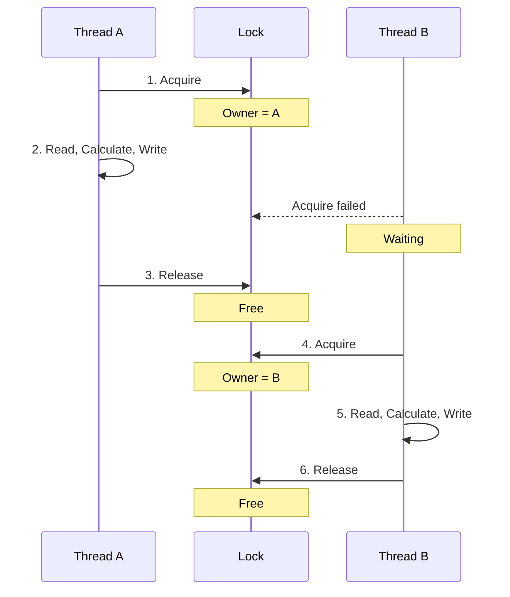
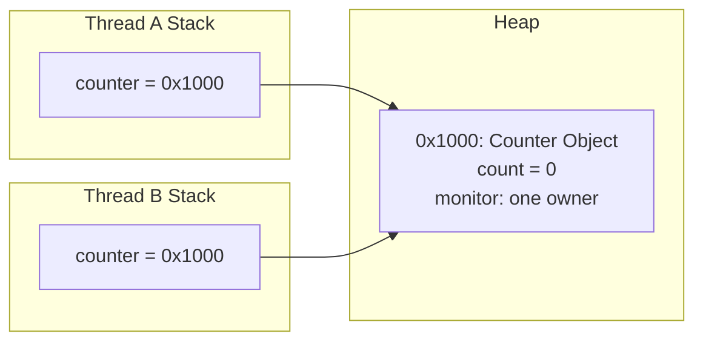
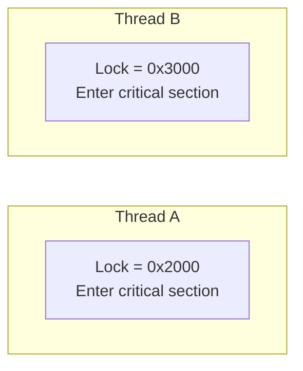

title: Java高并发底层原理（三）—— synchronized 为什么能够保证线程安全
date: 2026-07-02
abbrlink: 03
tags:
  - Java
  - 高并发
  - synchronized
  - 线程安全
categories:
  - java-concurrency
---


上一章确认了一件事:`count++` 由读、算、写三步组成，两个线程可能读到同一个旧值、算出同一个新值，互相覆盖。要解决这个问题，不是让加法变快，也不是减少线程，而是给"读—算—写"这一组操作定一条规则:一个线程在执行的时候，别的线程不能进来。

`synchronized` 就是用来定这条规则的。这一章只讲它最基础的能力:怎么靠一把锁实现互斥、互斥为什么能保护复合操作、锁对象选错了为什么保护会失效。

## 1. 把复合操作放进临界区

把上一章的计数器改一下:

```java
public class CountDemo {

    private static final int TIMES = 1_000_000；

    static class Counter {

        private int count = 0；

        public synchronized void increment() {
            count++；
        }

        public int getCount() {
            return count；
        }
    }

    public static void main(String[] args) throws InterruptedException {
        Counter counter = new Counter()；

        Thread threadA = new Thread(() -> {
            for (int i = 0； i < TIMES； i++) {
                counter.increment()；
            }
        })；

        Thread threadB = new Thread(() -> {
            for (int i = 0； i < TIMES； i++) {
                counter.increment()；
            }
        })；

        threadA.start()；
        threadB.start()；

        threadA.join()；
        threadB.join()；

        System.out.println("expected = " + TIMES * 2)；
        System.out.println("actual   = " + counter.getCount())；
    }
}
```

只改了一个地方:`increment()` 加了 `synchronized`。`count++` 本身还是读、算、写三步，JVM 没有把它变成一条指令。变的是执行权限——一个线程进了 `increment()`，另一个线程就不能同时进同一个对象的这段代码。

这段被保护起来的代码叫**临界区(Critical Section)**。这里的临界区就是整个 `increment()` 方法，保护的是字段 `count`。

## 2. synchronized 怎么实现互斥

每个 `synchronized` 都对应一个锁对象。线程进临界区之前先要拿到这把锁，执行完再释放。同一时刻只有一个线程能持有同一把锁，所以用同一把锁保护的代码不可能被两个线程同时执行。

一种可能的执行过程:




Thread B 不是不能干活，它只是进不了这把锁保护的临界区。A 释放锁之后 B 才能拿到锁往下执行。这样一来，两次 `count++` 之间只会是完整的先后关系，不会再出现两个线程同时读到旧值的情况。

这种"同一时刻只允许一个线程进入"的特性叫**互斥(Mutual Exclusion)**。它不改变单个线程内部的执行步骤，改变的是多个线程能以什么方式组合执行。`count++` 本身依然不是一条原子指令，但对所有用同一把锁的线程来说，整个临界区表现得就像一个不能被插队的整体。

## 3. synchronized 锁的是对象，不是代码

习惯上说"给方法加锁"，但准确地说，`synchronized` 锁住的不是一段代码，而是一个对象。代码只是规定:线程必须先拿到某个对象的锁，才能往下执行。

实例同步方法:

```java
public synchronized void increment() {
    count++；
}
```

等价于:

```java
public void increment() {
    synchronized (this) {
        count++；
    }
}
```

这里锁的是 `this`，也就是当前这个 `Counter` 实例。如果 A、B 两个线程调用的是同一个 `Counter` 对象，它们抢的就是同一把锁；如果调用的是两个不同的 `Counter` 对象，那就是两把不同的锁，两个线程可以同时各跑各的。

```java
Counter counterA = new Counter()；
Counter counterB = new Counter()；

Thread threadA = new Thread(counterA::increment)；
Thread threadB = new Thread(counterB::increment)；
```

这段代码里两个线程根本没竞争同一把锁，因为 `counterA` 和 `counterB` 是两个对象。实例同步方法只能保护当前这一个实例的状态，保护不了同类型的其他对象。

锁和对象的关系画出来是这样:




图里的 `monitor` 表示同步语义，不代表 Java 对象里真有这么一个能直接访问的字段。JVM 会给对象配一套监视器锁(Monitor)机制，线程通过它完成进入、退出、竞争。具体怎么实现——对象头、锁记录这些——留到后面讲锁实现细节的章节。

## 4. synchronized 的三种写法

`synchronized` 能用在实例方法、静态方法、代码块上。三种写法核心逻辑一样，区别只在锁的是谁、临界区多大。

### 4.1 实例同步方法

```java
public synchronized void increment() {
    count++；
}
```

锁的是 `this`。同一个对象上所有的同步实例方法共用一把锁，哪怕方法名不一样，也不能被两个线程同时进入。

```java
public synchronized void increment() {
    count++；
}

public synchronized void reset() {
    count = 0；
}
```

A 在执行某个对象的 `increment()` 时，B 不能同时执行同一个对象的 `reset()`——竞争关系看的是锁，不是方法。

### 4.2 静态同步方法

```java
public static synchronized void increment() {
    count++；
}
```

静态方法不属于哪个实例，锁的不是 `this`，而是这个类对应的 `Class` 对象。等价于:

```java
public static void increment() {
    synchronized (Counter.class) {
        count++；
    }
}
```

实例锁和类锁是两把完全不同的锁。一个线程占着某个 `Counter` 实例的锁，不影响另一个线程去拿 `Counter.class` 的锁，所以实例同步方法和静态同步方法可以同时跑。

### 4.3 同步代码块

```java
private final Object lock = new Object()；

public void increment() {
    synchronized (lock) {
        count++；
    }
}
```

同步代码块可以自己指定锁对象，也只保护真正需要互斥的那几行，比直接锁整个方法更精确。

```java
public void process() {
    prepare()；

    synchronized (lock) {
        count++；
    }

    finish()；
}
```

`prepare()` 和 `finish()` 不碰共享状态，不需要放进临界区。缩小临界区能减少持锁时间，但不能为了图省事把一个完整的复合操作拆散——读、判断、改如果本来就是一次业务动作，就得放在同一个临界区里。

## 5. 所有线程必须用同一把锁

`synchronized` 能不能生效，不只看代码有没有写这个关键字，还要看访问同一份共享状态的线程用的是不是同一把锁。下面这段代码看着加了锁，实际完全没用:

```java
public void increment() {
    Object lock = new Object()；

    synchronized (lock) {
        count++；
    }
}
```

每次调用 `increment()` 都新建一个 `lock`。A 锁的是一个对象，B 锁的是另一个对象，两把锁互不相干，两个线程照样能同时执行 `count++`。




正确做法是让所有线程稳定地用同一个锁对象，比如把锁存成实例字段，运行过程中不要换掉它:

```java
private final Object lock = new Object()；

public void increment() {
    synchronized (lock) {
        count++；
    }
}
```

锁对象通常声明成 `private final`——`private` 防止外部代码不小心用了同一把锁，`final` 防止锁引用中途被换掉。这里固定的是引用，不是让锁对象有什么特殊能力，真正重要的是所有相关线程每次进临界区用的都是同一个对象。

只保护写操作也不一定够。如果某次读必须跟某次写保持一致，这次读也得守同一套锁规则。要不要同步，看的是这次访问和其他操作之间的关系，不是光看这一行有没有赋值。

## 6. synchronized 是可重入的

一个线程已经持有某个对象的锁，还能再次拿到这同一把锁，这个能力叫**可重入(Reentrant)**。

```java
public synchronized void outer() {
    inner()；
}

public synchronized void inner() {
    count++；
}
```

A 调用 `outer()` 时已经拿到了 `this` 的锁，`outer()` 里面又调用了 `inner()`，`inner()` 还是要同一把锁。如果 `synchronized` 不支持重入，线程就得等自己把锁放了才能继续，可它又必须跑完 `inner()` 才能从 `outer()` 退出——直接死锁在自己手里。

可重入锁会记住是谁持有的、进了几层。同一个线程再进一次，计数加一；每退出一层，计数减一；计数归零锁才真正释放，别的线程才有机会拿到。

可重入只对同一个线程成立。A 持有锁，不代表 B 能重入，B 还是得老老实实等 A 完全放手。

## 7. 抢不到锁的线程在干什么

线程执行到 `synchronized` 时，如果锁是空闲的，直接拿锁进临界区；如果锁被别的线程占着，它就进不去这段代码。Java 线程状态里，这种等锁的线程通常显示为 `BLOCKED`。

锁释放之后，等待的线程会重新参与竞争，但不能想当然地认为等得最久的一定先拿到——`synchronized` 不保证严格的先来后到，具体谁先拿到跟 JVM 实现和调度都有关系。

也不能把每次抢锁都当成一次很重的操作。现代 JVM 会根据竞争激烈程度做不同优化，有时候线程会先短暂尝试几下，真抢不到才会走阻塞、唤醒那条路。这里先记住一个稳定的结论就够:没拿到锁的线程进不了临界区，竞争和等待会带来额外开销。锁具体怎么升级、怎么跟操作系统配合，留到后面章节单独讲。

## 8. synchronized 到底保证了什么

对用同一把锁的线程来说，`synchronized` 首先保证互斥——临界区同一时刻只能有一个线程在跑，读、算、写不会跟另一个用同一把锁保护的操作交错，`count++` 的丢失更新问题也就没了。

它还保证可见性。一个线程退出同步区域之前对共享数据做的修改，另一个线程随后拿到同一把锁时应该能看到。关键还是"同一把锁"——如果写的线程和读的线程用的是两把不同的锁，这层同步关系根本没建立起来。

完整的可见性规则属于 Java 内存模型的内容，缓存、指令重排、happens-before 这些留到后面再展开，这里先记住结论就行:`synchronized` 不只是限制谁先进谁后进，也在锁的释放和后续加锁之间建立了数据可见的保证。

`synchronized` 不会自动保护一个对象的所有字段，也不会自动帮你判断哪些代码算一次完整的业务操作。它只对真正被同步区域覆盖的代码生效，而且要求所有相关访问都守同一套锁规则——只要有一条修改路径绕开了锁，整体照样不安全。

## 9. 回到 count++

加锁之后的 `increment()` 可以拆成:


读、算、写这三步没有消失，只是被塞进了同一个临界区。A 持锁的时候 B 进不来；A 写完释放锁，B 才能读到最新的 `count`。执行顺序可以是 A 先 B 后，也可以反过来，但不会再出现两个线程同时基于同一个旧值各自更新的情况。

结论就一句话:

> `synchronized` 没有把复合操作变成一条指令，它是靠互斥，不让别的线程在复合操作执行到一半的时候插进来。

这个方案能把正确性找回来，但也带来了新问题。线程要进临界区得先抢锁，抢不到就得等，等就可能牵扯阻塞、唤醒、上下文切换。临界区越大、竞争越激烈，这部分开销就越明显。这是后面分析锁实现和并发性能的起点。

## 小结

`count++` 的问题源于多个线程对同一份共享状态执行可交错的复合操作。`synchronized` 靠锁对象建立互斥，让用同一把锁的线程不能同时进临界区，把读、算、写当成一个完整过程保护起来。

几个要记住的点:

- `synchronized` 锁的是对象，不是代码本身
- 实例同步方法锁 `this`，静态同步方法锁对应的 `Class` 对象
- 同步代码块可以自己指定锁对象和临界区范围
- 访问同一份共享状态的所有线程必须用同一把锁
- `monitorenter`/`monitorexit` 和 `ACC_SYNCHRONIZED` 是 JVM 识别同步区域的两种形式
- 同一线程可以重复拿到自己已经持有的锁
- 它同时保证互斥性和基于同一把锁的可见性
- 它不会自动保护所有访问路径，锁对象选错了照样白搭

`synchronized` 解决了正确性，但线程抢锁要付出代价。下一章接着看抢锁的过程里到底发生了什么，阻塞、唤醒、上下文切换又是怎么影响性能的。