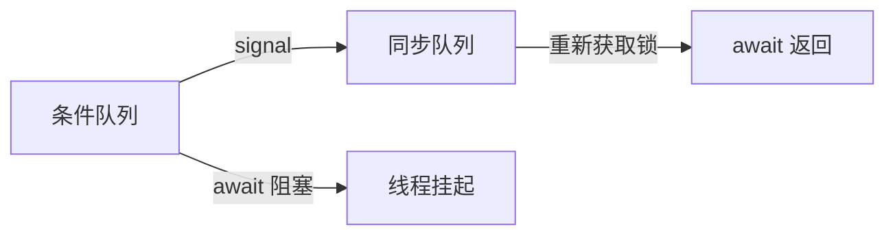

上一章讨论了 `ReentrantLock` 如何实现互斥：同一时刻只有一个线程能够进入临界区。但互斥只解决“谁能进去”的问题，并不保证线程进去以后，业务条件一定已经满足。

以消费者从队列中取数据为例：

```java
lock.lock();
try {
    if (queue.isEmpty()) {
        // 当前没有数据，无法继续消费
    }

    return queue.remove();
} finally {
    lock.unlock();
}
```

消费者已经获得了锁，但队列可能仍然为空。它不能直接从空队列中取数据，也不能一直持有锁等待，因为生产者需要获得同一把锁，才能向队列中添加数据。

`Condition` 解决的正是这个问题：线程已经进入过临界区，但业务条件暂时不满足时，应该释放锁并等待；等其他线程改变条件后，再被通知回来重新检查。

## 一、为什么有了锁还需要 Condition

假设生产者和消费者共同操作一个队列：

```java
private final Queue<String> queue = new ArrayDeque<>();
private final ReentrantLock lock = new ReentrantLock();
```

消费者只有在队列不为空时才能取出数据：

```java
public String take() {
    lock.lock();
    try {
        return queue.remove();
    } finally {
        lock.unlock();
    }
}
```

如果队列为空，`queue.remove()` 会失败。消费者必须等待生产者放入数据。

一种错误做法是在持有锁时不断检查：

```java
lock.lock();
try {
    while (queue.isEmpty()) {
        // 一直等待
    }

    return queue.remove();
} finally {
    lock.unlock();
}
```

问题在于，消费者始终占着 `lock`，生产者无法进入临界区，也就无法添加数据。消费者在等生产者改变队列，生产者又在等消费者释放锁，程序无法继续。

所以，等待业务条件时不能只“等”，还必须先让出锁。`Condition` 提供的就是这组动作：条件不满足时释放锁并等待，条件可能变化后再回来重新竞争锁。

## 二、Condition 是什么

`Condition` 由某一把 `ReentrantLock` 创建：

```java
private final ReentrantLock lock = new ReentrantLock();
private final Condition notEmpty = lock.newCondition();
```

这里的 `notEmpty` 表示一个业务条件：队列不为空。

消费者在条件不满足时调用：

```java
notEmpty.await();
```

生产者在添加数据后调用：

```java
notEmpty.signal();
```

两者可以先这样理解：

| 方法 | 作用 |
|---|---|
| `await()` | 当前线程释放锁，并等待条件变化 |
| `signal()` | 通知一个等待线程：条件可能已经变化，可以回来重新检查 |

`Condition` 不是一把新的锁。真正负责互斥的仍然是 `ReentrantLock`；`Condition` 只负责管理“已经获得过锁，但业务条件暂时不满足”的线程。

## 三、await 的基本语义：释放锁并等待

消费者的标准写法是：

```java
public String take() throws InterruptedException {
    lock.lock();
    try {
        while (queue.isEmpty()) {
            notEmpty.await();
        }

        return queue.remove();
    } finally {
        lock.unlock();
    }
}
```

当队列为空时，消费者调用 `notEmpty.await()`。这个方法可以先拆成三件事理解：当前线程进入 `notEmpty` 对应的条件等待队列，释放当前持有的 `lock`，然后暂停执行。

这意味着消费者不会继续占着锁空转。它停在 `await()` 中以后，生产者就有机会获得同一把 `lock`，向队列中添加数据。

因此，下面这段代码虽然写成 `while`，但它不是忙循环：

```java
while (queue.isEmpty()) {
    notEmpty.await();
}
```

每次循环只是在重新获得锁之后检查一次条件；如果条件仍然不满足，线程会再次释放锁并进入等待。

## 四、await 为什么必须在持锁状态下调用

`await()` 不能脱离锁单独调用：

```java
notEmpty.await(); // 错误用法
```

正确写法必须先获得与这个 `Condition` 绑定的锁：

```java
lock.lock();
try {
    while (queue.isEmpty()) {
        notEmpty.await();
    }
} finally {
    lock.unlock();
}
```

原因是：检查条件和进入等待之间不能留下空隙。假设消费者没有持锁，它先检查到队列为空，正准备等待；此时生产者添加了数据并调用 `signal()`，但消费者还没有真正进入条件队列，这次通知不会被长期保存。消费者随后再执行 `await()`，就可能错过已经发生的通知。

使用同一把锁后，生产者无法插入到消费者“检查条件”和“进入条件队列”之间。消费者持锁检查到队列为空后，`await()` 会把“进入条件队列”和“释放锁”衔接成一个受保护的过程；生产者只有在消费者释放锁之后，才能添加数据并发送通知。

所以，`await()` 必须在持有对应锁时调用。如果线程没有持有这把锁，直接调用 `await()` 会抛出 `IllegalMonitorStateException`。

## 五、signal 的基本语义：通知后还要重新竞争锁

生产者的代码通常写成：

```java
public void put(String value) {
    lock.lock();
    try {
        queue.add(value);
        notEmpty.signal();
    } finally {
        lock.unlock();
    }
}
```

`signal()` 的含义不是把锁直接交给消费者，而是通知一个正在等待的消费者：条件可能已经变化，可以准备回来重新检查。

生产者调用 `signal()` 时仍然持有 `lock`，所以消费者被通知后不能立即继续执行。只有生产者执行 `unlock()` 之后，消费者才有机会重新竞争这把锁；等它重新获得锁以后，`await()` 才会真正返回。

这里还有一个顺序要求：应当先修改条件依赖的数据，再发送通知。

```java
queue.add(value);
notEmpty.signal();
```

这个顺序表达的是：先让条件从“不满足”变成“可能满足”，再通知等待线程。虽然在同一个临界区里，先 `signal()` 再添加数据也不会让消费者立刻越过生产者读取队列，但这种写法不符合语义；如果后续的数据修改抛出异常，等待线程就可能收到一次无效通知。

更不能把数据修改放在锁外。否则消费者可能被通知后先获得锁，发现队列仍然为空，于是再次等待；生产者随后才添加数据，却没有再次通知，程序仍然可能停住。

## 六、为什么等待条件必须用 while

消费者应该使用：

```java
while (queue.isEmpty()) {
    notEmpty.await();
}
```

而不是：

```java
if (queue.isEmpty()) {
    notEmpty.await();
}
```

原因是，收到通知只代表条件可能发生变化，不代表线程重新获得锁时条件仍然满足。

例如队列中只新增了一个元素，但有两个消费者先后从等待中返回。第一个消费者获得锁后取走这个元素，第二个消费者随后获得锁时，队列已经再次为空。如果第二个消费者使用 `if`，它会从 `await()` 返回后直接执行 `queue.remove()`；如果使用 `while`，它会重新检查 `queue.isEmpty()`，发现条件仍然不满足后再次等待。

即使只调用 `signal()`，也不能把“被通知”理解成“条件一定满足”。默认非公平的 `ReentrantLock` 还可能让其他线程先获得锁并改变队列状态。因此，`while` 表达的是一个更稳固的规则：每次从 `await()` 返回后，都重新检查业务条件，直到条件确实满足。

## 七、Condition 条件队列和锁等待队列有什么区别

`ReentrantLock` 和 `Condition` 会涉及两类等待队列。

| 队列 | 等待的事情 | 典型来源 |
|---|---|---|
| 锁等待队列 | 等待获得 `ReentrantLock` | 调用 `lock()` 但锁被占用 |
| 条件队列 | 等待业务条件变化 | 已经持有锁，但调用了 `await()` |

消费者调用 `await()` 后，会从持锁执行状态进入 `Condition` 条件队列，并释放 `lock`。生产者调用 `signal()` 后，被通知的消费者不会直接执行临界区代码，而是从条件队列转移到锁等待队列，重新竞争同一把 `ReentrantLock`。

这一步是理解 `Condition` 的关键：




图中的 `Sync Queue` 就是 AQS 中用于竞争锁的等待队列。线程从 `await()` 返回时，已经重新持有了 `lock`，所以外层 `finally` 中可以安全执行 `unlock()`。

## 八、为什么一把锁可以创建多个 Condition

一个有界队列同时存在两个不同的业务条件：

| 条件 | 谁在等待 | 什么时候通知 |
|---|---|---|
| 队列不为空 | 消费者 | 生产者添加数据后 |
| 队列不满 | 生产者 | 消费者取走数据后 |

因此，可以从同一把锁创建两个 `Condition`：

```java
private final ReentrantLock lock = new ReentrantLock();

private final Condition notEmpty = lock.newCondition();
private final Condition notFull = lock.newCondition();
```

消费者在队列为空时等待 `notEmpty`，生产者在队列已满时等待 `notFull`。生产者添加数据后，只需要通知等待数据的消费者；消费者取走数据后，只需要通知等待空间的生产者。

如果所有线程都混在同一个条件队列中，生产者添加数据后可能唤醒另一个生产者，但“队列不为空”和“队列不满”是两种不同条件。多个 `Condition` 的价值就在于让等待队列按业务条件拆分，从而减少无效唤醒。

## 九、signal 和 signalAll 有什么区别

`signal()` 通知当前 `Condition` 上的一个等待线程：

```java
notEmpty.signal();
```

如果生产者只添加了一个元素，通常只需要唤醒一个消费者。唤醒更多消费者只会让它们一起转入锁等待队列，最终仍然只有一个线程取到数据，其他线程重新检查后还要再次等待。

`signalAll()` 会通知当前 `Condition` 上的所有等待线程：

```java
notEmpty.signalAll();
```

它的成本更高，因为所有等待线程都会重新竞争锁，并在获得锁后重新检查条件。

但 `signal()` 也有使用前提：同一个 `Condition` 中的线程等待的是同一种业务条件，并且一次状态变化只需要一个线程继续执行。如果条件变化可能让多个线程都能继续，或者无法准确判断应该唤醒哪一个线程，就应考虑使用 `signalAll()`。

可以简单记成：`signal()` 更精确，成本更低；`signalAll()` 更保守，成本更高，但在条件复杂时更不容易漏掉应该继续执行的线程。

## 十、await 为什么支持中断

线程执行 `await()` 后，可能长时间等待业务条件满足。如果程序准备关闭，之后不会再有生产者添加数据，等待线程就需要一种退出方式。

另一个线程可以调用：

```java
consumerThread.interrupt();
```

如果消费者正在 `await()`，它会停止等待，并在重新获得 `lock` 后抛出 `InterruptedException`：

```java
public String take() {
    lock.lock();
    try {
        while (queue.isEmpty()) {
            notEmpty.await();
        }

        return queue.remove();
    } catch (InterruptedException e) {
        Thread.currentThread().interrupt();
        return null;
    } finally {
        lock.unlock();
    }
}
```

这里要注意两点。第一，中断不是强制杀死线程，而是请求等待线程结束当前等待；线程自己的代码决定如何处理这个请求。第二，无论 `await()` 是因为 `signal()` 正常返回，还是因为中断抛出异常，它离开 `await()` 前都会重新获得 `lock`，因此 `finally` 中的 `unlock()` 仍然是安全的。

## 十一、一个简单的阻塞队列

把前面的规则组合起来，可以实现一个简化版有界阻塞队列：

```java
public class SimpleBlockingQueue<E> {

    private final Queue<E> queue = new ArrayDeque<>();
    private final int capacity;

    private final ReentrantLock lock = new ReentrantLock();
    private final Condition notEmpty = lock.newCondition();
    private final Condition notFull = lock.newCondition();

    public SimpleBlockingQueue(int capacity) {
        if (capacity <= 0) {
            throw new IllegalArgumentException("capacity must be greater than 0");
        }
        this.capacity = capacity;
    }

    public void put(E value) throws InterruptedException {
        lock.lock();
        try {
            while (queue.size() == capacity) {
                notFull.await();
            }

            queue.add(value);
            notEmpty.signal();
        } finally {
            lock.unlock();
        }
    }

    public E take() throws InterruptedException {
        lock.lock();
        try {
            while (queue.isEmpty()) {
                notEmpty.await();
            }

            E value = queue.remove();
            notFull.signal();
            return value;
        } finally {
            lock.unlock();
        }
    }
}
```

这段代码里，`ReentrantLock` 负责保护 `queue` 的互斥访问；`notEmpty` 管理等待数据的消费者；`notFull` 管理等待空间的生产者。每次等待都使用 `while` 重新检查条件，每次状态变化后只通知对应条件队列中的线程。

## 本章总结

`Condition` 的完整因果链可以从“线程不能长期占着锁等待业务条件”开始理解：消费者拿到锁后发现队列为空，如果继续持锁等待，生产者就无法进入临界区添加数据；因此等待条件必须同时包含释放锁这一动作。

`await()` 把线程从“持锁执行”转入“条件等待”，并把锁让给能够改变条件的线程。生产者获得锁后修改共享状态，再通过 `signal()` 把等待线程从条件队列转入锁等待队列。被通知的线程并不直接继续执行，而是重新竞争同一把锁；只有重新持有锁后，`await()` 才返回。

这条链路决定了几个写法上的约束：`await()` 必须在持锁状态下调用，因为检查条件和进入等待不能被其他线程插入；`signal()` 应该发生在共享状态改变之后，因为通知必须对应一次真实的条件变化；等待条件必须写成 `while`，因为通知只表示“可能满足”，不保证线程重新获得锁时条件仍然成立。

所以，`Condition` 不是独立于锁之外的通知器，而是 `ReentrantLock` 的条件等待层。它把“释放锁、等待条件、收到通知、重新竞争锁、再次检查条件”串成一个闭环，让线程能够在不长期占用锁的情况下等待业务状态变化。
