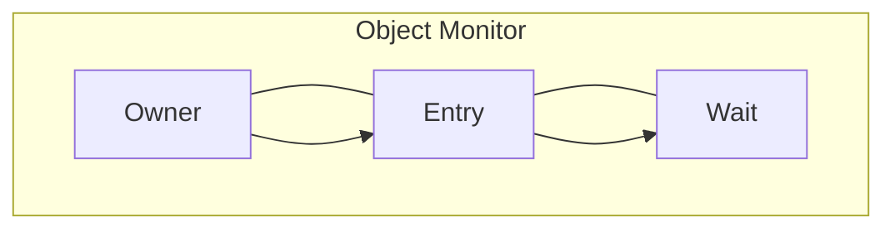
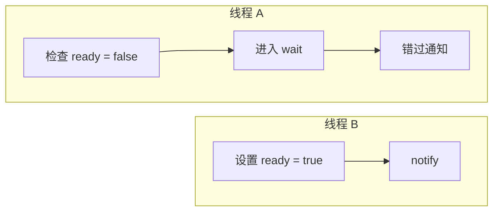
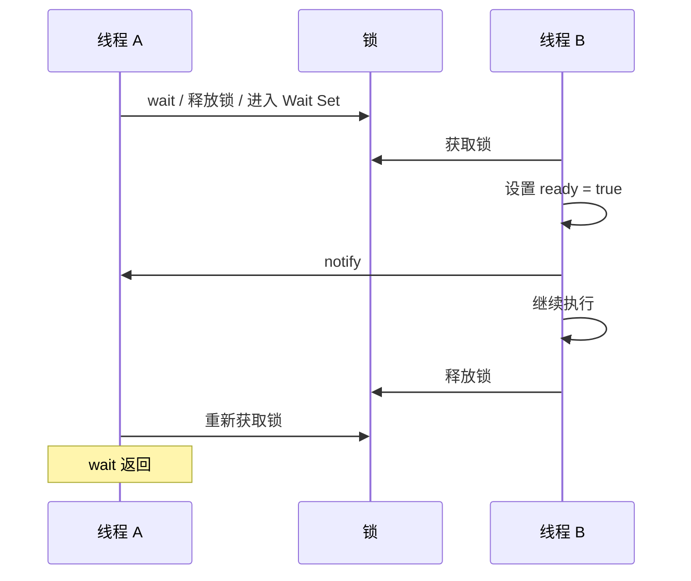

`synchronized` 不仅可以实现线程互斥，还可以配合 `Object.wait()`、`notify()` 和 `notifyAll()`，让线程在业务条件不满足时释放锁并等待。

```java
synchronized (lock) {
    while (!ready) {
        lock.wait();
    }

    useData();
}
```

另一个线程修改条件并发送通知：

```java
synchronized (lock) {
    ready = true;
    lock.notifyAll();
}
```

这套机制和前文的 `ReentrantLock + Condition` 很像：等待线程先持有锁，发现条件不满足后释放锁并暂停；通知线程修改条件后发出通知；被通知线程重新竞争锁，重新获得锁后，`wait()` 才会返回。

本章只讨论 Object Monitor 对外提供的语义，不展开 Mark Word、轻量级锁、重量级锁膨胀等 JVM 实现细节。

## 一、Monitor 和锁对象是什么关系

Java 中任意非 `null` 对象都可以作为 `synchronized` 的锁对象：

```java
Object lock = new Object();

synchronized (lock) {
    doWork();
}
```

线程进入 `synchronized (lock)` 时，并不是在修改 `lock` 这个普通 Java 对象本身的业务字段，而是在竞争这个对象关联的 Monitor。Monitor 可以理解为 JVM 用来管理对象锁和等待线程的一套机制。它至少要表达几类信息：对象锁当前是否空闲、当前由哪个线程持有、持锁线程重入了多少次、哪些线程正在等待获得锁、哪些线程已经调用 `wait()` 等待通知。

对象和 Monitor 不是同一个概念：

| 概念 | 含义 |
|---|---|
| 对象 | Java 程序创建和使用的数据对象 |
| Monitor | JVM 管理这个对象锁和等待线程的机制 |

从 Java 语言语义上看，每个对象都可以作为锁使用；但这不表示 JVM 在创建每个对象时都立即分配一个完整的重量级 Monitor 结构。具体实现可以根据竞争情况变化，本章只关注 `synchronized`、`wait()`、`notify()` 对程序员表现出来的行为。

## 二、为什么必须使用同一个锁对象

互斥成立的前提是多个线程竞争的是同一把对象锁。如果两个线程分别使用两个不同对象：

```java
Object lock1 = new Object();
Object lock2 = new Object();
```

```java
synchronized (lock1) {
    doWork1();
}
```

```java
synchronized (lock2) {
    doWork2();
}
```

它们获得的是两把不同的对象锁，因此可以同时执行。只有当两个线程都使用同一个对象时，它们才会竞争同一个 Monitor：

```java
synchronized (lock) {
    doWork();
}
```

锁对象本身不一定是被保护的数据。下面的代码中，真正被保护的是 `count`，`lock` 只是专门提供对象锁：

```java
class Counter {

    private final Object lock = new Object();
    private int count;

    public void increment() {
        synchronized (lock) {
            count++;
        }
    }
}
```

如果保护的是对象自己的字段，也可以直接使用这个对象作为锁：

```java
class Data {
    int count;
}

Data data = new Data();

synchronized (data) {
    data.count++;
}
```

但这要求所有线程访问 `data.count` 时都遵守同一规则：先获得 `data` 的对象锁。如果某个线程不加锁，或者使用另一把锁，仍然可能发生数据竞争。

## 三、不同 synchronized 写法锁的是什么

`synchronized` 可以用于代码块、实例方法和静态方法，本质区别在于锁对象不同。

| 写法 | 锁对象 |
|---|---|
| `synchronized (lock)` | 括号中的对象 |
| `synchronized` 实例方法 | 当前实例，也就是 `this` |
| `static synchronized` 方法 | 当前类对应的 `Class` 对象 |

代码块锁住括号中的对象：

```java
synchronized (lock) {
    doWork();
}
```

实例同步方法锁住当前实例：

```java
class Counter {

    public synchronized void increment() {
        // ...
    }
}
```

它近似等价于：

```java
public void increment() {
    synchronized (this) {
        // ...
    }
}
```

所以两个线程只有调用同一个实例的同步方法时，才会竞争同一把锁。

静态同步方法锁住的是当前类对应的 `Class` 对象：

```java
class Counter {

    public static synchronized void reset() {
        // ...
    }
}
```

它近似等价于：

```java
public static void reset() {
    synchronized (Counter.class) {
        // ...
    }
}
```

因此，同一个类的不同实例调用静态同步方法时，仍然会竞争同一个 `Counter.class` 对象锁。

## 四、synchronized 为什么可以重入

`synchronized` 是可重入的。同一个线程已经持有某个对象锁时，可以再次进入由同一个对象加锁的同步区域：

```java
synchronized (lock) {
    synchronized (lock) {
        doWork();
    }
}
```

Monitor 需要记录当前持锁线程和重入次数。第一次进入同步区域时，重入次数从 `0` 变成 `1`；再次进入同一把锁保护的区域时，重入次数继续增加；每退出一层同步区域，重入次数减少一次。只有重入次数回到 `0`，对象锁才真正释放。

这和前文的 `ReentrantLock` 思路相似：`ReentrantLock` 用 `owner` 记录持锁线程，用 `state` 记录重入次数；`synchronized` 的这些状态由 JVM 管理。

## 五、等待获得锁和调用 wait() 有什么区别

并发程序中有两类线程都可能表现为“等待”，但它们等待的事情不同。

第一类线程还没有进入 `synchronized`。如果对象锁已经被其他线程持有，它只能等待获得对象锁。这类线程还没有执行同步代码，也没有调用 `wait()`。

第二类线程已经获得锁并进入同步区域，但发现业务条件不成立，于是调用 `wait()`：

```java
synchronized (lock) {
    while (!ready) {
        lock.wait();
    }

    useData();
}
```

调用 `wait()` 的线程原本已经持有 `lock`，执行 `wait()` 后会释放这把锁，并进入该对象的 Wait Set。Wait Set 可以理解为保存“正在等待这个对象通知的线程”的集合。




这里的关键区别是：等待进入 `synchronized` 的线程还没有获得对象锁；调用 `wait()` 的线程是先获得对象锁，再主动释放对象锁并等待通知。正因为 `wait()` 会释放锁，其他线程才能进入同步区域，修改等待线程依赖的业务条件。

## 六、为什么 wait() 和 notify() 必须在 synchronized 中调用

`wait()`、`notify()` 和 `notifyAll()` 必须在持有对应对象锁时调用：

```java
synchronized (lock) {
    while (!ready) {
        lock.wait();
    }
}
```

```java
synchronized (lock) {
    ready = true;
    lock.notifyAll();
}
```

如果当前线程没有持有 `lock`，却直接调用 `lock.wait()`、`lock.notify()` 或 `lock.notifyAll()`，都会抛出 `IllegalMonitorStateException`。这个异常表示当前线程正在操作一把自己没有持有的对象锁。

必须持锁的根本原因是：检查条件、进入等待、修改条件和发送通知，都必须围绕同一个锁对象完成。否则就可能发生丢失通知。




上面的图表达的是：线程 A 检查到条件不成立后，还没来得及进入等待；线程 B 已经修改条件并通知，但当时 Wait Set 中没有线程，通知不会被保存；线程 A 随后进入等待，就可能一直等下去。

在 `synchronized` 中调用 `wait()` 时，JVM 会把“进入 Wait Set”和“释放锁”正确衔接起来，避免其他线程插入一次无法接收的通知。调用 `notify()` 或 `notifyAll()` 时，也必须操作当前线程实际持有的那个对象，不能在持有 `lock1` 的同步块里去通知 `lock2`。

## 七、notify() 后线程为什么不能立刻继续执行

`notify()` 不会立即释放锁，也不会直接把对象锁交给被通知线程。它只会从当前对象的 Wait Set 中通知一个线程，让它从“等待通知”转为“准备重新竞争对象锁”。

```java
synchronized (lock) {
    ready = true;
    lock.notify();
    doOtherWork();
}
```

在上面的代码中，通知线程调用 `notify()` 后仍然处于同步代码块中，所以仍然持有 `lock`。等待线程即使已经收到通知，也必须等通知线程退出同步区域、释放对象锁后，才有机会重新获得锁。




因此要区分两个时刻：收到通知，只表示线程可以准备重新竞争对象锁；`wait()` 返回，则表示线程已经重新获得对象锁。

## 八、为什么必须使用 while 检查条件

正确写法是：

```java
synchronized (lock) {
    while (!ready) {
        lock.wait();
    }

    useData();
}
```

不能只使用 `if`：

```java
synchronized (lock) {
    if (!ready) {
        lock.wait();
    }

    useData();
}
```

原因是通知只表示共享状态可能发生变化，不保证线程重新获得锁时条件仍然成立。被通知线程从 Wait Set 回来以后，要先重新竞争对象锁；在它重新获得锁之前，其他线程可能已经先进入同步区域并改变了条件。

例如，生产者只放入一个元素，却使用 `notifyAll()` 唤醒了两个消费者。第一个消费者重新获得锁后取走元素，第二个消费者再获得锁时，队列已经为空。如果第二个消费者用 `if`，就会从 `wait()` 后直接继续执行；如果用 `while`，它会重新检查条件并再次等待。

Java 还允许虚假唤醒，也就是线程可能没有收到明确通知，却从等待中醒来。因此，只要从 `wait()` 返回，就必须重新检查业务条件：

```text
wait returns
recheck condition
continue or wait again
```

这与前文 `Condition.await()` 返回后必须使用 `while` 重新检查条件的原因完全一致。

## 九、notify() 和 notifyAll() 如何选择

`notify()` 会从当前对象的 Wait Set 中选择一个线程进行通知：

```java
synchronized (lock) {
    lock.notify();
}
```

具体选择哪个线程由 JVM 决定，Java 不保证按照等待先后顺序选择。`notifyAll()` 会通知当前对象 Wait Set 中的所有线程：

```java
synchronized (lock) {
    lock.notifyAll();
}
```

所有线程收到通知后，仍然需要重新竞争同一把对象锁，同一时刻依然只有一个线程能够进入同步区域。

如果调用通知时 Wait Set 中没有线程，通知不会被保存。也就是说，先发生的通知不会变成以后某个 `wait()` 的“缓存通知”。

对象 Monitor 只有一套 Wait Set。如果生产者和消费者都在同一个对象上等待，`notify()` 可能唤醒一个当前条件仍然不成立的线程，而真正能够继续执行的线程没有被通知。因此，在多个业务条件混在同一个 Wait Set 中时，通常更倾向于使用 `notifyAll()`，再让所有线程通过 `while` 检查各自条件。

前文的 `Condition` 可以为同一把 `ReentrantLock` 创建多个条件队列，例如 `notEmpty` 和 `notFull`。这也是 `Condition` 相比 Object Monitor 更适合精确通知的地方。

## 十、wait()、sleep()、超时和中断有什么区别

`wait()` 是 `Object` 的实例方法，用于等待业务条件，必须在持有调用对象锁时使用，并且会释放这把锁。

```java
synchronized (lock) {
    lock.wait(1000);
}
```

`Thread.sleep()` 是 `Thread` 的静态方法，只是让当前线程暂停一段时间，不会释放线程已经持有的锁。

```java
synchronized (lock) {
    Thread.sleep(1000);
}
```

两者的差异可以概括为：

| 方法 | 是否要求持锁 | 是否释放锁 | 典型用途 |
|---|---|---|---|
| `wait()` | 是 | 是，释放调用对象的锁 | 等待业务条件 |
| `sleep()` | 否 | 否 | 暂停当前线程一段时间 |

带超时的 `wait()` 时间结束后，也不代表业务条件已经成立。线程仍然必须重新获得对象锁，方法才会返回；返回后也必须重新检查条件。

等待期间如果线程被中断，`wait()` 会抛出 `InterruptedException`：

```java
synchronized (lock) {
    try {
        while (!ready) {
            lock.wait();
        }
    } catch (InterruptedException e) {
        Thread.currentThread().interrupt();
    }
}
```

无论 `wait()` 是因为通知返回、超时返回，还是因为中断抛出异常，线程都需要先重新获得 `lock`，然后方法才能结束。

还要注意，`wait()` 只释放调用对象对应的锁：

```java
synchronized (lockA) {
    synchronized (lockB) {
        lockB.wait();
    }
}
```

这里调用 `lockB.wait()` 后，只会释放 `lockB`，不会释放 `lockA`。如果线程对同一个对象发生了重入，调用 `wait()` 时会完整释放对该对象的持有；重新获得对象锁后，原来的持有状态会恢复，`wait()` 才会返回。

## 十一、Monitor 与 Condition 有什么关系

对象 Monitor 和 `Condition` 的使用流程很接近。

对象锁方式：

```java
synchronized (lock) {
    while (!ready) {
        lock.wait();
    }
}
```

```java
synchronized (lock) {
    ready = true;
    lock.notifyAll();
}
```

`Condition` 方式：

```java
lock.lock();

try {
    while (!ready) {
        condition.await();
    }
} finally {
    lock.unlock();
}
```

```java
lock.lock();

try {
    ready = true;
    condition.signalAll();
} finally {
    lock.unlock();
}
```

两者可以这样对应：

| Object Monitor | ReentrantLock + Condition |
|---|---|
| `synchronized` | `ReentrantLock` |
| `Object.wait()` | `Condition.await()` |
| `Object.notify()` | `Condition.signal()` |
| `Object.notifyAll()` | `Condition.signalAll()` |
| 对象 Wait Set | `Condition` 条件队列 |

它们遵循同一条基本规律：等待前必须持有锁；等待时释放锁；通知不会直接交出锁；被通知线程重新竞争锁；重新获得锁后等待方法才返回；返回后必须使用 `while` 重新检查条件。

但二者的内部实现并不相同。对象 Monitor 由 JVM 管理，且一个对象只有一套 Wait Set；`Condition` 基于 AQS 的条件队列和同步队列实现，一把 `ReentrantLock` 可以创建多个独立的 `Condition`，因此可以更精确地区分不同业务条件。

## 本章总结

Object Monitor 的因果链条可以从同一个锁对象开始：多个线程只有围绕同一个对象进入 `synchronized`，才会竞争同一个 Monitor，从而形成互斥；进入同步区域后，如果业务条件不满足，线程不能持锁空等，而是调用 `wait()` 释放这把对象锁，进入该对象的 Wait Set，让其他线程有机会修改共享状态。

通知线程必须持有同一个对象锁，先修改条件依赖的数据，再调用 `notify()` 或 `notifyAll()`。通知并不转移锁，只是把等待线程从“等待通知”推进到“重新竞争锁”的阶段；只有通知线程退出同步区域，被通知线程重新获得对象锁后，`wait()` 才真正返回。

因此，Object Monitor 解决的是两层问题：`synchronized` 负责谁能进入临界区，`wait()` / `notify()` 负责进入临界区后条件不满足时如何让出锁并等待。由于通知可能丢失、条件可能被其他线程再次改变，也可能出现虚假唤醒，所以等待线程必须始终用 `while` 重新检查条件。和 `Condition` 相比，Monitor 的模型更内置、更直接，但只有一套 Wait Set；当多个业务条件需要精确区分时，`ReentrantLock + Condition` 往往更灵活。
