前面讲锁时，核心问题一直是：多个线程同时访问共享状态时，如何保证结果正确。`synchronized`、`ReentrantLock`、读写锁、`StampedLock` 都是在这个问题上给出的不同答案。

但是，锁不是唯一方案。如果线程获取不到锁，通常要进入阻塞、唤醒、重新竞争的过程；无锁设计则换了一个方向：不让线程因为竞争失败而进入阻塞队列，而是通过 CAS、快照替换、版本校验、分散竞争等方式，在用户态完成冲突处理。

因此，无锁并不是没有并发控制，而是竞争失败后的处理方式不同。

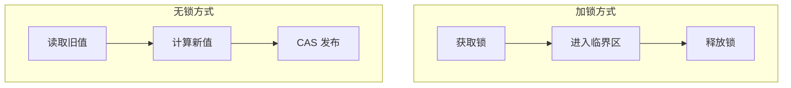

加锁的失败结果通常是等待；无锁的失败结果通常是重试、校验或换一个位置继续尝试。这也是本章后面所有内容的共同主线。

## 1. CAS：失败重试型无锁

CAS 是 Compare-And-Set 的缩写，意思是“比较并设置”。它的语义可以简化成一句话：

> 修改共享变量前，先确认它还是不是我之前看到的旧值；如果是，就替换成新值；如果不是，就说明期间已经有人改过，本次更新失败。

普通的 `count++` 不是一个原子动作，它至少包含读取、计算、写回三个步骤：

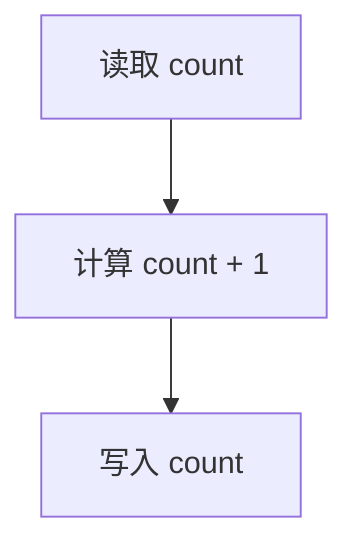

如果两个线程都读到 `count = 0`，再分别写回 `1`，就会丢失一次更新。CAS 的关键区别在于，“比较旧值”和“替换新值”在底层是一个不可分割的原子操作。两个线程同时执行 `compareAndSet(0, 1)` 时，只可能有一个线程成功，另一个线程会发现当前值已经不是 `0`，从而失败。

因此，真正的无锁更新通常不是单独执行一次 CAS，而是配合循环：

```java
while (true) {
    int oldValue = atomic.get();
    int newValue = oldValue + 1;

    if (atomic.compareAndSet(oldValue, newValue)) {
        break;
    }
}
```

这段代码的含义是：线程先基于当前值计算新值，提交时检查当前值是否仍然等于旧值；如果检查失败，说明期间有其他线程完成了更新，当前线程重新读取最新值，再计算、再提交。

CAS 适合的是可以重试的短操作，例如计数器累加、状态位切换、引用替换、链表节点指针更新。它提供的是无锁设计中最基础的原子能力：不用阻塞线程，也能安全完成一次条件更新。

## 2. CAS 的代价：不阻塞不等于没有成本

CAS 竞争失败后，线程不会进入阻塞队列，但这不代表它没有成本。失败线程仍然在运行，会继续读取、计算、尝试 CAS。如果竞争很激烈，CPU 时间会被大量消耗在失败重试上。

更重要的是，多个核心同时修改同一个变量时，这个变量所在的 cache line 会在不同核心之间反复失效和转移。比如多个线程同时更新一个 `AtomicLong`：

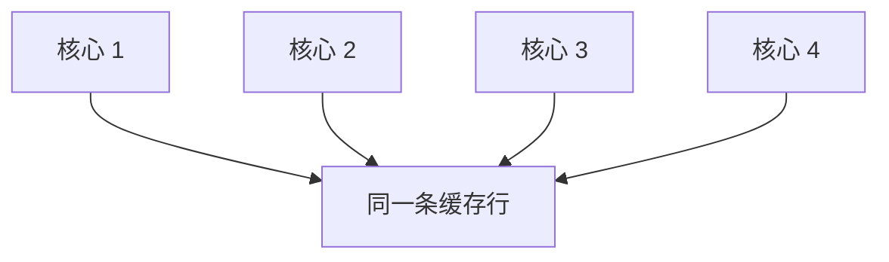

某个核心 CAS 成功后，其他核心缓存中的同一条 cache line 可能失效；其他核心下次再尝试更新时，又要重新获取最新值。高竞争下，CAS 的问题不是不安全，而是所有线程都集中争抢同一个热点。

所以 CAS 是无锁设计的基础，但不是所有场景下的最优解。它解决的是“如何安全完成一次条件更新”，并不自动解决“所有线程都抢同一个位置”的问题。后面的 Copy-On-Write、ABA 版本号和 LongAdder，都是在 CAS 这个基础能力之上继续处理更具体的问题。

## 3. Copy-On-Write：替换引用型无锁

CAS 更适合更新一个简单变量或一个引用。如果共享对象本身比较复杂，例如 Map、List、配置表、路由表，直接原地修改就会带来另一个问题：读线程可能读到一个正在被修改的中间状态。

Copy-On-Write 的思路是：

> 旧对象不动，复制一份新对象，在新对象上完成修改，最后一次性替换共享引用。

以本地配置缓存为例，系统中维护两类配置：

```java
Map<String, String> settings;
Map<String, List<String>> featureRules;
```

其中，`settings` 保存普通配置项，例如超时时间、开关状态；`featureRules` 保存某个功能对应的一组规则。读线程会频繁读取这些配置，但配置更新并不频繁，因此它适合作为 Copy-On-Write 的例子。

刷新缓存时，不应该在旧 Map 上逐个增删：

```java
settings.put("timeout", "3000");
featureRules.get("search").add("rule-1");
```

这样会破坏旧快照的稳定性。更合适的做法是先在局部变量里构造下一版缓存：

```java
Map<String, String> nextSettings = new HashMap<>();
nextSettings.put("timeout", "3000");
nextSettings.put("retry", "3");
nextSettings.put("gray.enabled", "true");

Map<String, List<String>> nextFeatureRules = new HashMap<>();
nextFeatureRules.put("search", List.of("rule-a", "rule-b"));
nextFeatureRules.put("recommend", List.of("rule-c", "rule-d"));
```

构造完成后，再把外层 Map 和内层 List 都转成不可修改结构：

```java
Map<String, String> immutableSettings =
        Map.copyOf(nextSettings);

Map<String, List<String>> immutableFeatureRules =
        nextFeatureRules.entrySet().stream()
                .collect(Collectors.toUnmodifiableMap(
                        Map.Entry::getKey,
                        entry -> List.copyOf(entry.getValue())
                ));
```

这里不能只冻结外层 Map。`Map.copyOf()` 或 `Collectors.toUnmodifiableMap()` 只能防止调用者对 Map 做 `put()`、`remove()` 等操作；如果 value 仍然是普通 `ArrayList`，外部仍然可以通过 `featureRules.get(feature).add(rule)` 修改内部列表。`List.copyOf()` 的作用，就是让每个功能对应的规则列表也变成只读结构。

Copy-On-Write 的关键不是复制和修改速度很快，而是复制和修改发生在私有副本上。副本没有发布出去之前，读线程看不到它；读线程要么读到旧快照，要么读到新快照，不会读到一个构造到一半的对象。

## 4. 用一个 Snapshot 发布一个逻辑版本

如果一次刷新要发布多个相关字段，最好不要分别赋值。例如：

```java
localSettings = immutableSettings;
localFeatureRules = immutableFeatureRules;
```

这两行在源码中虽然连续，但对其他线程来说不是一个原子整体。读线程可能短暂看到：

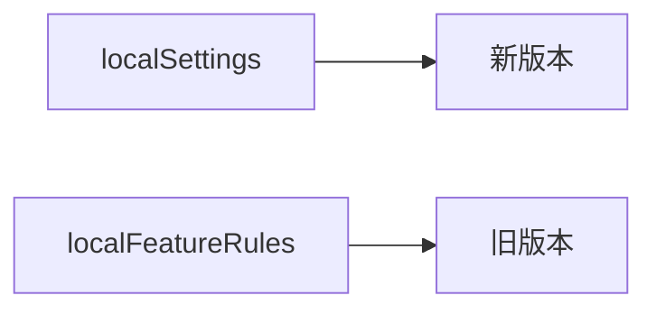

如果这两个字段必须来自同一次刷新，就应该把它们封装成一个快照对象：

```java
public final class ConfigSnapshot {
    private final Map<String, String> settings;
    private final Map<String, List<String>> featureRules;

    public ConfigSnapshot(
            Map<String, String> settings,
            Map<String, List<String>> featureRules) {
        this.settings = settings;
        this.featureRules = featureRules;
    }

    public Map<String, String> getSettings() {
        return settings;
    }

    public Map<String, List<String>> getFeatureRules() {
        return featureRules;
    }
}
```

然后只保留一个共享引用：

```java
private volatile ConfigSnapshot configSnapshot;
```

刷新时先构造完整的新快照，最后一次性发布：

```java
ConfigSnapshot nextSnapshot =
        new ConfigSnapshot(immutableSettings, immutableFeatureRules);

configSnapshot = nextSnapshot;
```

这里有三层含义：

| 设计                              | 作用                      |
| ------------------------------- | ----------------------- |
| `volatile configSnapshot`       | 保证新快照引用对读线程可见           |
| `final settings / featureRules` | 保证快照对象构造完成后，字段初始化结果稳定可见 |
| 不可修改 Map / List                 | 防止快照发布后被原地修改            |

`final` 不是用来替换共享引用的。它的作用是固定快照对象内部字段，并提供构造完成后的安全初始化语义。真正负责发布新版本的是 `volatile` 引用。

读线程访问缓存时，应该先读取一次快照引用，再基于这个局部变量访问内部数据：

```java
ConfigSnapshot snapshot = configSnapshot;

String timeout = snapshot.getSettings().get("timeout");
List<String> rules = snapshot.getFeatureRules().get("search");
```

这样读线程要么读到旧快照，要么读到新快照，但快照内部的 `settings` 和 `featureRules` 来自同一个逻辑版本。

## 5. 全量刷新和增量更新的区别

Copy-On-Write 是否需要 CAS，要看更新方式。

本地配置刷新通常是全量重建：配置中心或数据库是数据源，本地缓存只是快照。多个线程同时刷新时，即使后完成的刷新覆盖先完成的刷新，只要它们都来自同一份外部数据源的完整配置，一般可以接受。这种场景重点是 `volatile Snapshot` 的安全发布，而不是 CAS。

但是，如果更新是基于旧快照做增量修改，就不同了。假设当前配置是：

```java
{timeout=1000}
```

线程 A 基于它生成：

```java
{timeout=1000, retry=3}
```

线程 B 也基于它生成：

```java
{timeout=1000, gray.enabled=true}
```

如果只是普通赋值，最后可能只剩：

```java
{timeout=1000, gray.enabled=true}
```

A 增加的 `retry=3` 被覆盖了。

这种场景需要 `AtomicReference` 配合 CAS：

```java
private final AtomicReference<ConfigSnapshot> ref =
        new AtomicReference<>(initialSnapshot);

public void updateSetting(String key, String value) {
    while (true) {
        ConfigSnapshot oldSnapshot = ref.get();

        Map<String, String> nextSettings =
                new HashMap<>(oldSnapshot.getSettings());
        nextSettings.put(key, value);

        ConfigSnapshot newSnapshot = new ConfigSnapshot(
                Map.copyOf(nextSettings),
                oldSnapshot.getFeatureRules()
        );

        if (ref.compareAndSet(oldSnapshot, newSnapshot)) {
            return;
        }
    }
}
```

`AtomicReference<T>` 可以理解成“引用版本的 AtomicInteger”：`AtomicInteger` 原子更新数字，`AtomicReference` 原子更新对象引用。它的 `compareAndSet(oldRef, newRef)` 比较的是当前引用是否仍然指向 `oldRef`，如果是，才切换到 `newRef`。

所以这两类场景要分开：

| 更新方式 | 核心问题                | 典型做法                    |
| ---- | ------------------- | ----------------------- |
| 全量刷新 | 发布一个完整新版本           | `volatile Snapshot`     |
| 增量更新 | 多写线程可能基于旧版本修改，导致丢更新 | `AtomicReference + CAS` |

前者更关注快照发布，后者更关注旧版本是否已经过期。


## 6. 版本号与乐观校验

CAS 在写入前检查旧值是否仍然有效；版本号则常用于读取后检查数据是否在读取期间发生变化。

乐观读就是这种思路。线程先假设读取期间没有写入，不加锁读取数据；读完之后，再检查版本是否变化：

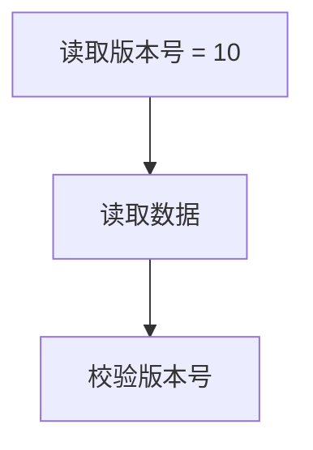

如果版本号仍然是 `10`，说明这次读取可以接受；如果版本号变化，说明读取期间可能发生过写入，需要重新读取或退化成加锁读。

这和前文的 CAS 是同一类乐观思想，只是检查时机不同：

| 思路 | 检查时机 | 检查内容 |
|---|---|---|
| CAS | 写入时检查 | 当前值是否仍然等于旧值 |
| 乐观读 | 读取后检查 | 读取期间版本是否变化 |

这里不再展开 `StampedLock` 的具体 API。它在本章中的作用，是为 ABA 做铺垫：只比较值本身有时不够，还需要额外的版本信息。

## 7. ABA：值相同不代表中间没有变化

CAS 的判断逻辑是：我之前看到的是 A，现在仍然是 A，所以可以更新。问题是，“现在还是 A”不代表“中间没有变过”。

可能发生过：

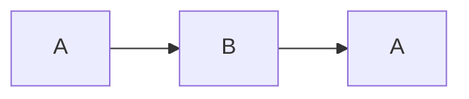

这就是 ABA 问题。它不是 CAS 更新失败，而是 CAS 成功了，但成功建立在一个不完整的判断之上：CAS 只确认当前值和旧值相同，却不知道中间是否经历过变化。

经典场景出现在无锁栈中。初始结构如下：

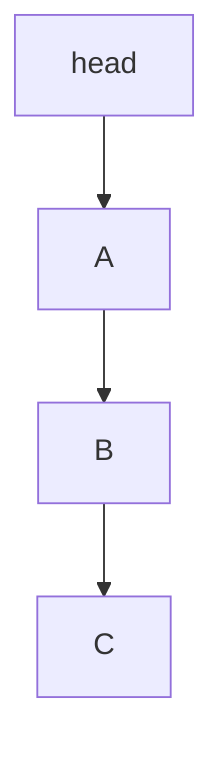

线程 1 想弹出 A，于是先读到：

```text
oldHead = A
next    = B
```

它准备执行：

```text
CAS(head, A, B)
```

但在线程 1 执行 CAS 之前，线程 2 插入执行：

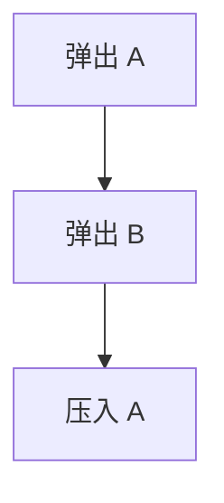

此时结构变成：


`head` 又回到了 A，但 A 后面的节点已经不是 B。线程 1 继续执行之前准备好的 `CAS(head, A, B)`，CAS 会成功，因为当前 `head` 确实还是 A。成功之后结构变成：

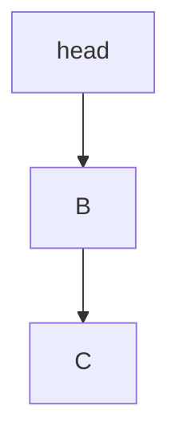

问题是，B 已经被线程 2 弹出，却被线程 1 根据旧的 `next = B` 重新接回了栈中。这里危险的不是 A 回来了本身，而是线程 1 基于旧结构做了决策，而 CAS 只检查了 head 是否还是 A，没有检查 A 后面的结构是否仍然有效。

解决 ABA 的常见思路是增加版本号，把比较对象从：

```text
A
```

升级成：

```text
(A, version)
```

例如：

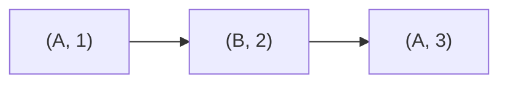

虽然值又回到了 A，但版本号已经变化。线程基于 `(A, 1)` 发起 CAS 时，会发现当前状态是 `(A, 3)`，从而失败。

Java 中对应的工具是 `AtomicStampedReference<T>`：

```java
AtomicStampedReference<Node> head =
        new AtomicStampedReference<>(nodeA, 1);

head.compareAndSet(
        oldNode,
        newNode,
        oldStamp,
        oldStamp + 1
);
```

它比较的不只是引用，还包括 stamp。这样就能识别“值虽然相同，但中间已经变化过”的情况。

## 8. LongAdder：把单点竞争拆成多点竞争

前面的 CAS 解决了单次条件更新的安全问题，但高并发计数时，所有线程都 CAS 同一个变量，会形成单点热点。

`AtomicLong` 的模型是：

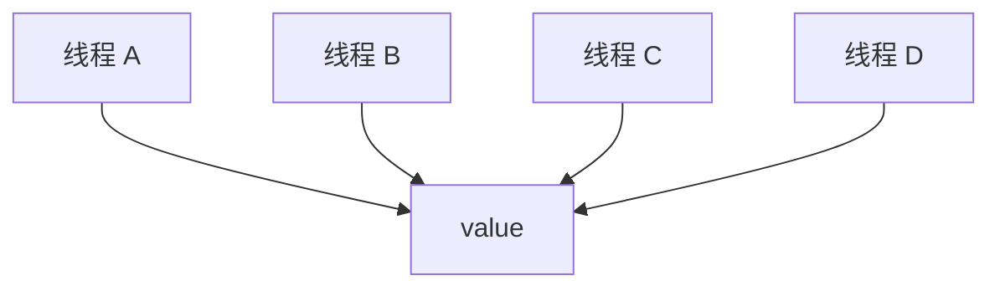

`LongAdder` 的思路是把一个热点拆成多个槽：

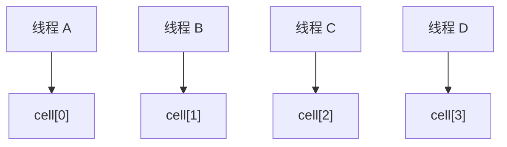

最后求总数时，再把 `base` 和所有 `Cell` 加起来：

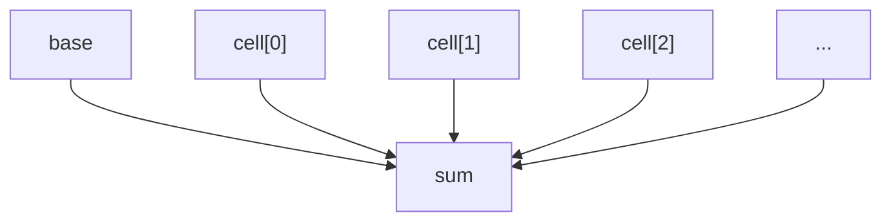

因此，`LongAdder` 不是让 CAS 消失，而是让 CAS 不再集中发生在同一个变量上。它的核心结构可以简化为：

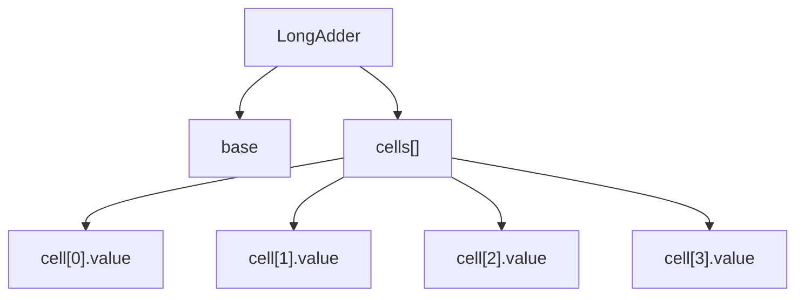

低竞争时，线程优先 CAS 更新 `base`。如果 `base` 更新失败，说明竞争开始变强，`LongAdder` 会初始化 `cells[]`，让线程根据自己的 probe 选择某个 Cell 更新。不同线程大概率落到不同 Cell 上，CAS 失败概率就会下降。

当多个线程仍然撞到同一个 Cell 时，`LongAdder` 会尝试调整 probe，让线程换一个位置；如果竞争持续存在，还可能扩容 `cells[]`。初始化和扩容属于结构性操作，不能让多个线程同时修改数组结构，因此内部会用 `cellsBusy` 这样的 CAS 标记位协调。

可以把一次 `add(1)` 简化为：

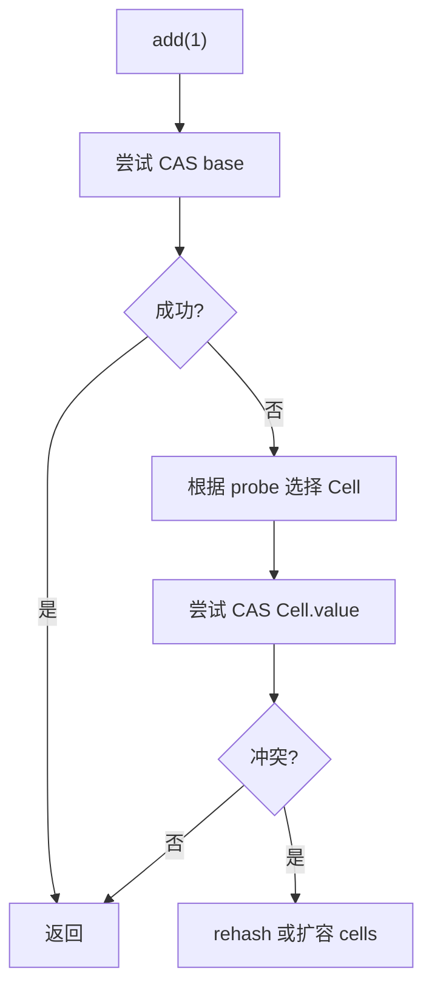

它的设计重点是分层处理竞争：

| 操作 | 频率 | 处理方式 |
|---|---:|---|
| 更新 `base` | 高频 | CAS |
| 更新 `Cell.value` | 高频 | 分散 CAS |
| 初始化 `cells[]` | 低频 | `cellsBusy` 协调 |
| 扩容 `cells[]` | 低频 | `cellsBusy` 协调 |

高频更新被分散到多个 Cell，低频结构调整才使用全局协调点。这就是 `LongAdder` 在高并发计数场景下优于 `AtomicLong` 的主要原因。

## 9. LongAdder 的读取不是强一致快照

`LongAdder.sum()` 不是一个原子快照。它不会在某一个瞬间冻结 `base` 和所有 Cell，而是逐个读取后相加：

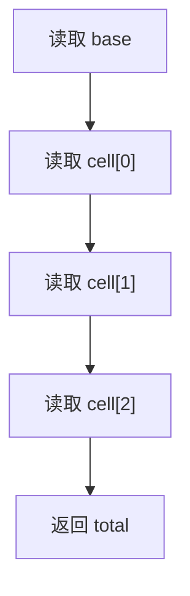

如果求和过程中仍然有线程在执行 `add()`，这次求和可能看到某些更新，也可能看不到某些更新。例如，`sum()` 已经读完 `cell[0]` 后，另一个线程又更新了 `cell[0]`，这次更新就可能不会包含在本次返回值中。

因此，`LongAdder.sum()` 返回的是遍历过程中读到的一组值拼出来的结果，而不是严格对应某一个全局时刻的精确值。它适合请求次数、QPS、监控指标、日志埋点、吞吐量统计等场景，因为这些场景更关心高并发写入性能，可以接受短暂不精确。

但它不适合账户余额、库存扣减、订单号生成、严格限流这类强一致场景。这些场景需要每一次读取和更新都对应明确的全局顺序，不能用弱一致统计值做决策。

所以，`LongAdder` 的本质不是比 `AtomicLong` 更原子，而是在更新路径上更会分散竞争。它用读取时的弱一致，换取高并发写入时的低冲突。

## 10. Cell 也要避免伪共享

`LongAdder` 把一个 value 拆成多个 Cell 后，还要考虑缓存行问题。如果多个 `Cell.value` 在内存里挨得太近，可能落在同一条 cache line 上。表面上线程更新的是不同变量，但缓存层面仍然在争抢同一条 cache line。

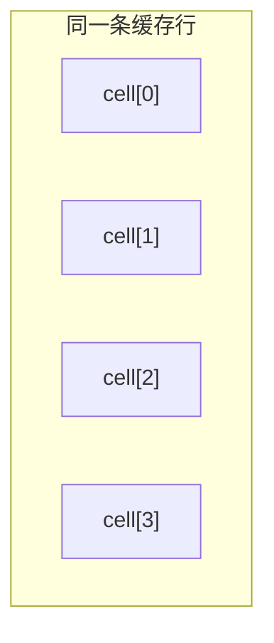

这种情况叫伪共享：多个线程修改的是不同变量，但这些变量位于同一条 cache line 上，导致它们互相造成缓存失效。

因此，`LongAdder` 的优化有两层：

| 层次 | 解决的问题 |
|---|---|
| 拆分 Cell | 避免所有线程 CAS 同一个变量 |
| 缓存行隔离 | 避免不同 Cell 在缓存层面重新互相干扰 |

这也解释了为什么高并发计数不能只从 Java 变量层面理解，还要考虑 CPU 缓存层面的竞争。`LongAdder` 不只是把一个数拆成多个数，它还要尽量让这些热点值在缓存层面互不影响。

## 11. 小结：无锁设计解决的不是竞争，而是竞争失败后的处理方式

本章的因果链条可以从 CAS 开始理解：普通读改写会丢更新，所以需要 CAS 把“比较旧值”和“替换新值”合成一个原子动作；但 CAS 只提供一次条件更新的原子能力，竞争激烈时仍然会退化成大量失败重试。

当共享状态从简单变量变成复杂对象时，原地修改会破坏读线程看到的结构稳定性，于是 Copy-On-Write 选择不修改旧对象，而是在局部变量中构造新快照，再通过一个引用整体发布。这个思路解决的是读多写少场景下的快照稳定性，而不是多写线程下的增量合并；后者仍然需要 CAS 检查旧版本是否过期。

CAS 的另一个边界是，它只能判断当前值是否等于旧值，不能判断中间是否发生过变化。ABA 正是从这个边界中出现的：值回到 A，并不意味着结构还停留在原来的 A。版本号把比较对象从单个值升级成“值 + 版本”，让中间变化可以被识别。

最后，LongAdder 处理的是 CAS 在高并发计数下的热点问题。它没有消灭 CAS，而是把单点 CAS 拆成多个 Cell 上的分散 CAS；代价是读取总和时不再提供强一致快照。因此，无锁设计并不是一套固定写法，而是一组围绕竞争成本做出的取舍：能重试就用 CAS，读多写少就用快照替换，需要识别中间变化就加版本号，单点热点太强就拆散竞争。
