---

title: Java高并发底层原理（二十二）—— ConcurrentHashMap 为什么能支持高并发访问
date: 2026-07-04
abbrlink: 22
tags:
    - Java
    - 高并发
    - ConcurrentHashMap
    - HashMap
categories:
    - java-concurrency
---

`ConcurrentHashMap` 要解决的核心问题，不是让 `Map` 变得“有序”，而是让它在多线程读写下仍然保持结构安全，并尽量减少线程之间的互相阻塞。

普通 `HashMap` 本身不保证遍历顺序。它的目标是根据 key 快速定位 value，而不是维护插入顺序或排序顺序。如果需要插入顺序，通常使用 `LinkedHashMap`；如果需要按 key 排序，通常使用 `TreeMap`。`ConcurrentHashMap` 继承的是哈希表的访问模型，因此它也不保证遍历顺序，它关注的是并发访问下的安全性和吞吐量。

## 一、HashMap 并发写为什么不安全

`HashMap` 的底层可以先理解成一个数组，数组中的每个位置称为一个桶。多个 key 经过 hash 计算后会落到不同桶中，如果多个 key 落到同一个桶，就会形成链表或红黑树。

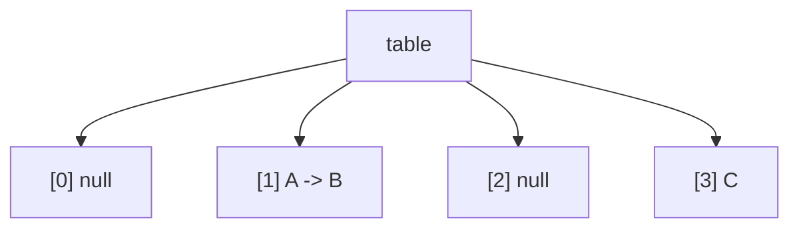


单线程下，`put` 的过程大致是：计算 key 的 hash，定位数组下标，再根据桶的状态插入新节点或覆盖旧 value。问题出现在多线程同时修改同一个桶时。假设 `table[1]` 原来只有节点 `A`，两个线程同时向这个桶插入节点 `B` 和 `C`，它们可能都先看到同一个旧状态：

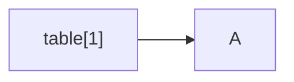


如果没有并发控制，两个线程都会基于 `A` 构造自己的新链表，然后分别写回 `table[1]`。后写回的线程可能覆盖先写回的结果，导致其中一个新节点丢失。这类问题的本质不是“多线程不能访问 `HashMap`”，而是多个线程同时修改数组、链表或红黑树时，可能破坏内部结构或造成数据丢失。

所以并发 Map 首先要解决的是：多个线程同时写入时，不能让它们无序地修改同一份内部结构。

## 二、Hashtable 为什么安全但性能差

最直接的办法是给整张表加一把锁。`Hashtable` 的很多方法都是 `synchronized` 的，可以把它理解成所有 `get`、`put`、`remove` 都必须先抢同一把锁。

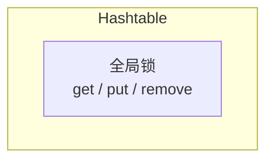


这种方式能保证线程安全，但锁的粒度太粗。比如两个线程分别操作完全不同的桶，它们本来没有结构冲突，却仍然必须串行执行。

这里的关键词是**粗粒度锁**。它表示锁保护的范围太大，而不是锁实现本身一定是“重量级锁”。`Hashtable` 的问题可以概括为：用一把全局锁保护整张表，安全性足够，但并发性能差。

`ConcurrentHashMap` 的设计方向正是从这里引出的：不要锁整张表，只锁真正可能发生冲突的那一小部分。

## 三、从 Segment 到桶级锁

JDK 1.7 的 `ConcurrentHashMap` 使用 `Segment` 分段锁。可以把整张 Map 拆成多个小区域，每个 `Segment` 内部像一个小型 `HashMap`，并且每个 `Segment` 有自己的锁。

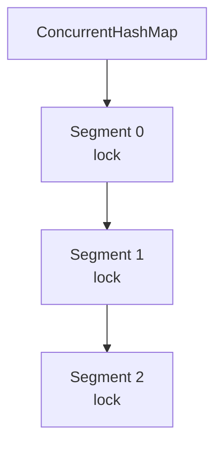


一个segment包含有多个 `table[0]` 到 `table[i]` ，这种方式比 `Hashtable` 好，因为不同线程如果落到不同 `Segment`，就可以并发执行。但它仍然不是最细的粒度：同一个 `Segment` 里有多个桶，如果两个线程操作的是同一个 `Segment` 中的不同桶，它们仍然要竞争同一把锁。

JDK 1.8 进一步缩小了加锁范围，不再把 `Segment` 作为主要并发控制单位，而是直接在数组桶上做并发控制：

| 桶状态 | 写入方式           |
| --- | -------------- |
| 桶为空 | CAS 放入新节点      |
| 桶非空 | 锁住桶头节点，再修改桶内结构 |

所以 JDK 1.8 的核心思路可以概括为：能用 CAS 完成的写入，就不加锁；必须修改桶内链表或红黑树时，只锁当前桶。

## 四、空桶为什么可以用 CAS

当线程执行 `put` 时，如果定位到的桶是空的：

```text
table[i] = null
```

这时写入只需要做一件事：把 `table[i]` 从 `null` 改成新节点。这个动作可以用 CAS 完成。

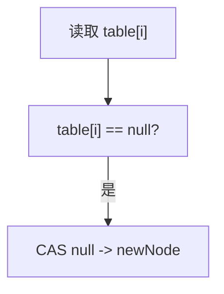


如果两个线程同时向同一个空桶插入，只有一个线程的 CAS 能成功，另一个线程会失败并重新判断桶状态。这样不会出现两个线程互相覆盖的问题。

空桶插入的关键是：对外可见的结构变化只有一次引用更新。只要这次更新是原子的，就能避免丢失写入。

## 五、非空桶为什么锁桶头

如果桶已经不是空的，例如：

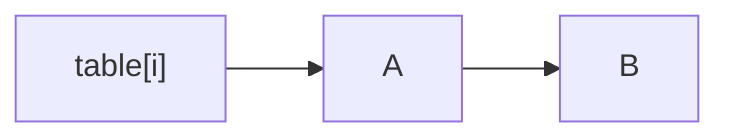


再插入新节点 `C` 时，就不只是修改 `table[i]` 这个数组引用了。线程需要遍历链表，判断 key 是否已经存在，存在则覆盖 value，不存在则追加新节点。这个过程由多个步骤组成，不能简单用一次 CAS 解决。

JDK 1.8 的做法是锁住当前桶的头节点：

```java
synchronized (f) {
    // f is table[i]
    // search, update, or append node
}
```

这里锁住的是 `table[i]` 对应的桶头，而不是整张表。其他线程如果修改的是不同桶，就不会被这把锁阻塞。

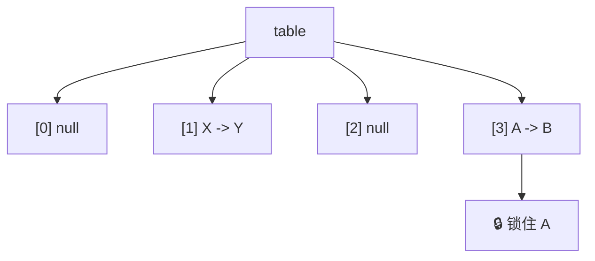


这就是桶级并发控制的核心：写同一个桶时串行，不同桶之间尽量并行。

## 六、为什么 get 大多数时候不用加锁

`get` 不修改结构，只是沿着已经发布出来的结构向下查找：

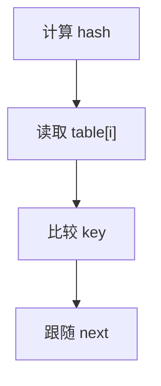


它不插入节点、不删除节点、不调整链表，也不触发结构变化。因此，它不需要像 `put` 一样保护一个修改过程。

能无锁读取，还依赖节点字段的设计。JDK 1.8 中的节点可以简化理解为：

```java
static class Node<K,V> {
    final int hash;
    final K key;
    volatile V val;
    volatile Node<K,V> next;
}
```

`key` 和 `hash` 初始化后不再改变，`val` 和 `next` 通过 `volatile` 保证可见性。写线程修改 value 或发布新节点后，读线程能够沿着可见的引用读取到相对安全的结构。

这里要注意，`get` 不保证一定读到全局最新的一瞬间状态。比如一个线程正在向链表尾部追加 `C`：

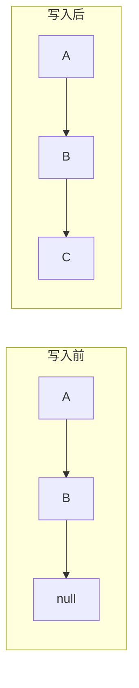


并发的 `get(C)` 可能发生在 `C` 发布之前，也可能发生在发布之后。因此它可能返回 `null`，也可能返回 `C` 对应的 value。两种结果都允许。`ConcurrentHashMap` 保证的是读线程不会读到被破坏的半截结构，而不是保证读到某个绝对最新的全局快照。

## 七、尾插为什么不会让读线程看到半成品

非空桶新增节点时，JDK 1.8 通常是在链表尾部追加，而不是头插。假设原链表是：

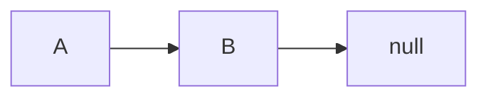


要追加 `C`，线程会先构造好完整的 `C` 节点，然后在锁内执行一次关键发布动作：

```java
B.next = C;
```

对读线程来说，结构只有两种可能：


或者：

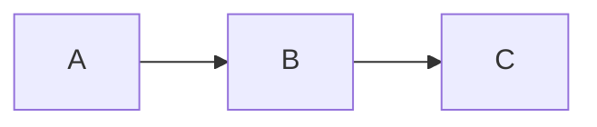


不会出现：

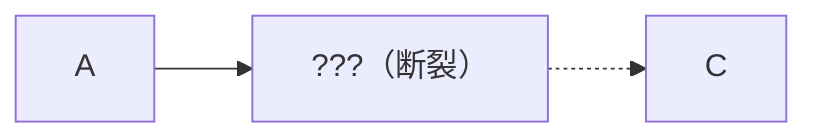


原因是没有先破坏旧链路，也没有把半成品节点暴露出去。新节点在局部变量中构造完成后，才通过一次 `volatile next` 写接入共享链表。

这和 Copy-On-Write 有相似的思想：先准备好新数据，最后通过一次引用更新发布。但 `ConcurrentHashMap` 的尾插不是严格意义上的 Copy-On-Write，因为它没有复制整条旧链表，而是在原链表尾部接入新节点。

如果使用头插，就必须特别注意发布顺序。错误顺序是：

```text
table[i] = C
C.next = A
```

读线程可能在两步之间看到 `C -> null`。正确顺序必须先完成 `C.next = A`，再发布 `table[i] = C`。这说明并发容器的关键不是把多个赋值强行变成一个原子操作，而是把对外可见的发布动作放到最后。

## 八、删除节点时为什么也不会破坏链表

继续沿用前面的链表，假设桶中节点为：


如果要删除 `B`，关键动作不是先把 `B.next` 断开，而是让前驱节点直接跳过它：

```java
A.next = C;
```

删除后，从 `table[i]` 出发的新路径变成：

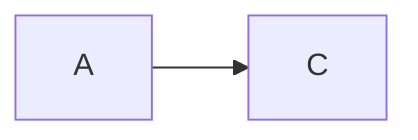


如果读线程在删除之前已经走到了 `B`，它的局部变量仍然可以继续指向 `B`：

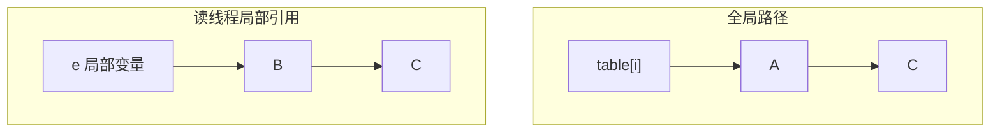


这里不是把 `A` 也删除了，而是读线程手里已经拿到了旧节点引用。Java 对象不会因为从链表主路径中被绕过就立刻消失，只要某个线程的局部变量还引用它，它就仍然可达。

因此删除也遵循同一个原则：不先破坏旧结构，而是通过一次引用更新改变新的可见路径。并发读线程可能看到删除前的路径，也可能看到删除后的路径，但不会看到断裂链表。

## 九、扩容为什么需要 oldTable 和 nextTable

哈希表的数组长度是固定的，创建之后不能原地变大。当元素越来越多时，桶会变挤，冲突增多，链表变长，查找和写入成本都会上升。因此需要创建一个更大的数组，并把旧数组中的节点重新分散过去。

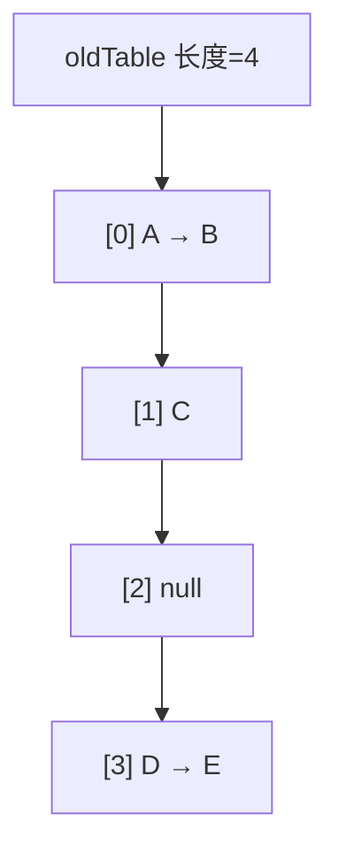


扩容后会创建新数组：

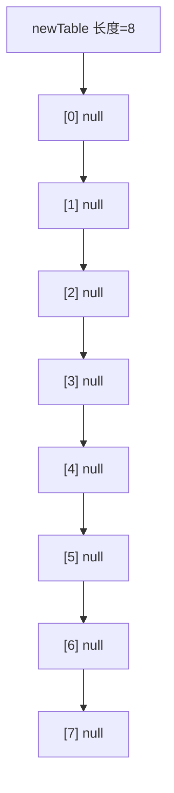


节点不是简单复制到相同下标，而是根据新数组长度重新分配。因为长度变了，同一个 hash 对应的新下标也可能变化。

在扩容过程中，旧表和新表会同时存在：

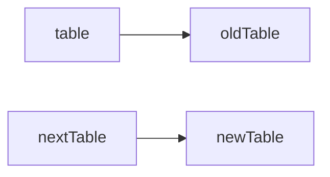


`ConcurrentHashMap` 不能长时间停住所有线程，等一个线程慢慢搬完整张表。因此旧表中的桶会被逐步迁移到新表。

## 十、ForwardingNode 如何引导到新表

某个旧桶迁移完成后，旧表对应位置会被放入一个特殊节点：`ForwardingNode`。它可以理解成一个路标。

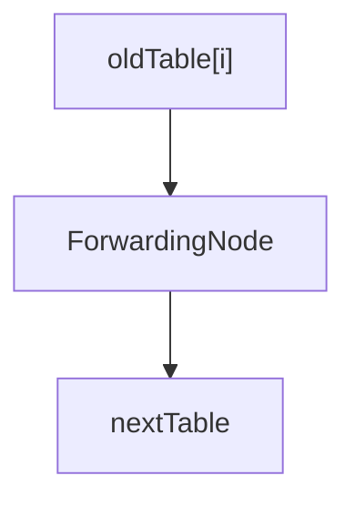


`ForwardingNode` 保存的是整张新表的引用，而不是保存某一个新下标。线程在旧表中遇到它后，会拿着 key 的 hash，到 `nextTable` 中根据新数组长度重新计算下标。

```mermaid
flowchart TD
    A["读取 oldTable[i]"] --> B["发现 ForwardingNode"]
    B --> C["读取 nextTable"]
    C --> D["根据 hash 和 nextTable.length<br>计算新下标"]
    D --> E["在 nextTable 中继续查找"]
```


这里说“重新定位”更准确，不是重新调用一次 `key.hashCode()`，而是使用已经计算好的 hash，结合新数组长度重新计算数组下标。

由于扩容通常是容量翻倍，旧桶中的节点迁移后只会去两个位置之一：原下标 `i`，或者 `i + oldCapacity`。所以一个旧桶迁移时，会被拆分成两组，分别放入新表的两个位置。搬完后，旧桶位置变成 `ForwardingNode`，后续读写线程就不会再把它当作普通桶处理。

## 十一、多个线程如何协助扩容

`ConcurrentHashMap` 的扩容不是后台新开一个专门线程完成的，而是由正在执行 `put` 等操作的业务线程顺手参与迁移。

假设旧表有多个桶：

```mermaid
graph TD
    oldTable["oldTable"]
    oldTable --> slot0["[0]"]
    slot0 --> slot1["[1]"]
    slot1 --> slot2["[2]"]
    slot2 --> slot3["[3]"]
    slot3 --> slot4["[4]"]
    slot4 --> slot5["[5]"]
    slot5 --> slot6["[6]"]
    slot6 --> slot7["[7]"]
```


一个线程触发扩容后，会创建 `nextTable` 并开始迁移部分桶。其他线程如果在 `put` 时发现当前 Map 正在扩容，也可以领取一段旧桶参与搬迁。

为了避免两个线程搬同一个桶，`ConcurrentHashMap` 会维护迁移进度，可以简化理解成一个任务分配指针。线程通过 CAS 领取一段桶，领取成功后再迁移这段范围。

```mermaid
graph TD
    transferIndex["transferIndex = 8"]
    transferIndex --> t1["线程1 认领 [6, 7]"]
    t1 --> t2["线程2 认领 [4, 5]"]
    t2 --> t3["线程3 认领 [2, 3]"]
    t3 --> t4["线程4 认领 [0, 1]"]
```


每个桶迁移完成后都会被标记为 `ForwardingNode`。这个标记有两个作用：一是告诉读写线程去新表继续操作，二是告诉迁移线程这个桶已经处理过了。

因此协助扩容的核心不是多个线程随便搬，而是通过 CAS 分配迁移范围，再用 `ForwardingNode` 标记完成状态。

## 十二、扩容期间 put 写旧表还是新表

扩容期间不能简单说 `put` 一定写旧表，或者一定写新表。它取决于当前 key 落到的旧桶是否已经迁移。

```mermaid
graph TD
    oldTable2["oldTable"]
    oldTable2 --> f0["[0] ForwardingNode"]
    oldTable2 --> f1["[1] A -> B"]
    oldTable2 --> f2["[2] ForwardingNode"]
    oldTable2 --> f3["[3] C -> D"]
```


如果 `put` 落到还没迁移的普通桶，例如 `[1]`，这个桶仍然属于旧表。线程可以锁住桶头，在旧桶上完成写入。之后该桶迁移时，新写入的节点会一起搬到新表。

如果 `put` 落到已经迁移完成的桶，例如 `[0]`，线程会看到 `ForwardingNode`。这说明旧桶已经不能继续写入，线程需要转向扩容流程，并基于新表重新定位。

所以扩容期间的规则是：未迁移桶仍然可以在旧表处理，已迁移桶通过 `ForwardingNode` 转向新表。扩容完成后，最后一个完成迁移的线程会把主表引用切换到新表：

```java
table = nextTable;
```

`table` 是 `volatile` 字段，这次写入会把新表安全发布给后续线程。即使某个线程在切换前已经拿到了旧表引用，旧表中迁移完成的桶也会通过 `ForwardingNode` 引导到新表。

## 十三、size 为什么不是普通 int

普通单线程 Map 可以用一个 `int size` 记录元素个数，新增时 `size++`，删除时 `size--`。但在并发环境下，`size++` 不是原子操作，它至少包含读取、加一、写回三步。多个线程同时更新同一个计数变量时，可能发生计数丢失。

给计数器加一把全局锁也能解决问题，但会让所有新增和删除都竞争同一个计数点，抵消桶级并发控制带来的性能收益。

JDK 1.8 的 `ConcurrentHashMap` 使用类似 `LongAdder` 的分散计数思路：

```mermaid
graph TD
    root["计数结构"]
    root --> baseCount["baseCount"]
    baseCount --> cc0["CounterCell[0]"]
    cc0 --> cc1["CounterCell[1]"]
    cc1 --> cc2["CounterCell[2]"]
    cc2 --> ccN["..."]
```


低竞争时，线程尽量更新 `baseCount`；竞争激烈时，更新压力会被分散到多个 `CounterCell` 中。统计总数时，再把这些值加起来：

```mermaid
graph LR
    base["baseCount"] --> total["total<br>baseCount + sum(CounterCell[])"]
    cc0["CounterCell[0]"] --> total
    cc1["CounterCell[1]"] --> total
    ccN["CounterCell[...]"] --> total
```


因此，`ConcurrentHashMap` 的内部计数更新是线程安全的，不会像普通 `int size++` 那样随意丢失更新。但 `size()` 在并发修改时不是强一致快照。它统计时，其他线程可能仍然在 `put` 或 `remove`，所以结果只能代表统计过程附近观察到的状态。

同理，`isEmpty()` 也不能作为并发流程中的强一致控制条件。它可以用于观察、监控或日志，但不能用来保证后续业务逻辑中 Map 仍然为空。

## 十四、为什么不允许 null

`ConcurrentHashMap` 不允许 `null key`，也不允许 `null value`。其中更关键的是 `null value`。

如果允许 value 为 `null`，那么：

```java
V value = map.get(key);
```

返回 `null` 时就有两种可能：key 不存在，或者 key 存在但 value 本身就是 `null`。在单线程 `HashMap` 中，可以再调用 `containsKey(key)` 区分。但在并发环境下，这两次观察之间 Map 可能已经被其他线程修改。

例如，线程 1 先执行 `get(key)` 返回 `null`，随后线程 2 插入或删除了这个 key，线程 1 再执行 `containsKey(key)`，第二次观察到的状态已经不能解释第一次 `get` 返回 `null` 的原因。

所以 `ConcurrentHashMap` 直接禁止 `null value`，让 `get(key) == null` 的含义保持唯一：当前没有找到这个 key 对应的 value。

`null key` 的问题略有不同，哈希表定位桶需要基于 key 计算 hash，`HashMap` 为 `null key` 做了特殊处理，而 `ConcurrentHashMap` 选择不保留这条特殊通道，使 key 和 value 都保持非 null，避免并发 API 的语义变复杂。

## 十五、复合操作要使用原子方法

`ConcurrentHashMap` 能保证单个 `get`、`put`、`remove` 的线程安全，但它不能自动保证用户写出的多步业务逻辑是原子的。

下面这种写法在并发下有问题：

```java
if (!map.containsKey(key)) {
    map.put(key, value);
}
```

两个线程可能同时判断 key 不存在，然后都执行 `put`。这种“先判断，再修改”的逻辑应该使用原子复合方法：

| 方法                                 | 语义                     |
| ---------------------------------- | ---------------------- |
| `putIfAbsent(key, value)`          | key 不存在时才放入            |
| `remove(key, value)`               | 当前 value 匹配时才删除        |
| `replace(key, oldValue, newValue)` | 当前旧值匹配时才替换             |
| `computeIfAbsent(key, function)`   | key 不存在时计算并放入非 null 结果 |

缓存场景中常见的写法是：

```java
Value value = map.get(key);

if (value == null) {
    value = loadFromDb(key);
    map.put(key, value);
}
```

并发下，多个线程可能同时发现缓存不存在，然后重复加载。更合适的方式是：

```java
Value value = map.computeIfAbsent(key, k -> loadFromDb(k));
```

它把“检查是否存在、计算新值、放入 Map、返回结果”封装成对同一个 key 更安全的复合操作。如果计算函数返回 `null`，则不会建立映射关系，因为 `ConcurrentHashMap` 不允许 `null value`。

不过，`computeIfAbsent` 的计算函数不应该过慢或包含不可控的复杂逻辑。它虽然方便，但为了保证复合语义，可能影响同一个桶或同一个 key 上的其他操作。轻量、可控的初始化适合放进去，耗时很长的远程调用要谨慎处理。

## 十六、遍历是弱一致的

`ConcurrentHashMap` 的遍历不会像普通 fail-fast 迭代器那样在并发修改时依赖 `ConcurrentModificationException` 暴露问题。它的遍历是弱一致的：遍历过程中，如果其他线程执行 `put` 或 `remove`，当前遍历可能看到这些变化，也可能看不到。

这和前文的 `get`、`size()` 语义是一致的：它保证并发访问时结构安全，不保证提供某一瞬间的强一致快照。因此遍历适合用于统计、扫描、监控等场景，但不适合表达“遍历期间 Map 完全不变”这种业务假设。

## 总结

`ConcurrentHashMap` 的设计可以从 `HashMap` 的并发写问题开始理解：普通哈希表在多个线程同时修改内部结构时可能丢失数据，因此需要并发控制；如果像 `Hashtable` 那样锁住整张表，安全性有了，但并发能力被全局锁限制。于是 JDK 1.7 先用 `Segment` 把锁拆小，JDK 1.8 又进一步把并发控制下沉到桶级别。

桶级控制之所以能成立，是因为写操作尽量把对外可见的结构变化压缩成一次安全发布：空桶用 CAS 发布桶头，非空桶锁住桶头后修改桶内结构，新增节点先构造完成再接入链表，删除节点通过改变可见路径绕过旧节点。这样，读线程不需要参与加锁，也能在旧状态和新状态之间安全地观察结构。

当数组容量不足时，问题从单个桶扩大到整张表迁移。`ConcurrentHashMap` 没有暂停所有线程等待单线程扩容，而是让多个业务线程协助迁移，并用 `ForwardingNode` 把旧桶变成通往新表的路标。计数、遍历和 `size()` 则继续沿用这种并发容器的基本取舍：保证结构安全和操作可用，但不承诺强一致快照。真正需要“判断 + 修改”同时成立的业务场景，应交给 `putIfAbsent`、`computeIfAbsent`、`remove(key, value)` 这类原子复合方法完成。
