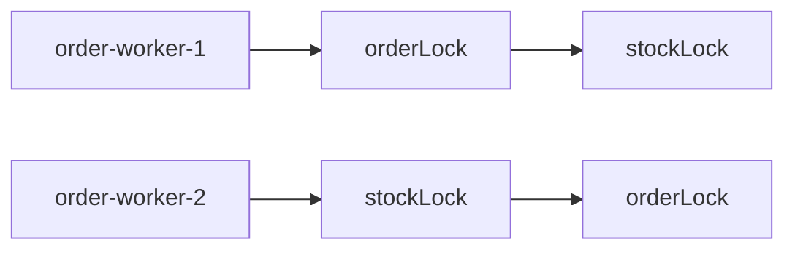
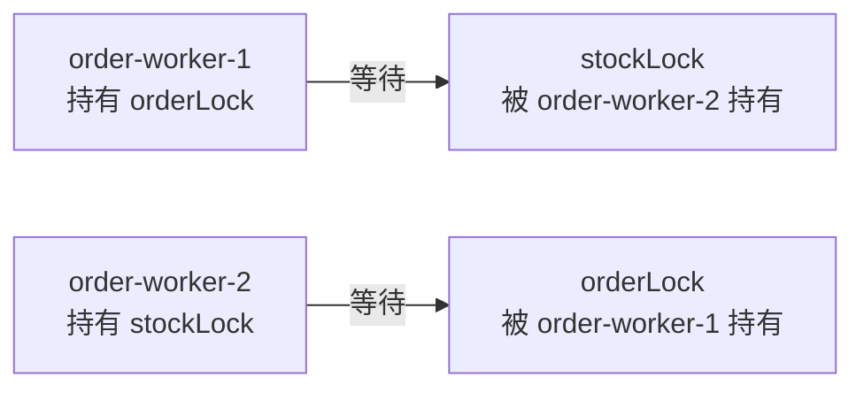
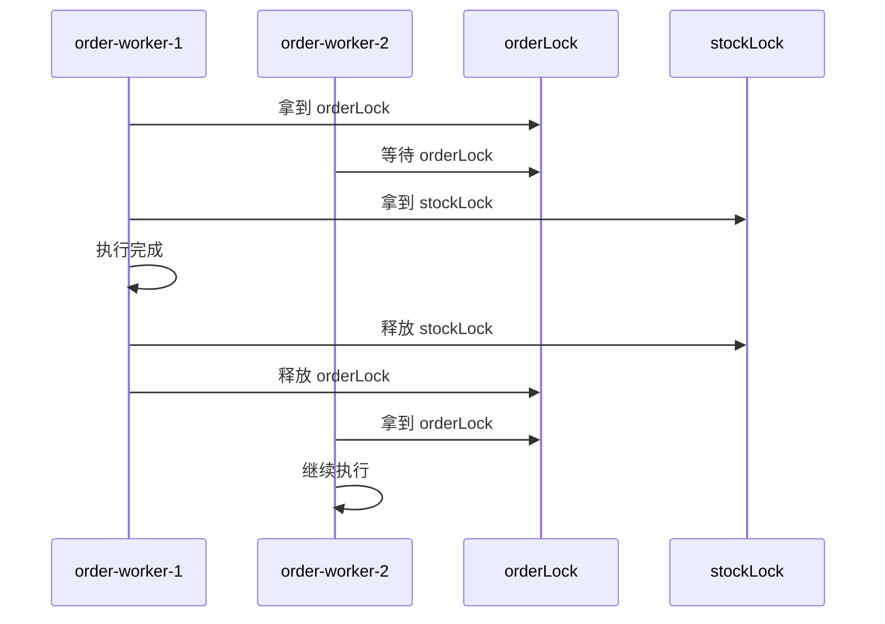
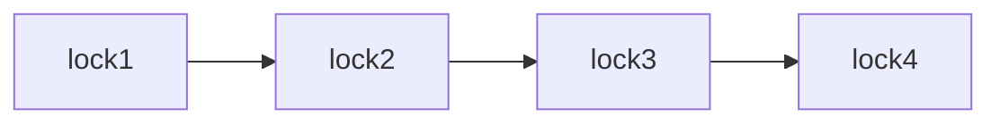
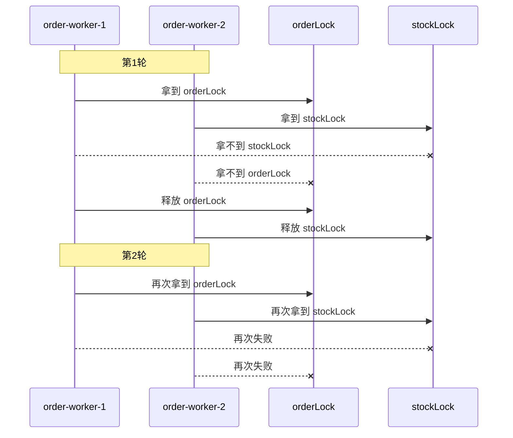
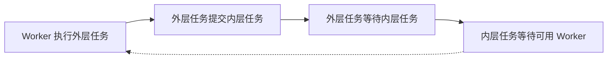
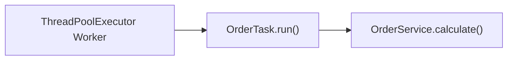
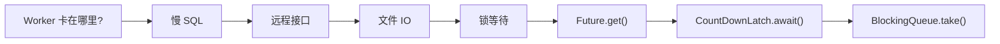

---

title: Java高并发底层原理（二十七）—— 死锁、活锁与线程饥饿是如何发生的
date: 2026-07-05
abbrlink: 27
tags:

 - Java
 - 高并发
 - 线程安全
 - 线程排查
categories:
 - java-concurrency

---

前面几章已经讲过锁、线程池、AQS、Condition、BlockingQueue 等并发组件。它们本质上都在解决同一个问题：多个线程如何安全、有序地共享资源。但只要线程之间存在资源竞争，就不只会出现数据错误，还可能出现另一类问题：程序看起来“卡住了”。

“卡住”并不是一种问题。线程可能真的互相等待，可能一直在运行但没有推进，也可能只是长期轮不到执行。本文从死锁、活锁与线程饥饿三个问题出发，解释它们分别是如何发生的，以及排查时应该如何从 `jstack`、CPU、线程池指标中找到线索。

## 1、程序为什么会看起来卡住

在并发程序里，一个任务迟迟没有完成，并不一定代表程序崩溃了。更常见的情况是：线程还活着，但执行条件没有被满足。

例如一个订单任务需要同时访问订单缓存和库存缓存。为了保护共享数据，代码可能使用两把锁：

```java
private static final Object orderLock = new Object();
private static final Object stockLock = new Object();
```

如果多个线程同时处理订单，它们就可能围绕这两把锁产生等待关系。等待本身不是错误，锁的意义就是让线程在必要时排队。真正的问题在于：等待关系是否还能被打破。

这类“卡住”大致可以分成三种：

| 问题   | 表面现象                    | 本质原因              |
| ---- | ----------------------- | ----------------- |
| 死锁   | 多个线程互相等待，程序局部停住         | 等待关系形成环           |
| 活锁   | 线程一直运行、重试、让步，但业务没有推进    | 动作存在，但都是无效动作      |
| 线程饥饿 | 系统整体还在运行，部分线程或任务长期没机会执行 | 资源长期被其他线程占用或分配不公平 |

所以排查这类问题时，不能只说“程序卡住了”。更准确的问题应该是：

```text
线程是在等锁，还是一直重试？
任务是互相等待，还是单纯排队太久？
系统是完全没有进展，还是只有部分任务没有进展？
```

这三个问题对应的排查方向完全不同。

## 2、死锁是如何发生的

死锁的典型结构是：多个线程各自持有一部分资源，同时等待别人手里的资源，并且谁都不会主动释放自己已经持有的资源。

仍然用两把锁举例：

```java
public class DeadLockDemo {

    private static final Object orderLock = new Object();
    private static final Object stockLock = new Object();

    public static void main(String[] args) {
        Thread t1 = new Thread(() -> {
            synchronized (orderLock) {
                sleep(100);

                synchronized (stockLock) {
                    System.out.println("t1 done");
                }
            }
        }, "order-worker-1");

        Thread t2 = new Thread(() -> {
            synchronized (stockLock) {
                sleep(100);

                synchronized (orderLock) {
                    System.out.println("t2 done");
                }
            }
        }, "order-worker-2");

        t1.start();
        t2.start();
    }

    private static void sleep(long millis) {
        try {
            Thread.sleep(millis);
        } catch (InterruptedException e) {
            Thread.currentThread().interrupt();
        }
    }
}
```

这里两个线程拿锁顺序相反：




`Thread.sleep(100)` 不是死锁的根本原因，它只是扩大并发交错窗口，让两个线程更容易先各自拿到第一把锁。

一种可能的执行过程是：

```text
order-worker-1 拿到 orderLock
order-worker-2 拿到 stockLock

order-worker-1 想拿 stockLock，但 stockLock 在 order-worker-2 手里
order-worker-2 想拿 orderLock，但 orderLock 在 order-worker-1 手里
```

等待关系变成：




这就是死锁的核心：**等待关系形成了环**。

死锁通常需要同时满足四个条件：

| 条件    | 含义                | 在例子中的体现                      |
| ----- | ----------------- | ---------------------------- |
| 互斥    | 一个资源同一时刻只能被一个线程持有 | 一把 `synchronized` 锁只能被一个线程进入 |
| 请求并保持 | 线程持有已有资源时，又去申请新资源 | 已经拿到第一把锁，还想继续拿第二把锁           |
| 不可剥夺  | 别人不能强行抢走线程已经持有的资源 | 锁只能由持有线程退出同步块后释放             |
| 循环等待  | 多个线程之间形成首尾相接的等待链  | 线程 1 等线程 2，线程 2 又等线程 1       |

其中最关键、也最容易从代码上控制的是循环等待。如果等待关系不能形成环，死锁就无法成立。

## 3、如何避免死锁

避免死锁最常用的办法是：**固定加锁顺序**。

前面的代码之所以可能死锁，是因为两个线程拿锁顺序不一致：

```text
order-worker-1: orderLock → stockLock
order-worker-2: stockLock → orderLock
```

如果所有线程都按照同一个顺序拿锁，例如都先拿 `orderLock`，再拿 `stockLock`，等待环就无法形成：

```java
public class NoDeadLockDemo {

    private static final Object orderLock = new Object();
    private static final Object stockLock = new Object();

    public static void main(String[] args) {
        Thread t1 = new Thread(() -> update(), "order-worker-1");
        Thread t2 = new Thread(() -> update(), "order-worker-2");

        t1.start();
        t2.start();
    }

    private static void update() {
        synchronized (orderLock) {
            sleep(100);

            synchronized (stockLock) {
                System.out.println(Thread.currentThread().getName() + " done");
            }
        }
    }

    private static void sleep(long millis) {
        try {
            Thread.sleep(millis);
        } catch (InterruptedException e) {
            Thread.currentThread().interrupt();
        }
    }
}
```

现在两个线程的加锁顺序都是：

```text
orderLock → stockLock
```

最多只会出现：




这里仍然有等待，但不是死锁。因为等待链只有单向关系：

```text
order-worker-2 → waits for orderLock → order-worker-1
```

它没有形成环。

如果不止两把锁，也要给锁规定一个全局顺序：




所有线程都只能按照这个顺序申请锁。这样可以破坏死锁四个条件里的“循环等待”。

另一种办法是使用 `ReentrantLock.tryLock()` 给线程一个失败退路。`synchronized` 的问题是拿不到锁时只能一直等待，而 `tryLock()` 可以表达“我只等一会儿，拿不到就放弃”。

```java
import java.util.concurrent.ThreadLocalRandom;
import java.util.concurrent.TimeUnit;
import java.util.concurrent.locks.ReentrantLock;

public class TryLockDemo {

    private static final ReentrantLock orderLock = new ReentrantLock();
    private static final ReentrantLock stockLock = new ReentrantLock();

    public static void main(String[] args) {
        Thread t1 = new Thread(() -> work(orderLock, stockLock), "order-worker-1");
        Thread t2 = new Thread(() -> work(stockLock, orderLock), "order-worker-2");

        t1.start();
        t2.start();
    }

    private static void work(ReentrantLock first, ReentrantLock second) {
        while (true) {
            boolean firstLocked = false;
            boolean secondLocked = false;

            try {
                firstLocked = first.tryLock(1, TimeUnit.SECONDS);
                if (!firstLocked) {
                    continue;
                }

                secondLocked = second.tryLock(1, TimeUnit.SECONDS);
                if (!secondLocked) {
                    Thread.sleep(ThreadLocalRandom.current().nextInt(10, 100));
                    continue;
                }

                System.out.println(Thread.currentThread().getName() + " done");
                break;

            } catch (InterruptedException e) {
                Thread.currentThread().interrupt();
                break;
            } finally {
                if (secondLocked) {
                    second.unlock();
                }
                if (firstLocked) {
                    first.unlock();
                }
            }
        }
    }
}
```

这里两个线程仍然是反向拿锁：

```text
order-worker-1: orderLock → stockLock
order-worker-2: stockLock → orderLock
```

但它们不会永久卡死。因为如果第二把锁拿不到，线程会在本轮结束前进入 `finally`，释放自己已经持有的第一把锁。

也就是说：


这里有一个细节：即使 `try` 中执行了 `continue`，Java 也会在离开当前 `try` 结构之前先执行 `finally`。所以这段代码能够保证每一轮循环结束前，只要已经拿到锁，就会把锁交出来。

`tryLock()` 解决的是“线程拿着部分资源无限等待”的问题，但它也有代价。如果多个线程释放和重试的节奏过于一致，死锁可能会被转化成另一种问题：活锁。

## 4、活锁是如何发生的

活锁和死锁的区别在于：死锁里的线程通常不动了，活锁里的线程还在运行。

前面的 `tryLock()` 逻辑中，线程拿不到完整资源时会释放已有锁并重试。这比死锁好，因为线程不会永久阻塞。但如果两个线程每次都在同一时刻拿到第一把锁、同一时刻拿不到第二把锁、同一时刻释放、又同一时刻重试，就可能一直失败。

执行过程可能变成：




线程没有阻塞，也没有互相永久持有资源，但业务仍然没有推进。这就是活锁。

活锁的本质是：


问题不在“让步”本身，而在于多个线程让步和重试的节奏完全同步。就像两个人在走廊相遇，都往同一边让，结果谁也过不去。

所以避免活锁的常见做法是让重试节奏错开。例如失败后随机等待一小段时间：

```java
Thread.sleep(ThreadLocalRandom.current().nextInt(10, 100));
```

随机退避不是业务逻辑的核心，它只是为了降低所有线程同时重试的概率。更完整的处理还包括限制重试次数、引入排队顺序、减少多个线程同时竞争同一组资源的机会。

## 5、线程饥饿是如何发生的

线程饥饿和死锁、活锁不一样。死锁和活锁通常体现为多个线程之间互相影响；线程饥饿更像是某些线程长期被系统排在后面。

线程饥饿指的是：

```text
某些线程长期得不到 CPU、锁、连接、线程池 Worker 等资源，
导致任务迟迟无法执行或无法完成。
```

系统整体可能还在运行，其他任务也可能正常完成，但某些任务一直轮不到。

第一类常见场景是非公平锁。在 `ReentrantLock` 中，如果不传参数，默认是非公平锁：

```java
ReentrantLock lock = new ReentrantLock();
```

非公平锁不是完全无序，而是它允许新来的线程在锁释放时直接参与竞争。这样做可能提高吞吐量，但在高竞争下，排队较久的线程可能反复被新来的线程插队。

如果希望更接近先来先得，可以使用公平锁：

```java
ReentrantLock lock = new ReentrantLock(true);
```

公平锁可以缓解饥饿，但也会增加排队和调度成本，吞吐量可能下降。因此这里不是简单地说公平锁一定更好，而是要看目标是什么：

| 选择   | 优点      | 代价             |
| ---- | ------- | -------------- |
| 非公平锁 | 吞吐量通常更好 | 个别线程可能等待较久     |
| 公平锁  | 等待顺序更稳定 | 调度成本更高，吞吐量可能下降 |

第二类常见场景是线程池饥饿。例如线程池只有两个 Worker：

```text
pool size = 2

Worker-1 runs longTask-1
Worker-2 runs longTask-2

shortTask-1 waits in queue
shortTask-2 waits in queue
shortTask-3 waits in queue
```

短任务本身可能只需要 10 毫秒，但前面的长任务一直占着 Worker，它就迟迟没有机会执行。这不是死锁，也不是活锁，而是线程池资源被长任务占满，后面的任务长期排队。

还有一种更隐蔽的线程池饥饿：线程池中的任务又提交新任务到同一个线程池，并等待新任务完成。

```java
import java.util.concurrent.ExecutorService;
import java.util.concurrent.Executors;
import java.util.concurrent.Future;

public class ThreadPoolStarvationDemo {

    public static void main(String[] args) {
        ExecutorService executor = Executors.newFixedThreadPool(1);

        executor.submit(() -> {
            Future<?> future = executor.submit(() -> {
                System.out.println("inner task");
            });

            future.get();
            return null;
        });
    }
}
```

这个线程池只有一个 Worker。外层任务先占用了这个 Worker，然后又提交内层任务，并调用 `future.get()` 等它完成。但内层任务也需要 Worker 才能执行。

于是出现：




这里不一定有显式锁，但工作线程被等待动作占住了，真正需要执行的任务反而没有线程执行。它和死锁很像，但发生在任务调度层面。

## 6、如何用 jstack 看死锁和锁竞争

`jstack` 的作用是打印 Java 进程中所有线程当前的调用栈。它能告诉我们：

```text
线程是谁
线程处于什么状态
线程当前执行到哪一行
线程正在等待什么锁
线程已经持有什么锁
```

基本命令是：

```bash
jps -l
jstack <pid> > dump.txt
```

实际排查时，最好连续抓几次：

```bash
jstack <pid> > dump1.txt
sleep 5
jstack <pid> > dump2.txt
sleep 5
jstack <pid> > dump3.txt
```

单次线程栈只能看到某一瞬间。连续几次都卡在同一段代码，才更能说明问题。

线程栈中常见状态如下：

| 状态              | 大致含义                    | 常见原因                                           |
| --------------- | ----------------------- | ---------------------------------------------- |
| `RUNNABLE`      | 正在运行，或准备运行              | 计算、循环、重试、等待 CPU 调度                             |
| `BLOCKED`       | 等待进入 `synchronized` 临界区 | synchronized 锁竞争                               |
| `WAITING`       | 无限期等待某个条件               | `wait()`、`join()`、`park()`、`Condition.await()` |
| `TIMED_WAITING` | 限时等待                    | `sleep()`、带超时的 `wait()`、`join()`、`parkNanos()` |

如果是死锁，`jstack` 通常会直接提示：

```text
Found one Java-level deadlock:
```

但不能只依赖这个提示。手动分析时，要看 `waiting to lock` 和 `locked`。

例如某个线程块中出现：

```text
"order-worker-2" #13 prio=5 os_prio=31 tid=0x... nid=0x3050 blocked
   java.lang.Thread.State: BLOCKED (on object monitor)
        at com.example.OrderService.update(OrderService.java:58)
        - waiting to lock <0x0000000712345678> (a com.example.OrderCache)
```

这表示 `order-worker-2` 正在等待地址为 `0x0000000712345678` 的锁。接下来要在同一份 `dump.txt` 里搜索这个地址：

```bash
grep -n -C 20 "0x0000000712345678" dump.txt
```

如果找到：

```text
"order-worker-1" #12 prio=5 os_prio=31 tid=0x... nid=0x3044 runnable
   java.lang.Thread.State: RUNNABLE
        at com.example.OrderService.refresh(OrderService.java:35)
        - locked <0x0000000712345678> (a com.example.OrderCache)
```

就说明：

```text
order-worker-2 → waits for 0x0000000712345678 → held by order-worker-1
```

判断死锁的关键不是看到某个线程 `BLOCKED`，而是还原出完整等待链。如果等待链闭合，才是死锁；如果大量线程都在等待同一把锁，但持锁线程仍然能够继续执行，那更可能是锁竞争严重或某个线程持锁时间太长。

## 7、如何从高 CPU 定位到 Java 线程

死锁通常表现为线程等待，CPU 不一定高。活锁、死循环、大量计算则可能表现为 CPU 很高。这时排查入口要从操作系统线程开始。

先找到 Java 进程：

```bash
jps -l
```

假设进程 ID 是 `12345`，再查看这个进程下各个线程的 CPU 使用情况：

```bash
top -Hp 12345
```

输出中第一列虽然叫 `PID`，但在 `top -Hp` 下表示线程 ID：

```text
PID     USER   PR  NI  VIRT   RES   SHR S  %CPU  %MEM  TIME+   COMMAND
12356   app    20   0  ...    ...   ... R  98.7  ...   10:22   java
```

这里说明线程 `12356` 消耗了大量 CPU。`top` 中的线程 ID 是十进制，而 `jstack` 中的 `nid` 是十六进制，所以要转换：

```bash
printf "%x\n" 12356
```

假设输出：

```text
3044
```

接着在 `jstack` 里搜索：

```bash
jstack 12345 > dump.txt
grep -n -A 30 -B 5 "nid=0x3044" dump.txt
```

找到类似：

```text
"order-worker-1" #12 prio=5 os_prio=31 tid=0x... nid=0x3044 runnable
   java.lang.Thread.State: RUNNABLE
        at com.example.OrderService.calculate(OrderService.java:42)
        at com.example.OrderTask.run(OrderTask.java:18)
        at java.base/java.util.concurrent.ThreadPoolExecutor.runWorker(ThreadPoolExecutor.java:1136)
        at java.base/java.util.concurrent.ThreadPoolExecutor$Worker.run(ThreadPoolExecutor.java:635)
        at java.base/java.lang.Thread.run(Thread.java:833)
```

这条链路就完整了：


栈顶的业务代码最值得看：

```text
at com.example.OrderService.calculate(OrderService.java:42)
```

如果连续几次 `jstack` 都看到这个线程停在同一段代码附近，就要检查这里是否存在死循环、无限重试、大量计算、正则回溯、大集合遍历、JSON 序列化过重，或者活锁式重试。

## 8、如何读线程头和调用栈

一段线程栈通常从线程头开始：

```text
"order-worker-1" #12 prio=5 os_prio=31 tid=0x... nid=0x3044 runnable
   java.lang.Thread.State: RUNNABLE
```

它可以拆成几部分：

| 字段                 | 含义          | 排查价值           |
| ------------------ | ----------- | -------------- |
| `"order-worker-1"` | 线程名         | 非常重要，用来判断业务来源  |
| `#12`              | JVM 打印的线程序号 | 一般价值不高         |
| `prio=5`           | Java 线程优先级  | 判断是否被人为设置过优先级  |
| `os_prio=31`       | 操作系统层优先级    | 特殊优先级问题时有用     |
| `tid=0x...`        | JVM 内部线程地址  | 普通业务排查较少使用     |
| `nid=0x3044`       | 操作系统线程 ID   | 排查 CPU 高时非常重要  |
| `RUNNABLE`         | Java 线程状态   | 判断线程大致处于运行还是等待 |

线程头告诉我们“它是谁”，状态告诉我们“它大概在做什么”，真正的代码位置要看下面的调用栈：

```text
at com.example.OrderService.calculate(OrderService.java:42)
at com.example.OrderTask.run(OrderTask.java:18)
at java.base/java.util.concurrent.ThreadPoolExecutor.runWorker(ThreadPoolExecutor.java:1136)
at java.base/java.util.concurrent.ThreadPoolExecutor$Worker.run(ThreadPoolExecutor.java:635)
at java.base/java.lang.Thread.run(Thread.java:833)
```

调用栈要从上往下读。最上面通常是线程当前正在执行的位置，下面是它一路被谁调用过来的。

这里可以还原成：




也就是说，这是线程池 Worker 正在执行一个订单任务，当前停在 `OrderService.java:42`。

如果看到下面这些线程池框架调用：

```text
ThreadPoolExecutor.runWorker
ThreadPoolExecutor$Worker.run
Thread.run
```

不要停在框架层。它们只说明任务是由线程池 Worker 执行的，真正要看的通常是它上面的业务代码。

如果线程处于 `WAITING`，例如：

```text
java.lang.Thread.State: WAITING (parking)
        at jdk.internal.misc.Unsafe.park(Native Method)
        at java.util.concurrent.locks.LockSupport.park(LockSupport.java:341)
        at java.util.concurrent.LinkedBlockingQueue.take(LinkedBlockingQueue.java:435)
        at java.util.concurrent.ThreadPoolExecutor.getTask(ThreadPoolExecutor.java:1062)
```

这通常表示线程池 Worker 正在 `LinkedBlockingQueue.take()` 等待任务。这不一定是问题，可能只是线程池暂时没有任务。

所以读线程栈时，顺序应该是：

```text
线程名 → 线程状态 → 栈顶业务代码 → 锁信息 → 连续多次对比
```

## 9、如何排查线程池饥饿

线程池饥饿不是看某一个线程，而是看整个线程池是否已经被占满，任务是否在持续堆积，任务是否还在完成。

`ThreadPoolExecutor` 提供了几个有用指标：

```java
ThreadPoolExecutor executor = ...;

System.out.println("poolSize = " + executor.getPoolSize());
System.out.println("corePoolSize = " + executor.getCorePoolSize());
System.out.println("maximumPoolSize = " + executor.getMaximumPoolSize());
System.out.println("activeCount = " + executor.getActiveCount());
System.out.println("queueSize = " + executor.getQueue().size());
System.out.println("taskCount = " + executor.getTaskCount());
System.out.println("completedTaskCount = " + executor.getCompletedTaskCount());
```

排查时重点看：

| 指标                   | 说明          | 异常信号                                |
| -------------------- | ----------- | ----------------------------------- |
| `activeCount`        | 正在执行任务的线程数  | 长期等于 `maximumPoolSize`，说明 Worker 打满 |
| `queue.size()`       | 队列中等待执行的任务数 | 长期增长，说明处理不过来                        |
| `completedTaskCount` | 已完成任务数      | 不增长，说明 Worker 可能卡住                  |
| `taskCount`          | 任务总数估计值     | 和完成数差距持续扩大，说明积压加重                   |

例如：

```text
poolSize = 10
activeCount = 10
maximumPoolSize = 10
queueSize = 5000
completedTaskCount grows slowly
```

这说明 10 个 Worker 都在执行任务，还有 5000 个任务排队。如果后面的任务迟迟不执行，优先怀疑线程池被长任务、阻塞任务或等待动作占满。

这时要继续结合 `jstack` 看 Worker 到底卡在哪里：




不同位置含义不同。`BlockingQueue.take()` 可能只是空闲等任务；`Future.get()`、`CountDownLatch.await()` 则可能说明 Worker 被等待动作占住，导致真正的任务没有线程执行。

## 10、三类问题如何快速区分

死锁、活锁、线程饥饿都可能让程序看起来“没有响应”，但它们的判断线索不同。

| 问题   | 线程表现            | 系统表现            | 重点工具                  | 判断关键      |
| ---- | --------------- | --------------- | --------------------- | --------- |
| 死锁   | 多个线程 `BLOCKED`  | 局部完全卡死          | `jstack`              | 等待关系形成环   |
| 活锁   | 线程多为 `RUNNABLE` | CPU 可能不低，但业务没进展 | `top -Hp`、`jstack`、日志 | 一直重试但一直失败 |
| 线程饥饿 | 部分线程等待或任务排队     | 系统可能还在运行        | 线程池指标、`jstack`        | 长期拿不到资源   |

可以把排查思路压缩成三句话：

```text
死锁看等待环。
活锁看无效重试。
饥饿看长期排队。
```

如果线上遇到程序卡住，可以按这个顺序看：


再压缩一点就是：

```text
CPU 高，看谁一直跑。
CPU 不高，看谁一直等。
任务不执行，看队列和 Worker。
```

## 总结

并发程序中的“卡住”不是单一问题。线程为了保护共享资源需要等待，等待本身是正常机制；真正危险的是等待关系失去出口、重试动作没有推进，或者资源长期被少数线程占用。

死锁的核心是等待关系形成环，所以排查时要从 `jstack` 中还原 `waiting to lock` 和 `locked` 的关系；避免时要固定加锁顺序，或者使用 `tryLock()` 给线程失败退路。活锁的核心是线程一直运行却没有有效进展，所以要关注 CPU、日志中的重试行为，以及多个线程是否在同步让步和同步重试。线程饥饿的核心是某些线程或任务长期得不到资源，所以不能只看单个线程状态，还要看线程池是否打满、队列是否堆积、任务是否还在完成。

死锁、活锁和饥饿都不是独立于并发组件之外的概念。它们正是锁、线程池、等待队列、任务调度这些机制在极端条件下暴露出来的结果。理解它们的发生方式，才能在排查时从“程序卡住了”进一步定位到：到底是谁在等、谁在跑、谁一直轮不到。
