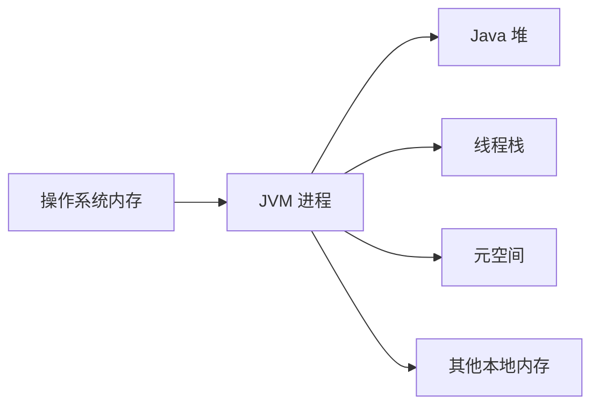
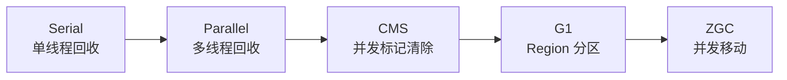
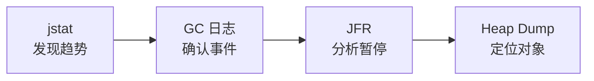

---
categories:
     - java-diagnostics
date: 2026-07-13
abbrlink: 01
tags:
     - Java
     - JVM
     - GC
     - jstat
title: Java运行时诊断（一）—— 从 JVM 内存结构到 jstat 趋势分析
---

垃圾回收通常被简化成一句话：JVM 自动回收不再使用的对象。但真正进行 GC 分析时，仅仅知道“对象会被回收”是不够的。我们还需要理解对象放在哪里、JVM 如何判断对象是否存活、年轻代与老年代为什么存在，以及不同垃圾收集器为什么会表现出不同的暂停和吞吐量。

本文从 JVM 的整体内存结构开始，逐步建立对象存活、分代回收、Stop-The-World、垃圾收集算法和垃圾收集器之间的关系。最后再把这些机制对应到 `jstat` 指标上，说明为什么单次采样只能看到状态，而连续采样才能判断 GC 是否频繁、老年代是否持续增长以及回收效果是否正常。

## 1、理解 GC 之前，为什么要先看 JVM 内存结构

GC 回收的是内存，但 JVM 进程使用的内存并不只有 Java 堆。如果一开始没有区分堆、线程栈和元空间，后面看到“老年代不足”“元空间溢出”或“本地内存不足”时，就容易把不同问题混在一起。

JVM 本质上是运行在操作系统中的一个进程。操作系统先为 JVM 进程提供内存，JVM 再把这些内存用于不同用途。



几个主要区域的职责如下。

| 内存区域     | 主要存放内容                  | 是否线程共享 | 与 GC 的关系           |
| -------- | ----------------------- | -----: | ------------------ |
| Java 堆   | 普通对象实例、数组、Class 对象等     |      是 | GC 的主要工作区域         |
| Java 线程栈 | 栈帧、局部变量、方法调用状态          |      否 | 栈中的引用可以成为 GC Roots |
| 元空间      | 类结构、字段和方法描述、运行时常量池等类元数据 |      是 | 类卸载时可能被回收          |
| 程序计数器    | 当前线程正在执行的字节码位置          |      否 | 不是普通对象回收区域         |
| 本地方法栈    | Native 方法执行状态           |      否 | 由 JVM 和本地代码管理      |
| 直接内存等    | DirectBuffer、JVM 内部结构等  |  视用途而定 | 不属于 Java 堆         |

这里所说的“本地内存”并不是 JVM 外部的一块独立内存，而是 JVM 进程从操作系统获得、但不属于 Java 堆的内存。

例如设置：

```text
-Xmx2g
```

只表示 Java 堆最大约为 2 GB，并不意味着 JVM 进程最多只会使用 2 GB。线程栈、元空间、直接内存和 JVM 自身结构仍然会额外占用内存。

对于本文的 GC 主线，目前只需要抓住一点：

> Java 堆是普通对象分配和垃圾回收的主要区域，年轻代和老年代都属于 Java 堆；元空间和线程栈不属于 Java 堆。

## 2、GC 真正要判断的不是对象有没有变量名

考虑一个处理订单的方法：

```java
public void processOrder() {
    Order order = new Order();
    Payment payment = new Payment();

    order.setPayment(payment);
}
```

`Order` 和 `Payment` 对象通常分配在堆中，而局部变量 `order`、`payment` 所对应的引用存在当前线程的栈帧中。

方法执行期间，引用关系可以简化为：


方法结束后，栈帧被弹出，局部变量引用随之消失。如果此时没有其他引用能够找到这些对象，它们就可能成为垃圾。

但执行：

```java
order = null;
```

并不意味着对象会在这一行立即消失。它只表示当前变量不再指向原来的对象。JVM 仍然需要判断是否还有其他引用可以访问该对象。

因此，GC 判断对象是否存活的核心问题是：

> 这个对象能否从一组确定存活的起点出发，通过引用链找到？

这些起点称为 **GC Roots**。常见的 GC Roots 包括：

* 当前线程栈中的局部变量引用；
* 已加载类的静态字段引用；
* 正在运行的线程及其关联对象；
* JNI 等本地代码持有的引用；
* JVM 内部持有的特定对象。

JVM 从 GC Roots 出发遍历对象引用。如果对象可以被找到，就认为它仍然可达；如果整个对象关系无法从任何 GC Root 到达，就可以进入回收流程。

这也解释了为什么循环引用不会阻止 Java GC：

```java
a.next = b;
b.next = a;

a = null;
b = null;
```

虽然两个对象仍然互相引用，但只要没有 GC Root 能够到达它们，整个引用环仍然可以被回收。

可达性分析解决的是“谁还活着”，而复制、清除和整理解决的是“确认垃圾后，怎样释放空间”。这两个层级不能混为一谈。

## 3、为什么堆还要分成年轻代和老年代

实际程序中的对象生命周期并不相同。处理一次请求时创建的参数对象、临时集合和中间结果，往往很快失去引用；缓存、线程池对象和应用级组件则可能存活很久。

这种现象可以概括为：

> 大多数对象创建后很快死亡，只有少部分对象能够长期存活。

如果每次内存不足都扫描整个堆，就会反复检查大量长期存活对象。JVM 因此把对象按照生命周期进行分代管理。


传统分代堆可以理解为：

| 区域         | 主要职责                    |
| ---------- | ----------------------- |
| Eden       | 接收绝大多数新对象               |
| Survivor 0 | 保存一次 Young GC 后仍然存活的对象  |
| Survivor 1 | 与另一个 Survivor 区交替接收存活对象 |
| 老年代        | 保存长期存活、提前晋升或体积较大的对象     |

两个 Survivor 区不会同时承担相同角色。一次 Young GC 中，一个是保存现有存活对象的 From 区，另一个是接收复制对象的 To 区。回收完成后，两者交换角色。

当 Eden 空间不足时，JVM 会触发 Young GC。存活对象被复制到 Survivor 或老年代，Eden 和原 Survivor 区则可以整体清空。

对象进入老年代主要有几种情况：

1. 对象经历多次 Young GC，年龄达到晋升条件；
2. Survivor 空间不足，无法容纳所有存活对象；
3. 某些收集器可能让大对象直接进入老年代；
4. 收集器根据对象年龄分布动态调整晋升条件。

因此，对象并不是必须在 Survivor 中停留固定次数后才会进入老年代。对象年龄只是晋升判断的一部分，Survivor 容量和收集器策略同样会影响结果。

## 4、一次 Young GC 为什么适合使用复制算法

假设 Eden 中有大量对象，但只有少量对象仍然可达。Young GC 可以先找到这些存活对象，再将它们复制到新的 Survivor 区或老年代。


复制算法的关键不在于“复制所有对象”，而在于只复制存活对象。

如果 Eden 中有 1000 个对象，只有 50 个仍然存活，JVM 只需要移动这 50 个对象。其余 950 个死亡对象不需要逐个删除，原 Eden 区可以整体重新使用。

复制算法因此特别适合年轻代：

* 年轻代死亡对象比例通常较高；
* 实际需要复制的对象较少；
* 复制后对象连续排列，不容易产生碎片；
* 原区域可以整体清空。

复制算法的代价是必须准备接收存活对象的空间。如果 Survivor 无法容纳全部存活对象，多余对象就可能提前晋升到老年代。

Young GC 通常会产生 Stop-The-World，但暂停范围和持续时间要根据具体收集器判断。Young GC 不是异常事件，而是 JVM 正常的内存循环。

真正需要关注的是：

* Young GC 是否过于频繁；
* 每次暂停是否过长；
* 回收后 Eden 是否释放充分；
* 是否有大量对象不断晋升老年代。

## 5、老年代为什么不能照搬年轻代的回收方式

年轻代通常是“死亡对象多，存活对象少”，老年代则通常相反。进入老年代的对象已经经历过多次存活判断，其中较大比例仍然可达。

如果老年代也使用简单的双区域复制，就需要移动大量存活对象，并准备足够大的备用空间，成本通常过高。因此老年代更常使用标记—清除或标记—整理思路。

| 算法    | 执行方式          | 优点        | 代价          |
| ----- | ------------- | --------- | ----------- |
| 复制    | 复制存活对象，再清空旧区域 | 分配简单，没有碎片 | 需要额外空间      |
| 标记—清除 | 标记存活对象，清除死亡对象 | 不需要移动存活对象 | 容易产生碎片      |
| 标记—整理 | 标记后移动存活对象到一侧  | 获得连续空闲空间  | 移动和更新引用成本较高 |

标记—清除不会移动存活对象，但回收后可能出现多个分散的小空闲块。即使总空闲空间足够，也可能因为缺少连续区域而无法分配大对象。

标记—整理会把存活对象移动到一侧，从而形成连续空间。但对象地址变化后，所有指向该对象的引用都需要更新。这种移动过程通常需要更强的同步，因此容易带来较长暂停。

这里就引出了 **Stop-The-World，简称 STW**。

STW 并不是整个操作系统停止，也不是 JVM 内部所有线程都停止，而是 JVM 暂停应用程序线程，使它们暂时不能继续执行 Java 业务代码。GC 线程仍然可以运行。

暂停业务线程通常有两个原因：

1. GC 需要在一个相对稳定的引用关系上判断对象是否存活；
2. 移动对象时，需要避免业务线程继续通过旧地址访问对象。

某些收集器可以让标记、清除甚至对象移动与业务线程并发执行，但通常仍然存在少量必须 STW 的阶段。

## 6、垃圾收集器为什么不断演进

复制、标记—清除和标记—整理是基础回收算法，而 Serial、Parallel、CMS、G1 和 ZGC 是采用这些思想的具体垃圾收集器。

垃圾收集器需要在三个目标之间进行取舍：

* 吞吐量；
* 单次暂停时间；
* CPU 和内存额外开销。

吞吐量表示一段总运行时间中，应用真正执行业务代码的时间比例：

```text
吞吐量 = 业务运行时间 ÷ 总运行时间
```

例如程序运行 100 秒，其中业务运行 95 秒、GC 暂停 5 秒，吞吐量约为 95%。

不同收集器的发展主线可以概括为：



### 6.1 Serial：用最简单的方式完成回收

Serial GC 在 GC 时暂停业务线程，并使用单个 GC 线程完成回收。

它的优势是结构简单、线程协调成本低，适合堆较小、CPU 核心较少或对暂停不敏感的程序。堆变大后，单线程处理的暂停时间容易增加。

### 6.2 Parallel：用多个 GC 线程提高吞吐量

Parallel GC 同样会暂停业务线程，但它会让多个 GC 线程同时处理回收任务。

例如原本一个线程需要处理全部对象，现在可以由多个线程分担。在 CPU 核心充足时，一次 GC 的实际耗时可能缩短，业务线程因此能更快恢复，总 GC 时间占比也可能下降。

这里要区分两个概念：

| 概念            | 同时运行的线程             |
| ------------- | ------------------- |
| 并行 Parallel   | 多个 GC 线程同时工作，业务线程暂停 |
| 并发 Concurrent | GC 线程与业务线程同时运行      |

Parallel GC 主要追求总体吞吐量，并不保证每次暂停都很短。因此它更适合批处理和离线计算，而在线服务通常更关注单次暂停是否会导致请求超时。

### 6.3 CMS：把耗时标记工作放到并发阶段

CMS 的目标是降低老年代回收时的持续停顿。它把老年代回收拆成初始标记、并发标记、重新标记和并发清除等阶段。

初始标记和重新标记需要 STW，而工作量较大的并发标记和清除阶段可以与业务线程同时运行。

重新标记不是重新扫描整个老年代。业务线程在并发标记期间修改引用时，JVM 会通过写屏障记录相关变化。重新标记阶段主要补查这些变化，因此通常比从头完成一次完整标记更短。

这种过程更接近“增量修正”，而不是普通算法中的剪枝。

CMS 没有采用并发标记—整理，主要是因为移动对象会改变地址。如果业务线程仍然通过旧引用访问对象，JVM 就必须提供额外的地址转发和访问屏障机制。CMS 没有完整解决这个问题，因此选择不移动对象的标记—清除。

这也带来了几个代价：

* 清除后产生内存碎片；
* GC 线程和业务线程争抢 CPU；
* 并发期间会出现只能等待下一轮回收的浮动垃圾；
* 老年代空间耗尽时可能发生并发模式失败，退化为长时间 STW。

### 6.4 G1：把堆切成可以独立选择的 Region

G1 不再要求年轻代和老年代分别占据一整块连续空间，而是把堆划分成多个大小相同的 Region。

Region 可以动态承担 Eden、Survivor、Old、Free 或大对象区域等角色。年轻代和老年代仍然存在，但它们变成由一组 Region 构成的逻辑分组。

Young GC 通常回收 Eden 和 Survivor Region。并发标记完成后，G1 会了解各 Old Region 的垃圾比例，随后在 Mixed GC 中回收年轻代 Region 和部分收益较高的 Old Region。

G1 会把选中 Region 中的存活对象疏散到其他 Region，再整体释放原 Region。这种方式能不断获得完整的空闲 Region，比 CMS 的原地标记—清除更不容易产生细碎空洞。

G1 的主要价值不是保证每次暂停绝对准确，而是可以通过控制本次回收的 Region 数量，让暂停范围更容易估算和调整。

### 6.5 ZGC：连对象移动也尽量并发完成

G1 的标记阶段可以并发执行，但疏散存活对象时通常仍需要暂停业务线程。

ZGC 进一步解决对象移动的问题。它通过指针信息、读屏障和地址转发等机制，使对象被移动后，业务线程仍然能够找到新的位置。

因此，ZGC 可以把标记、重定位和引用修正中的大部分工作放到并发阶段完成。它仍然存在短暂 STW，但暂停时间通常比传统收集器更容易维持在较低水平。

代价是业务线程需要执行额外屏障逻辑，GC 线程也会持续占用 CPU。ZGC 更偏向低延迟目标，并不意味着它在吞吐量和资源消耗方面一定优于 G1。

几种收集器可以收束为：

| 收集器      | 核心方式           | 主要目标     | 主要代价          |
| -------- | -------------- | -------- | ------------- |
| Serial   | 单线程 STW 回收     | 简单、低额外开销 | 大堆暂停较长        |
| Parallel | 多 GC 线程 STW 回收 | 高吞吐量     | 单次暂停仍可能较长     |
| CMS      | 标记和清除尽量并发      | 降低老年代暂停  | 碎片、CPU 竞争     |
| G1       | Region 化并分批疏散  | 平衡吞吐量与暂停 | 维护跨 Region 信息 |
| ZGC      | 标记和移动大部分并发     | 极低停顿     | 屏障和并发开销       |

## 7、Young GC、老年代回收和 Full GC 分别因为什么发生

Young GC 最常见的触发原因是 Eden 空间不足。


老年代回收通常与老年代占用持续升高有关，但不同收集器的表现不同：

* Parallel Old 可能通过 STW 回收和整理老年代；
* CMS 会提前启动并发老年代回收；
* G1 会启动并发标记，随后执行 Mixed GC；
* ZGC 可以执行并发的老年代回收过程。

因此，老年代空间下降不一定要求 `FGC` 增加。例如 G1 的 Mixed GC 就可能在没有传统 Full GC 的情况下释放 Old Region。

Full GC 往往是更重的兜底行为，可能由以下情况引起：

* 老年代无法容纳晋升对象；
* 大对象找不到足够空间；
* 正常并发回收来不及释放空间；
* 显式调用 `System.gc()`；
* 元空间不足，需要尝试类卸载；
* G1 疏散失败或 CMS 并发模式失败。

“Major GC”和“Full GC”在不同资料和收集器中的定义并不完全统一。实际分析时，不应只依据名称，而要结合具体收集器和 GC 日志判断回收范围。

一次 Full GC 并不一定意味着内存泄漏。更重要的是观察回收效果：

```text
Full GC 前：老年代 96%
Full GC 后：老年代 40%
```

说明本次释放了大量空间，可能只是一次阶段性压力。

如果表现为：

```text
Full GC 前：老年代 96%
Full GC 后：老年代 92%
```

说明大部分对象仍然可达。程序很可能很快再次接近满，从而形成频繁 Full GC。

真正危险的不是“发生过一次 Full GC”，而是：

> 老年代回收越来越频繁，但每次只能释放很少空间。

## 8、为什么一次 jstat 采样不能判断 GC 是否健康

`jstat` 可以观察 JVM 各内存区域的使用情况，以及 GC 次数和累计耗时。

常用命令是：

```bash
jstat -gcutil -t <pid> 1s 120
```

它表示每秒采样一次，共采样 120 次，并输出相对 JVM 启动时间的时间戳。

典型字段如下：

| 字段     | 含义             |
| ------ | -------------- |
| `S0`   | Survivor 0 使用率 |
| `S1`   | Survivor 1 使用率 |
| `E`    | Eden 使用率       |
| `O`    | 老年代使用率         |
| `M`    | 元空间使用率         |
| `CCS`  | 压缩类空间使用率       |
| `YGC`  | 年轻代相关 GC 累计次数  |
| `YGCT` | 年轻代相关 GC 累计耗时  |
| `FGC`  | Full GC 累计次数   |
| `FGCT` | Full GC 累计耗时   |
| `GCT`  | GC 累计总耗时       |

例如：

```text
Timestamp    S0     S1      E      O     YGC   YGCT   FGC   FGCT
  100.0      0.0   45.2   78.6   62.4    120   1.82     2    0.45
```

单看这一行，只能知道当前 Eden 使用约 78.6%、老年代使用约 62.4%，JVM 启动以来发生过 120 次年轻代相关 GC。

但它不能回答：

* 最近一分钟发生了多少次 GC；
* Old 是正在上涨还是正在下降；
* 最近一次 Young GC 花了多久；
* Full GC 后释放了多少空间；
* 当前 GC 开销是否正在恶化。

因为 `YGC`、`YGCT`、`FGC` 和 `FGCT` 都是 JVM 启动以来的累计值。要判断当前状态，必须比较相邻或一段窗口内的多个样本。

## 9、多次 jstat 采样怎样还原 GC 过程

假设连续得到以下数据：

```text
Timestamp    E      O     YGC    YGCT
100.0       30.0   50.0   120    1.200
101.0       65.0   50.0   120    1.200
102.0       95.0   50.0   120    1.200
103.0        8.0   52.0   121    1.218
```

从第三条到第四条发生了几件事：

* `E` 从 95% 降到 8%；
* `YGC` 从 120 增加到 121；
* `YGCT` 从 1.200 增加到 1.218；
* `O` 从 50% 上升到 52%。

这说明发生了一次 Young GC。Eden 被释放，部分存活对象进入 Survivor 或晋升到老年代。

这次 GC 在累计时间上的增量约为：

```text
ΔYGCT = 1.218 - 1.200 = 0.018 秒
```

也就是约 18 毫秒。

连续采样可以进一步计算几个关键指标。

### 9.1 GC 频率

假设观察 60 秒：

```text
开始时 YGC = 100
结束时 YGC = 112
```

则最近一分钟发生了 12 次年轻代相关 GC：

```text
Young GC 频率 = 12 ÷ 60 = 0.2 次/秒
平均间隔 = 60 ÷ 12 = 5 秒
```

单独看到 `YGC = 112` 没有诊断意义，因为不知道 JVM 已经运行了多长时间。

### 9.2 窗口内 GC 开销

如果 60 秒内：

```text
GCT：10.0 → 13.0
```

说明最近 60 秒 GC 累计消耗了 3 秒：

```text
GC 时间占比 = 3 ÷ 60 = 5%
```

对应公式为：

```text
gc_overhead = ΔGCT ÷ 观察窗口时间
```

相比 JVM 启动以来的总 `GCT`，窗口内增量更能反映当前压力。

### 9.3 平均 GC 时间

如果某个窗口内：

```text
ΔYGC = 10
ΔYGCT = 0.5 秒
```

则平均每次年轻代相关 GC 约为：

```text
0.5 ÷ 10 = 0.05 秒
```

也就是约 50 毫秒。

但平均值可能掩盖极端暂停。例如 9 次 GC 都是 5 毫秒，另一次是 500 毫秒，平均值无法直接揭示最长暂停。单次事件仍然需要结合 GC 日志或 JFR。

### 9.4 老年代增长速度

`jstat -gcutil` 中的 `O` 是使用率。如果需要观察老年代实际使用量，应该使用：

```bash
jstat -gc -t <pid> 1s 120
```

其中：

* `OU` 表示老年代实际使用量；
* `OC` 表示老年代当前容量。

假设：

```text
0 秒：OU = 500 MB
60 秒：OU = 800 MB
```

老年代净增长速率为：

```text
old_growth_rate = 300 MB ÷ 60 秒 = 5 MB/s
```

如果多个连续窗口都保持正增长，说明对象进入老年代的速度持续高于老年代释放空间的速度。

不过 `OU` 的净增长不能直接等于晋升量，因为窗口内可能同时发生对象晋升和老年代回收。它表示的是这两个过程叠加后的最终结果。

### 9.5 老年代的几种典型走势

正常情况下，老年代可能呈现锯齿形：

```text
40% → 50% → 60% → 35% → 45% → 55%
```

含义是对象持续晋升，老年代回收后又明显下降。

如果表现为：

```text
50% → 60% → 70% → 80%
```

说明老年代持续净增长，但还不能立刻判断为内存泄漏。也可能是缓存预热、流量上涨、年轻代过小或短期任务堆积。

更危险的是：

```text
90% → 96% → 回收 → 92% → 97% → 再次回收
```

这说明回收后老年代仍然很高，大量对象持续可达，GC 很难释放空间。

因此，判断内存泄漏不能只看 Old 是否上涨，而要同时观察：

1. 是否发生了老年代回收；
2. 回收后 Old 能下降多少；
3. 下降后多久再次接近满；
4. GC 频率和 GC 时间是否同步恶化。

## 10、jstat 的采样间隔应该怎样设置

采样间隔需要根据问题持续时间和 GC 频率选择。间隔过长，会丢失 GC 前后的状态变化；间隔过短，则会产生大量样本和无效噪声。

一般可以采用以下配置。

| 分析场景            |       建议间隔 |          建议窗口 |
| --------------- | ---------: | ------------: |
| 初次排查            |        1 秒 |        1～3 分钟 |
| Young GC 每秒发生多次 | 250～500 毫秒 |       30～60 秒 |
| 观察 Old 中期趋势     |        5 秒 |      10～30 分钟 |
| 数小时长期监控         |    10～30 秒 |           数小时 |
| 精确分析单次暂停        |  不依赖 jstat | 使用 GC 日志或 JFR |

初次进入未知环境时，可以先运行：

```bash
jstat -gcutil -t <pid> 1s 60
```

根据一分钟结果判断 GC 周期。如果 Young GC 大约每 10 秒一次，1～2 秒间隔通常足够；如果每秒发生多次，可以缩短到 250～500 毫秒。

一个实用原则是：

> 采样间隔尽量小于典型 GC 周期的三分之一到五分之一。

不过，即使采样间隔为一秒，也不会完全错过这一秒内发生的 GC。因为 `YGC`、`YGCT` 等累计值会发生变化。

例如：

```text
样本一：YGC = 100
样本二：YGC = 105
```

可以知道这一秒发生了 5 次 GC，只是无法还原每一次 GC 前后的 Eden 和 Old 状态，也无法得知最长一次暂停。

对于自动诊断系统，可以采用：

```yaml
sampling:
  interval_seconds: 1
  minimum_samples: 30
  analysis_window_seconds: 60
```

系统不应根据单个样本报警，而应在最近 60 秒窗口中计算：

```text
young_gc_rate = ΔYGC / window_seconds
young_gc_avg_pause = ΔYGCT / ΔYGC
full_gc_avg_pause = ΔFGCT / ΔFGC
gc_overhead = ΔGCT / window_seconds
old_growth_rate = ΔOU / window_seconds
```

再结合趋势进行判断：

| 现象                       | 可能含义                |
| ------------------------ | ------------------- |
| Young GC 频繁，但暂停短且 Old 稳定 | 分配率较高，但未必异常         |
| Young GC 频繁，Old 同时持续上涨   | 晋升压力较大              |
| FGC 增加，回收后 Old 明显下降      | 阶段性内存压力             |
| FGC 增加，回收后 Old 仍然很高      | 长期存活对象过多或泄漏风险       |
| GC 时间占比持续升高              | JVM 正在花更多时间回收而非执行业务 |
| M 持续上涨                   | 需要关注动态类加载或类卸载问题     |

## 11、jstat 能发现问题，但不能独立解释根因

`jstat` 适合发现趋势：

* GC 是否发生；
* 最近发生了多少次；
* 累计花费了多少时间；
* Eden 是否快速填满；
* Old 是否持续增长；
* Full GC 后 Old 是否明显下降。

但它无法直接回答：

* 哪个类的对象占用了大量内存；
* 哪条引用链阻止对象被回收；
* 最长一次暂停具体发生在哪个阶段；
* 某次 GC 为什么被触发；
* G1 某个 Region 为什么疏散失败。

因此，完整诊断通常需要逐层推进：



`jstat` 更像是体检指标，用来判断系统是否正在朝异常方向发展；GC 日志和 JFR 用来确认具体回收事件；Heap Dump 则用于进一步寻找占用内存的对象及其引用链。

不能因为 Old 上涨就直接认定内存泄漏，也不能因为没有 Full GC 就认为老年代没有被回收。诊断结论必须结合垃圾收集器类型、时间窗口、GC 增量和回收后的内存变化共同得出。

## 总结

GC 问题首先是内存结构问题。普通对象主要位于 Java 堆中，年轻代和老年代是堆内根据对象生命周期形成的逻辑区域；线程栈中的引用、静态字段和 JVM 内部引用则构成可达性分析的起点。

大多数对象创建后很快死亡，因此年轻代使用复制算法，通过 Young GC 快速释放 Eden。长期存活对象逐渐进入老年代，而老年代由于存活对象比例更高，需要在清除成本、空间碎片和对象移动之间进行取舍。Serial、Parallel、CMS、G1 和 ZGC 的演进，本质上就是不断调整哪些工作需要暂停、哪些工作可以并发，以及对象移动能否在业务线程运行期间安全完成。

当这些机制落到实际诊断时，单次 `jstat` 只能提供一个时间点的内存状态。只有比较连续样本，计算 GC 次数、累计时间和 Old 使用量的增量，才能识别 GC 频率、GC 时间占比、晋升压力和回收效果。最终需要关注的不是“是否发生 GC”，而是回收是否及时、暂停是否可接受，以及回收完成后系统能否重新获得足够的可用空间。
