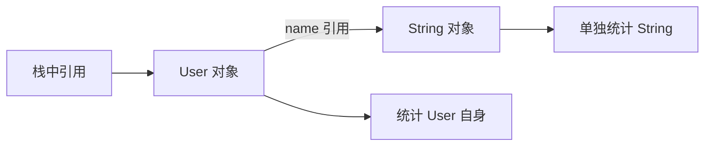

---

title: Heap Histogram：从对象统计到堆内存问题定位
date: 2026-07-30
tags:

  - Java
  - JVM
  - Heap Histogram
  - 内存排查

categories:

  - JVM

---

当 Java 服务的堆内存持续升高时，只知道“堆已经用了 6 GB”通常是不够的。真正需要回答的是：这 6 GB 主要由哪些对象组成，是字符串太多、缓存不断增长，还是某种数组占用了大量内存？

Heap Histogram 就是解决这个第一层定位问题的工具。它不会直接告诉我们哪一行代码发生了内存泄漏，而是先把堆中的对象按照类型汇总，让我们知道哪类对象数量最多、占用最大，以及哪些类型正在持续增长。

## 1、为什么只看堆内存大小还不够

假设监控发现某个 Java 服务的堆使用量不断上涨：

```text
10:00    2 GB
10:10    3 GB
10:20    5 GB
```

这些数字只能说明堆中对象占用的空间越来越多，却没有说明增长来自哪里。

可能的原因有很多：

* 缓存中的数据只增加、不删除；
* 消息队列消费速度跟不上；
* 文件或网络响应被读取成大字节数组；
* 某种业务对象仍被集合引用，无法回收；
* 大量临时对象尚未等到下一次 GC。

如果不知道是哪类对象在增长，后续就只能盲目查看代码。Heap Histogram 的作用，就是先把排查范围从“整个 Java 程序”缩小到“几个可疑的对象类型”。

## 2、Heap Histogram 到底是什么

Heap Histogram 可以理解为一张**堆对象分类统计表**。

JVM 会遍历堆中的对象，然后按照对象所属的类进行分组。例如堆里存在：

```java
class User {
    int age;
    String name;
}
```

程序创建了两个 `User` 对象：

```java
User user1 = new User();
User user2 = new User();
```

Heap Histogram 不会把 `user1` 和 `user2` 分别列出来，而是把相同类型的对象合并成一行：

```text
#instances    #bytes    class name
2             48        User
```

这行表示：

* 堆中有 2 个 `User` 对象；
* 这些 `User` 对象自身合计占用 48 字节；
* 它们都属于 `User` 类型。

因此，Heap Histogram 观察的不是某一个具体对象，而是**同一种类型的对象整体情况**。

## 3、一行 Histogram 应该怎样阅读

典型的 Heap Histogram 输出如下：

```text
 num     #instances         #bytes  class name
------------------------------------------------
   1:         100000       8000000  [B
   2:          50000       1200000  java.lang.String
   3:          10000        240000  com.example.User
------------------------------------------------
Total          160000       9440000
```

四个字段分别承担不同职责：

| 字段           | 含义               |
| ------------ | ---------------- |
| `num`        | 当前类型按照内存占用排列后的名次 |
| `#instances` | 这种类型一共有多少个对象     |
| `#bytes`     | 这些对象自身大小的总和      |
| `class name` | 对象所属的类           |

例如：

```text
3:    10000    240000    com.example.User
```

可以读成：

> 堆中存在 10000 个 `User` 对象，它们自身合计占用 240000 字节，在当前结果中排名第三。

还可以进一步计算平均大小：

```text
240000 ÷ 10000 = 24 字节
```

这说明每个 `User` 对象平均占用约 24 字节。

最后的 `Total` 是所有行的对象数量和自身大小之和。它不是 JVM 的最大堆容量，也不是整个 Java 进程占用的全部内存。

## 4、为什么对象引用的内容不会一起计算

理解 `#bytes` 时，最重要的是区分：

* 对象自身占用了多少内存；
* 对象连同它引用的其他对象一共关联了多少内存。

继续使用 `User`：

```java
class User {
    int age;
    String name;
}
```

创建对象后，堆中的关系大致如下：



`User` 对象自身包含：

* JVM 使用的对象头；
* `age` 字段保存的整数值；
* `name` 字段保存的引用。

但 `name` 指向的 `String` 是另一个独立对象，因此会单独统计在 `java.lang.String` 那一行。

假设当前 JVM 中：

```text
User 自身大小      24 字节
String 自身大小    24 字节
```

Histogram 会分别显示：

```text
#instances    #bytes    class name
1             24        User
1             24        java.lang.String
```

它不会把 `User` 显示为 48 字节。

这种只计算对象自身、不继续递归计算引用对象的大小，通常称为 **Shallow Size，也就是浅大小**。

普通对象的自身大小可以先理解为：

```text
对象自身大小 = 对象头 + 字段 + 对齐填充
```

其中，基本类型字段直接保存值，引用字段只保存一个引用。引用指向的对象需要单独计算。

对象的实际大小还会受 JVM 位数、压缩指针、字段排列和对象对齐方式影响，因此不能把某个固定字节数当成所有环境都成立的结论。

## 5、为什么数组会以特殊名称出现

数组本身也是对象，因此也会出现在 Heap Histogram 中。

例如：

```java
String[] names = new String[3];
```

堆中会存在：

* 一个 `String[]` 数组对象；
* 数组内部的三个引用位置；
* 这些引用可能指向三个独立的 `String` 对象。

数组自身的大小包括：

```text
数组头 + 所有元素位置 + 对齐填充
```

它不包括数组元素引用所指向的对象。

Heap Histogram 使用 JVM 内部类型名称表示数组，常见形式如下：

| Histogram 名称          | Java 类型     |
| --------------------- | ----------- |
| `[B`                  | `byte[]`    |
| `[I`                  | `int[]`     |
| `[J`                  | `long[]`    |
| `[C`                  | `char[]`    |
| `[Z`                  | `boolean[]` |
| `[Ljava.lang.String;` | `String[]`  |
| `[Ljava.lang.Object;` | `Object[]`  |

其中：

* `[` 表示数组；
* 后面的单个字母表示基本类型；
* `[L类名;` 表示某种对象数组。

例如：

```text
[Ljava.lang.String;
```

可以拆解为：

```text
[                     数组
L                     对象类型
java.lang.String      类名
;                     类名结束
```

因此它表示 `String[]`。

## 6、怎样生成 Heap Histogram

常见命令是：

```bash
jcmd <PID> GC.class_histogram
```

其中 `<PID>` 是目标 Java 进程的进程编号。

例如：

```bash
jcmd 12345 GC.class_histogram
```

这个命令关注的是 GC 后仍然存活的对象。在常见 HotSpot 实现中，它可能请求一次 Full GC，然后再生成 Histogram。

这会带来两个结果：

1. 已经不可达、等待回收的对象会被清理；
2. 应用线程可能因为 Full GC 和堆遍历而出现停顿。

因此，默认形式不能在生产环境中随意或高频执行。

另一种形式是：

```bash
jcmd 12345 GC.class_histogram -all
```

`-all` 表示统计当前堆里尚未被清理的全部对象，包括：

* 仍然可以从 GC Root 到达的对象；
* 已经不可达，但还没等到 GC 回收的对象。

它不会为了生成结果主动请求 Full GC，因此通常更适合先做线上采样。

不过，`-all` 仍然需要遍历堆，也可能造成暂停和额外开销。它只是避免了主动触发 Full GC，并不等于一个可以高频运行的普通监控命令。

两种方式的核心区别可以整理为：

| 方式     | 观察对象          | 主要优点           | 主要限制                |
| ------ | ------------- | -------------- | ------------------- |
| 默认模式   | GC 后仍存活的对象    | 结果更接近真正仍被引用的对象 | 可能请求 Full GC，线上影响较大 |
| `-all` | 当前堆中所有尚未清理的对象 | 不主动请求 Full GC  | 混有等待回收的垃圾对象         |

## 7、Heap Histogram 可以排查什么问题

Heap Histogram 最适合处理的问题是：

> 堆内存异常升高时，找到哪一类对象正在大量堆积。

### 7.1 怀疑内存泄漏

如果某种业务对象持续增长：

| 时间    | `User` 数量 | `User` 内存 |
| ----- | --------: | --------: |
| 10:00 |    100000 |    2.4 MB |
| 10:05 |    180000 |    4.3 MB |
| 10:10 |    300000 |    7.2 MB |

并且业务流量已经稳定，这说明 `User` 对象可能一直被某个地方引用，没有正常释放。

Histogram 能帮助我们锁定 `User` 是可疑类型，但还不能告诉我们是谁持有它。

### 7.2 缓存或集合不断增长

如果看到下面的内部类型持续增加：

```text
java.util.HashMap$Node
java.util.concurrent.ConcurrentHashMap$Node
```

`$` 表示内部类，因此 `HashMap$Node` 可以理解为：

> `HashMap` 内部用来保存键值关系的节点对象。

节点数量很多，通常意味着某些 Map 中保存了大量键值对。可能是正常的大缓存，也可能是缓存没有过期、状态表没有清理或集合一直写入。

### 7.3 大量数组占用内存

如果 `[B` 的 `#bytes` 很高，说明堆中存在大量或很大的 `byte[]`。

它们可能来自：

* 文件内容；
* 图片数据；
* 网络请求与响应；
* 序列化结果；
* 字符串底层数据；
* 缓存中的二进制内容。

但 `[B` 排名高不能直接证明发生泄漏，因为很多正常 Java 服务本身就需要大量字节数组。

### 7.4 容器内部数组过大

`ArrayList` 内部并不是直接保存所有元素，而是使用一个 `Object[]` 保存元素引用。

因此，如果看到：

```text
java.util.ArrayList
[Ljava.lang.Object;
```

其中 `Object[]` 占用很大，可能意味着某些 `ArrayList` 装了大量元素。

这里只能说“可能”，因为 `Object[]` 也会被其他框架和数据结构使用。Histogram 只能看到类型数量，无法确认某个数组具体属于哪个 `ArrayList`。

## 8、为什么单次排名高不能证明异常

Heap Histogram 是某一时刻的堆快照。

假设结果中：

```text
#instances    #bytes      class name
500000        40000000    java.lang.String
```

`String` 排名很高，并不一定异常。大多数 Java 程序都会长期存在大量字符串。

真正需要关注的是趋势：

| 时间    | `String` 占用 |
| ----- | ----------: |
| 10:00 |       40 MB |
| 10:05 |       42 MB |
| 10:10 |       41 MB |

这种上下波动可能只是正常对象创建与 GC 回收。

但如果是：

| 时间    | `String` 占用 |
| ----- | ----------: |
| 10:00 |       40 MB |
| 10:05 |       80 MB |
| 10:10 |      150 MB |

并且对象在业务空闲后仍未明显下降，就更值得调查。

分析时可以同时看三个维度：

| 维度           | 可以发现的问题        |
| ------------ | -------------- |
| `#instances` | 是否创建了过多对象      |
| `#bytes`     | 哪类对象真正占用了大量内存  |
| 平均大小         | 是否出现了少量但特别大的对象 |

例如：

```text
#instances    #bytes      class name
100           50000000    [B
```

虽然只有 100 个 `byte[]`，但平均每个约 500 KB。这与“创建了几百万个很小的对象”是两种完全不同的问题。

因此，Histogram 不是简单地看谁排名第一，而是结合业务负载、GC 状态和多次采样判断：

> 哪类对象正在以不合理的方式持续增长。

## 9、发现可疑类型后为什么还需要 Heap Dump

Heap Histogram 能回答：

* 哪种类型的对象最多；
* 哪种类型占用内存最大；
* 哪些对象正在持续增长；
* 数量增长和内存增长分别来自哪里。

但它不能回答：

* 是哪个缓存保存了这些对象；
* 哪个集合正在持有它们；
* 对象到 GC Root 的引用路径是什么；
* 哪一行代码导致对象一直无法释放。

例如看到：

```text
java.util.concurrent.ConcurrentHashMap$Node
```

持续增长，只能说明某些并发 Map 里存在越来越多的键值对。

Histogram 无法告诉我们：

* 是用户缓存；
* 是任务状态表；
* 是连接管理器；
* 还是某个第三方框架的内部数据结构。

这时需要进一步生成 Heap Dump，通过对象引用关系找到：

```text
GC Root
→ 某个单例服务
→ ConcurrentHashMap
→ Node
→ User
```

因此，两种工具的职责并不相同：

| 工具             | 主要回答的问题          |
| -------------- | ---------------- |
| Heap Histogram | 哪一类对象可疑          |
| Heap Dump      | 谁在持有这些对象，为什么回收不了 |

Heap Histogram 适合做快速筛查，Heap Dump 适合做引用关系调查。

## 总结

堆内存升高时，真正困难的不是确认“内存变多了”，而是找出增长来自哪里。Heap Histogram 通过按照类型汇总堆中对象，把一个模糊的内存问题转化成可以观察的对象数量、对象自身大小和增长趋势。

它统计的是对象的浅大小：对象头、字段和对齐填充会计入当前对象，但引用指向的其他对象会被单独统计。数组同样是对象，因此会以 `[B`、`[I` 或 `[Ljava.lang.Object;` 等 JVM 内部名称出现。

默认的 `GC.class_histogram` 更接近观察 GC 后仍存活的对象，但可能请求 Full GC；`-all` 不主动请求 Full GC，却会混入等待回收的对象。两种方式都需要遍历堆，生产环境中都不能高频执行。

最终，Heap Histogram 的价值不是直接证明内存泄漏，而是快速锁定最值得调查的对象类型。当问题进一步变成“是谁持有这些对象”时，就应当停止在 Histogram 中继续猜测，转而使用 Heap Dump 分析引用链。
