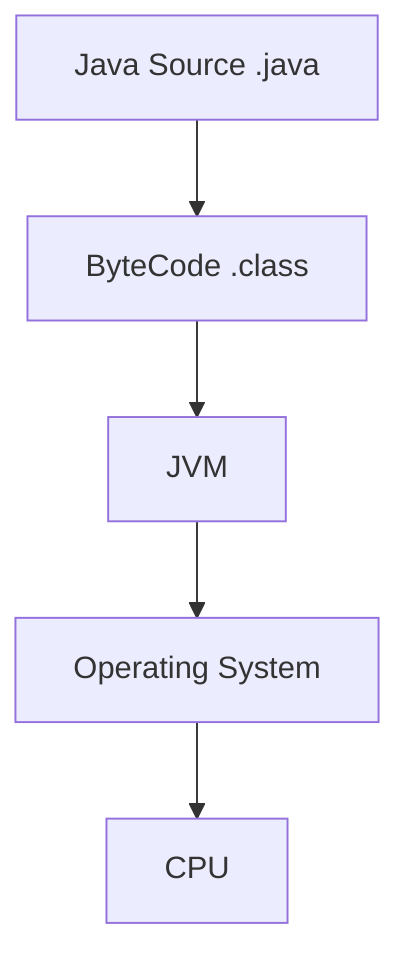
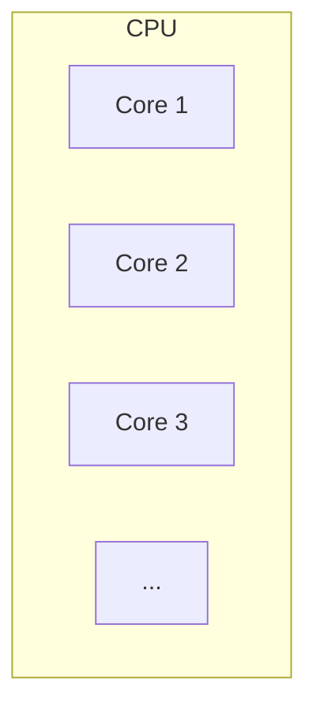
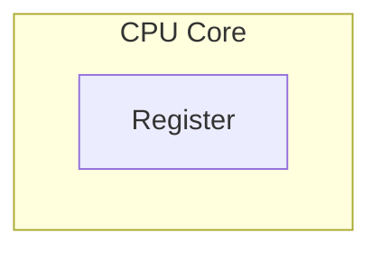
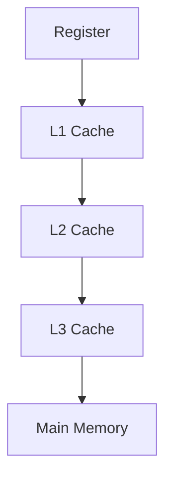
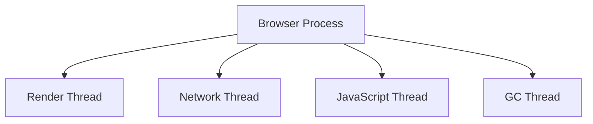
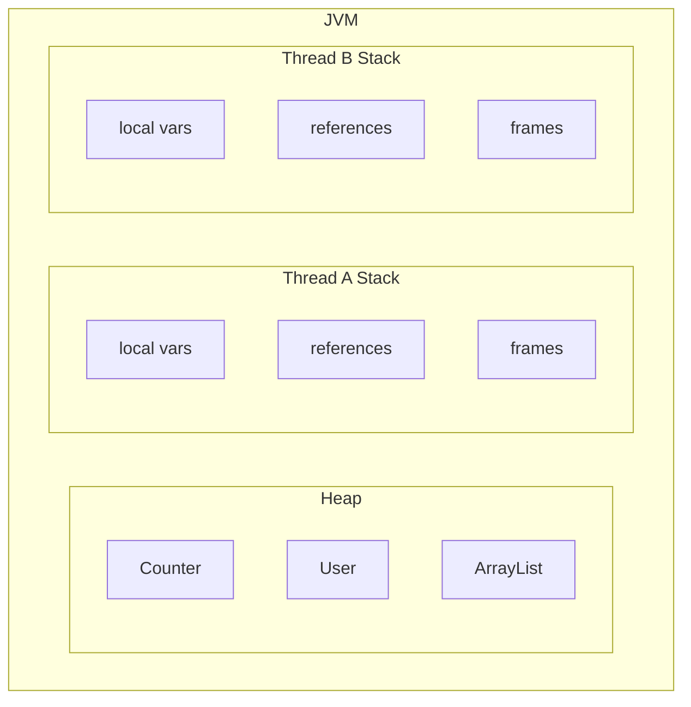
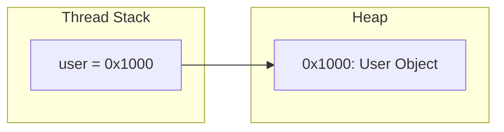
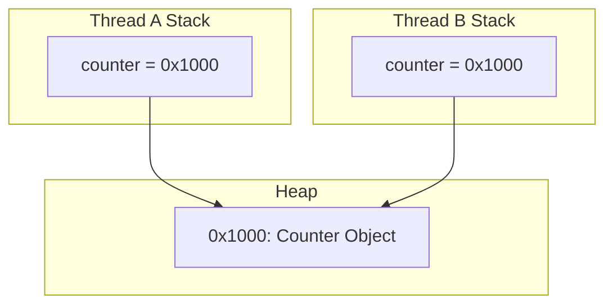
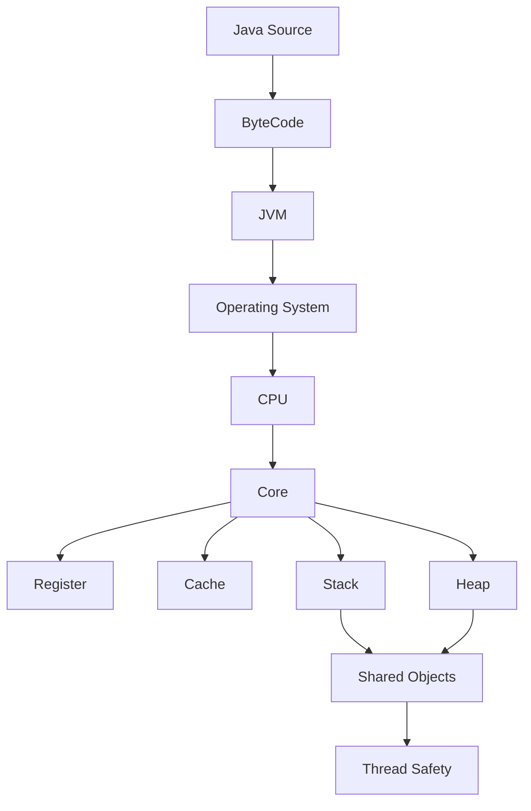

---
categories:
     - java-concurrency
date: 2026-07-02
tags:
     - Java
     - 高并发
     - JVM
title: java-concurrency（一）—— 计算机是如何执行 Java 程序的
---


## 本章目标

阅读完本章后，你应该能够回答下面几个问题：

-   一段 Java 程序是如何运行起来的？
-   JVM、操作系统和 CPU 分别负责什么？
-   为什么现代 CPU 都采用多核设计？
-   什么是线程，CPU 如何调度线程？
-   Heap、Stack、对象和引用之间是什么关系？
-   为什么多个线程访问同一个对象会产生线程安全问题？

## 1. Java 程序是如何运行起来的

学习 Java 高并发之前，我们先回答一个最基础的问题：**点击 IDEA 的 Run
按钮之后，计算机到底发生了什么？**

很多人知道 Java 程序运行在 JVM 上，但 JVM
并不是终点，它只是整个执行链路中的一环。一段 Java
程序最终会经过下面几个阶段：



整个过程可以概括为五个步骤：

1.  编写 Java 源代码；
2.  使用 `javac` 编译成字节码；
3.  JVM 加载并执行字节码，必要时将热点代码编译为机器指令；
4.  操作系统负责创建和调度线程；
5.  CPU 执行最终的机器指令。

后面的学习都会围绕这条链路展开，因此先建立整体模型，比记住各种 API
更重要。

## 2. CPU 是如何工作的

CPU 并不是一个单独的计算核心，而是由多个 Core（计算核心）组成。



现代 CPU 很少继续提升主频，而是增加 Core
的数量。这是因为主频越高，功耗和发热越严重，而增加 Core
更容易获得整体性能提升。

不过，多核 CPU 并不会自动让程序变快。例如：

``` java
for (int i = 0； i < 1000000000； i++) {

}
```

这段代码通常仍然只会由一个 Core 顺序执行，其余 Core 基本处于空闲状态。

因此，仅仅拥有多个 Core 还不够，程序还需要一种能够把任务拆分给多个 Core
的机制，这就是线程。

## 3. 一个 Core 是如何执行程序的

CPU 真正执行的是机器指令，而不是 Java 代码。

为了减少数据访问时间，Core
会优先使用寄存器（Register）保存当前参与计算的数据。



寄存器容量很小，但访问速度极快。例如执行：

``` java
int c = a + b；
```

CPU 会先把 `a`、`b` 放入寄存器，在寄存器中完成计算，再写回结果。

如果所有数据都必须直接从内存读取，CPU
大部分时间都会浪费在等待数据上。因此，仅靠寄存器仍然无法满足性能需求。

## 4. 为什么 CPU 需要 Cache

寄存器虽然快，但数量极少，只能保存当前参与计算的数据。

程序中的绝大多数数据仍然存放在主内存中，而主内存的访问速度远慢于
CPU。为了缩小两者之间的性能差距，现代 CPU 引入了多级缓存（Cache）。



CPU
每次读取数据时，都会优先查询距离自己最近的存储区域。只有前一级没有命中时，才继续向下一层查找。

Cache 大幅提升了执行效率，但多个 Core 拥有各自的
Cache，也意味着同一份数据可能同时存在多个副本。这一点会在后面的并发章节继续讨论。

## 5. 为什么需要线程

现代 CPU 已经拥有多个 Core，但程序默认仍然是顺序执行的。

如果希望多个 Core
同时工作，就必须把任务拆分成多条独立的执行路径，这就是线程（Thread）。

一个进程可以拥有多个线程，每个线程负责不同的任务。



Java 中创建的 `Thread`
最终都会对应到操作系统线程，由操作系统决定它们在哪个 Core 上运行。

## 6. CPU 如何调度线程

假设一台计算机拥有 8 个 Core，而程序创建了 100
个线程，那么显然不可能让所有线程同时运行。

一个 Core 在同一时刻只能执行一个线程，其余线程只能等待调度。

线程通常可以简单理解为三种状态：

-   Running：正在执行。
-   Runnable：具备运行条件，等待 CPU。
-   Blocked：由于锁、IO 等原因暂时不能运行。

CPU 会不断切换 Runnable
状态的线程，让它们轮流获得时间片。切换线程时，需要保存当前线程的执行现场，并在下次恢复执行，因此线程切换本身也存在一定开销。

## 7. JVM 为什么需要 Heap 和 Stack

线程出现以后，一个新的问题随之而来：线程自己的数据放在哪里？多个线程共同访问的数据又放在哪里？

JVM 将内存划分为多个区域，本书首先关注最重要的两个：

-   Stack：线程私有。
-   Heap：线程共享。



局部变量属于当前线程，因此放在 Stack；对象需要被多个线程访问，因此放在
Heap。

## 8. 对象和引用

来看一段代码：

``` java
User user = new User()；
```

很多人认为变量 `user` 就是对象本身，其实不是。

`new User()` 创建的是 Heap 中的对象，而变量 `user` 保存的是对象的引用。



引用相当于对象的地址，通过引用才能找到真正的对象。

多个引用也可以同时指向同一个对象：

``` java
User u1 = new User()；
User u2 = u1；
```

修改 `u1`，通过 `u2` 同样能够看到变化，因为它们访问的是同一个对象。

## 9. 为什么会出现线程安全问题

对象存放在 Heap，而 Heap 是所有线程共享的。

如果多个线程同时持有同一个对象的引用，那么它们实际上访问的是同一份数据。



当多个线程同时读取或修改同一个对象时，就可能发生竞争，这就是线程安全问题产生的根本原因。

后面的章节，我们将围绕最经典的一行代码：

``` java
count++；
```

一步一步分析线程安全问题是如何产生的，以及 Java 是如何解决这些问题的。

## 本章总结

本章建立了整本书的基础模型：



后续所有内容都会建立在这张模型图之上。
