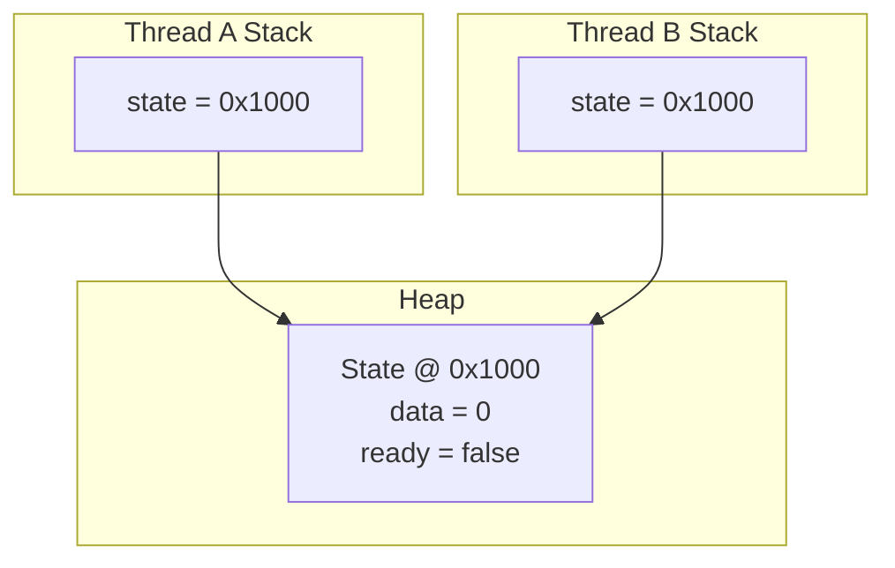
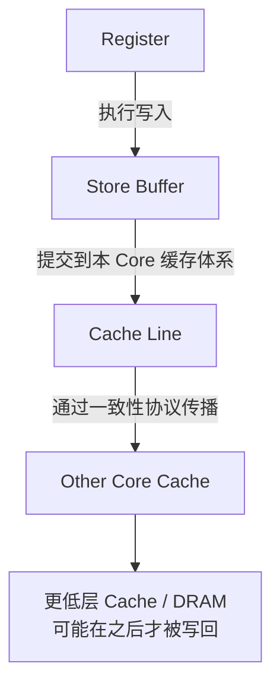
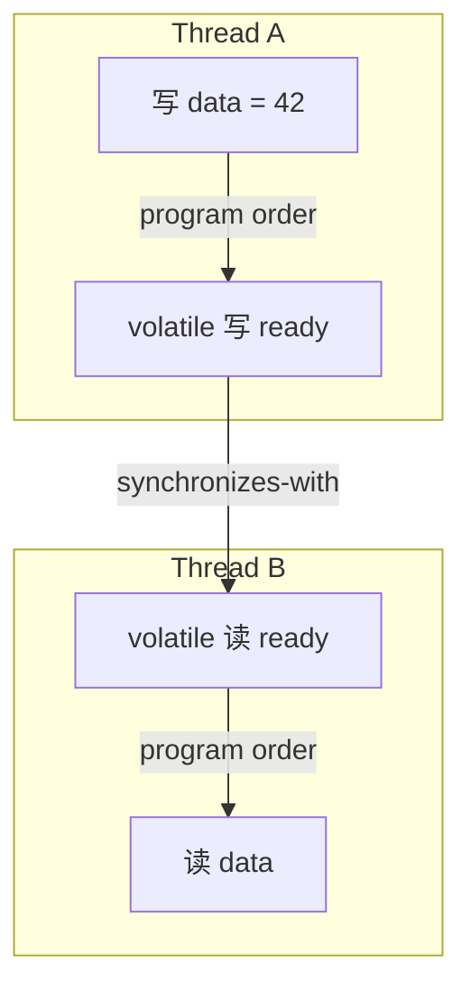
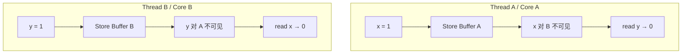
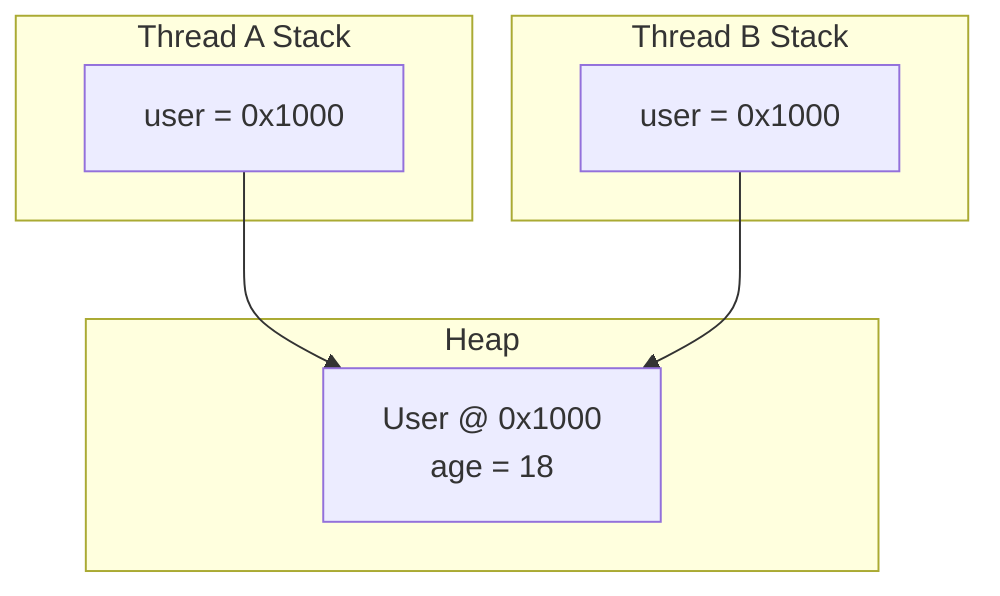
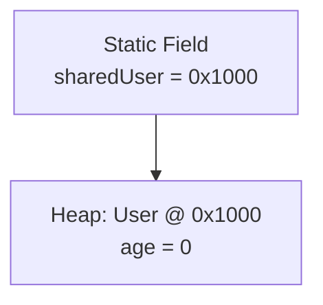

---

title: Java高并发底层原理（八）—— Java 内存模型到底规定了什么
date: 2026-07-03
tags:
    - Java
    - 高并发
    - JMM
    - happens-before
categories:
    - java-concurrency

---


Java 程序最终运行在 CPU 上。CPU 有寄存器、Store Buffer 和多级 Cache，JIT 编译器会调整指令，CPU 也可能乱序执行。相同的 Java 代码可以运行在 x86、ARM 等不同架构上，而不同架构提供的内存顺序保证并不完全相同。

如果 Java 并发程序只能依赖某一种 CPU 的具体行为，那么同一段代码换一台机器、换一种 JVM 实现，结果就可能发生变化。Java 因此需要在语言层面定义一套统一规则，规定不同线程能够观察到什么结果。

这套规则就是 Java Memory Model，简称 JMM，也就是 Java 内存模型。

## 一、JMM 是在描述内存结构吗

提到 Java 内存模型，很容易把它理解成“每个线程都有一份工作内存，主内存中保存共享变量”。这种说法可以帮助理解可见性，但它不是 Java 程序运行时的物理结构。Java 线程不会在自己的栈中复制一整份共享对象，Heap 也不等于物理内存中的 DRAM。

先看本文后面会反复回指的 `State` 例子：

```java
class State {
    int data = 0;
    boolean ready = false;
}

State state = new State();

Thread threadA = new Thread(() -> {
    state.data = 42;
    state.ready = true;
});

Thread threadB = new Thread(() -> {
    if (state.ready) {
        System.out.println(state.data);
    }
});
```

两个线程的栈中保存的是同一个对象地址，真正的 `State` 对象只有一份：



线程 A 修改的不是线程 B 的变量副本，而是 Heap 中同一个对象的字段。线程 B 之所以可能看不到最新值，不是因为 Heap 中真的存在两份 `State` 对象，而是因为一次写入从当前线程执行完成，到被另一个线程观察到，中间还要经过寄存器、Store Buffer、Cache、JIT 优化和 CPU 指令调度。

所以 JMM 关注的不是“变量具体放在哪一级硬件结构里”，而是“某次读取允许看到哪一次写入，以及哪些执行结果必须被排除”。这也是本文后面所有讨论的起点。

## 二、写入共享变量后，数据什么时候对别的线程可见

继续使用前文的 `State` 例子。线程 A 执行 `state.data = 42`，并不意味着 CPU 必须立刻把 `42` 写入 DRAM。现代 CPU 通常采用写回缓存，写操作可能先进入 Store Buffer，再修改 Cache Line，之后通过缓存一致性协议让其他 Core 看到这个变化。

这个过程跨越了内存层级，因此可以画出传播路径：



这里至少有三个不同时间点：当前 Core 认为写操作已经执行、写操作对其他 Core 可见、数据最终写回 DRAM。Java 并发主要关心第二个时间点。只要另一个 Core 能通过缓存一致性协议取得最新 Cache Line，就不需要先等待数据写回 DRAM。

因此，“对其他线程可见”不能简单理解为“已经写入主内存”。JMM 只要求另一个线程在规定的位置必须能够观察到这个写入，至于 JVM 和 CPU 如何完成传播，属于实现细节。

## 三、为什么 CPU 不严格按照源码顺序执行

JMM 允许底层实现做优化，前提是不能破坏单线程语义。比如：

```java
int a = 0;
int b = 0;

a = 1;
b = 2;
```

`b = 2` 不依赖 `a = 1` 的结果，JIT 编译器可以调整两条机器指令的顺序，CPU 也可能让它们在流水线中重叠执行。只要当前线程最终观察到的结果没有变化，这种优化就不会破坏单线程语义。

如果存在数据依赖，顺序就不能随意交换：

```java
a = 1;
b = a + 1;
```

`b` 的计算依赖 `a` 的结果，所以 `b = a + 1` 不能被当作与 `a = 1` 无关的独立写入处理。编译器和 CPU 还会考虑控制依赖、异常语义、对象别名以及同步操作，但核心判断标准仍然是：调整之后能否保持当前线程的可观察行为不变。

这种规则通常称为 as-if-serial：

> 实际执行过程可以不像串行执行，但单线程观察到的结果必须像按照程序逻辑串行执行一样。

如果 Java 强制所有操作严格按照源码顺序完成，每次写入都必须等待全局可见，那么 JIT 调整无依赖指令、CPU 提前执行已就绪指令、Store Buffer 隐藏一致性通信延迟、Cache 延迟回写、内存系统合并相邻写操作等优化都会受到限制。Java 采用的策略不是禁止所有优化，而是在程序明确使用 `volatile`、锁等同步机制时，再限制那些会破坏线程间语义的重排。

## 四、什么是 program order

前文说底层可以重排，但 JMM 仍然需要一个线程内部的逻辑顺序。这个线程内逻辑顺序就是 program order。

在前文的 `State` 例子中，线程 A 的程序逻辑是先写 `data`，再写 `ready`；线程 B 的程序逻辑是先读 `ready`，条件成立后再读 `data`。JMM 会保留这种线程内部的程序语义，但它不把两个线程的内部顺序自动拼成一条全局顺序。

这句话很关键：program order 只连接同一个线程内部的操作。没有同步操作时，线程 A 中“写 `data` 先于写 `ready`”这个事实，不会自动变成线程 B 必须先看到 `data`、再看到 `ready` 的保证。

因此，普通变量下线程 B 即使看到 `ready == true`，仍然不保证一定看到 `data == 42`。这不是对第一节例子的重新展开，而是从 program order 的角度解释它为什么还不够。

## 五、JMM 如何连接两个线程

program order 只能连接线程内部。要让一个线程的写入对另一个线程产生约束，还需要跨线程连接，这个连接叫 synchronizes-with。

继续沿用第一节的 `State` 例子：如果把 `ready` 改成 `volatile`，线程 A 对 `ready` 的 volatile 写，和线程 B 后续读到这个值的 volatile 读之间，就建立了 synchronizes-with 关系。这个关系不是因为两个线程碰巧先后执行，而是因为 JMM 明确规定 volatile 写和后续观察到该写入的 volatile 读之间存在同步关系。

常见的 synchronizes-with 规则包括：volatile 写连接后续观察到该写入的 volatile 读；同一把锁的解锁连接后续加锁；`Thread.start()` 连接新线程中的动作；线程中的动作连接另一个线程从 `join()` 成功返回。

到这里形成了一个新的层次：program order 负责线程内部，synchronizes-with 负责跨线程。JMM 不是要求所有读写都按物理时间排成一列，而是在必要的位置建立这些语义连接。

## 六、happens-before 到底表示什么

有了前两节的铺垫，happens-before 就可以从“连接关系”来理解：它由 program order、synchronizes-with 以及传递性共同构成。

如果操作 A happens-before 操作 B，JMM 提供两类保证：A 的内存效果必须对 B 可见；同时，编译器和 CPU 不能通过重排产生违背这个关系的结果。happens-before 不是单纯的现实时间顺序。一个操作在时钟时间上先执行，并不代表它一定 happens-before 另一个操作；只有符合 JMM 规则的操作，才会建立这种关系。

继续回到前文的 volatile `ready`：线程 A 在 program order 中先写 `data`，再 volatile 写 `ready`；线程 B 通过 volatile 读看到 `ready == true` 后，再按 program order 读取 `data`。中间的 volatile 写和 volatile 读建立 synchronizes-with，三段关系通过传递性连起来后，线程 A 写 `data = 42` 就 happens-before 线程 B 读 `data`。

所以线程 B 读到 `ready == true` 后，必须能够看到 `data = 42`。这里不是 `volatile ready` 把 `data` 也变成了 volatile，而是 `ready` 在两个线程之间建立了一座桥，把线程 A 中 volatile 写之前的内存效果传递给线程 B 中 volatile 读之后的操作。



## 七、volatile 的保证范围有多大

前文已经完整展开了 volatile 如何通过 `ready` 建立跨线程连接，这一节只讨论它的范围。

volatile 的方向和位置非常重要。在线程 A 中，只有 volatile 写之前的普通写，才能随着这次 volatile 写被发布出去；在线程 B 中，只有 volatile 读之后的普通读，才能接收这次发布带来的可见性效果。

因此，正确的模式是：先写普通数据，再写 volatile 标志；另一个线程先读 volatile 标志，再读普通数据。反过来就不行。如果先写 volatile 标志，再写普通数据，后面的普通写不能通过前面的 volatile 写发布出去；如果另一个线程先读普通数据，再读 volatile 标志，后面的 volatile 读也不能反过来修复之前已经读到的旧值。

所以 volatile 不是让整个线程无条件互相可见，而是在特定位置建立有方向的同步边界。它的作用范围来自 happens-before 链条，而不是来自“所有变量都刷新一次”这种物理想象。

## 八、缓存一致性为什么不能代替 JMM

第二节已经讲过写入传播路径，这里只补上它和 JMM 的边界。缓存一致性协议主要维护同一个内存位置在多个 Core 之间的一致性：一个 Core 修改某个 Cache Line 时，需要取得修改权限，并让其他 Core 中对应的 Cache Line 失效。

这个过程解决的是硬件层面的数据副本一致问题，但不能替代 JMM 的同步规则。原因有两点：第一，传播不是瞬间完成的，另一个 Core 仍可能在传播完成前读取到旧值；第二，即使某个 Cache Line 已经更新，JIT 仍可能复用寄存器中的旧值，CPU 也可能调整不同地址之间的内存操作顺序。

更重要的是，缓存一致性通常关注同一个地址，而 Java 并发经常关心多个变量之间的顺序。以前文的 `State` 例子来说，`data` 和 `ready` 是两个字段，硬件最终能让每个地址保持一致，不等于线程 B 必须按照线程 A 的源码顺序观察到两个字段的变化。多变量之间的顺序需要 volatile、锁等同步规则建立约束。

所以不能因为硬件最终会保持 Cache 一致，就推导出没有同步的 Java 程序最终一定能看到新值。JMM 没有建立 happens-before 时，程序不能依赖这种结果。

## 九、什么是数据竞争

前面几节一直在说明“什么时候有保证”。现在反过来看“什么时候没有保证”。

当两个不同线程访问同一个变量，并且至少一个操作是写，同时两个操作之间没有 happens-before，就存在数据竞争。写和读冲突，写和写也冲突；两个线程都只读取同一个变量，不构成数据竞争。

例如：

```java
int data = 0;

// Thread A
data = 1;

// Thread B
int value = data;
```

线程 A 的写与线程 B 的读之间没有 happens-before，因此存在数据竞争。线程 B 可能读到初始值 `0`，也可能读到 `1`。

没有 happens-before 的含义不是“一定读到旧值”，而是“Java 不提供必须读到哪个值的保证”。程序连续运行很多次都得到预期结果，也不能证明程序没有数据竞争；线程调度、JIT 编译结果和硬件时序发生变化后，允许范围内的其他结果仍然可能出现。

## 十、happens-before 是否保证读到某一个固定值

第六节已经说明，happens-before 会让前面的内存效果对后面的操作可见。但这不等于读取只能返回某一个固定值，因为在 happens-before 之外，可能还有其他合法写入参与竞争。

看一个新例子：

```java
int data = 0;
volatile boolean flag = false;

// Thread A
data = 1;
flag = true;

// Thread B
if (flag) {
    data = 2;
}

// Thread C
if (flag) {
    System.out.println(data);
}
```

线程 C 读取到 `flag == true` 后，线程 A 的 `data = 1` 通过 volatile 建立的 happens-before 关系传递到线程 C，因此线程 C 不能再读到初始值 `0`。

但线程 B 对 `data = 2` 的写，与线程 C 对 `data` 的读之间没有必然的 happens-before。如果 B 已经执行并且它的写入被 C 观察到，C 可以读到 `2`；如果没有观察到，C 可以读到 `1`。所以可能结果是 `1` 或 `2`，不可能结果是 `0`。

这个例子说明：happens-before 不是“指定读取必须返回哪一次写入”，而是限制一次读取允许观察到哪些写入。它能排除不合法结果，但不把所有并发竞争都变成唯一结果。

## 十一、为什么双方都可能读到初始值

这一节完整展开一个经典的多线程交错例子，用来连接前文的 Store Buffer、重排和 happens-before。

```java
int x = 0;
int y = 0;

// Thread A
x = 1;
int r1 = y;

// Thread B
y = 1;
int r2 = x;
```

`r1 == 0 && r2 == 0` 是允许出现的。一种原因是线程内部不存在相关数据依赖，编译器或 CPU 可能产生读操作越过写操作的效果；另一种原因是机器指令没有交换，双方仍然可以因为 Store Buffer 传播延迟而读到旧值。

这个场景涉及两个线程和两个 Core 的交错时序，因此可以画图：



JMM 不要求程序判断究竟是 JIT 重排、CPU 乱序执行，还是 Store Buffer 传播延迟造成了结果。因为两个线程之间没有 happens-before，双方都读到初始值就是合法结果。

如果 `x` 和 `y` 都是 volatile，那么 `r1 == 0 && r2 == 0` 会被排除。原因不是 volatile 让两个线程互相等待，而是所有 volatile 操作必须进入统一的同步顺序，并且这个同步顺序不能违背每个线程自己的 program order。若双方都读到 `0`，同步顺序中会形成一个无法成立的环：A 的 volatile 写必须排在 A 的 volatile 读之前，B 的 volatile 写也必须排在 B 的 volatile 读之前；同时，A 读到 `y == 0` 又要求它排在 B 写 `y` 之前，B 读到 `x == 0` 又要求它排在 A 写 `x` 之前。一个顺序无法同时满足这四个约束。

但 volatile 仍然不能保证双方都读取到 `1`。它负责可见性和顺序约束，不负责等待另一个线程完成某个阶段。要保证双方都先完成写入，再开始读取，需要使用 `CountDownLatch`、`CyclicBarrier` 等线程会合工具。

## 十二、什么是正确同步程序

如果所有存在冲突的共享变量访问，都通过锁、volatile、线程启动和结束等规则建立了 happens-before，那么程序就是正确同步的。

例如：

```java
int count = 0;

// Thread A
synchronized (lock) {
    count++;
}

// Thread B
synchronized (lock) {
    count++;
}
```

两次 `count++` 都位于同一把锁保护的临界区中。由于同一把锁的解锁 synchronizes-with 后续加锁，先进入临界区的线程会把对 `count` 的修改发布给后进入临界区的线程。同时，互斥保证两个 `count++` 不会拆成读取、计算、写回三个步骤后互相穿插。

因此两个线程执行完成后，`count` 必须为 `2`。这里不需要开发者逐条分析 Store Buffer、Cache Line 和 CPU 时序，只需要依据锁建立的 happens-before 和互斥语义推理。

JMM 对正确同步程序提供一个重要保证：程序的执行结果可以按照顺序一致性进行推理。顺序一致性不表示 CPU 真的逐条串行执行，而是说最终可观察结果等价于某种全局交错顺序，并且每个线程自己的 program order 不被破坏。

## 十三、start 和 join 规定了什么

除了 volatile 和锁，线程生命周期方法也能建立 happens-before。

`Thread.start()` 不只是启动一个线程，它还负责把启动前的内存效果发布给新线程：

```java
int data = 42;

Thread thread = new Thread(() -> {
    System.out.println(data);
});

thread.start();
```

主线程调用 `start()` 之前已经产生的内存效果，happens-before 新线程中的动作。因此子线程必须看到 `data == 42`。`start()` 发布的不是某一个变量，而是调用 `start()` 之前已经产生的全部内存效果；如果主线程在启动前完成了对象构造，对象内部字段也会被一起发布。

`Thread.join()` 的方向相反。一个线程中的所有操作，happens-before 另一个线程从该线程的 `join()` 中成功返回：

```java
int[] result = new int[1];

Thread thread = new Thread(() -> {
    result[0] = 42;
});

thread.start();
thread.join();

System.out.println(result[0]);
```

子线程写入 `result[0] = 42` 后结束，主线程从 `join()` 返回后再读取数组元素，因此必须读到 `42`。`join()` 同时包含等待作用和可见性作用：先等待目标线程结束，再接收目标线程结束前的内存效果。

可以把二者方向记成一句话：`start()` 把数据从启动线程传给新线程，`join()` 把新线程的执行结果传回等待线程。

## 十四、什么是对象发布

对象发布是指让其他线程能够获得这个对象的引用。

```java
class User {
    int age = 18;
}

User sharedUser;

// Thread A
sharedUser = new User();

// Thread B
User user = sharedUser;
```

线程 A 把对象地址写入共享字段 `sharedUser`，线程 B 通过这个字段得到同一个地址：



发布的是对象引用，不是复制对象。把引用写入共享字段、放入共享集合、传入线程任务或返回给其他代码，都可能构成对象发布。

如果发布过程没有使用 volatile、锁、并发容器、`start()` 等方式建立 happens-before，就属于不安全发布。线程 B 可能仍然读到旧引用，例如 `null`；即使读到了对象，也不一定能看到普通字段的完整初始化结果。

安全发布的核心不是对象一定放在 Heap 中，而是构造期间的写入与另一个线程读取对象之间建立了 happens-before。

## 十五、什么是 this 逃逸

上一节讲的是对象引用如何交给其他线程，这一节只讨论一种危险发布：构造函数还没结束，`this` 就被外部代码或其他线程拿到了。

```java
class User {
    static User sharedUser;

    int age;

    User() {
        sharedUser = this;
        age = 18;
    }
}
```

对象创建时，字段先具有默认值。上面这个构造函数先把 `this` 写入共享字段，再给 `age` 赋值。其他线程如果在这两个动作之间读取 `sharedUser`，就可能拿到一个尚未完成初始化的对象，并看到 `age == 0`。

这个场景涉及对象引用在堆上的提前暴露，可以用引用关系表达：



正确做法是：完成全部字段初始化，构造函数正常结束之后，再向其他线程发布对象引用。构造函数内部启动线程、注册回调、把 `this` 放入静态字段或共享集合，都可能造成 `this` 逃逸。

## 十六、final 字段为什么具有特殊语义

从 Java 语法看，`final` 字段只能赋值一次：

```java
class User {
    final int id;

    User() {
        id = 1;
    }
}
```

JMM 还为 final 字段提供了特殊的初始化安全保证。看这个例子：

```java
class User {
    final int id;
    int age;

    User() {
        id = 1;
        age = 18;
    }
}

User sharedUser;

// Thread A
sharedUser = new User();

// Thread B
User local = sharedUser;
if (local != null) {
    System.out.println(local.id);
    System.out.println(local.age);
}
```

`sharedUser` 是普通字段，线程 A 写引用与线程 B 读引用之间没有 happens-before。因此，线程 B 不保证一定看到非空引用。但是，只要对象构造函数正常结束，并且构造期间没有发生前文说的 `this` 逃逸，那么线程 B 一旦看到了这个对象，JMM 保证它看到 final 字段的构造值，也就是 `local.id` 必须为 `1`。

普通字段 `age` 没有同样的特殊保证。在不安全发布的情况下，理论上可能出现 `id = 1` 但 `age = 0`。final 字段规则不能简单写成普通的跨线程 happens-before，因为对象引用本身可能没有通过同步方式发布。它更像是 JMM 对构造完成后的 final 字段做了特殊冻结：只要对象没有在构造期间逃逸，其他线程获得对象后必须看到 final 字段在构造函数中写入的值。

这里的“冻结”是 JMM 语义，不代表对象在物理内存中被锁定。final 也只保证字段本身的初始化安全，不代表整个对象自动线程安全。例如，`final List<String> names` 只能保证其他线程看到的是构造函数赋给 `names` 的那个引用；多个线程之后同时修改这个 `ArrayList`，仍然会产生并发问题。

实际程序中仍应优先使用 volatile、锁、并发容器、静态初始化或线程启动等方式安全发布对象，而不是只依赖 final 的特殊规则。

## 本章总结

JMM 的主线可以从一个问题展开：Java 既要允许 JIT、CPU 和缓存体系做优化，又要让跨线程通信在必要位置具有确定语义。为了解决这个矛盾，JMM 不去承诺某个值必须立刻进入 DRAM，而是把并发程序的判断点提升为“读取允许看到哪一次写入”。

在这个判断点上，单线程内部先由 program order 保持语义连续性；跨线程处再由 volatile、锁、`start()`、`join()` 等同步动作建立 synchronizes-with；这些边通过传递性汇合成 happens-before。只要链条连通，前面的内存效果就必须被后面的操作承接；链条断开，程序就不能再把某次运行结果误认为语言保证。

于是，缓存一致性、Store Buffer 和重排解释的是“为什么没有同步时会出现意外结果”，而 happens-before 解释的是“哪些意外结果会被 Java 规则排除”。对象发布、`this` 逃逸和 final 字段语义也都落在同一条主线上：引用能被别的线程拿到，只说明对象地址传过去了；构造期间的写入能不能一起被看见，还要看这条发布路径上有没有被 JMM 承认的同步边界。
