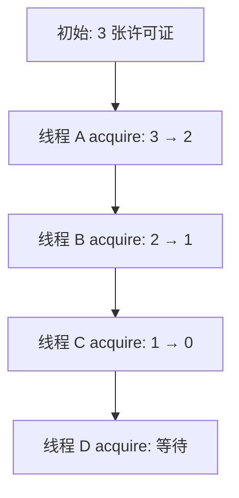
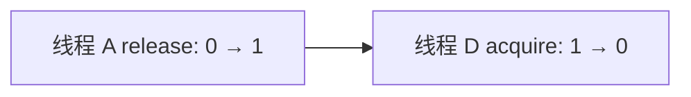
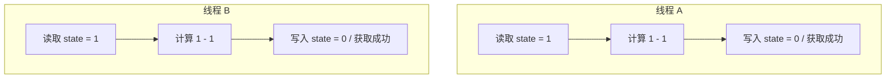
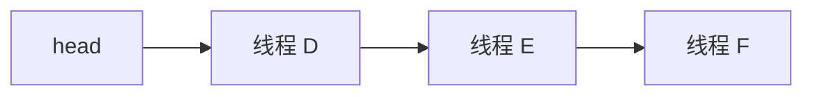
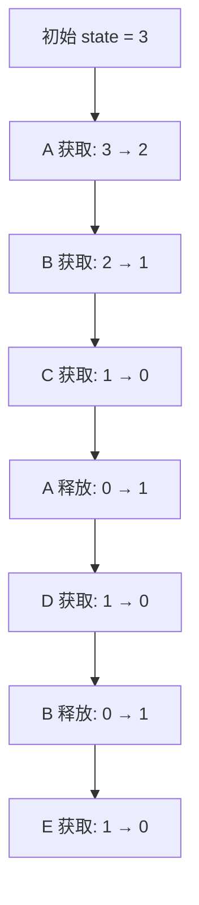

`CountDownLatch` 适合等待一批任务全部完成，但它不限制这些任务能够同时执行多少个。假设程序需要访问一个外部服务，而这个服务最多只能同时处理三个请求，如果十个线程一起访问，就可能造成连接耗尽、响应变慢甚至服务崩溃。

这时可以使用 `Semaphore`：

```java
Semaphore semaphore = new Semaphore(3);
```

这里的 `3` 表示初始有三个许可证。线程只有成功取得许可证后，才能继续访问受限资源；使用结束后，再把许可证归还。

```java
semaphore.acquire();

try {
    accessService();
} finally {
    semaphore.release();
}
```

`Semaphore` 解决的不是“所有任务什么时候结束”，而是“同一时刻最多允许多少个线程继续执行”。

## 一、许可证表示什么

创建 `Semaphore` 时传入的数字表示当前可用许可证数量：

```java
Semaphore semaphore = new Semaphore(3);
```

可以把它理解为当前有三张通行证。前三个线程调用 `acquire()` 时，可以分别拿走一张许可证；第四个线程再调用 `acquire()` 时，发现许可证已经用完，就需要等待。



当某个线程执行完受限任务并调用 `release()` 后，许可证数量增加，等待线程才有机会重新尝试获取许可证。



这里需要注意，`release()` 并不是把许可证直接指定给某个等待线程。它只是增加可用许可证，并通知等待线程重新参与竞争。最终哪个线程成功，还要看它是否重新执行获取逻辑并成功减少许可证数量。

## 二、acquire()、release() 与 state 的关系

`Semaphore` 基于 AQS 实现，并使用 AQS 的 `state` 保存当前剩余许可证数量：

```text
state = 3: three permits available
state = 2: two permits available
state = 1: one permit available
state = 0: no permit available
```

这和前面几个同步工具使用的是同一个 AQS 状态字段，但语义不同。

| 同步工具 | state 的含义 |
|---|---|
| `ReentrantLock` | 锁状态和重入次数 |
| `CountDownLatch` | 尚未完成的事件数量 |
| `Semaphore` | 剩余许可证数量 |

所以 `Semaphore` 的两个核心操作可以直接理解为：

```text
acquire(): state decreases
release(): state increases
```

这和 `CountDownLatch` 只递减不同。`Semaphore` 的许可证既可以被获取，也可以被归还，因此它可以长期重复使用。

## 三、为什么 acquire() 和 release() 都需要 CAS

多个线程可能同时申请许可证。如果 `acquire()` 内部只是普通地执行 `state--`，就可能让多个线程取得同一个许可证。

假设当前只剩一个许可证，也就是 `state == 1`。两个线程同时申请时，都可能先读到 `1`，然后都把结果写回 `0`。从状态结果看只少了一个许可证，但两个线程都可能认为自己已经通过了限制。

这个交错过程可以表示为：



这会破坏并发数量限制。`Semaphore` 因此使用 CAS 循环修改 `state`。可以简化理解为：

```java
for (;;) {
    int available = getState();
    int remaining = available - 1;

    if (remaining < 0) {
        获取失败;
    }

    if (compareAndSetState(available, remaining)) {
        获取成功;
        return;
    }
}
```

如果两个线程都读到 `state == 1`，只有一个线程能成功执行 `CAS(1, 0)`；另一个线程 CAS 失败后必须重新读取最新状态，发现已经没有许可证，就进入等待。

`release()` 也需要 CAS，原因和 `acquire()` 对称。多个线程可能同时归还许可证，如果只是普通地执行 `state++`，也可能发生更新丢失。例如两个线程都读到 `state == 0`，都写回 `1`，实际归还了两个许可证，结果却只增加了一个。因此归还许可证同样要通过 CAS 循环完成。

## 四、许可证不足时线程去了哪里

当线程调用 `acquire()` 时，如果发现 `state == 0`，它不会一直空转重试。AQS 会把它加入等待队列，并暂停线程执行。等其他线程调用 `release()` 增加许可证后，等待线程会被唤醒，再重新尝试获取许可证。



被唤醒不等于已经取得许可证。线程醒来后仍然要重新读取 `state`，并通过 CAS 尝试减少许可证数量。只有成功减少 `state`，才算真正通过 `acquire()`。

这一点和前文的 `Condition` 类似：通知只是让等待线程重新获得机会，不是直接承诺业务条件一定满足；在 `Semaphore` 中，唤醒也只是重新竞争许可证的开始。

## 五、为什么 Semaphore 属于共享模式

`ReentrantLock` 使用 AQS 独占模式。一把锁同一时刻只能由一个线程持有，其他线程必须等待。

`Semaphore` 使用 AQS 共享模式。只要还有许可证，多个线程就可以同时获取成功：

```text
Initial permits = 3

Thread A acquire: 3 -> 2
Thread B acquire: 2 -> 1
Thread C acquire: 1 -> 0
```

三个线程都能通过 `acquire()`，因此可以同时执行受限代码。这里的“共享”不是指多个线程共同拥有同一张许可证，而是指同步状态允许多个线程同时通过。

它和 `CountDownLatch` 都属于共享模式，但通过条件不同：

| 同步工具 | 共享通过条件 |
|---|---|
| `CountDownLatch` | `state == 0` 后，等待线程都可以通过 |
| `Semaphore` | `state` 足够时，线程消耗许可证后通过 |

所以 `CountDownLatch` 更像一次性闸门，计数归零后所有等待线程放行；`Semaphore` 更像可循环使用的通行证池，线程通过时拿走许可证，结束后再归还许可证。

## 六、为什么 Semaphore 可以重复使用

`CountDownLatch` 的计数只能减少，到达 `0` 后不会恢复，因此只能使用一轮。`Semaphore` 的 `state` 既会因为 `acquire()` 减少，也会因为 `release()` 增加，所以它可以在长期运行的程序中反复控制并发数量。



这也是它适合做限流、资源池并发控制的原因：许可证不会因为用完一次就永久失效，而是在获取和归还之间循环流动。

## 七、Semaphore 不记录许可证属于哪个线程

`ReentrantLock` 会记录当前持锁线程，只有 owner 才能合法执行 `unlock()`。`Semaphore` 不记录某个许可证具体属于哪个线程，也没有类似 owner 的字段。

这意味着从 `Semaphore` 自身的角度看，一个线程调用 `acquire()`，另一个线程调用 `release()` 是允许的：

```java
semaphore.acquire();

// another thread
semaphore.release();
```

这不是漏洞，而是它的设计语义：`Semaphore` 只维护许可证数量，不检查许可证由谁取得、又由谁归还。因此程序必须自己保证 `acquire()` 和 `release()` 的业务配对关系。

如果没有成功取得许可证却调用了 `release()`，许可证数量可能超过初始值：

```java
Semaphore semaphore = new Semaphore(3);

semaphore.release(); // permits may become 4
```

构造方法中的 `3` 只是初始许可证数量，不是自动维护的最大上限。错误地多调用 `release()`，会直接破坏原本的并发限制。

## 八、正确使用：finally、多许可证和公平性

只要 `acquire()` 成功返回，就应该保证后续一定会调用 `release()`。否则线程在执行受限任务时抛出异常，就可能造成许可证泄漏。许可证泄漏后，后续线程会一直等待，即使原来的工作线程早已结束。

标准写法是：

```java
semaphore.acquire();

try {
    doWork();
} finally {
    semaphore.release();
}
```

`acquire()` 应放在 `try` 外面。因为它可能在等待期间被中断并抛出 `InterruptedException`；如果线程根本没有成功取得许可证，就不应该在 `finally` 中归还许可证。

`Semaphore` 还支持一次申请多个许可证：

```java
semaphore.acquire(2);
```

这表示当前线程必须同时取得两个许可证才能继续执行。归还时也应该归还相同数量：

```java
semaphore.release(2);
```

一次申请多个许可证适合表示一个任务会同时占用多份资源，但业务代码必须保证申请和归还数量一致。

默认创建的是非公平 `Semaphore`：

```java
Semaphore semaphore = new Semaphore(3);
```

也可以创建公平 `Semaphore`：

```java
Semaphore semaphore = new Semaphore(3, true);
```

非公平模式下，新到达的线程可能在等待队列中的线程之前取得刚刚释放的许可证。公平模式会尽量按照线程进入等待队列的顺序分配许可证。公平模式可以减少长期等待，但通常需要更多队列判断和线程调度，吞吐量可能低于非公平模式。因此，默认使用非公平模式；只有业务明确要求等待顺序时，才需要考虑公平模式。

## 九、如何避免无限等待

普通的 `acquire()` 会一直等待许可证，但等待期间可以响应中断：

```java
try {
    semaphore.acquire();
} catch (InterruptedException e) {
    Thread.currentThread().interrupt();
}
```

如果不希望线程进入等待，可以使用立即尝试获取：

```java
boolean acquired = semaphore.tryAcquire();

if (acquired) {
    try {
        doWork();
    } finally {
        semaphore.release();
    }
} else {
    System.out.println("no permit available");
}
```

如果希望最多等待一段时间，可以使用带超时的方法：

```java
boolean acquired =
        semaphore.tryAcquire(5, TimeUnit.SECONDS);
```

返回 `true` 表示在超时前成功取得许可证，返回 `false` 表示等待超时。只有返回 `true` 时，后续才能调用 `release()`。

## 十、release() 和 acquire() 的可见性边界

`Semaphore` 不只控制线程能否继续执行，还具有内存可见性保证：一个线程在调用 `release()` 之前完成的操作，happens-before 另一个线程成功调用 `acquire()` 之后的操作。

```java
// Thread A
data = result;
semaphore.release();

// Thread B
semaphore.acquire();
System.out.println(data);
```

如果线程 B 成功取得了由同步过程释放出来的许可证，那么它能够看到线程 A 在 `release()` 之前产生的内存更新。

但这类可见性保证不能代替互斥。`Semaphore(3)` 允许最多三个线程同时进入受限区域，如果这三个线程还会同时修改同一个非线程安全对象，仍然可能发生写写冲突。

```text
Semaphore(3): at most three threads enter
ReentrantLock: at most one thread enters
```

所以 `Semaphore` 解决的是并发数量边界，不是临界区互斥边界。许可证只控制有多少线程能进来，不保证进来的线程之间不会互相干扰。

## 十一、Semaphore 适合解决什么问题

`Semaphore` 适合限制同时访问某种资源的线程数量，例如限制同时访问外部服务的请求数、限制同时使用数据库连接的线程数、限制同时执行文件转换的任务数、模拟停车场中的剩余车位，或者控制接口调用的并发数量。

它表示的是“还有多少个线程可以继续执行”，而不是“还有多少个任务没有完成”。

| 工具 | 解决的问题 |
|---|---|
| `ReentrantLock` | 同一时刻谁能进入临界区 |
| `Condition` | 进入临界区后，业务条件不满足时如何等待 |
| `CountDownLatch` | 一批事件是否已经全部完成 |
| `Semaphore` | 同一时刻最多允许多少线程继续执行 |

`Semaphore` 也不能完全代替线程池。线程池不仅能限制同时执行的任务数量，还负责复用线程、保存待执行任务和管理线程生命周期。`Semaphore` 只负责许可证控制，不负责创建、复用和调度线程。

## 本章总结

`Semaphore` 的因果链条可以从许可证开始理解：许可证数量被保存在 AQS 的 `state` 中，线程想继续执行就必须先通过 CAS 减少 `state`；如果许可证不足，线程进入 AQS 等待队列，而不是持续占用 CPU。任务结束后，线程再通过 CAS 增加 `state`，等待线程被唤醒并重新竞争许可证。

正因为 `state` 可以减少也可以增加，`Semaphore` 不像 `CountDownLatch` 那样只使用一次，而是可以在获取和归还之间长期循环。正因为它使用共享模式，只要许可证足够，多个线程就能同时通过；也正因为它不记录 owner，程序必须自己保证成功获取后再释放，避免多释放破坏并发限制。

最终，`Semaphore` 建立的是“并发数量”的边界。它可以把十个线程限制成同一时刻最多三个线程访问资源，也可以通过 `release()` / `acquire()` 提供必要的内存可见性，但它不会把这三个线程变成互斥执行。如果通过许可证的线程仍然共同修改非线程安全对象，仍然需要额外的锁、线程安全容器或其他同步机制。
