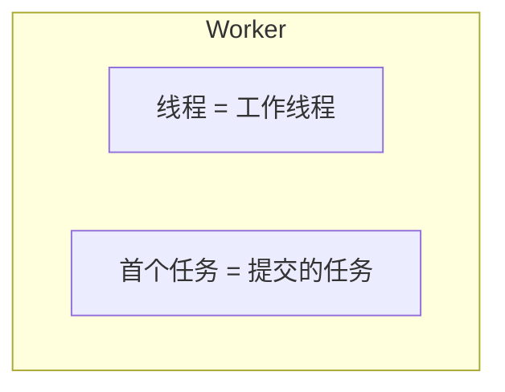
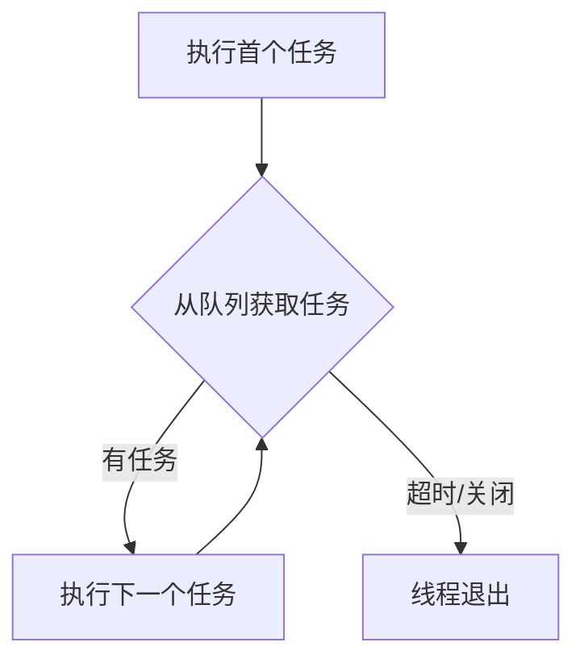
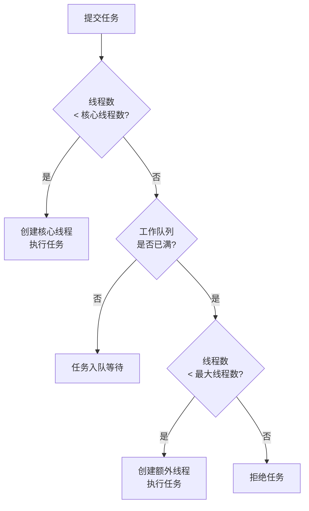
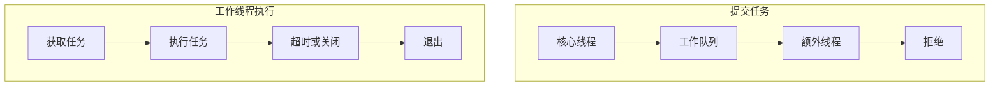

并发程序需要同时处理多个任务，最直接的做法是为每个任务创建一个线程：

```java
new Thread(() -> handleRequest()).start();
```

任务数量较少时，这种写法没有明显问题。但如果短时间内到来大量任务，程序就会不断创建线程。线程创建、启动和销毁都需要成本，过多线程还会争夺 CPU 和内存，导致上下文切换频繁，甚至耗尽系统资源。

线程池解决的核心问题是：把“任务”和“线程”分离。任务表示需要完成的工作，线程表示执行任务的执行者。线程池提前维护一组可复用的工作线程，把不断到来的任务交给这些线程执行，而不是每个任务都重新创建一个线程。

## 一、为什么不能为每个任务都创建线程

一个 Java 线程不仅是一个普通对象，它还需要对应的执行栈、程序计数器，以及 JVM 和操作系统中的线程管理状态。创建一个线程，通常意味着申请线程资源、分配线程栈、启动线程并参与操作系统调度；任务结束后，还要回收这些资源。

如果每个任务都创建新线程，会产生三类问题。第一，线程创建和销毁本身有成本，短任务尤其容易被这部分成本放大。第二，每个线程都需要占用内存，线程数量过多时，仅线程栈就可能消耗大量空间。第三，CPU 核心数量有限，即使创建了几万个线程，同一时刻真正运行的线程也只有少数，大量线程会频繁暂停、恢复和切换。

线程池不让任务直接驱动线程数量无限增长，而是在三类资源之间做协调：

| 资源 | 作用 |
|---|---|
| 工作线程 | 真正执行任务 |
| 任务队列 | 保存暂时没人执行的任务 |
| 并发上限 | 限制最多创建多少工作线程 |

所以线程池的目标不是“创建更多线程”，而是“用有限线程稳定处理更多任务”。

## 二、任务、线程和 Worker 是什么关系

在线程池中，任务和线程是两个不同概念。

```java
Runnable task = () -> handleRequest();
```

任务表示“要做什么”；线程表示“由谁来做”。没有线程池时，一个线程通常只执行一个任务：线程启动，执行任务，任务结束，线程也结束。在线程池中，一个工作线程执行完当前任务后不会立刻结束，而是继续寻找下一个任务。

线程池内部会使用 `Worker` 管理工作线程。可以先把 `Worker` 理解为线程池内部的工作单元：它关联一个真正的 Java 线程，并保存这个线程启动后要执行的第一个任务。



工作线程启动后，先执行 `firstTask`。执行完之后，它会继续调用 `getTask()` 从任务队列中获取后续任务。只要还能拿到任务，这个线程就会继续复用。



因此，线程池复用的不是任务，而是工作线程。同一个 `Worker Thread` 可以在生命周期内执行多个不同的 `Runnable`。

## 三、ThreadPoolExecutor 的核心参数

Java 线程池的核心实现类是 `ThreadPoolExecutor`。一个常见的创建方式如下：

```java
ThreadPoolExecutor executor = new ThreadPoolExecutor(
        2,
        4,
        60,
        TimeUnit.SECONDS,
        new ArrayBlockingQueue<>(100),
        new ThreadPoolExecutor.AbortPolicy()
);
```

这些参数分别表示：

| 参数 | 含义 |
|---|---|
| `corePoolSize` | 核心线程数 |
| `maximumPoolSize` | 最大线程数 |
| `keepAliveTime` | 非核心线程的最长空闲时间 |
| `unit` | 空闲时间单位 |
| `workQueue` | 任务队列 |
| `handler` | 拒绝策略 |

假设 `corePoolSize = 2`，`maximumPoolSize = 4`，队列容量为 `100`，可以理解为：正常情况下先创建最多两个核心工作线程；核心线程都忙时，任务进入队列；队列也满时，继续创建非核心线程；线程总数最多增加到四个；如果线程和队列都达到上限，就执行拒绝策略。

最大线程数不是线程池一开始就会创建的线程数量，而是任务过载时允许扩展到的上限。

## 四、新任务到来后如何被调度

线程池接收到新任务时，不是直接入队，也不是立即把线程数扩展到最大值。`execute()` 的核心分流顺序是：先核心线程，再任务队列，再非核心线程，最后拒绝策略。



假设核心线程数是 `2`，最大线程数是 `4`，队列容量是 `2`。连续提交七个执行时间较长的任务时，会出现这样的结果：

| 任务 | 处理方式 |
|---|---|
| Task 1 | 创建 Worker 1，直接执行 |
| Task 2 | 创建 Worker 2，直接执行 |
| Task 3 | 进入任务队列 |
| Task 4 | 进入任务队列 |
| Task 5 | 队列已满，创建 Worker 3，直接执行 |
| Task 6 | 队列已满，创建 Worker 4，直接执行 |
| Task 7 | 线程数达到上限，队列仍满，执行拒绝策略 |

这里有一个容易忽略的细节：当队列已满后，线程池创建新的非核心工作线程时，新线程会直接执行刚刚提交的任务，而不是先从队列中取出更早提交的任务。因此，即使任务队列本身是先进先出的，整个线程池也不保证任务严格按照提交顺序开始执行。

在上面的例子中，`Task 5` 和 `Task 6` 可能比更早入队的 `Task 3`、`Task 4` 先开始执行。线程池保证的是按照既定规则分配线程和保存任务，不保证所有任务严格按照提交顺序开始或结束。

## 五、为什么不是先创建到最大线程数

如果 `corePoolSize = 2`，`maximumPoolSize = 100`，线程池在任务稍微增加时就立刻创建一百个线程，会很快带来大量线程调度和内存开销。

因此，`ThreadPoolExecutor` 采用的是一种分阶段扩容策略：先创建核心线程；核心线程都忙时，让任务进入队列；队列也满时，才创建非核心线程；线程数达到上限后，再执行拒绝策略。

这种设计是在两个目标之间取平衡：线程太少，任务等待时间变长；线程太多，线程切换和资源消耗变大。任务队列可以吸收短时间的任务高峰，避免瞬时流量直接推动线程数暴涨。

但队列也不能无限增大。队列过大时，任务虽然没有被拒绝，却可能等待很久，同时占用大量内存。线程池的容量设计，本质上就是在线程数、队列长度和拒绝策略之间选择系统过载时的退让方式。

## 六、Worker 如何循环获取任务

线程池中的工作线程启动后，不只执行创建时分配给它的第一个任务，还会在循环中不断从队列获取后续任务。这个过程可以简化为：

```java
Runnable task = firstTask;

while (task != null || (task = getTask()) != null) {
    try {
        task.run();
    } finally {
        task = null;
    }
}
```

`firstTask` 是创建 `Worker` 时直接交给它的任务；`getTask()` 负责从任务队列中取得后续任务。如果队列中有任务，工作线程取出并继续执行；如果队列中没有任务，工作线程可能阻塞等待，也可能在空闲超时后退出。

这里可以把 Worker 的生命周期理解成三段：先执行首个任务，再循环获取队列任务，最后在取不到任务且满足退出条件时结束。

| 阶段 | 含义 |
|---|---|
| `firstTask` | Worker 创建时携带的首个任务 |
| `getTask()` | 从任务队列获取后续任务 |
| 退出 | 线程池关闭，或空闲时间超过回收条件 |

如果任务执行过程中抛出异常，当前任务会提前结束，工作线程也可能异常退出。线程池会在任务结束后做清理，并根据当前线程数、队列状态和线程池状态决定是否需要补充新的工作线程。这里先记住一点：线程池复用的是正常存活的工作线程；如果工作线程异常退出，线程池需要重新维护自己的工作线程集合。

## 七、任务队列如何影响线程池行为

任务队列用于保存已经提交、但暂时没有工作线程执行的任务。队列类型会直接改变线程池的扩容节奏。

| 队列 | 特点 | 对线程数的影响 |
|---|---|---|
| `ArrayBlockingQueue` | 固定容量数组队列 | 队列满后更容易创建非核心线程 |
| `LinkedBlockingQueue` | 可指定容量；不指定时容量很大 | 任务更容易堆积，线程数不容易增长到最大值 |
| `SynchronousQueue` | 容量为 `0`，不保存任务 | 任务必须直接交给线程，线程数更容易增长 |

`ArrayBlockingQueue` 适合需要明确限制任务积压数量的场景。`LinkedBlockingQueue` 如果不指定容量，效果接近无界队列；当核心线程都在忙时，新任务会不断进入队列，`maximumPoolSize` 往往很难发挥作用。`SynchronousQueue` 不保存任务，每个新任务都必须直接交给工作线程；如果没有空闲线程接收，就尝试创建新线程，直到达到最大线程数。

因此，配置线程池时不能只看核心线程数和最大线程数，还要同时考虑队列容量。队列容量较大，任务更容易排队，线程数不容易增长；队列容量较小，更容易创建额外线程，也更早触发拒绝策略；队列容量为 `0` 时，任务无法排队，会优先推动线程数增长。

## 八、核心线程、预启动和空闲回收

创建 `ThreadPoolExecutor` 时，核心线程通常不会立即全部启动。线程池对象已经创建，并不代表工作线程已经创建。默认情况下，任务到来后线程池才逐步创建核心线程。

如果业务对首个任务延迟比较敏感，可以提前启动核心线程：

```java
executor.prestartCoreThread();
executor.prestartAllCoreThreads();
```

前者提前启动一个核心线程，后者提前启动所有核心线程。这样可以避免第一个任务到来时再承担线程创建成本。

线程池也不需要永久保留所有曾经创建过的线程。假设 `corePoolSize = 2`，`maximumPoolSize = 10`，任务高峰期间线程池可能扩展到十个工作线程。高峰结束后，如果这些线程全部长期保留，就会浪费内存和调度资源。

默认情况下，超过核心线程数的工作线程在空闲时间达到 `keepAliveTime` 后可以退出，线程数逐步回落到核心线程数。核心线程通常不会因为空闲而退出；如果开启下面的配置，核心线程也可以超时回收：

```java
executor.allowCoreThreadTimeOut(true);
```

此时线程池长期没有任务时，工作线程数甚至可以降到 `0`。

## 九、拒绝策略决定系统过载时如何退让

当工作线程数已经达到 `maximumPoolSize`，并且任务队列也已经满了，线程池就无法继续接收新任务。此时必须决定怎样处理新提交的任务，这就是拒绝策略。

| 拒绝策略 | 行为 | 适用提醒 |
|---|---|---|
| `AbortPolicy` | 抛出 `RejectedExecutionException` | 默认策略，调用方能明确感知失败 |
| `CallerRunsPolicy` | 由提交任务的线程直接执行任务 | 可以形成反向压力，但会拖慢提交线程 |
| `DiscardPolicy` | 直接丢弃新任务，不抛异常 | 只能用于允许丢任务的场景 |
| `DiscardOldestPolicy` | 丢弃队列中最旧任务，再尝试提交当前任务 | 可能导致旧任务长期无法执行 |

`AbortPolicy` 不会悄悄丢弃任务，调用方可以记录日志、返回错误、稍后重试或执行降级处理。`CallerRunsPolicy` 不创建新线程，而是让提交线程同步执行任务；提交线程被占用后，提交速度会下降，从而把压力传回上游，这种效果常称为反向压力。

拒绝策略不是异常情况下才考虑的附属配置，而是线程池容量设计的一部分。它决定系统过载时是明确失败、拖慢上游、丢弃新任务，还是牺牲旧任务。

## 十、线程池大小为什么要看任务类型和下游资源

线程池的目的不是创建尽可能多的线程，而是把并发程度控制在系统能承受的范围内。

CPU 密集型任务的大部分时间都在计算，例如数据压缩、图片处理、加密计算、复杂规则计算。CPU 核心数量有限，线程数远大于 CPU Core 数量通常不会提高吞吐量，反而会增加上下文切换和 Cache 重新加载成本。实际配置可以从接近 CPU Core 数量开始，再通过压测调整。

I/O 密集型任务的大部分时间都在等待外部操作，例如远程接口、数据库、磁盘或网络响应。线程等待 I/O 时通常不会持续占用 CPU，因此线程数可以适当高于 CPU Core 数量，让部分线程等待时，其他线程继续使用 CPU。

但 I/O 任务也不能无限增加线程数，因为下游资源也有并发上限。数据库连接池可能只有二十个连接，外部接口可能有并发限制，系统文件描述符、内存和网络连接数也都有上限。如果线程池配置两百个工作线程，但数据库连接池只有二十个连接，真正能访问数据库的仍然只有二十个线程，其余线程只是在等待连接。

因此，最大线程数应该同时考虑 CPU 能力、任务等待比例、线程内存成本、数据库连接数量、外部服务承载能力，以及业务允许的最大并发量。线程池的作用之一，就是把进入下游系统的压力限制在系统能够承受的范围内。

## 十一、如何估算任务队列容量

队列容量过小，会较早触发扩容和拒绝；队列容量过大，则可能让任务等待很久，甚至在结果已经失去业务价值后才开始执行。队列容量不能只根据内存大小设置，还要考虑任务最多允许排队多久，以及线程池稳定处理速度。

假设线程池有十个工作线程，每个任务平均执行时间为 `200ms`。一个线程每秒大约处理 `1 ÷ 0.2 = 5` 个任务，十个线程每秒大约处理 `10 × 5 = 50` 个任务。如果一个任务最多允许在队列中等待五秒，那么理论队列容量可以粗略估算为：

```text
queue capacity
≈ stable throughput per second × max waiting seconds
≈ 50 × 5
≈ 250
```

也可以写成：

```text
queue capacity
≈ worker count × max waiting seconds ÷ average task seconds
```

这个结果只能作为初步估算，不能直接当成最终配置。实际任务耗时会波动，数据库变慢或外部接口抖动时，任务执行时间可能从几百毫秒变成数秒。通常要保留安全余量，并通过压测观察任务平均等待时间、最长等待时间、队列峰值长度、拒绝数量、CPU 使用率和下游响应时间。

还要区分“最多排队五秒”和“整个请求必须五秒内完成”。如果整个请求最多五秒，而任务本身预计执行一秒，那么留给排队的时间最多只有四秒，还要扣除其他调用时间。

如果任务提交速度长期大于线程池处理速度，任何有限队列最终都会被填满。此时不能只扩大队列，而应该限流、拒绝、降级，或者提高整个处理链路的实际能力。

## 十二、线程池如何关闭

线程池中的工作线程会持续等待新任务。如果程序不再需要线程池，应当主动关闭，否则工作线程可能一直存活，占用资源，并阻止 JVM 正常退出。

`shutdown()` 表示平缓关闭：不再接收新任务，正在执行的任务继续执行，队列中的任务也继续执行；所有任务完成后，工作线程退出，线程池终止。`shutdown()` 发出关闭命令后会立即返回，不会一直等待所有任务执行完成。

```java
executor.shutdown();
```

`shutdownNow()` 会尝试中断正在执行任务的工作线程，同时移出并返回队列中尚未开始的任务。

```java
List<Runnable> notStartedTasks =
        executor.shutdownNow();
```

它只是发出中断请求，不保证任务立即停止。任务能否尽快结束，取决于任务代码是否正确响应中断。例如阻塞方法可以通过 `InterruptedException` 响应中断，普通计算循环则需要主动检查中断状态。

```java
while (!Thread.currentThread().isInterrupted()) {
    doWork();
}
```

`awaitTermination()` 会让调用线程最多等待指定时间，它只负责等待，不会主动关闭线程池。因此通常先调用 `shutdown()`，再调用 `awaitTermination()` 等待线程池终止。

```java
executor.shutdown();

try {
    if (!executor.awaitTermination(30, TimeUnit.SECONDS)) {
        List<Runnable> notStartedTasks =
                executor.shutdownNow();

        if (!executor.awaitTermination(30, TimeUnit.SECONDS)) {
            System.out.println("thread pool still not terminated");
        }
    }
} catch (InterruptedException e) {
    executor.shutdownNow();
    Thread.currentThread().interrupt();
}
```

即使调用了 `shutdownNow()`，如果任务忽略中断，线程池仍然可能无法及时终止。

## 十三、线程池调度任务的完整过程

把前面的内容合在一起，一个任务从提交到执行结束，可以按这条主线理解：任务先进入 `execute()` 的分流逻辑，可能被核心 Worker 直接执行，可能进入队列等待，可能触发非核心 Worker 创建，也可能被拒绝；Worker 执行完当前任务后，再通过 `getTask()` 继续从队列获取后续任务；当线程池关闭或 Worker 空闲超时且满足回收条件时，Worker 才会退出。



线程池控制的是任务如何分配给有限数量的线程，而不是保证任务中的共享数据自动安全。多个线程池工作线程同时修改共享变量时，仍然需要使用 `synchronized`、`ReentrantLock`、CAS、线程安全容器或其他正确的同步机制。

## 本章总结

线程池的因果链条可以从“任务和线程分离”开始理解：任务只是待执行的工作，Worker 才是可以复用的执行单元。任务提交后，线程池先用核心线程承接稳定负载，再用任务队列吸收短时峰值；当队列也无法承受时，才创建非核心线程继续扩展；如果线程数和队列都达到上限，拒绝策略决定系统如何在过载时退让。

Worker 执行完首个任务后，会通过 `getTask()` 继续从队列中获取后续任务，所以线程池节省的是反复创建和销毁线程的成本。空闲回收、预启动和关闭流程，都是围绕 Worker 生命周期展开：需要降低首个任务延迟时可以预启动，需要释放空闲资源时可以超时回收，不再使用时必须主动关闭。

因此，线程池不是简单地“多开几个线程”，而是在核心线程数、最大线程数、队列容量、拒绝策略、任务耗时和下游承载能力之间建立边界。它能控制任务调度和线程复用，但不会自动消除任务内部的数据竞争；只要多个 Worker 同时访问共享状态，仍然需要额外的同步机制。
