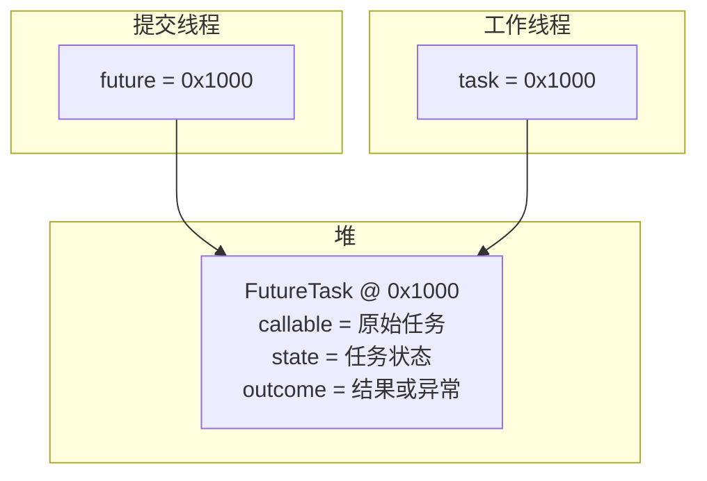
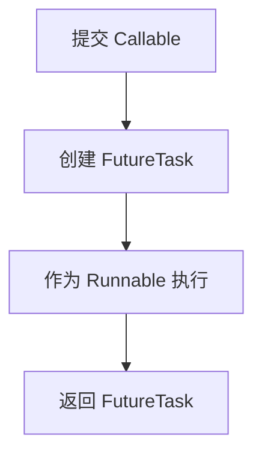
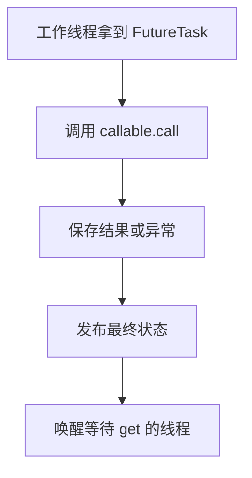
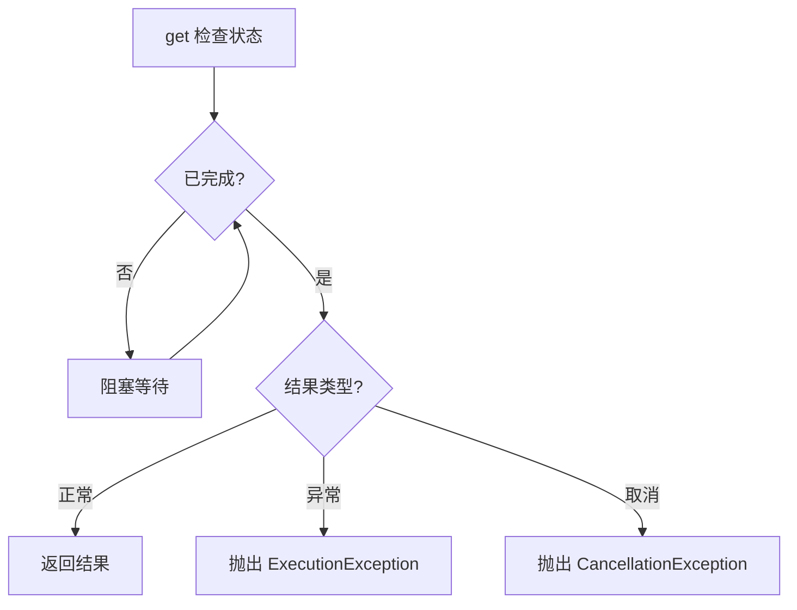

上一章介绍了线程池如何复用工作线程。线程池中的 `Worker` 会不断取得任务，并调用任务的 `run()`：

```java
while ((task = getTask()) != null) {
    task.run();
}
```

这解决了线程反复创建和销毁的问题，但也带来一个新问题：`Runnable.run()` 没有返回值。如果一个计算任务在线程池的工作线程中执行，提交任务的线程怎样取得计算结果？如果任务执行时抛出异常，异常又怎样传回提交任务的线程？

Java 使用 `Callable`、`Future` 和 `FutureTask` 共同解决这个问题。`Callable` 表示有返回值的任务，`Future` 表示异步结果的凭证，`FutureTask` 则把“可以被工作线程执行”和“可以被提交线程查询结果”这两件事合在同一个对象里。

## 一、Runnable 为什么不够用

在线程池中，工作线程最终执行的是：

```java
task.run();
```

所以不论原始任务是什么，进入线程池执行流程后，都需要表现为一个 `Runnable`。

对于不需要返回结果的任务，这没有问题：

```java
executor.execute(() -> {
    handleRequest();
});
```

但如果任务需要计算并返回结果，`Runnable` 就不够用了。它的核心方法是：

```java
public void run();
```

返回类型是 `void`，不能通过 `return` 把计算结果返回给提交任务的线程。即使在 `run()` 内部定义局部变量，那个变量也只存在于工作线程的调用栈中，不会自动出现在提交线程的栈里。

更关键的是，方法返回值只能返回给当前方法的直接调用者。`run()` 是由工作线程调用的，返回路径也只回到工作线程的执行流程，不能直接跨线程回到提交任务的线程。

因此，要在线程池中表达“有返回值的任务”，需要引入 `Callable`。

## 二、Callable 和 Future 分别解决什么问题

`Callable<V>` 用来表示有返回值的任务：

```java
public interface Callable<V> {

    V call() throws Exception;
}
```

例如：

```java
Callable<Integer> task = () -> {
    return 10 + 20;
};
```

`Callable` 和 `Runnable` 的区别可以概括为：

| 接口 | 方法 | 特点 |
|---|---|---|
| `Runnable` | `void run()` | 没有返回值，不能直接抛出受检异常 |
| `Callable<V>` | `V call()` | 有返回值，可以直接抛出受检异常 |

`Callable` 解决的是“任务如何产生结果”。但它还没有解决“提交线程以后如何拿到结果”。使用 `submit()` 提交 `Callable` 后，线程池会返回一个 `Future`：

```java
Future<Integer> future = executor.submit(() -> {
    return 10 + 20;
});
```

可以先把 `Future` 理解为异步任务结果的凭证。提交线程拿到 `Future` 时，任务可能还没开始，也可能正在执行，甚至可能已经完成。`Future` 本身不表示任务已经结束，它只提供了后续查询、等待、取消和获取结果的入口。

常用方法包括：

| 方法 | 含义 |
|---|---|
| `get()` | 等待并获取任务结果 |
| `get(timeout, unit)` | 最多等待指定时间 |
| `cancel(boolean)` | 尝试取消任务 |
| `isDone()` | 判断任务是否已经结束 |
| `isCancelled()` | 判断任务是否已经被取消 |

所以这一层可以先建立两个分工：`Callable` 负责定义有结果的任务，`Future` 负责让另一个线程以后取得这个异步结果。

## 三、get()、超时和取消分别表示什么

提交任务后，工作线程可能还没有执行完成：

```java
Future<Integer> future = executor.submit(() -> {
    Thread.sleep(3000);
    return 100;
});

Integer result = future.get();
```

调用 `get()` 的线程会检查任务是否已经完成。如果任务已经完成，`get()` 立即处理结果；如果任务还没完成，调用线程进入等待。阻塞的是调用 `get()` 的线程，不是整个线程池，其他工作线程仍然可以继续执行任务。

普通 `get()` 没有等待时间上限。如果任务一直没有结束，调用线程就可能一直等待。为了避免无限等待，可以使用带超时的方法：

```java
Integer result = future.get(3, TimeUnit.SECONDS);
```

如果三秒内任务完成，`get()` 返回结果；如果三秒后任务仍未完成，`get()` 抛出 `TimeoutException`。但超时只表示调用线程不再等待，并不表示后台任务已经停止。

如果任务超时后已经没有继续执行的价值，可以尝试取消：

```java
future.cancel(true);
```

参数 `mayInterruptIfRunning` 表示：如果任务已经开始执行，是否允许通过中断请求尝试停止任务。`cancel(false)` 不会中断正在运行的任务；`cancel(true)` 会尝试中断执行任务的工作线程。

这里要注意两点。第一，如果任务还在队列中没有开始执行，取消成功后它不会再被正常执行。第二，如果任务已经开始执行，`cancel(true)` 也不是强制杀死线程，只是发出中断请求。任务是否真正停止，取决于任务代码是否响应中断。例如 `sleep()`、`wait()`、阻塞队列等阻塞方法通常能通过 `InterruptedException` 响应中断；普通计算循环则需要主动检查中断状态。

```java
while (!Thread.currentThread().isInterrupted()) {
    calculate();
}
```

如果取消成功，之后调用 `future.get()` 会抛出 `CancellationException`。

## 四、isDone() 不等于任务成功

`isDone()` 只能说明任务已经进入结束状态，但不能说明任务是正常成功、执行失败，还是被取消。

```text
isDone() == true
may mean: success, failure, or cancellation
```

`isCancelled()` 用来判断任务是否被取消。只要 `isCancelled()` 为 `true`，`isDone()` 一定也为 `true`；但 `isDone()` 为 `true` 时，不一定是取消，也可能是正常完成或执行失败。

因此，要判断任务最终结果，仍然需要结合 `get()`：

| `get()` 的结果 | 任务状态 |
|---|---|
| 正常返回 | 任务执行成功 |
| 抛出 `ExecutionException` | 任务执行失败 |
| 抛出 `CancellationException` | 任务已经被取消 |
| 抛出 `TimeoutException` | 当前调用线程等待超时，任务未必结束 |

如果任务已经正常完成，再调用 `cancel(true)` 会返回 `false`，因为任务已经进入最终状态，不能再改成取消状态。任务执行失败后也是同理。

## 五、为什么需要 FutureTask

`Future` 规定了如何查询结果、等待和取消任务，但工作线程需要的是能执行的 `Runnable`。线程池需要一个对象同时具有两种能力：

| 身份 | 给谁使用 | 作用 |
|---|---|---|
| `Runnable` | 工作线程 | 调用 `run()` 执行任务 |
| `Future` | 提交线程 | 调用 `get()` 获取结果、异常或取消状态 |

这个对象就是 `FutureTask`。

`FutureTask` 实现了 `RunnableFuture`：

```java
public class FutureTask<V>
        implements RunnableFuture<V> {
}
```

而 `RunnableFuture` 同时继承 `Runnable` 和 `Future`：

```java
public interface RunnableFuture<V>
        extends Runnable, Future<V> {
}
```

因此，`FutureTask` 可以近似理解为：

```text
FutureTask = Runnable task + Future result holder
```

它既包装了需要执行的原始任务，又负责保存任务的结果、异常和状态。

## 六、submit() 内部如何把 Callable 变成 FutureTask

假设提交一个 `Callable`：

```java
Future<Integer> future = executor.submit(() -> {
    return 10 + 20;
});
```

在线程池的默认实现中，可以把内部过程简化成：

```java
Callable<Integer> callable = () -> 10 + 20;

FutureTask<Integer> futureTask =
        new FutureTask<>(callable);

execute(futureTask);

return futureTask;
```

这里发生了三件事：原始 `Callable` 被包装成 `FutureTask`；`FutureTask` 作为 `Runnable` 提交给线程池；同一个 `FutureTask` 又作为 `Future` 返回给提交线程。

也就是说，工作线程执行的对象和提交线程拿到的 `Future`，通常是同一个堆对象。



提交线程和工作线程各自有独立的线程栈，但它们都持有同一个 `FutureTask` 引用。工作线程通过这个对象执行任务并写入结果，提交线程通过这个对象等待并读取结果。

## 七、FutureTask.run() 如何执行原始任务

原始的 `Callable` 在创建 `FutureTask` 时已经保存在对象内部：

```java
Callable<Integer> callable = () -> 10 + 20;

FutureTask<Integer> futureTask =
        new FutureTask<>(callable);
```

工作线程后来只需要调用：

```java
futureTask.run();
```

`FutureTask.run()` 会从自身内部取出之前保存的 `Callable`，然后调用：

```java
callable.call();
```

如果任务正常完成，`call()` 的返回值先返回给当前工作线程中的 `FutureTask.run()`，再由 `FutureTask` 保存到自己的字段中。这个返回值不会直接跨线程回到提交线程。

可以简化为：

```java
public void run() {
    V value = callable.call();

    outcome = value;
    state = NORMAL;
}
```

真实实现还要处理并发状态、取消、异常和等待线程唤醒。当前先抓住主线：`Callable.call()` 在工作线程中执行；结果或异常被写入 `FutureTask`；提交线程之后通过同一个 `FutureTask.get()` 读取这些信息。

## 八、state 和 outcome 分别负责什么

`FutureTask` 至少要保存两类信息：任务结束到了什么状态，以及任务结束后产生了什么内容。

`state` 负责说明任务状态：

| 简化状态 | 含义 |
|---|---|
| Not Completed | 任务还没完成 |
| Success | 任务正常完成 |
| Failed | 任务执行失败 |
| Cancelled | 任务已被取消 |

`outcome` 负责保存任务结束后的内容：

| 任务结果 | outcome 保存什么 |
|---|---|
| 正常完成 | 返回值 |
| 执行失败 | 异常对象 |
| 被取消 | 没有正常结果 |

二者必须分开，因为 `outcome == null` 不能说明任务处于什么状态。任务可以正常返回 `null`，任务还没完成时 `outcome` 也可能是 `null`，任务取消后也没有正常结果。因此，必须由 `state` 决定怎样解释 `outcome`。

例如，任务正常返回一个异常对象也是合法的：

```java
Callable<Throwable> task = () -> {
    return new IOException("这是任务的正常返回值");
};
```

此时 `state` 是正常完成，`outcome` 是返回值，不能因为 `outcome instanceof Throwable` 就把它当作任务失败。真正的失败必须由 `state = EXCEPTIONAL` 这类状态来表达。

## 九、真实 FutureTask 的状态如何理解

真实 `FutureTask` 的状态比“成功、失败、取消”更细。它内部定义了这些状态：

| 状态 | 含义 |
|---|---|
| `NEW` | 任务未进入最终状态 |
| `COMPLETING` | 正在写入结果或异常 |
| `NORMAL` | 任务正常完成 |
| `EXCEPTIONAL` | 任务执行时抛出异常 |
| `CANCELLED` | 任务取消，不中断运行线程 |
| `INTERRUPTING` | 正在向运行线程发送中断请求 |
| `INTERRUPTED` | 中断请求已经发出 |

正常完成时，状态从 `NEW` 经过短暂的 `COMPLETING`，最终到达 `NORMAL`。执行失败时，同样先进入 `COMPLETING`，再到达 `EXCEPTIONAL`。调用 `cancel(false)` 成功时，状态进入 `CANCELLED`；调用 `cancel(true)` 成功时，状态会经历 `INTERRUPTING`，再进入 `INTERRUPTED`。

`COMPLETING` 和 `INTERRUPTING` 都是短暂过渡状态。它们的作用不是给业务代码判断，而是让结果写入、状态发布和中断请求之间保持正确顺序。理解 `Future` 的主要行为时，可以先把最终状态归纳为三类：正常完成、执行失败、被取消。

## 十、为什么要先写 outcome，再发布 state

`state` 相当于“任务是否已经完成”的发布标志。提交线程调用 `get()` 时，会先读取 `state`；如果发现任务已经完成，再读取 `outcome`。

因此，工作线程完成任务时必须先准备结果，再发布完成状态：

```text
write outcome
publish state
```

如果顺序反过来，就可能出现提交线程先看到完成状态，随后立即读取 `outcome`，但工作线程还没有把结果写进去。

`FutureTask` 对状态读写提供了相应的内存可见性保证。提交线程看到完成状态后，也能看到完成状态发布之前写入的结果或异常。这个模式和前面讲过的 volatile 发布思想相似：先写普通数据，再写发布标志；另一个线程先看到发布标志，再读取普通数据。

## 十一、get() 如何处理结果、异常和取消

调用：

```java
V result = future.get();
```

时，`FutureTask` 会先检查 `state`。如果任务还没完成，调用线程等待；如果任务正常完成，返回 `outcome`；如果任务执行失败，抛出 `ExecutionException`；如果任务被取消，抛出 `CancellationException`。

任务执行失败时，`FutureTask` 保存的是原始异常对象：

```java
Callable<Integer> task = () -> {
    throw new IOException("文件读取失败");
};
```

工作线程执行失败后，可以理解为：

```text
state   = EXCEPTIONAL
outcome = IOException object
```

提交线程调用 `get()` 时，`FutureTask` 会把这个原始异常包装成 `ExecutionException`：

```java
try {
    Integer result = future.get();
} catch (ExecutionException e) {
    Throwable cause = e.getCause();

    System.out.println(cause.getClass());
    System.out.println(cause.getMessage());
}
```

为什么要包装一层？因为 `get()` 需要用统一方式告诉提交线程：任务本身失败了。原始异常仍然保存在 `ExecutionException.getCause()` 中。这样既能区分“任务失败”和“任务正常返回一个异常对象”，又能保留异常类型、错误信息和调用栈。

## 十二、Future.get() 的可见性边界

`Future` 还提供内存一致性保证：异步任务中的操作 happens-before 另一个线程从对应的 `Future.get()` 成功返回后的操作。

例如：

```java
class Data {
    int value;
}

Data data = new Data();

Future<Integer> future = executor.submit(() -> {
    data.value = 100;
    return 200;
});

int result = future.get();

System.out.println(result);
System.out.println(data.value);
```

工作线程在任务中写入 `data.value = 100`，随后任务完成并发布状态。主线程从 `future.get()` 返回后，不仅能拿到返回值 `200`，也能看到任务完成前对共享对象的写入。

这里的同步边界是“对应的 `Future.get()`”。不能把它扩大成：只要任务提交给线程池，所有线程在任何时刻都一定能看到任务中的修改。如果另一个线程没有通过这个 `Future` 建立同步关系，仍然需要使用正确的共享数据同步机制。

## 十三、submit(Runnable) 为什么也能返回 Future

`Runnable.run()` 没有返回值，但线程池仍然允许：

```java
Future<?> future = executor.submit(() -> {
    handleRequest();
});
```

这是因为线程池可以把 `Runnable` 转换成一种没有业务返回值的 `Callable`：

```java
Callable<Object> callable = () -> {
    runnable.run();
    return null;
};
```

然后再创建 `FutureTask`。因此，`submit(Runnable)` 返回的 `Future` 仍然可以用于等待任务完成、判断任务状态、取消任务和获取任务异常，只是任务正常完成时 `get()` 返回 `null`。

还有一个重载方法：

```java
<T> Future<T> submit(
        Runnable task,
        T result
);
```

例如：

```java
Future<String> future = executor.submit(
        () -> handleRequest(),
        "完成"
);

String result = future.get();
```

如果 `Runnable` 正常完成，`get()` 会返回提交时指定的固定结果。这不是 `Runnable` 自己计算出的返回值，而是调用 `submit()` 时提前提供的结果。

三种提交方式可以对比为：

| 提交方式 | `get()` 结果 |
|---|---|
| `submit(Callable<V>)` | `call()` 返回的结果 |
| `submit(Runnable)` | `null` |
| `submit(Runnable, V result)` | 提交时指定的固定结果 |

## 十四、execute() 和 submit() 如何处理异常

`execute()` 和 `submit()` 都能把任务交给线程池，但二者对任务异常的处理方式不同。

使用 `execute()` 时，原始 `Runnable` 直接交给线程池。工作线程取得任务后调用 `task.run()`。如果任务中的运行时异常没有在任务内部被捕获，异常会从 `run()` 中逃出，导致当前工作线程异常结束。

```java
executor.execute(() -> {
    throw new IllegalStateException("执行失败");
});
```

结束的是执行该任务的工作线程，不是整个线程池。线程池随后会清理已经结束的 `Worker`，并根据线程池状态、队列状态和工作线程数量，决定是否补充新的 `Worker`。失败的任务不会被线程池自动重试；异常发生前已经完成的业务操作也不会自动回滚，是否需要补偿要由业务代码负责。

如果任务自己捕获了异常，异常没有逃出 `run()`，工作线程就不会因此结束，仍然可以继续从队列取得后续任务。

使用 `submit()` 时，原始任务会先被包装成 `FutureTask`。任务抛出的异常会被 `FutureTask` 捕获并保存，状态变为异常完成；异常不会逃出 `FutureTask.run()`，工作线程通常可以继续执行后续任务。

```java
Future<?> future = executor.submit(() -> {
    throw new IllegalStateException("执行失败");
});
```

提交线程需要调用 `future.get()` 才能发现任务失败：

```java
try {
    future.get();
} catch (ExecutionException e) {
    Throwable cause = e.getCause();
}
```

二者的差异可以概括为：

| 提交方式 | 执行对象 | 异常处理 |
|---|---|---|
| `execute()` | 原始 `Runnable` | 异常可能逃出 `run()`，导致当前工作线程结束 |
| `submit()` | `FutureTask` | 异常被保存到 `FutureTask`，通过 `get()` 取出 |

这也解释了为什么使用 `submit()` 后，如果从不调用 `get()`，任务异常可能很容易被忽略。异常并没有消失，只是被保存在 `FutureTask` 中。

## 十五、立即调用 get() 可能让并行任务重新串行化

下面的代码虽然使用了线程池，但每提交一个任务就立即等待：

```java
for (int i = 0; i < 10; i++) {
    Future<Integer> future =
            executor.submit(() -> calculate());

    Integer result = future.get();
}
```

执行过程会变成：提交第一个任务，等待第一个任务完成；再提交第二个任务，等待第二个任务完成。这样任务接近串行执行，无法充分利用线程池的并行能力。

更合理的方式通常是先提交多个任务：

```java
List<Future<Integer>> futures =
        new ArrayList<>();

for (int i = 0; i < 10; i++) {
    futures.add(
            executor.submit(() -> calculate())
    );
}
```

然后再统一获取结果：

```java
for (Future<Integer> future : futures) {
    Integer result = future.get();
    System.out.println(result);
}
```

这样多个工作线程可以并发执行任务。不过，依次调用 `get()` 时，如果第一个 `Future` 对应的任务很慢，即使后面的任务已经完成，当前线程仍然会先等待第一个任务。因此，`Future` 适合表示单个异步任务的结果，但不擅长处理复杂的任务组合、完成顺序和异步回调。

## 十六、FutureTask 的完整执行过程

把前面的内容合在一起，一次 `submit()` 调用可以概括为：



工作线程一侧：



提交线程一侧：



`FutureTask` 的核心价值就在于它连接了两个线程：工作线程负责执行任务并写入结果，提交线程负责等待并读取结果。任务的返回值和异常不能直接跨线程返回，但可以通过同一个堆上的 `FutureTask` 对象完成传递。

## 本章总结

`FutureTask` 的因果链条可以从 `Runnable.run()` 的限制开始理解：线程池中的工作线程只会调用 `run()`，而 `run()` 没有返回值，也不能把工作线程栈上的局部变量直接交给提交线程。于是 Java 引入 `Callable` 表达有返回值的任务，再引入 `Future` 作为提交线程获取异步结果的凭证。

但工作线程需要的是 `Runnable`，提交线程需要的是 `Future`，所以线程池在 `submit()` 时会创建 `FutureTask`。同一个 `FutureTask` 一边作为 `Runnable` 进入线程池，被工作线程调用 `run()`；一边作为 `Future` 返回给提交线程，被提交线程调用 `get()`、`cancel()`、`isDone()` 等方法。

工作线程在 `FutureTask.run()` 中调用原始任务。任务正常完成时，返回值写入 `outcome`，状态发布为 `NORMAL`；任务失败时，异常对象写入 `outcome`，状态发布为 `EXCEPTIONAL`；任务被取消时，状态进入取消相关的最终状态。`state` 决定如何解释 `outcome`，因此不能只看 `outcome` 是否为 `null`，也不能只看 `outcome` 是否是异常对象。

最终，`FutureTask` 不只是一个结果容器。它把任务执行、结果保存、异常传递、取消状态、等待唤醒和内存可见性组织到同一个对象中，使提交线程能够在另一个工作线程完成任务后，可靠地拿到结果、异常或取消状态。
