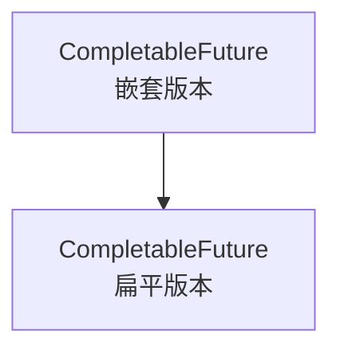
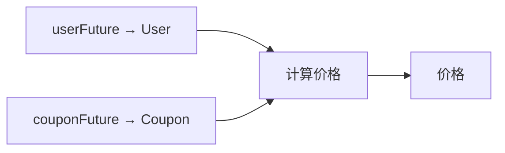
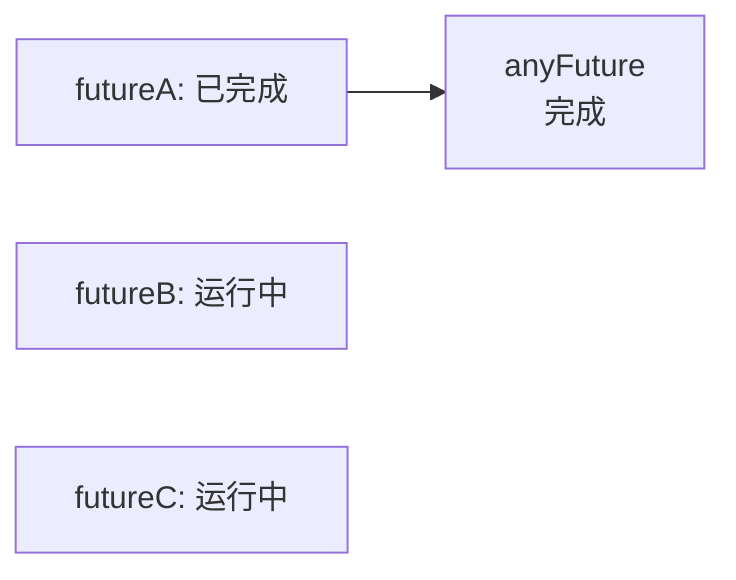

上一章介绍 `FutureTask` 时，我们已经知道，异步任务执行结束后，正常结果或异常会保存在 `FutureTask` 中，提交任务的线程可以通过 `get()` 取得最终结果。

例如：

```java
Future<User> userFuture =
        executorService.submit(() -> queryUser());

User user = userFuture.get();
```

这段代码可以取得异步结果。但如果查询用户后，还要根据用户编号查询订单，普通 `Future` 的写法就会变成：

```java
Future<User> userFuture =
        executorService.submit(() -> queryUser());

User user = userFuture.get();

Future<List<Order>> orderFuture =
        executorService.submit(
                () -> queryOrders(user.getId())
        );

List<Order> orders = orderFuture.get();
```

这里的问题不是 `Future` 不能保存结果，而是它不擅长描述多个异步任务之间的关系。调用线程必须先等待用户查询完成，取得 `User`，再提交订单查询任务。任务链越长，调用线程越容易变成“提交一个、等待一个、再提交下一个”。

`CompletableFuture` 要解决的核心问题是：能不能提前描述任务之间的依赖关系，让前一个阶段完成后自动推动后一个阶段，而不是由调用线程反复调用 `get()` 来手动推进。

## 一、CompletableFuture 改变了什么

普通 `Future` 更适合表示单个异步任务的结果。调用线程提交任务后，拿到一个 `Future`；以后什么时候取结果，由调用线程主动调用 `get()` 决定。

`CompletableFuture` 更适合描述多个异步阶段之间的关系。调用线程不一定要马上等待结果，而是可以提前登记后续操作。

```java
CompletableFuture<String> future =
        CompletableFuture
                .supplyAsync(() -> queryUser())
                .thenApply(user -> user.getName());
```

这段代码表达的是：先异步查询用户；查询完成后，把 `User` 交给下一阶段；下一阶段读取 `user.getName()`，得到 `String`。调用线程执行 `thenApply()` 时，用户查询可能还没有完成，`thenApply()` 此时只是登记一个后续阶段。等前一阶段真正完成后，`CompletableFuture` 会自动把结果传给下一阶段。

| 普通 `Future` | `CompletableFuture` |
|---|---|
| 调用线程主动等待结果 | 调用线程提前登记后续阶段 |
| 调用线程取得结果后亲自提交下一步 | 前一阶段完成后自动触发下一阶段 |
| 更适合单个异步任务 | 更适合多个异步任务编排 |
| 任务链越长，阻塞等待代码越多 | 可以连续描述完整任务链 |

需要注意，`CompletableFuture` 没有消除任务依赖。如果任务 B 必须使用任务 A 的结果，那么 B 仍然必须等 A 完成。它改变的是“谁来推动下一步”：从调用线程手动等待并提交，变成由完成事件自动触发后续阶段。

## 二、如何创建任务链的起点

任务链必须先有一个起点。`CompletableFuture` 常用两个方法创建第一个阶段：

| 方法 | 接收接口 | 是否有业务返回值 | 返回类型 |
|---|---|---|---|
| `runAsync()` | `Runnable` | 否 | `CompletableFuture<Void>` |
| `supplyAsync()` | `Supplier<T>` | 是 | `CompletableFuture<T>` |

如果异步任务只需要执行一段操作，不需要产生业务结果，可以使用 `runAsync()`：

```java
CompletableFuture<Void> future =
        CompletableFuture.runAsync(() -> {
            sendMessage();
        });
```

`runAsync()` 接收的是 `Runnable`，它的 `run()` 没有返回值。因此返回的是 `CompletableFuture<Void>`。这里的 `Void` 只表示没有业务结果，不表示这个任务无法被等待、取消或继续编排。

如果异步任务执行后需要产生结果，可以使用 `supplyAsync()`：

```java
CompletableFuture<User> future =
        CompletableFuture.supplyAsync(() -> {
            return queryUser();
        });
```

`supplyAsync()` 接收的是 `Supplier<T>`，它的 `get()` 会产生一个结果 `T`。

`Supplier<T>` 本身没有参数，但 Lambda 可以使用外部已经存在的变量：

```java
long userId = 1001L;

CompletableFuture<User> future =
        CompletableFuture.supplyAsync(
                () -> queryUser(userId)
        );
```

这里的 `userId` 不是 `Supplier.get()` 的参数，而是 Lambda 捕获的外部变量。

## 三、一个阶段完成后，下一步怎么写

一个阶段正常完成后，下一步通常有三种需求：使用上一步结果并产生新结果；使用上一步结果但不产生新结果；不使用上一步结果，只需要等它完成。它们分别对应 `thenApply()`、`thenAccept()` 和 `thenRun()`。

| 方法 | 是否使用上一步结果 | 是否产生新结果 | 接收接口 |
|---|---:|---:|---|
| `thenApply()` | 是 | 是 | `Function<T, R>` |
| `thenAccept()` | 是 | 否 | `Consumer<T>` |
| `thenRun()` | 否 | 否 | `Runnable` |

`thenApply()` 适合做结果转换：

```java
CompletableFuture<Integer> future =
        CompletableFuture
                .supplyAsync(() -> 10)
                .thenApply(value -> value * 2);
```

第一阶段产生 `10`，第二阶段接收 `10` 并返回 `20`。任务链中的结果类型也可以继续变化：

```java
CompletableFuture<String> future =
        CompletableFuture
                .supplyAsync(() -> 10)
                .thenApply(value -> value * 2)
                .thenApply(value -> "结果是：" + value);
```

`thenAccept()` 适合消费结果，但不再产生新结果：

```java
CompletableFuture<Void> future =
        CompletableFuture
                .supplyAsync(() -> 10)
                .thenAccept(value -> {
                    System.out.println(value);
                });
```

`thenRun()` 只关心前一阶段已经正常完成，不关心前一阶段产生了什么：

```java
CompletableFuture<Void> future =
        CompletableFuture
                .supplyAsync(() -> 10)
                .thenRun(() -> {
                    System.out.println("任务链结束");
                });
```

选择这三个方法时，不需要先背方法名，可以先问两个问题：下一步是否需要上一步结果？下一步是否要产生新结果？这两个问题决定了该用 `thenApply()`、`thenAccept()` 还是 `thenRun()`。

## 四、下一步本身也是异步任务时，为什么要用 thenCompose

假设已经有两个异步方法：

```java
CompletableFuture<User> queryUserAsync() {
    return CompletableFuture.supplyAsync(
            () -> queryUser()
    );
}
```

```java
CompletableFuture<List<Order>> queryOrdersAsync(long userId) {
    return CompletableFuture.supplyAsync(
            () -> queryOrders(userId)
    );
}
```

订单查询依赖用户编号，因此必须先查询用户，再根据用户编号查询订单。如果使用 `thenApply()`：

```java
CompletableFuture<CompletableFuture<List<Order>>> nestedFuture =
        queryUserAsync()
                .thenApply(user ->
                        queryOrdersAsync(user.getId())
                );
```

这里会得到两层 `CompletableFuture`。原因是 `thenApply()` 会把 Lambda 的返回值当作当前阶段的普通结果，而 Lambda 返回的本身就是一个 `CompletableFuture<List<Order>>`。

这表示外层任务完成时，只能说明 `queryOrdersAsync()` 已经被调用，并返回了一个新的异步对象；并不表示订单查询已经完成。后续如果要取得订单，可能需要处理两层结果。

这种嵌套不方便继续编排，因此应该使用 `thenCompose()`：

```java
CompletableFuture<List<Order>> ordersFuture =
        queryUserAsync()
                .thenCompose(user ->
                        queryOrdersAsync(user.getId())
                );
```

`thenCompose()` 的作用是连接两个前后依赖的异步阶段，并把嵌套结构展平成一层。



判断规则可以简化为：

| Lambda 返回值 | 应使用的方法 |
|---|---|
| 普通结果 `R` | `thenApply()` |
| `CompletableFuture<R>` | `thenCompose()` |

如果订单查询是普通同步方法：

```java
List<Order> queryOrders(long userId)
```

那就不需要 `thenCompose()`，直接用 `thenApply()` 即可：

```java
CompletableFuture<List<Order>> ordersFuture =
        queryUserAsync()
                .thenApply(user ->
                        queryOrders(user.getId())
                );
```

所以，`thenCompose()` 不是所有前后依赖任务都必须使用。它专门解决“下一步本身已经返回 `CompletableFuture`”时的嵌套问题。

## 五、两个独立任务如何并行汇合

`thenCompose()` 表示前后依赖：任务 B 必须使用任务 A 的结果才能启动。有些任务彼此独立，可以同时启动，最后再汇合。

例如，查询用户资料和查询优惠券互不依赖：

```java
CompletableFuture<User> userFuture =
        CompletableFuture.supplyAsync(
                () -> queryUser()
        );

CompletableFuture<Coupon> couponFuture =
        CompletableFuture.supplyAsync(
                () -> queryCoupon()
        );
```

如果两个任务各耗时一秒，依次执行大约需要两秒；工作线程充足时，同时执行可以接近一秒完成。最终计算价格时，需要同时使用两个结果，可以使用 `thenCombine()`：

```java
CompletableFuture<Price> priceFuture =
        userFuture.thenCombine(
                couponFuture,
                (user, coupon) ->
                        calculatePrice(user, coupon)
        );
```

执行关系可以表示为：



合并函数只有在两个任务都正常完成后才会执行。它不要求哪个任务先完成，只要求两个结果最终都可用。

`thenCompose()` 和 `thenCombine()` 的区别可以概括为：

| 方法 | 任务关系 | 含义 |
|---|---|---|
| `thenCompose()` | 前后依赖 | A 的结果决定如何启动 B |
| `thenCombine()` | 并行汇合 | A 和 B 可以同时执行，最后合并结果 |

真正能缩短总耗时的是互不依赖的任务并行执行。前后依赖的任务即使用了异步写法，也仍然要按依赖顺序完成。

## 六、如何等待一批异步任务

当任务数量较多时，如果只是想知道一批任务什么时候全部完成，没有必要反复嵌套 `thenCombine()`，可以使用 `allOf()`：

```java
CompletableFuture<User> userFuture = ...;
CompletableFuture<Coupon> couponFuture = ...;
CompletableFuture<Order> orderFuture = ...;

CompletableFuture<Void> allFuture =
        CompletableFuture.allOf(
                userFuture,
                couponFuture,
                orderFuture
        );
```

`allOf()` 返回的是 `CompletableFuture<Void>`。它只表示所有任务都已经完成，不会自动把各个业务结果收集到一个列表中。各个结果仍然保存在原来的 `CompletableFuture` 中。

```java
allFuture.join();

User user = userFuture.join();
Coupon coupon = couponFuture.join();
Order order = orderFuture.join();
```

后面的几个 `join()` 通常不会继续阻塞，因为 `allFuture.join()` 已经保证这些任务都完成了。

如果只关心任意一个任务率先完成，可以使用 `anyOf()`：

```java
CompletableFuture<Object> anyFuture =
        CompletableFuture.anyOf(
                futureA,
                futureB,
                futureC
        );
```

`anyOf()` 返回 `CompletableFuture<Object>`，保存的是最先完成任务的结果。之所以是 `Object`，是因为传入任务的结果类型可能不同，编译器无法提前确定最先完成的是哪一种结果。

需要注意，`anyOf()` 完成后，其他任务不会自动取消：



此外，最先完成不一定是最先成功。如果某个任务最先异常完成，`anyOf()` 也可能直接异常完成。异常处理会放到下一章单独讨论。

多任务关系可以这样选择：

| 任务关系 | 应使用的方法 |
|---|---|
| 前一步完成后启动另一个异步任务 | `thenCompose()` |
| 两个独立任务完成后合并结果 | `thenCombine()` |
| 等待多个任务全部完成 | `allOf()` |
| 等待任意任务率先完成 | `anyOf()` |

## 七、普通方法和 Async 方法有什么区别

`CompletableFuture` 中很多方法都有普通版本和 `Async` 版本，例如：

```java
thenApply()
thenApplyAsync()
```

它们都要等前一阶段完成，也都能使用前一阶段结果并产生新结果。区别主要在于后续操作如何被调度。

假设主线程创建任务链：

```java
CompletableFuture<Integer> future =
        CompletableFuture.supplyAsync(() -> {
            sleep(1000);
            return 10;
        });

CompletableFuture<Integer> next =
        future.thenApply(value -> value * 2);
```

如果主线程调用 `thenApply()` 时，前一阶段还没有完成，那么 `thenApply()` 只是登记后续操作。之后完成前一阶段的工作线程，通常会继续执行这个后续操作。

但如果调用 `thenApply()` 时，前一阶段已经完成：

```java
CompletableFuture<Integer> future =
        CompletableFuture.completedFuture(10);

CompletableFuture<Integer> next =
        future.thenApply(value -> value * 2);
```

那么当前调用 `thenApply()` 的线程可能直接执行这个转换。因此，普通 `thenApply()` 不保证一定在哪个固定线程中执行。

`thenApplyAsync()` 会在前一阶段完成后，把后续操作重新提交到线程池：

```java
future.thenApplyAsync(
        value -> slowProcess(value)
);
```

这会形成一个新的调度边界，但不要把 `Async` 误解成以下含义：

| `Async` 不代表什么 |
|---|
| 不代表后续任务立即执行 |
| 不代表可以跳过前置依赖 |
| 不代表一定新建线程 |
| 不代表一定更换线程 |
| 不代表一定提高单条任务链速度 |

如果任务 B 依赖任务 A 的结果，那么无论使用 `thenApply()` 还是 `thenApplyAsync()`，B 都不能在 A 完成前执行。`Async` 改变的是 A 完成以后，B 如何被调度。

## 八、为什么要显式指定线程池

不显式指定线程池时，`runAsync()`、`supplyAsync()` 以及不带 `Executor` 参数的 `Async` 方法，通常会使用默认公共线程池。

```java
CompletableFuture<User> future =
        CompletableFuture.supplyAsync(
                () -> queryUser()
        );
```

实际项目中，更推荐为重要业务显式指定线程池：

```java
ExecutorService executor =
        Executors.newFixedThreadPool(8);

CompletableFuture<User> future =
        CompletableFuture.supplyAsync(
                () -> queryUser(),
                executor
        );
```

`thenApplyAsync()` 等方法也可以指定线程池：

```java
CompletableFuture<String> nameFuture =
        userFuture.thenApplyAsync(
                user -> user.getName(),
                executor
        );
```

显式指定线程池的价值在于控制线程数量、任务队列、拒绝策略、线程名称，以及不同业务之间的隔离。尤其是可能长时间阻塞的任务，不应该不加区分地全部提交到公共线程池。

不同任务也可以交给不同线程池。例如，数据库查询和 CPU 密集计算可以分开：

```java
CompletableFuture.supplyAsync(
        () -> queryDatabase(),
        ioExecutor
).thenApplyAsync(
        data -> heavyCalculate(data),
        cpuExecutor
);
```

这表示数据库查询由 `ioExecutor` 执行，查询完成后的计算由 `cpuExecutor` 执行。不同线程池的主要价值是任务隔离、资源匹配和并发数量控制。它不一定缩短一条前后依赖任务链的总耗时；如果 A 耗时一秒，B 依赖 A 且耗时两秒，总耗时仍然接近三秒。

## 九、常见错误用法

第一，不要在任务链中频繁调用 `join()` 或 `get()` 来手动推进下一步：

```java
User user = queryUserAsync().join();

List<Order> orders =
        queryOrdersAsync(user.getId()).join();
```

这种写法又回到了普通 `Future` 的阻塞编排。更合适的是使用 `thenCompose()` 描述依赖关系：

```java
CompletableFuture<List<Order>> future =
        queryUserAsync()
                .thenCompose(user ->
                        queryOrdersAsync(user.getId())
                );
```

第二，当 Lambda 返回 `CompletableFuture` 时，不要用 `thenApply()` 造成嵌套：

```java
CompletableFuture<CompletableFuture<List<Order>>> future =
        queryUserAsync()
                .thenApply(user ->
                        queryOrdersAsync(user.getId())
                );
```

这种情况应使用 `thenCompose()`。

第三，不要把所有后续操作都写成 `Async`。如果只是一次很快的内存计算：

```java
.thenApply(value -> value * 2)
```

通常没有必要改成：

```java
.thenApplyAsync(value -> value * 2)
```

`Async` 会增加一次任务提交和调度，不一定带来收益。

第四，不要依赖普通回调一定运行在某个固定线程中。前一阶段尚未完成时，后续操作可能由完成前一阶段的线程执行；前一阶段已经完成时，当前调用回调方法的线程也可能直接执行。

第五，不要把 `anyOf()` 理解成“最快成功”。它等待的是最快完成，最先异常完成也可能使结果异常完成。它也不会自动取消其他还在执行的任务。

## 十、如何根据任务关系选择方法

学习 `CompletableFuture` 时，不应该先背方法名，而应该先判断任务之间是什么关系。

| 任务需求 | 应使用的方法 |
|---|---|
| 创建无返回值异步任务 | `runAsync()` |
| 创建有返回值异步任务 | `supplyAsync()` |
| 使用上一步结果并产生新结果 | `thenApply()` |
| 使用上一步结果但不产生新结果 | `thenAccept()` |
| 不使用上一步结果，只等待它完成 | `thenRun()` |
| 下一步本身返回 `CompletableFuture` | `thenCompose()` |
| 两个独立任务完成后合并结果 | `thenCombine()` |
| 等待多个任务全部完成 | `allOf()` |
| 等待任意任务率先完成 | `anyOf()` |
| 将后续操作重新提交线程池 | 对应的 `Async` 方法 |

整章的主线可以概括为：先创建异步任务，再描述单个后续阶段；如果后续阶段依赖前一个异步结果，用 `thenCompose()` 连接；如果两个任务互不依赖，用 `thenCombine()`、`allOf()` 或 `anyOf()` 汇合；如果需要隔离执行资源，再用 `Async` 版本和自定义线程池建立新的调度边界。

## 本章总结

`CompletableFuture` 的因果链条可以从普通 `Future` 的局限开始理解：`Future` 能保存一个异步任务的结果，但调用线程必须主动调用 `get()` 等待结果，并在结果到手后亲自推动下一步。任务之间的依赖越多，调用线程越容易退化成异步流程的调度者。

`CompletableFuture` 把这种手动调度改成了阶段编排。`runAsync()` 和 `supplyAsync()` 创建起点；`thenApply()`、`thenAccept()`、`thenRun()` 描述单个后续阶段；`thenCompose()` 连接前后依赖的异步任务；`thenCombine()` 汇合两个独立任务；`allOf()` 和 `anyOf()` 处理一批任务的完成关系；`Async` 方法和自定义线程池则决定后续阶段如何被调度。

它的核心价值不是让依赖关系消失，而是让依赖关系显式化。A 完成后执行 B，A 的结果交给 B，A 与 C 并行执行，B 和 C 都完成后执行 D，任意一个任务完成后继续——这些关系都可以提前写进任务链中，由 `CompletableFuture` 在阶段完成时自动推动。

至于任务执行失败后异常如何传播，`exceptionally()`、`handle()`、`whenComplete()` 有什么区别，以及 `get()` 和 `join()` 应该如何选择，将放到下一章单独讨论。
