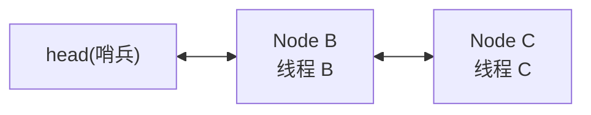
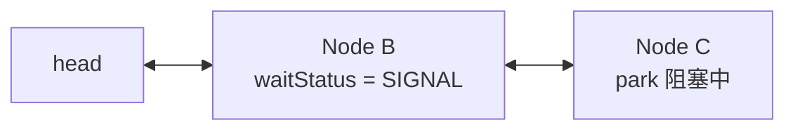
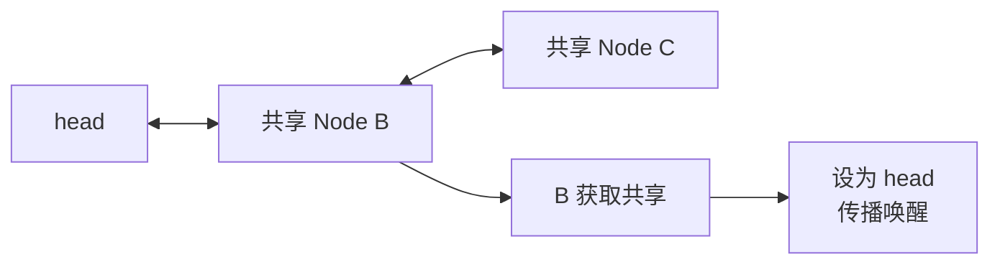
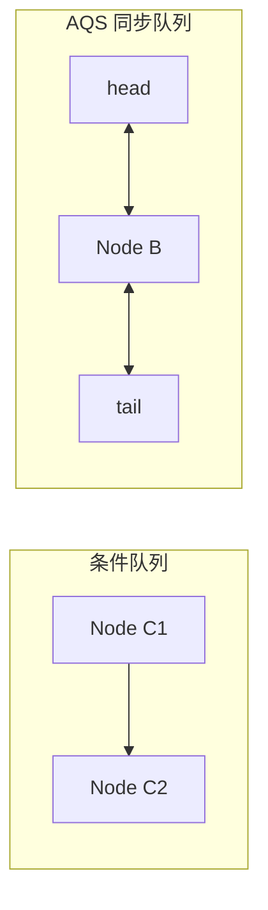
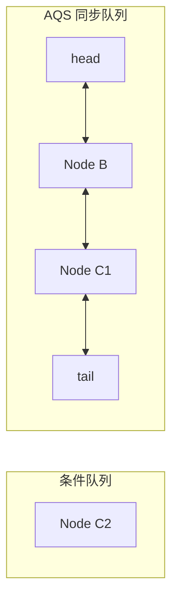

## 1. AQS 先解决什么问题

AQS，全名是 `AbstractQueuedSynchronizer`。它本身不是一把具体的锁，而是一套用于构建同步器的基础框架。`ReentrantLock`、`Semaphore`、`CountDownLatch` 等工具可以基于 AQS 实现不同语义，但它们都会遇到同一个底层问题：当多个线程同时竞争同一份资源时，成功的线程继续执行，失败的线程不能一直空转抢资源，而要进入等待队列，并在合适的时候被唤醒。

本文先从独占模式讲起，也就是同一时刻只有一个线程能够获取资源的场景；再在独占模式的基础上补充共享模式。以 `ReentrantLock` 为例，`lock()` 最终会进入 AQS 的独占获取流程，`unlock()` 最终会进入 AQS 的独占释放流程。AQS 在中间承担的职责不是决定“什么叫锁可用”，而是把获取失败的线程组织成队列，再用 `park / unpark` 完成阻塞和唤醒。

## 2. state 只是同步状态，具体语义由子类决定

AQS 内部维护一个 `int state`，它表示同步状态，但这个状态的具体含义并不固定。对 `ReentrantLock` 来说，`state = 0` 可以表示锁空闲，`state > 0` 可以表示锁已经被某个线程占用，并且数值还能表示重入次数；对 `Semaphore` 来说，`state` 可以表示剩余许可证数量。

因此，AQS 不能把获取和释放规则写死。它只提供统一流程，具体规则交给子类实现：`tryAcquire()` 判断当前线程能否获取资源，并在成功时修改 `state`；`tryRelease()` 负责释放资源，并告诉 AQS 资源是否已经真正释放干净。

| 方法 | 作用 | 谁来实现规则 |
|---|---|---|
| `tryAcquire(int arg)` | 尝试获取资源 | 子类 |
| `tryRelease(int arg)` | 尝试释放资源 | 子类 |
| `acquire(int arg)` | 获取失败后入队等待 | AQS |
| `release(int arg)` | 释放成功后唤醒后继 | AQS |

以 `ReentrantLock` 为例，线程第一次加锁可以把 `state` 从 `0` 改成 `1`；同一线程重入时，`state` 继续增加；释放时，`state` 逐步减少。只有当 `state` 减到 `0` 时，锁才算真正释放，AQS 才需要考虑唤醒等待队列里的后继线程。

## 3. acquire 的第一步不是排队，而是先尝试获取

独占模式的获取入口可以简化成下面这样：

```java
public final void acquire(int arg) {
    if (!tryAcquire(arg)) {
        acquireQueued(addWaiter(Node.EXCLUSIVE), arg);
    }
}
```

这段代码体现了 AQS 获取资源的基本顺序：当前线程先直接调用 `tryAcquire()` 尝试一次；如果成功，就不需要进入等待队列；如果失败，才会把当前线程包装成节点并加入队列。

这里要注意，AQS 不会一上来就让线程排队，因为资源可能正好空闲。只有当子类的 `tryAcquire()` 明确返回失败时，AQS 才接管后续的排队和阻塞流程。

## 4. 获取失败后，线程要包装成 Node 入队

等待队列里保存的不是裸线程，而是一个个 `Node`。因为排队不仅要知道哪个线程在等，还要记录它在队列中的前后关系，以及它和前驱节点之间的唤醒约定。本文沿用 JDK 8 AQS 源码中的命名，核心字段可以先简化为：

```java
static final class Node {
    volatile int waitStatus;
    volatile Node prev;
    volatile Node next;
    volatile Thread thread;
}
```

AQS 的等待队列是一个双向链表。获取失败的线程会被包装成 `Node`，然后通过 CAS 插入队尾。队列第一次初始化时，会先创建一个不代表具体等待线程的 dummy head，真正等待的节点接在它后面。



`head` 不是普通等待节点，而是队列已经推进到的位置。一个节点只有在自己的前驱是 `head` 时，才说明它排在最前面，才有资格尝试获取资源。这个规则使 AQS 不需要让所有等待线程一起抢锁，而是尽量按照队列顺序推进。

## 5. addWaiter 和 enq：安全地插入队尾

`addWaiter(Node.EXCLUSIVE)` 负责把当前线程包装成独占模式节点，并尝试插入队尾。队列已经初始化时，它会先走快速路径：读取当前 `tail`，把新节点的 `prev` 指向旧 `tail`，再通过 CAS 把 `tail` 改成新节点。CAS 成功后，当前节点才真正抢到队尾位置，随后再补上旧尾节点的 `next` 指针。

如果队列还没有初始化，或者多个线程同时入队导致 CAS 失败，就会进入 `enq(node)`。`enq()` 是兜底入队逻辑：如果发现 `tail == null`，先创建 dummy head；如果队列已经存在，就在循环中反复尝试 CAS 更新 `tail`，直到当前节点成功入队。

这里需要注意一个细节：第一次进入 `enq()` 时，可能只是完成队列初始化，并不会立刻把当前节点插入进去；下一轮循环看到 `tail != null` 后，才会继续执行真正的队尾插入。

## 6. acquireQueued：入队后循环等待

节点入队后，会进入 `acquireQueued()`。它的核心不是“直接睡眠”，而是在循环中反复判断自己是否已经排到最前面，以及当前资源是否已经可用。简化后的结构如下：

```java
for (;;) {
    Node p = node.predecessor();

    if (p == head && tryAcquire(arg)) {
        setHead(node);
        p.next = null;
        return;
    }

    if (shouldParkAfterFailedAcquire(p, node)) {
        parkAndCheckInterrupt();
    }
}
```

每一轮都要重新读取前驱节点，因为等待队列不是静态的。前驱节点可能已经取消等待并被跳过，前驱节点的 `waitStatus` 也可能从普通状态变成 `SIGNAL`。当前节点不能缓存旧判断，而要在每一轮重新确认：自己现在排在谁后面，前驱是不是 `head`，前驱是否还能承担唤醒后继的责任。

其中 `p == head` 只表示当前节点有资格尝试获取资源，不表示它已经拿到了资源。真正能否继续执行，还要看 `tryAcquire(arg)` 是否成功。成功之后，当前节点会通过 `setHead(node)` 变成新的 `head`，原来的旧 `head` 会断开 `next` 指针，方便后续回收。

## 7. SIGNAL：park 前必须先建立唤醒关系

如果当前节点没有成功获取资源，就不能马上 `park()`。在 AQS 中，线程睡下去之前，必须先确保将来有人负责叫醒它。这个约定通过前驱节点的 `waitStatus` 表达，其中最重要的是 `SIGNAL`。

| `waitStatus` | 值 | 含义 |
|---|---:|---|
| `SIGNAL` | `-1` | 当前节点的后继节点需要被唤醒 |
| `CANCELLED` | `1` | 当前节点已经取消等待 |
| `0` | `0` | 普通初始状态 |

`SIGNAL` 是标在前驱节点上的，不是标在当前节点自己身上的。假设 `Node C` 准备阻塞，它会先尝试把前驱 `Node B` 的状态改成 `SIGNAL`，意思是：`B` 后面有节点要睡了，等 `B` 释放资源或队列推进时，要负责唤醒后继。



因此，`shouldParkAfterFailedAcquire(p, node)` 的关键逻辑可以压缩成三种情况：如果前驱已经是 `SIGNAL`，说明唤醒关系已经建立，当前线程可以安全地 `park`；如果前驱状态是 `0`，先用 CAS 把前驱改成 `SIGNAL`，本轮不睡，回到循环重新判断；如果前驱状态大于 `0`，说明前驱已经取消等待，当前节点要跳过它，重新接到有效前驱后面。

| 前驱状态 | 当前节点的处理 | 本轮是否 park |
|---|---|---|
| `SIGNAL` | 唤醒关系已经建立 | 是 |
| `0` | 尝试把前驱改成 `SIGNAL` | 否 |
| `> 0` | 跳过取消节点，修正队列关系 | 否 |

这也是为什么设置完 `SIGNAL` 后，当前线程通常不会立刻睡下去，而是回到外层循环重新判断一次。因为在并发环境里，前驱可能已经变化，资源也可能已经释放；AQS 不会让线程在没有重新确认局势的情况下直接阻塞。

## 8. park / unpark 只是挂起和唤醒，不等于交接锁

当 `shouldParkAfterFailedAcquire()` 返回 `true` 后，当前线程才会通过 `LockSupport.park()` 挂起。这里的阻塞不是 `synchronized` 竞争失败时的 `BLOCKED`，也不是 `Object.wait()`，而是 AQS 基于 `LockSupport` 使用的 `park / unpark` 机制。

`park` 的含义是让当前线程暂时挂起，不再占用 CPU 空转；`unpark` 的含义是让被挂起的线程有机会醒来。被唤醒的线程不会直接获得锁，而是回到 `acquireQueued()` 的循环中，重新判断自己的前驱是否为 `head`，再调用 `tryAcquire()`。

这一区分很重要：AQS 的释放线程只负责唤醒后继，真正获取资源的动作仍然发生在被唤醒线程自己的 `tryAcquire()` 中。尤其在非公平锁中，新来的线程也可能在这个间隙竞争成功，所以被 `unpark` 只能说明线程获得了重新尝试的机会，不能说明锁已经交到它手里。

## 9. release：释放资源后才考虑唤醒后继

独占模式的释放入口可以简化成：

```java
public final boolean release(int arg) {
    if (tryRelease(arg)) {
        Node h = head;
        if (h != null && h.waitStatus != 0) {
            unparkSuccessor(h);
        }
        return true;
    }
    return false;
}
```

和获取流程对应，AQS 释放时也先把具体规则交给子类。`tryRelease(arg)` 负责修改 `state`，并返回资源是否真正释放成功。仍以 `ReentrantLock` 为例，如果当前线程重入了两次，第一次 `unlock()` 只会让 `state` 从 `2` 变成 `1`，锁还没有真正释放；只有第二次 `unlock()` 让 `state` 从 `1` 变成 `0`，`tryRelease()` 才会返回 `true`。

所以 `release()` 不是一调用就唤醒后继。只有 `tryRelease()` 明确表示资源已经释放干净，AQS 才会从 `head` 出发，检查等待队列中是否存在需要唤醒的节点。

## 10. unparkSuccessor：清理 head 状态，再唤醒有效后继

当 `release()` 发现 `head` 存在，并且 `head.waitStatus != 0` 时，会调用 `unparkSuccessor(head)`。这里不是直接唤醒 `head.next`，而是先处理 `head` 自己的状态。

如果 `head.waitStatus < 0`，通常也就是 `SIGNAL`，AQS 会先尝试把它改回 `0`。因为 `SIGNAL` 表示前驱节点上有一个“需要唤醒后继”的提醒；既然释放流程已经开始处理这个提醒，就要先把标记复位，再去唤醒后继节点。

之后，AQS 会寻找 `head` 后面的第一个有效等待节点。理想情况下，这个节点就是 `head.next`；但如果 `head.next` 已经取消等待，或者在并发入队过程中 `next` 链还没有完全接好，AQS 会从 `tail` 往前反向查找，跳过 `waitStatus > 0` 的取消节点，找到真正还在等待的节点并 `unpark` 它。

这一步可以概括为：`unparkSuccessor(head)` 先清理 `head` 上已经被处理的唤醒标记，再从队列中找到有效后继并唤醒。被唤醒的线程随后回到自己的获取循环，重新尝试 `tryAcquire()`。

## 11. 取消节点不会继续参与唤醒链路

等待过程中，线程可能因为中断、超时等原因取消等待。取消后的节点会被标记为 `CANCELLED`，也就是 `waitStatus > 0`。这种节点已经不再参与后续竞争，也不应该继续承担唤醒后继的职责。

当前节点在检查前驱时，如果发现前驱已经取消，就会向前跳过这些无效节点，重新接到一个有效前驱后面；释放线程在唤醒后继时，也会跳过取消节点，避免把唤醒机会浪费在已经放弃等待的线程上。

取消节点的清理不是必须在某一个时刻一次性完成。AQS 更像是在入队、阻塞判断、释放唤醒等过程中顺手修正队列关系。只要后续流程能够跳过无效节点，并保证有效等待节点还能被唤醒，队列就可以继续向前推进。

## 12. acquire 和 release 如何连成一条链

现在可以把独占模式的获取和释放放到同一条链路里看。线程调用 `lock()` 后，先由子类的 `tryAcquire()` 判断能否直接获取资源；失败后，AQS 把当前线程包装成 `Node` 插入队尾，并在 `acquireQueued()` 中循环等待。等待线程不是一失败就睡，而是先确认自己是否排到 `head` 后面；如果还不能获取，就通过前驱的 `SIGNAL` 建立唤醒关系，然后才 `park`。

释放方向则相反。线程调用 `unlock()` 后，子类的 `tryRelease()` 先修改 `state`，并判断资源是否真正释放；如果释放成功，AQS 从 `head` 出发，清理已经处理的 `SIGNAL` 标记，找到有效后继节点并 `unpark`。后继线程醒来后并不会直接拥有锁，而是继续回到获取循环，重新判断资格并调用 `tryAcquire()`。成功之后，它成为新的 `head`，队列向前推进一格。

这一整套机制的关键不在于某一个方法，而在于几个动作之间的配合：`tryAcquire()` 决定能不能拿资源，`Node` 队列保存等待顺序，`SIGNAL` 保证线程睡前有人负责唤醒，`park / unpark` 负责挂起和叫醒，`tryRelease()` 决定资源是否真正释放，`setHead()` 则表示队列已经推进到新的位置。


## 13. 共享模式复用同一条同步队列

独占模式解决的是“同一时刻只能有一个线程通过”的问题。共享模式要解决的是另一类问题：资源可能允许多个线程同时通过。比如 `Semaphore` 可以有多个许可证，`CountDownLatch` 在计数归零后可以让所有等待线程继续执行。

共享模式没有重新设计一条等待队列，而是复用前文已经讲过的 AQS 同步队列。区别在于，入队节点的模式从独占变成共享，获取和释放入口也换成了共享版本。

| 模式 | 获取入口 | 释放入口 | 子类规则 |
|---|---|---|---|
| 独占模式 | `acquire()` | `release()` | `tryAcquire()` / `tryRelease()` |
| 共享模式 | `acquireShared()` | `releaseShared()` | `tryAcquireShared()` / `tryReleaseShared()` |

因此，前文关于 `Node`、`head`、`SIGNAL`、`park / unpark` 的主线仍然成立。共享模式新增的问题不是“线程还要不要入队”，而是：当一个共享节点成功获取资源后，后面的共享节点是否也应该继续被唤醒。

## 14. tryAcquireShared 为什么返回 int

独占模式的 `tryAcquire()` 返回 `boolean`，因为它只需要回答一个问题：当前线程是否获取成功。共享模式的 `tryAcquireShared()` 返回 `int`，因为它除了要表示成功或失败，还要告诉 AQS 是否需要继续传播唤醒。

| 返回值 | 简化含义 |
|---:|---|
| `< 0` | 获取失败，需要入队等待 |
| `= 0` | 获取成功，但后续共享节点不一定还能继续获取 |
| `> 0` | 获取成功，并且后续共享节点可能也能继续获取 |

以 `Semaphore` 为例，`state` 可以表示剩余许可证。线程获取一个许可证后，如果剩余许可证仍然大于 `0`，说明后面的共享节点也可能继续通过；如果刚好变成 `0`，当前线程虽然获取成功，但后面线程暂时不能继续获取。

`CountDownLatch` 的语义又不一样。等待线程调用 `await()` 时，如果 `state` 还没有归零，`tryAcquireShared()` 返回负数，线程进入同步队列等待；一旦 `state == 0`，等待线程获取共享资源成功，并且后面的等待线程也都应该被放行。

这里要抓住一个差异：独占模式只需要唤醒一个后继去竞争；共享模式可能需要沿着队列继续唤醒多个后继，让“共享可通过”的状态向后传播。

## 15. doAcquireShared：共享节点成功后还要传播

共享模式获取失败后，也会包装成共享节点入队，然后在队列中循环等待。这个过程和独占模式相似：当前节点仍然要等到自己的前驱是 `head`，才有资格调用 `tryAcquireShared()`。不同点出现在获取成功之后。

独占模式获取成功后，当前节点只需要 `setHead(node)`，表示队列推进到当前位置。共享模式获取成功后，还会调用类似 `setHeadAndPropagate(node, result)` 的逻辑：当前节点成为新的 `head`，同时根据 `tryAcquireShared()` 的返回值和队列状态，决定是否继续唤醒后面的共享节点。



这就是共享模式和独占模式最核心的区别：独占模式强调“一个线程成功后，其他线程继续等待”；共享模式强调“一个共享节点成功后，可能要继续把唤醒机会传给后面的共享节点”。

## 16. releaseShared：共享释放为什么需要继续传播

共享模式的释放入口可以简化成：

```java
public final boolean releaseShared(int arg) {
    if (tryReleaseShared(arg)) {
        doReleaseShared();
        return true;
    }
    return false;
}
```

这里仍然是先调用子类方法。`tryReleaseShared()` 负责修改 `state`，并告诉 AQS 这次释放是否可能让等待队列里的共享节点继续执行。比如 `CountDownLatch` 的 `countDown()` 会减少 `state`，只有当计数减到 `0` 时，等待线程才应该被唤醒；在计数还没有归零之前，即使调用了 `countDown()`，也不能放行等待线程。

当 `tryReleaseShared()` 返回 `true` 后，AQS 会进入 `doReleaseShared()`。它和独占模式中的 `unparkSuccessor(head)` 有相似之处：都会从 `head` 出发，处理 `SIGNAL`，并唤醒有效后继。不同之处在于，共享模式要保证唤醒动作能够继续传播，所以会引入一个额外状态：`PROPAGATE`。

| `waitStatus` | 值 | 在本文中的作用 |
|---|---:|---|
| `SIGNAL` | `-1` | 后继节点需要被唤醒 |
| `PROPAGATE` | `-3` | 共享模式下需要继续传播唤醒 |
| `CANCELLED` | `1` | 节点已经取消等待 |
| `0` | `0` | 普通初始状态 |

`PROPAGATE` 可以先理解成共享模式中的传播标记。它不是为了表示当前节点自己要被唤醒，而是为了保证共享释放或共享获取成功后，后面的共享节点不会因为某个瞬间没有 `SIGNAL` 标记而断掉传播链路。

## 17. Semaphore 和 CountDownLatch 如何落到共享模式

共享模式的抽象比较绕，可以用两个工具把它落回 `state`。

`Semaphore` 的 `state` 表示剩余许可证。线程获取许可证时，`tryAcquireShared()` 会尝试扣减 `state`：如果扣减后结果小于 `0`，表示许可证不足，当前线程需要入队等待；如果扣减成功，当前线程可以继续执行；如果扣减后还有剩余许可证，AQS 还有机会继续唤醒后面的共享节点。

`CountDownLatch` 的 `state` 表示计数。等待线程调用 `await()` 时，并不是去减少 `state`，而是检查计数是否已经归零：如果没有归零，等待线程进入同步队列；如果已经归零，等待线程直接通过。其他线程调用 `countDown()` 时才会减少 `state`，当最后一次减少让 `state` 变成 `0`，`releaseShared()` 会触发共享唤醒，把等待队列里的线程陆续放出来。

| 工具 | `state` 含义 | 共享获取什么时候成功 | 共享释放什么时候传播 |
|---|---|---|---|
| `Semaphore` | 剩余许可证 | 成功扣减许可证 | 释放许可证后可能唤醒等待者 |
| `CountDownLatch` | 剩余计数 | 计数已经归零 | 最后一次 `countDown()` 归零时传播 |

这样看，共享模式并不是一种固定业务语义，而是一套“允许多个线程通过时，如何排队、唤醒和继续传播”的通用机制。`Semaphore` 和 `CountDownLatch` 都使用共享模式，但一个围绕许可证数量变化，一个围绕倒计时是否归零。

## 18. 公平锁和非公平锁差在哪里

前面独占模式已经说明，获取失败的线程会进入 AQS 同步队列，后续由前驱释放时唤醒。公平锁和非公平锁没有改变这条队列，它们的区别只发生在**新线程刚来抢锁时**：是否允许它绕过已经排队的线程。

非公平锁会先直接尝试一次 CAS：

```java
if (compareAndSetState(0, 1)) {
    setExclusiveOwnerThread(Thread.currentThread());
} else {
    acquire(1);
}
```

因此，即使同步队列里已经有线程在等待，只要新线程刚好看到 `state == 0` 并 CAS 成功，它就可以直接获取锁。公平锁则会在 CAS 前多做一次队列检查：

```java
if (!hasQueuedPredecessors()
        && compareAndSetState(0, 1)) {
    setExclusiveOwnerThread(current);
    return true;
}
```

`hasQueuedPredecessors()` 可以先理解为：当前线程前面是否已经有等待者。如果前面有人，公平锁不会让新线程直接抢，而是让它进入同步队列。

| 类型   | 获取策略               | 特点              |
| ---- | ------------------ | --------------- |
| 非公平锁 | 新线程先 CAS 抢一次，失败再排队 | 吞吐通常更高，但可能插队    |
| 公平锁  | 先检查队列，前面没人才能抢      | 更尊重等待顺序，但吞吐可能下降 |

所以，“公平”不是线程调度层面的绝对公平，而是在 AQS 队列层面尽量避免新来的线程绕过旧线程。普通业务场景下，`ReentrantLock` 默认使用非公平锁；只有当业务特别关心等待顺序或饥饿风险时，才更倾向使用公平锁。

## 19. Condition：从“等锁”扩展到“等条件”

AQS 同步队列解决的是“线程想获取锁，但暂时获取不到”的问题。`Condition` 解决的是另一个问题：线程已经拿到锁，但发现业务条件不满足，需要暂时等待。

以阻塞队列中的消费者为例：

```java
lock.lock();
try {
    while (queue.isEmpty()) {
        notEmpty.await();
    }

    Object item = queue.remove();
} finally {
    lock.unlock();
}
```

消费者执行到 `await()` 时，说明它已经持有锁。它不是抢锁失败，而是发现队列为空，业务条件不满足。此时它不能继续占着锁等待，否则生产者无法获得同一把锁，也就无法放入元素。因此，`await()` 必须先让当前线程进入 Condition 条件队列，再释放锁，让其他线程有机会修改条件。

Condition 会在 AQS 同步队列之外维护一条条件队列。两条队列的等待原因不同：

| 队列             | 等待原因           |
| -------------- | -------------- |
| AQS 同步队列       | 想获取锁，但暂时获取不到   |
| Condition 条件队列 | 已经持有锁，但业务条件不满足 |

当消费者调用 `await()` 后，它会进入 Condition 条件队列，并释放当前持有的锁。此时可以理解成：



此时，`Node(C1)` 和 `Node(C2)` 等的是业务条件被 `signal()`，而 `Node(B)` 等的是重新获取锁。两条队列虽然都保存等待线程，但等待原因不同。

当其他线程修改条件后调用 `signal()`，并不是让 `C1` 立刻继续执行，而是把 `C1` 从 Condition 条件队列转移到 AQS 同步队列：



所以 `signal()` 的准确含义是：条件可能已经变化，先把一个条件等待节点转回同步队列。至于这个线程什么时候从 `await()` 返回，还要等当前持锁线程 `unlock()`，然后它在 AQS 同步队列中重新竞争锁。


因为调用 `signal()` 的线程此时通常还持有锁，被转移的线程不能马上从 `await()` 返回，只能先进入同步队列，等当前线程 `unlock()` 后再重新竞争锁。只有重新获取锁成功，`await()` 才真正返回。

因此，Condition 的完整链路可以压缩成一句话：

> `await()` 让线程从“持锁执行”进入“条件等待”，并释放锁；`signal()` 只负责把它从条件队列转回同步队列，真正继续执行还要等它重新获得锁。

这也解释了为什么 `await()` 外面必须用 `while`，而不是 `if`。线程从 `await()` 返回，只能说明它重新拿到了锁，不能说明业务条件一定仍然满足。条件可能已经被其他线程改变，也可能只是被唤醒后重新竞争到了锁，所以必须重新检查：

```java
lock.lock();
try {
    while (!conditionSatisfied()) {
        condition.await();
    }

    // 条件真正满足后再执行
} finally {
    lock.unlock();
}
```

`signal()` 和 `signalAll()` 的区别也可以放在这个模型里理解：前者只转移一个条件节点，后者转移全部条件节点。它们都只是让等待线程回到 AQS 同步队列，而不是直接继续执行。

| 方法            | 动作       | 适合场景                    |
| ------------- | -------- | ----------------------- |
| `signal()`    | 转移一个等待节点 | 一次状态变化通常只满足一个等待者        |
| `signalAll()` | 转移所有等待节点 | 状态变化可能影响多个等待者，或无法确定该唤醒谁 |

到这里，AQS 的等待模型就从“等锁”扩展成了“先等条件，再等锁”。

## 20. 中断：不同等待方式的响应差异

中断不会改变 AQS 的队列模型，它只影响线程在等待期间是否可以提前退出。这里主要区分三种方式：普通 `lock()`、`lockInterruptibly()` 和 `Condition.await()`。

| 方法                    | 等待期间被中断      | 结果                                         |
| --------------------- | ------------ | ------------------------------------------ |
| `lock()`              | 可以被唤醒，但不退出等锁 | 继续排队，最终拿到锁后恢复中断标记，不抛异常                     |
| `lockInterruptibly()` | 响应中断         | 退出等锁，直接抛出 `InterruptedException`           |
| `Condition.await()`   | 响应中断         | 退出条件等待，但要重新拿到锁后，才抛出 `InterruptedException` |

普通 `lock()` 是不可中断获取锁，所以它不会抛出 `InterruptedException`，外层也不能用 `catch (InterruptedException e)` 捕获它：

```java
lock.lock();
try {
    // 临界区
} finally {
    lock.unlock();
}
```

如果业务希望线程在等锁阶段就能被取消，应使用 `lockInterruptibly()`。它在获取锁期间被中断时，会直接抛出 `InterruptedException`。注意，只有成功拿到锁以后，才应该执行 `unlock()`：

```java
try {
    lock.lockInterruptibly();
    try {
        // 临界区
    } finally {
        lock.unlock();
    }
} catch (InterruptedException e) {
    Thread.currentThread().interrupt();
    // 处理中断，例如返回、取消任务或向上结束流程
}
```

`Condition.await()` 也是可中断等待，但它响应的是“条件等待阶段”的中断。线程在 `await()` 中被中断后，需要先重新获取锁，然后才把 `InterruptedException` 抛给调用代码，所以 `finally` 中仍然可以安全释放锁：

```java
lock.lock();
try {
    while (!conditionSatisfied()) {
        condition.await();
    }

    // 条件真正满足后再执行
} catch (InterruptedException e) {
    Thread.currentThread().interrupt();
    // 处理中断，例如返回、取消任务或向上结束流程
} finally {
    lock.unlock();
}
```

所以可以概括成一句话：`lock()` 不抛中断异常；`lockInterruptibly()` 在等锁阶段就能抛；`await()` 能响应条件等待期间的中断，但异常要等重新拿到锁后才交给调用代码。


## 总结

AQS 的因果链可以从 `state` 不可用开始理解：独占模式下，因为同一时刻只能有一个线程通过，所以获取失败的线程进入同步队列，并通过 `SIGNAL`、`park / unpark` 建立可靠的睡眠和唤醒关系；共享模式在此基础上增加传播问题，当一个线程成功通过后，后面的共享线程也可能继续通过，所以需要把共享可用状态继续向后传递。

公平锁和非公平锁没有改变同步队列，只是在新线程进入竞争时改变策略：非公平锁允许先抢一次，公平锁则先检查队列中是否已有等待者。Condition 又补充了另一类等待原因：线程不是没抢到锁，而是拿到锁后发现条件不满足，于是先进入条件队列并释放锁，等 `signal()` 转回同步队列后再重新竞争锁。最终，AQS 仍然只提供通用机制：用 `state` 表示状态，用队列保存等待顺序，用阻塞和唤醒恢复线程，具体语义则由锁、信号量、倒计时器或条件等待来定义。
