前面已经讨论了 `Condition` 如何让线程在业务条件不满足时释放锁并等待。`BlockingQueue` 正是这类机制在队列场景中的标准化封装：队列为空时，消费者不需要自己写 `await()`；队列已满时，生产者也不需要自己管理 `notFull`。它把“存取元素”和“空满等待”合并成了一套统一的队列接口。

普通 `Queue` 只回答一个问题：元素如何进入队列、如何从队列中取出。`BlockingQueue` 额外回答了另一个问题：当队列暂时不能继续操作时，线程应该怎么办。这个问题在生产者消费者模型中非常常见：生产者负责放入任务，消费者负责取走任务；如果两边速度不一致，队列就会出现空或满。

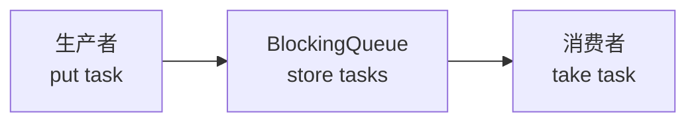

因此，`BlockingQueue` 不是简单的“线程安全队列”，而是一个带等待语义的线程安全队列。线程安全保证多个线程同时访问队列时内部状态不会损坏；等待语义保证队列空或满时，线程可以按约定阻塞、超时、失败或抛异常。

## 一、BlockingQueue 的方法差异，本质是失败策略差异

队列操作主要分成插入、获取并移除、只查看三类。`BlockingQueue` 在普通 `Queue` 的基础上，对“操作无法立即完成”提供了几组不同策略。

| 失败策略 | 插入元素 | 获取并移除元素 | 查看队首元素 | 队列满或空时的行为 |
|---|---|---|---|---|
| 抛异常 | `add(e)` | `remove()` | `element()` | 无法操作时抛异常 |
| 返回特殊值 | `offer(e)` | `poll()` | `peek()` | 插入失败返回 `false`，获取失败返回 `null` |
| 一直等待 | `put(e)` | `take()` | 无 | 满了不能放就等，空了不能取就等 |
| 超时等待 | `offer(e, time, unit)` | `poll(time, unit)` | 无 | 等一段时间，超时后返回失败结果 |

这张表的重点不在于记 API 名称，而在于区分调用者想要的语义。`put(e)` 表示“这个元素必须放进去，满了我可以等”；`take()` 表示“我必须取到元素，空了我可以等”。而 `offer(e)` 和 `poll()` 更像是“试一下”，不能立即完成就返回结果，不会长期阻塞当前线程。

在生产者消费者模型中，最典型的是 `put()` 和 `take()`：

```java
queue.put(task);
Task task = queue.take();
```

如果队列有容量上限，`put()` 可能因为队列满而等待；如果队列没有元素，`take()` 可能因为队列空而等待。至于等待时如何释放锁、如何进入条件队列、被通知后为什么要重新竞争锁，这些属于上一章 `Condition` 已经完成的机制闭环，本文后面只在队列实现中简短回指。

## 二、ArrayBlockingQueue：固定数组上的有界阻塞队列

`ArrayBlockingQueue` 是最接近手写有界阻塞队列的实现。它的内部结构可以概括为固定数组、一把锁、两个条件队列。

| 字段 | 作用 |
|---|---|
| `items` | 真正保存元素的数组 |
| `putIndex` | 下一次插入元素的位置 |
| `takeIndex` | 下一次取出元素的位置 |
| `count` | 当前队列中的元素数量 |
| `lock` | 保护数组、下标和数量的一把锁 |
| `notEmpty` | 队列为空时，消费者等待的条件 |
| `notFull` | 队列满时，生产者等待的条件 |

假设容量为 5，依次放入 `A`、`B`、`C` 后，数组状态大致如下：

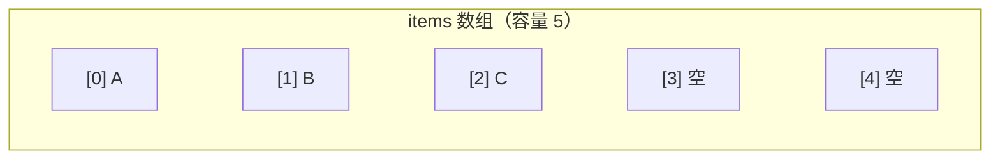

此时执行一次 `take()`，取出的不是移动整个数组，而是读取 `takeIndex` 指向的位置，然后让 `takeIndex` 后移。数组不会把 `B`、`C` 搬到前面，因为每次搬移都会带来额外成本。队列只需要维护“下次从哪里取”和“下次往哪里放”。

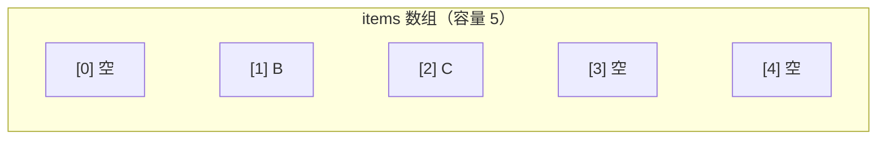

数组下标走到末尾后会回到 0，所以这个数组是循环使用的。继续放入 `D`、`E`，再放入 `F` 时，`putIndex` 会回到开头，把已经被取走的位置重新利用。

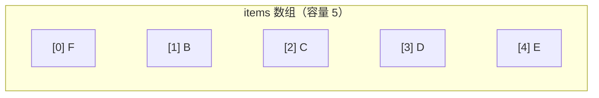

这里可以看到一个细节：`putIndex == takeIndex` 并不一定表示队列为空，也可能表示队列已满。因此 `ArrayBlockingQueue` 不能只靠两个下标判断空满，而要用 `count` 区分。

| 状态 | 判断条件 |
|---|---|
| 队列为空 | `count == 0` |
| 队列已满 | `count == items.length` |

在这个结构上，`put()` 的流程就是：先获得锁；如果 `count == items.length`，说明队列已满，进入 `notFull` 等待；否则把元素写入 `items[putIndex]`，移动 `putIndex`，增加 `count`，最后通知 `notEmpty` 上的消费者。对应地，`take()` 会在 `count == 0` 时等待 `notEmpty`，否则读取 `items[takeIndex]`，清空该位置引用，移动 `takeIndex`，减少 `count`，最后通知 `notFull` 上的生产者。

简化代码可以这样理解：

```java
// put 侧：写入数组尾部
items[putIndex] = e;
if (++putIndex == items.length) {
    putIndex = 0;
}
count++;
notEmpty.signal();

// take 侧：读取数组头部
E e = items[takeIndex];
items[takeIndex] = null;
if (++takeIndex == items.length) {
    takeIndex = 0;
}
count--;
notFull.signal();
return e;
```

这里的 `items[takeIndex] = null` 不是为了让本次返回正确，因为返回值已经保存到局部变量 `e` 中；它的作用是断开数组对已出队对象的引用，避免对象逻辑上已经离开队列，却仍然因为数组持有引用而不能被 GC 回收。

## 三、ArrayBlockingQueue 为什么只用一把锁

`ArrayBlockingQueue` 的所有核心状态都由同一把 `ReentrantLock` 保护。生产者修改 `items`、`putIndex` 和 `count`，消费者修改 `items`、`takeIndex` 和 `count`，其中 `count` 是双方共同修改的状态。使用一把锁可以让所有修改串行化，状态一致性更容易保证。

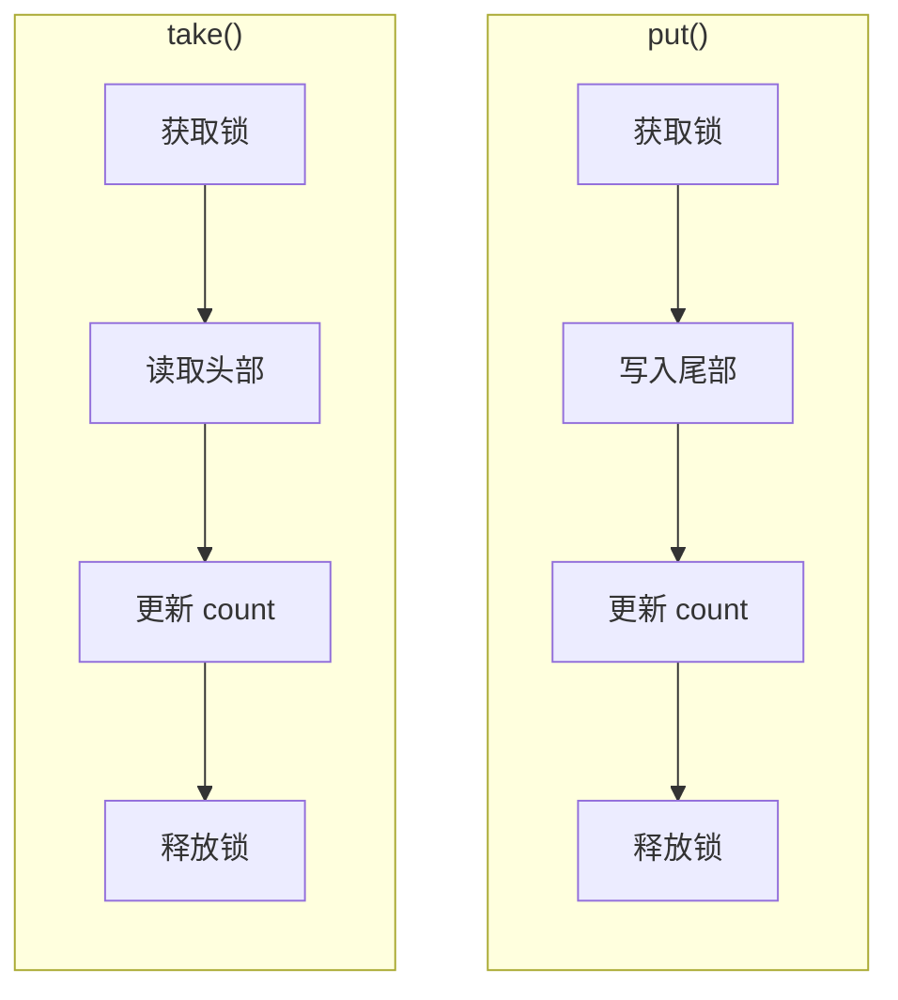

这也带来明显代价：即使队列既不空也不满，一个生产者正在 `put()`，一个消费者也不能同时 `take()`，因为二者竞争的是同一把锁。两个 `Condition` 只是把等待线程按业务条件分组，`notEmpty` 给消费者等待数据，`notFull` 给生产者等待空间，并不代表有两把锁。

所以，`ArrayBlockingQueue` 的特点可以概括为：固定数组、容量明确、内存稳定、实现简单，但 `put()` 和 `take()` 不能真正并行。在容量边界清晰、希望内存可控的场景中，它是一个很稳妥的选择。

## 四、LinkedBlockingQueue：用两把锁提高生产消费并发度

`LinkedBlockingQueue` 的底层结构不是数组，而是链表。链表的一个天然特点是：入队主要修改尾部，出队主要修改头部。利用这个特点，`LinkedBlockingQueue` 把入队和出队拆成了两把锁。

| 锁 | 保护的操作 | 对应条件 |
|---|---|---|
| `putLock` | 入队，修改链表尾部 | `notFull` |
| `takeLock` | 出队，修改链表头部 | `notEmpty` |

这和前面的单锁模型形成对比：`ArrayBlockingQueue` 中生产者和消费者必须竞争同一把锁；`LinkedBlockingQueue` 中，只要队列既不空也不满，生产者可以持有 `putLock` 追加节点，消费者可以持有 `takeLock` 摘取节点，两类操作可以并发推进。

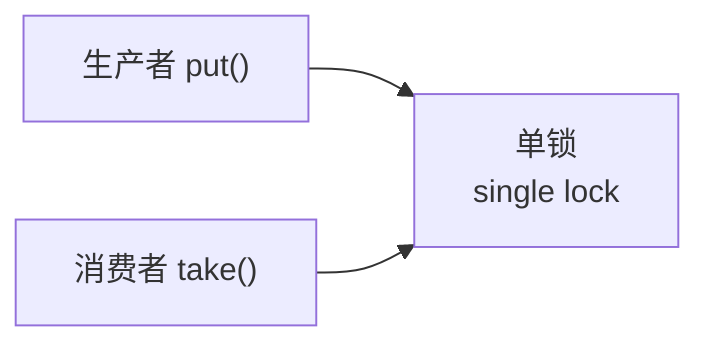

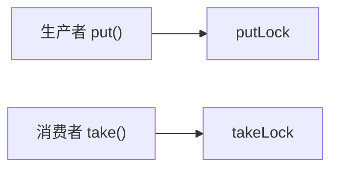

两把锁提高了并发度，但也引出一个新问题：入队和出队都会修改元素数量，而它们并不持有同一把锁。为了解决这个共享计数问题，`LinkedBlockingQueue` 使用 `AtomicInteger count`。链表尾部由 `putLock` 保护，链表头部由 `takeLock` 保护，数量变化由原子变量保护。

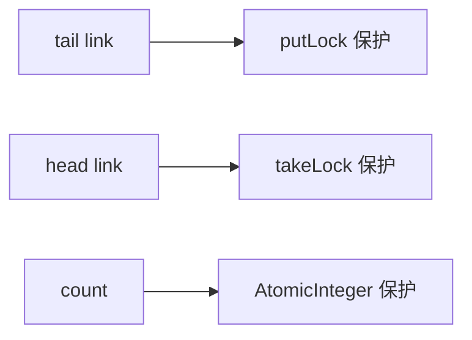

如果 `count` 是普通 `int`，生产者执行 `count++`、消费者执行 `count--` 时可能并发发生，导致丢失更新。原子变量使数量变化在两把锁之间仍然保持一致。

## 五、LinkedBlockingQueue 的链表为什么需要哨兵节点

`LinkedBlockingQueue` 的链表节点大致包含两个字段：`item` 保存元素，`next` 指向后继节点。队列内部维护 `head` 和 `last` 两个指针，其中 `head` 通常是哨兵节点，不保存有效元素；真正的第一个元素在 `head.next`。

初始状态下，队列只有一个哨兵节点，`head` 和 `last` 都指向它。

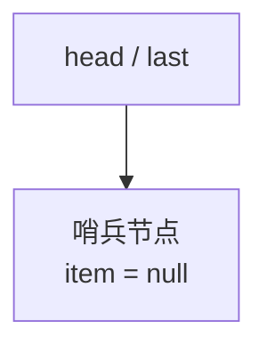

第一次放入 `A` 时，入队逻辑可以简化为：

```java
last.next = node;
last = node;
```

第一句是把新节点接到旧尾节点后面，第二句是把尾指针移动到新节点。放入 `A` 后，`last` 指向 `A`，而不是让 `A.next` 指向自己。

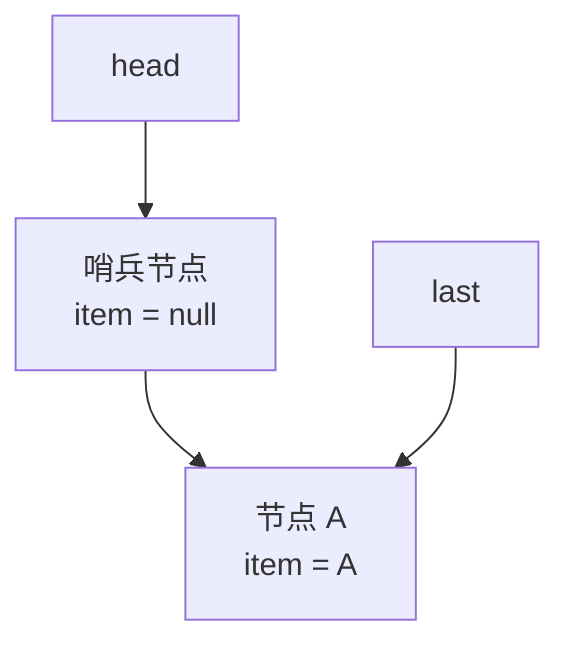

继续放入 `B`，就是把 `B` 接到旧尾节点 `A` 后面，再把 `last` 移到 `B`。

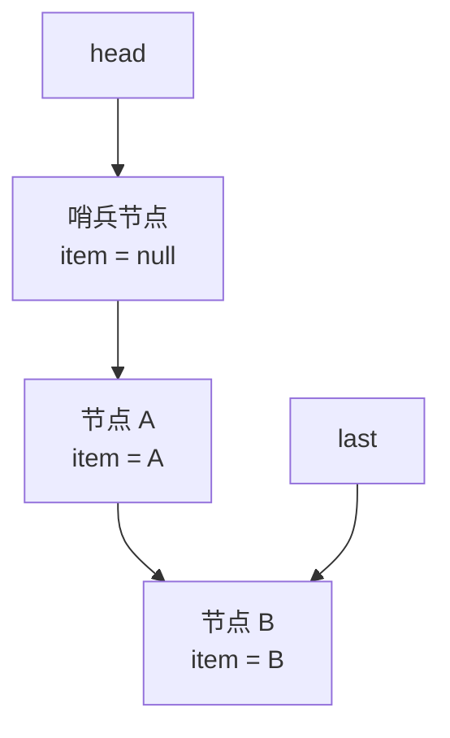

出队时取的不是 `head`，而是 `head.next`。假设当前第一个真实节点是 `A`，`take()` 会读取 `A.item`，然后把 `head` 移动到 `A`，并把 `A.item` 置为 `null`。这样原来的 `A` 节点变成新的哨兵节点，`B` 成为新的第一个真实元素。

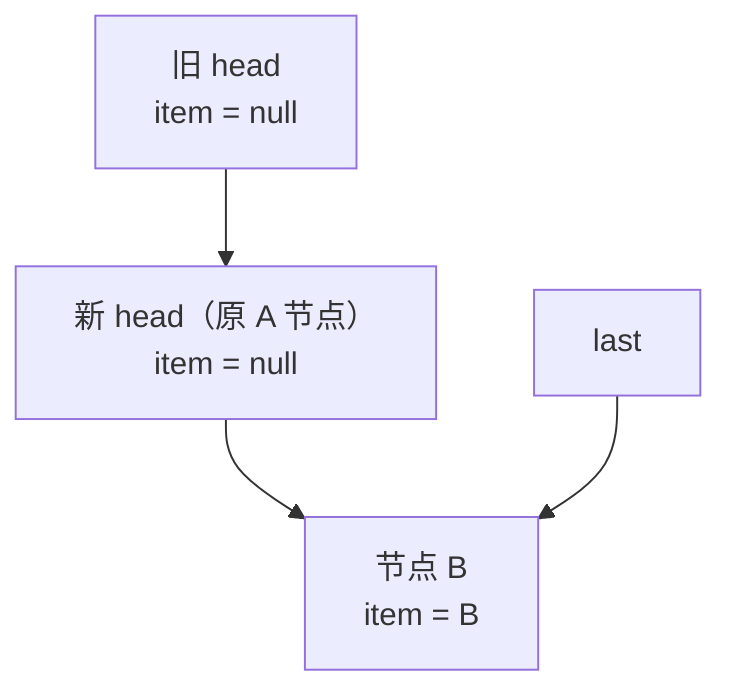

这里的 `item = null` 不是原子并发控制手段，而是引用清理。由于头部摘取在 `takeLock` 下完成，同一时间不会有两个消费者同时移动 `head`；由于尾部追加在 `putLock` 下完成，同一时间不会有两个生产者同时修改 `last`。链表指针本身不需要 CAS，锁已经提供了互斥保护。

哨兵节点让空队列和非空队列的处理更加统一：`head` 永远不保存有效元素，`head.next` 才是第一个真实元素；空队列时 `head == last`，非空时 `head.next != null`。

## 六、两把锁拆开后，通知也要分成两类

在单锁队列中，生产者放入元素后直接通知 `notEmpty`，消费者取出元素后直接通知 `notFull`。但在 `LinkedBlockingQueue` 中，`notEmpty` 绑定的是 `takeLock`，`notFull` 绑定的是 `putLock`。这意味着要操作哪个 `Condition`，就必须先持有创建它的那把锁。

生产者完成入队后，如果队列从空变成非空，就需要唤醒消费者；但消费者等待在 `notEmpty` 上，所以生产者要临时获取 `takeLock`，再执行 `notEmpty.signal()`。反过来，消费者完成出队后，如果队列从满变成未满，就需要临时获取 `putLock`，再执行 `notFull.signal()`。

| 状态变化 | 通知对象 | 需要持有的锁 |
|---|---|---|
| 队列从空变成非空 | 等待数据的消费者 | `takeLock` |
| 队列从满变成未满 | 等待空间的生产者 | `putLock` |

这就是两锁模型下的跨边通知。除此之外，`LinkedBlockingQueue` 还会做同侧通知：生产者放完以后，如果队列仍然没满，可以继续唤醒其他等待空间的生产者；消费者取完以后，如果队列仍然有数据，可以继续唤醒其他等待数据的消费者。这种接力式通知可以让同侧线程在条件仍然满足时继续推进，而跨边通知负责处理空、满边界被打破后的另一类线程唤醒。

可以把 `LinkedBlockingQueue` 的同步结构压缩成一条链：链表头尾分离，所以入队和出队可以用两把锁；两把锁无法共同保护 `count`，所以数量用原子变量；两边状态变化会影响对方等待条件，所以需要跨边通知；同一侧如果条件仍然满足，还可以接力唤醒本侧等待线程。

下面以生产者执行 `put(e)` 为例，把同侧通知和跨边通知串起来看。

简化后的 `put()` 逻辑如下：

```java
public void put(E e) throws InterruptedException {
    if (e == null) {
        throw new NullPointerException();
    }

    int c = -1;
    Node<E> node = new Node<>(e);

    final ReentrantLock putLock = this.putLock;
    final AtomicInteger count = this.count;

    putLock.lockInterruptibly();
    try {
        while (count.get() == capacity) {
            notFull.await();
        }

        enqueue(node);
        c = count.getAndIncrement();

        if (c + 1 < capacity) {
            notFull.signal();
        }
    } finally {
        putLock.unlock();
    }

    if (c == 0) {
        signalNotEmpty();
    }
}
```

这段代码可以分成三段看。

第一段是生产者侧的等待和入队：

```java
putLock.lockInterruptibly();
try {
    while (count.get() == capacity) {
        notFull.await();
    }

    enqueue(node);
    c = count.getAndIncrement();
    ...
} finally {
    putLock.unlock();
}
```

生产者只持有 `putLock`。如果队列已满，它等待的是 `notFull`；如果队列还有空间，它就把新节点追加到链表尾部。这里的 `enqueue(node)` 只修改尾部指针：

```java
private void enqueue(Node<E> node) {
    last = last.next = node;
}
```

由于这段代码在 `putLock` 内执行，所以多个生产者不会同时修改 `last`，尾部追加不需要 CAS。

第二段是同侧通知：

```java
if (c + 1 < capacity) {
    notFull.signal();
}
```

这里的 `c` 是入队之前的元素数量。执行 `count.getAndIncrement()` 后，队列数量变成 `c + 1`。如果 `c + 1 < capacity`，说明当前生产者放完元素后，队列仍然没有满，还可以继续放入元素，于是唤醒另一个等待在 `notFull` 上的生产者。

这一步仍然发生在 `putLock` 保护范围内，因为 `notFull` 绑定的就是 `putLock`。

第三段是跨边通知：

```java
if (c == 0) {
    signalNotEmpty();
}
```

如果 `c == 0`，说明入队之前队列是空的；当前生产者放入一个元素后，队列从空变成非空。消费者原来可能正在 `notEmpty` 上等待，所以需要唤醒消费者。

但 `notEmpty` 绑定的是 `takeLock`，不能直接在只持有 `putLock` 的情况下调用 `notEmpty.signal()`。因此 `signalNotEmpty()` 会临时获取 `takeLock`：

```java
private void signalNotEmpty() {
    final ReentrantLock takeLock = this.takeLock;

    takeLock.lock();
    try {
        notEmpty.signal();
    } finally {
        takeLock.unlock();
    }
}
```

这样，生产者的一次 `put()` 就完整串起了三件事：

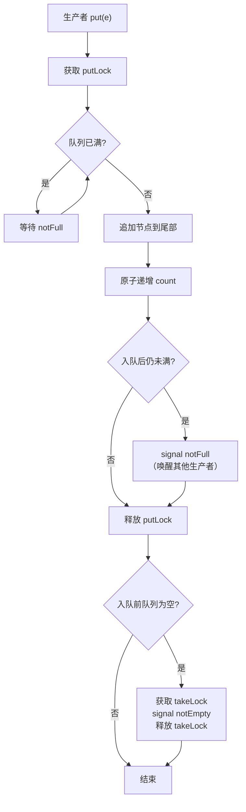

这个例子体现了 `LinkedBlockingQueue` 的通知规则：生产者侧的尾部追加由 `putLock` 保护，数量变化由 `AtomicInteger count` 保证，放完后如果本侧条件仍然满足，就继续唤醒其他生产者；如果这次入队打破了“空队列”边界，就跨到 `takeLock` 一侧唤醒消费者。


## 七、LinkedBlockingQueue 默认近似无界

`ArrayBlockingQueue` 创建时必须指定容量，而 `LinkedBlockingQueue` 可以不传容量：

```java
new LinkedBlockingQueue<>();
new LinkedBlockingQueue<>(capacity);
```

无参构造下，它的容量是 `Integer.MAX_VALUE`。这不是数学意义上的无限，但在大多数业务场景中可以视为近似无界。生产者通常很难因为队列满而阻塞，任务会不断堆积，最终风险从“线程等待”转移成“内存压力”。

| 创建方式 | 容量特点 | 主要风险 |
|---|---|---|
| `new LinkedBlockingQueue<>()` | 近似无界 | 任务堆积，可能 OOM |
| `new LinkedBlockingQueue<>(capacity)` | 有界 | 满了以后可以形成反压 |
| `new ArrayBlockingQueue<>(capacity)` | 有界 | 容量固定，内存边界清晰 |

因此，`LinkedBlockingQueue` 的优势不是“可以无限放”，而是用链表和两把锁提高生产消费并发度。实际使用时，通常更应该显式指定容量，让系统在消费能力不足时尽早暴露压力，而不是把压力隐藏到内存中。

## 八、SynchronousQueue：没有容量的直接交接

`SynchronousQueue` 虽然也实现了 `BlockingQueue`，但它不是用来缓存元素的。它的容量为 0，生产者和消费者必须直接配对，元素不会进入一个中间缓冲区等待以后再取。

普通阻塞队列允许生产者和消费者在时间上错开：

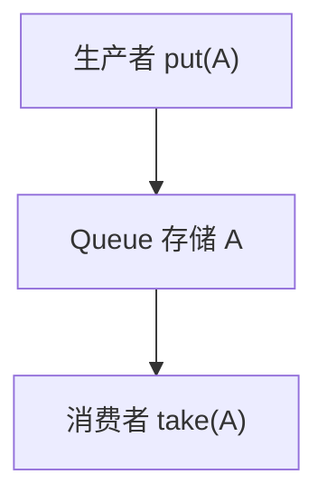

`SynchronousQueue` 则要求双方同时在场：

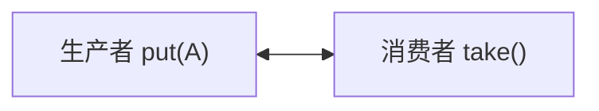

如果生产者先调用 `put(A)`，但没有消费者正在 `take()`，生产者就会阻塞；如果消费者先调用 `take()`，但没有生产者正在 `put()`，消费者也会阻塞。非阻塞的 `offer(A)` 在没有等待消费者时会直接返回 `false`，`poll()` 在没有等待生产者时会直接返回 `null`。

这个特性在线程池中非常重要。使用普通队列时，核心线程忙了以后，任务可以先排队；使用 `SynchronousQueue` 时，任务没有地方缓存，只能直接交给空闲工作线程。如果没有空闲线程接收，线程池就更倾向于创建新线程，直到达到 `maximumPoolSize` 或执行拒绝策略。

`SynchronousQueue` 还支持公平模式和非公平模式：

```java
new SynchronousQueue<>();     // 默认非公平
new SynchronousQueue<>(true); // 公平模式
```

两种模式不改变“容量为 0、不能缓存元素”的本质，只影响等待配对线程的匹配顺序。

| 模式    | 内部结构倾向  | 匹配顺序        | 优点     | 代价           |
| ----- | ------- | ----------- | ------ | ------------ |
| 非公平模式 | 栈，LIFO  | 后等待的线程可能先匹配 | 吞吐通常更高 | 早等待的线程可能等待更久 |
| 公平模式  | 队列，FIFO | 先等待的线程优先匹配  | 顺序更稳定  | 吞吐通常低一些      |

默认非公平模式更偏性能，适合大多数线程池直接交接任务的场景；公平模式更偏顺序稳定，适合更关注等待顺序而不是极限吞吐的场景。

## 九、PriorityBlockingQueue：按优先级取，而不是按插入顺序取

`PriorityBlockingQueue` 的出队顺序由元素优先级决定，而不是由入队时间决定。默认情况下，元素越“小”越先出队，因为底层是小顶堆。

最简单的例子是整数队列：

```java
PriorityBlockingQueue<Integer> queue = new PriorityBlockingQueue<>();

queue.put(30);
queue.put(10);
queue.put(20);

System.out.println(queue.take()); // 10
System.out.println(queue.take()); // 20
System.out.println(queue.take()); // 30
```

如果队列中放的是任务对象，就需要给任务定义比较规则。下面这个例子中，`priority` 越小优先级越高；如果两个任务优先级相同，再用 `sequence` 保证先入队的任务先出队。

```java
import java.util.concurrent.PriorityBlockingQueue;
import java.util.concurrent.atomic.AtomicLong;

public class PriorityBlockingQueueDemo {

    static class PriorityTask implements Comparable<PriorityTask> {
        private static final AtomicLong sequencer = new AtomicLong();

        private final String name;
        private final int priority;
        private final long sequence;

        PriorityTask(String name, int priority) {
            this.name = name;
            this.priority = priority;
            this.sequence = sequencer.getAndIncrement();
        }

        @Override
        public int compareTo(PriorityTask other) {
            int result = Integer.compare(this.priority, other.priority);
            if (result != 0) {
                return result;
            }

            return Long.compare(this.sequence, other.sequence);
        }

        @Override
        public String toString() {
            return name + "(priority=" + priority + ", sequence=" + sequence + ")";
        }
    }

    public static void main(String[] args) throws InterruptedException {
        PriorityBlockingQueue<PriorityTask> queue = new PriorityBlockingQueue<>();

        queue.put(new PriorityTask("normal-1", 10));
        queue.put(new PriorityTask("urgent-1", 1));
        queue.put(new PriorityTask("important-1", 5));
        queue.put(new PriorityTask("urgent-2", 1));

        System.out.println(queue.take());
        System.out.println(queue.take());
        System.out.println(queue.take());
        System.out.println(queue.take());
    }
}
```

输出顺序大致是：

```text
urgent-1(priority=1, sequence=1)
urgent-2(priority=1, sequence=3)
important-1(priority=5, sequence=2)
normal-1(priority=10, sequence=0)
```

这里体现了两层规则：先按 `priority` 排序，优先级更高的任务先出队；如果 `priority` 相同，再按 `sequence` 排序，先入队的任务先出队。

如果 `compareTo()` 只比较 `priority`：

```java
@Override
public int compareTo(PriorityTask other) {
    return Integer.compare(this.priority, other.priority);
}
```

那么同优先级任务在比较器看来是相等的，`PriorityBlockingQueue` 不保证它们按插入顺序出队。原因是它底层维护的是堆结构，堆只保证优先级关系，不维护同优先级元素的 FIFO 顺序。

`PriorityBlockingQueue` 也是无界队列。它的 `put()` 通常不会因为容量满而阻塞，真正会阻塞的是队列为空时的 `take()`。所以它适合任务确实存在优先级的场景，但不适合用来做容量反压。生产速度长期超过消费速度时，优先级队列同样会不断膨胀，带来内存风险。


## 十、DelayQueue：队列非空也不一定能取

`DelayQueue` 可以看成按到期时间排序的阻塞队列。它和 `PriorityBlockingQueue` 类似，底层都依赖优先级排序；区别在于，`DelayQueue` 的优先级不是普通大小，而是元素的到期时间。

队列中的元素必须实现 `Delayed` 接口：

```java
public interface Delayed extends Comparable<Delayed> {
    long getDelay(TimeUnit unit);
}
```

其中 `compareTo()` 用来决定元素的排序，通常是谁更早到期谁排在前面；`getDelay()` 用来判断当前元素还剩多久到期。只有堆顶元素的延迟时间小于等于 0 时，`take()` 才能真正取出它。

例如有三个延迟任务：

```text
A：10 秒后到期
B：3 秒后到期
C：5 秒后到期
```

即使插入顺序是 `A → B → C`，取出顺序也会是：

```text
B → C → A
```

因为 `DelayQueue` 关注的是到期时间，而不是插入顺序。

这一点会带来一个和普通阻塞队列不同的行为：**队列非空，`take()` 也可能继续阻塞**。

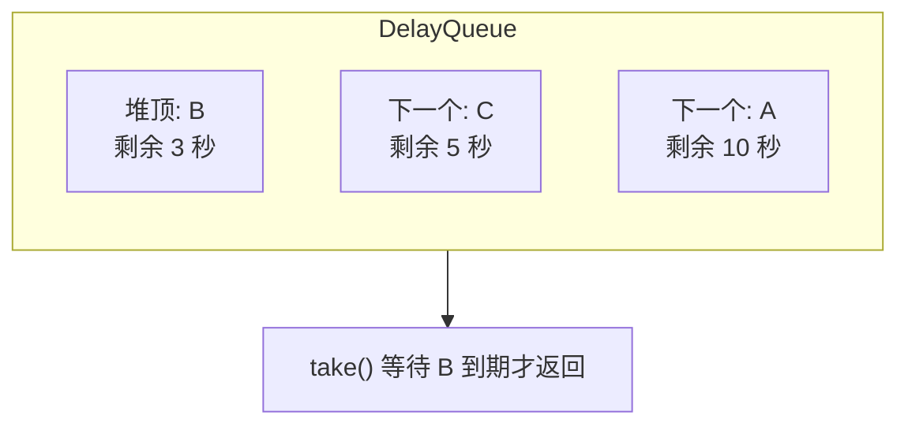

普通队列只要非空，消费者就可以取元素；但 `DelayQueue` 会先看堆顶元素是否到期。如果堆顶没到期，说明后面的元素只会更晚到期，所以消费者没有必要扫描整个队列，只需要等待堆顶元素到期。

可以简单理解为：

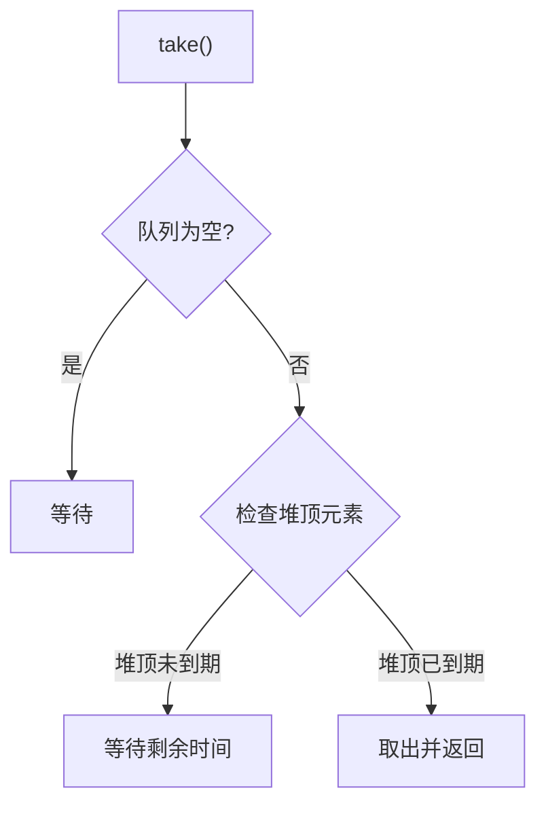

多个消费者同时等待时，`DelayQueue` 内部使用 `leader` 优化。它不会让所有消费者都等待同一个到期时间，而是只让一个线程作为 leader，负责等待最近的到期时间；其他线程普通等待。这样可以避免到期时间一到，多个消费者同时醒来抢锁，最后却只有一个线程真正取到元素。

```text
Consumer-1: leader, waits until top expires
Consumer-2: awaits normally
Consumer-3: awaits normally
```

如果生产者新放入的任务比原堆顶更早到期，原来的等待时间就不准确了。这时队列会清空 leader 并唤醒一个等待线程，让它重新检查新的堆顶任务。

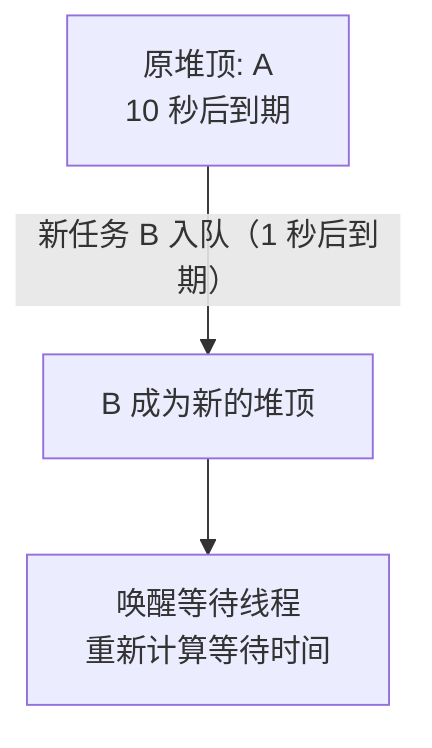

所以，`DelayQueue` 的核心可以压缩成一句话：

> `DelayQueue` 是按到期时间释放元素的阻塞队列；队列非空不代表可以取，只有最早到期的元素真正到期后，`take()` 才会返回。

它也属于无界队列，`put()` 通常不会因为容量满而阻塞。真正阻塞的是没有到期元素时的 `take()`。因此它适合延迟任务、订单超时关闭、缓存过期清理、定时重试等场景，但不适合用来做容量反压。

## 十一、BlockingQueue 在线程池中决定任务是排队还是扩容

`ThreadPoolExecutor` 的构造参数中，`workQueue` 就是 `BlockingQueue<Runnable>`。它不仅是任务容器，还会影响线程池的扩容路径。简化后的 `execute()` 流程是：

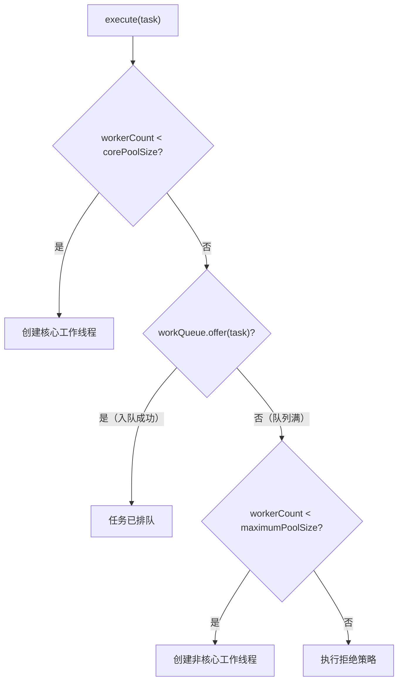

这里有一个容易忽略的点：线程池提交任务时，入队通常调用的是 `offer()`，不是 `put()`。也就是说，队列满了以后，提交线程不会在 `put()` 上一直阻塞，而是入队失败，然后线程池尝试创建非核心线程；如果线程数也达到上限，才执行拒绝策略。

不同队列会让线程池表现出不同倾向：

| 队列 | 线程池行为倾向 | 主要风险 |
|---|---|---|
| `ArrayBlockingQueue` | 核心线程满后先排队，队列满后再扩容 | 队列太小容易拒绝，太大延迟升高 |
| 有界 `LinkedBlockingQueue` | 类似先排队，满后扩容，但生产消费并发度更高 | 节点对象更多，GC 压力较大 |
| 无界 `LinkedBlockingQueue` | 几乎一直排队，`maximumPoolSize` 不易发挥作用 | 任务堆积，可能 OOM |
| `SynchronousQueue` | 不缓存任务，倾向直接交接或创建新线程 | 线程数可能快速增长 |
| `PriorityBlockingQueue` | 按优先级排队 | 无界堆积，同优先级不保证 FIFO |
| `DelayQueue` | 按到期时间取任务 | 无界堆积，只适合延迟任务模型 |

因此，线程池参数不能只看 `corePoolSize` 和 `maximumPoolSize`。如果队列是无界的，`maximumPoolSize` 往往很难发挥作用；如果队列是 `SynchronousQueue`，线程池又会更积极地创建新线程。队列选择本身就是线程池调度策略的一部分。

## 十二、几个常见使用误区

第一个误区是把 `BlockingQueue` 等同于“安全无风险的队列”。它确实解决了多线程并发访问和空满等待问题，但不自动解决容量设计问题。无界队列不会因为队列满而阻塞生产者，压力会转移到内存；有界队列虽然能形成反压，但容量过大也会让任务等待时间变长，故障暴露更晚。

第二个误区是以为 `BlockingQueue` 一定会让生产者在队列满时阻塞。是否阻塞取决于调用的方法和具体队列。`put()` 满了会等待，`offer()` 满了会返回失败；无界队列的 `put()` 通常不会因为容量满而等待；线程池内部也更常使用 `offer()` 决定是否入队。

第三个误区是忽略队列的出队顺序。`ArrayBlockingQueue` 和 `LinkedBlockingQueue` 是 FIFO，`PriorityBlockingQueue` 按优先级，`DelayQueue` 按到期时间，`SynchronousQueue` 根本不缓存元素。它们都实现了 `BlockingQueue`，但调度语义完全不同。

## 本章总结

本章的因果链可以从生产者消费者速度不一致开始理解：普通队列只能保存元素，不能决定空或满时线程如何等待；`Condition` 提供了释放锁并等待业务条件的能力，`BlockingQueue` 则把这种能力封装到队列接口中，并通过不同方法表达抛异常、返回特殊值、一直等待和超时等待这几种失败策略。

在具体实现上，数组结构引出了循环下标和单锁保护，得到的是容量明确、内存稳定但并发度较低的 `ArrayBlockingQueue`；链表结构让头尾操作可以拆开，进一步引出两把锁、原子计数和跨边通知，得到的是生产消费并发度更高但对象开销更大的 `LinkedBlockingQueue`。再往后，队列不一定只是 FIFO 缓冲区：`SynchronousQueue` 把缓存取消，变成生产者和消费者的直接交接；`PriorityBlockingQueue` 把出队顺序交给优先级；`DelayQueue` 又把优先级具体化为到期时间。

所以，`BlockingQueue` 最终解决的不是“用哪个容器存任务”这么简单，而是把线程等待、容量边界、出队顺序和任务调度策略绑定在一起。尤其在线程池中，队列类型会直接决定任务是先排队、先扩容、按优先级执行，还是必须直接交给工作线程。理解阻塞队列，就是理解生产速度、消费速度和系统承压方式之间的关系。
