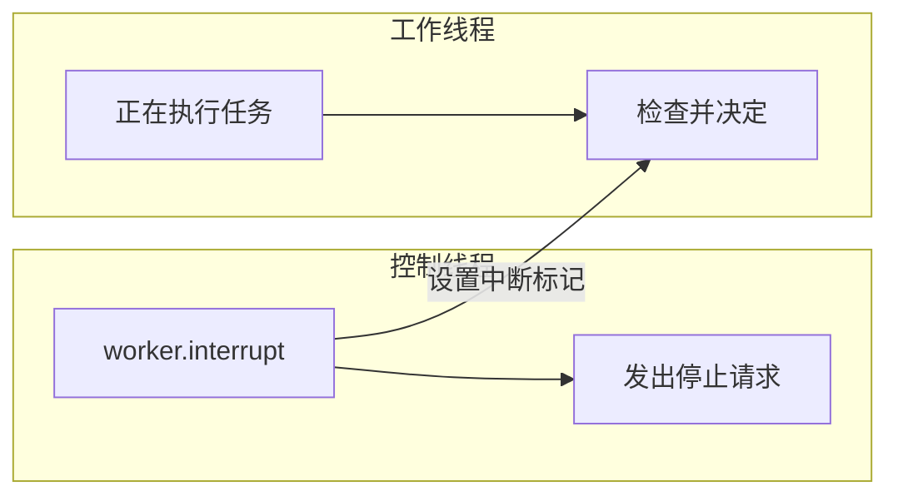

---

title: Java高并发底层原理（二十四）—— 线程中断如何让任务安全停止
date: 2026-07-05
abbrlink: 24tags:
- Java
- 高并发
- 线程中断
- 线程池
categories:
- java-concurrency
-------------

线程停止不是一个简单的 API 调用问题。真正的问题是：一个线程可能正在修改共享状态，可能正在持有锁，可能正在阻塞等待队列、I/O 或其他资源。如果外部直接把线程强行终止，线程可能停在任意位置，留下半完成状态。Java 不推荐强制停止线程，而是提供了中断机制，让外部线程发出停止请求，再由任务自己在合适的位置退出。

中断的核心不是“杀死线程”，而是“通知线程该停止了”。线程是否退出、什么时候退出、退出前是否清理资源，都取决于任务代码本身是否写好了响应路径。

## 1. `interrupt()` 只是发出停止请求

调用一个线程的 `interrupt()` 方法，并不会强制终止这个线程：

```java
worker.interrupt();
```

它做的事情可以先理解为：把目标线程的中断标记设置为 `true`。这个标记表示“有人希望你停下来”，但线程不会因为这个标记自动退出。



所以中断是一种协作式停止机制：外部线程只负责发出请求，Worker 线程要自己读取这个请求，并决定是否退出。

## 2. 运行中的任务要主动检查中断标记

如果任务一直在运行，没有进入阻塞方法，那么它必须主动检查中断标记。常见写法是：

```java
class Worker implements Runnable {

    @Override
    public void run() {
        while (!Thread.currentThread().isInterrupted()) {
            doWork();
        }

        cleanup();
    }

    private void doWork() {
        // 执行一小段可重复的任务
    }

    private void cleanup() {
        // 释放资源、记录日志等
    }
}
```

这里真正让任务退出的不是 `interrupt()`，而是循环条件：

```java
while (!Thread.currentThread().isInterrupted())
```

当其他线程调用 `worker.interrupt()` 后，Worker 下一次执行 `isInterrupted()` 时会看到中断标记已经变成 `true`，循环结束，任务自然退出。

这种写法适合计算型任务、轮询型任务，或者每次循环都能比较快回到判断条件的位置。如果循环体内部长期不返回，或者卡在某个阻塞方法里，单靠循环条件就不够了。

## 3. 阻塞中的任务通过 `InterruptedException` 被唤醒

任务不一定一直处于运行状态。更常见的情况是，Worker 等待任务队列：

```java
Task task = queue.take();
```

如果队列为空，线程会阻塞在 `take()` 里面。此时它回不到 `while` 条件，也就没有机会主动执行 `isInterrupted()`。这时需要阻塞方法本身支持中断。

例如 `BlockingQueue.take()` 的方法签名包含：

```java
E take() throws InterruptedException;
```

这表示：线程阻塞在 `take()` 时，如果外部调用 `interrupt()`，`take()` 会被唤醒，并抛出 `InterruptedException`。

完整的 Worker 写法通常是：

```java
class QueueWorker implements Runnable {

    private final BlockingQueue<Task> queue;

    QueueWorker(BlockingQueue<Task> queue) {
        this.queue = queue;
    }

    @Override
    public void run() {
        try {
            while (!Thread.currentThread().isInterrupted()) {
                Task task = queue.take();
                process(task);
            }
        } catch (InterruptedException e) {
            Thread.currentThread().interrupt();
            return;
        } finally {
            cleanup();
        }
    }

    private void process(Task task) {
        // 处理任务
    }

    private void cleanup() {
        // 关闭连接、释放资源、写日志等
    }
}
```

这里的结构分成四层：`while` 负责运行状态下检查中断；`queue.take()` 负责阻塞状态下响应中断；`catch` 负责处理中断；`finally` 负责退出前清理资源。

需要注意，`try-catch` 不是让中断生效的原因。中断能唤醒 `take()`，是因为 `take()` 本身支持中断；`try-catch` 只是因为 `InterruptedException` 是受检异常，代码必须处理它。

## 4. `catch` 里不能吞掉中断

阻塞方法因为中断抛出 `InterruptedException` 后，通常会清除当前线程的中断标记。也就是说，进入 `catch` 时，中断标记可能已经变回 `false`。

因此常见写法是：

```java
catch (InterruptedException e) {
    Thread.currentThread().interrupt();
    return;
}
```

这两句的职责不同：

```java
Thread.currentThread().interrupt();
```

负责恢复中断标记，表示“当前线程确实被中断过”。

```java
return;
```

才是真正让当前任务退出的语句。

不要写成下面这样：

```java
try {
    Task task = queue.take();
    process(task);
} catch (InterruptedException e) {
    // 什么都不做
}
```

这种写法会吞掉中断。外部线程已经发出停止请求，阻塞方法也已经被唤醒，但任务没有退出，也没有恢复中断标记，停止请求就丢失了。

如果当前方法不能直接退出，而是要把中断交给上层处理，也应该恢复中断标记：

```java
catch (InterruptedException e) {
    Thread.currentThread().interrupt();
}
```

这样上层代码仍然可以通过 `isInterrupted()` 看到当前线程曾经被请求停止。

## 5. `isInterrupted()` 和 `Thread.interrupted()` 不一样

读取中断标记有两个常见方法：

| 方法                       | 作用对象 | 是否清除中断标记 | 常见用途      |
| ------------------------ | ---- | -------: | --------- |
| `thread.isInterrupted()` | 指定线程 |        否 | 普通循环检查    |
| `Thread.interrupted()`   | 当前线程 |        是 | 检查并消费中断信号 |

`isInterrupted()` 只读取标记，不清除：

```java
Thread.currentThread().interrupt();

System.out.println(Thread.currentThread().isInterrupted()); // true
System.out.println(Thread.currentThread().isInterrupted()); // true
```

`Thread.interrupted()` 会读取当前线程的中断标记，并把它清除：

```java
Thread.currentThread().interrupt();

System.out.println(Thread.interrupted()); // true
System.out.println(Thread.interrupted()); // false
```

所以在任务循环中，通常使用：

```java
while (!Thread.currentThread().isInterrupted()) {
    doWork();
}
```

不优先使用：

```java
while (!Thread.interrupted()) {
    doWork();
}
```

因为后者会把中断标记清掉，后面的代码可能就不知道当前线程被中断过了。

## 6. 调用线程如何安全关闭线程池

线程池里的任务通常不是直接通过 `Thread` 对象管理，而是通过 `Future` 或 `ExecutorService` 控制。虽然 API 不同，但底层思想仍然是中断 Worker 线程。

`Future.cancel(true)` 表示：如果任务还没有开始，就取消它；如果任务已经在运行，就尝试中断执行它的线程。

```java
Future<?> future = executor.submit(new QueueWorker(queue));

future.cancel(true);
```

这里的 `true` 不是强制终止任务，而是允许对正在执行任务的 Worker 线程调用 `interrupt()`。任务能不能停止，仍然取决于 `QueueWorker` 内部是否按照前文方式响应中断。

线程池关闭时，常见做法是先温和关闭，再超时升级：

```java
executor.shutdown();

try {
    if (!executor.awaitTermination(30, TimeUnit.SECONDS)) {
        executor.shutdownNow();
    }
} catch (InterruptedException e) {
    executor.shutdownNow();
    Thread.currentThread().interrupt();
}
```

这段代码中，调用线程和 Worker 线程承担不同职责。`shutdown()` 表示线程池不再接收新任务，但已经提交的任务继续执行；`awaitTermination()` 是调用线程等待线程池结束；如果等待超时，再调用 `shutdownNow()` 尝试中断正在执行任务的 Worker 线程。

如果调用线程自己在 `awaitTermination()` 期间被中断，就进入 `catch`。此时调用线程不应该继续等待，而是升级为 `shutdownNow()`，并恢复自己的中断标记：

```java
catch (InterruptedException e) {
    executor.shutdownNow();
    Thread.currentThread().interrupt();
}
```

这里恢复的是调用线程的中断状态，不是 Worker 线程的中断状态。

`shutdown()` 和 `shutdownNow()` 的区别可以概括如下：

| 方法              | 是否接收新任务 | 队列中未开始任务 | 正在执行的任务 |
| --------------- | ------: | -------- | ------- |
| `shutdown()`    |       否 | 继续执行     | 继续执行    |
| `shutdownNow()` |       否 | 从队列移除并返回 | 尝试中断    |

`shutdownNow()` 返回的是队列里还没开始执行的任务，不包含已经被 Worker 线程取走、正在执行中的任务。正在执行的任务只会收到中断请求，是否退出仍然取决于任务代码。

## 7. `interrupt()` 不能唤醒所有等待

不是所有阻塞都能被 `interrupt()` 唤醒。像下面这些方法通常支持中断：

| 方法                                  | 中断后的表现                    |
| ----------------------------------- | ------------------------- |
| `Thread.sleep()`                    | 抛出 `InterruptedException` |
| `Object.wait()`                     | 抛出 `InterruptedException` |
| `Thread.join()`                     | 抛出 `InterruptedException` |
| `BlockingQueue.take()`              | 抛出 `InterruptedException` |
| `Condition.await()`                 | 抛出 `InterruptedException` |
| `ReentrantLock.lockInterruptibly()` | 抛出 `InterruptedException` |

但线程等待进入 `synchronized` 锁时，不能被 `interrupt()` 唤醒。

```java
synchronized (lock) {
    doWork();
}
```

如果线程正在等待进入这个同步块，外部调用 `interrupt()` 只会设置它的中断标记，线程仍然会继续等待锁。

如果希望“等待锁时也能响应中断”，可以使用 `ReentrantLock.lockInterruptibly()`：

```java
class InterruptibleLockWorker implements Runnable {

    private final ReentrantLock lock;

    InterruptibleLockWorker(ReentrantLock lock) {
        this.lock = lock;
    }

    @Override
    public void run() {
        try {
            lock.lockInterruptibly();
            try {
                doWork();
            } finally {
                lock.unlock();
            }
        } catch (InterruptedException e) {
            Thread.currentThread().interrupt();
            return;
        }
    }

    private void doWork() {
        // 持锁执行临界区逻辑
    }
}
```

这里讨论的是“还没拿到锁，正在等锁”的阶段。如果线程已经拿到锁并进入临界区，中断仍然不会强行把它赶出去。它仍然要执行完当前临界区，再根据任务代码决定是否退出。

## 8. 为什么不用 `Thread.stop()`

`Thread.stop()` 的问题是强制终止线程。它不给线程自己选择退出位置的机会，线程可能停在任意一行代码上。

例如：

```java
class Account {

    private int balance;
    private int frozenAmount;

    public synchronized void transferOut(int amount) {
        balance -= amount;
        frozenAmount += amount;
    }
}
```

这两个字段更新本来应该一起完成。如果线程执行完第一句后被 `Thread.stop()` 强行终止：

```java
balance -= amount;
// 线程在这里被强制终止
frozenAmount += amount;
```

对象就会处于半完成状态：`balance` 已经减少，但 `frozenAmount` 还没有增加。更危险的是，线程被强行终止时会释放已经持有的锁，其他线程随后可以进入同步方法，看到这个不一致状态。

`interrupt()` 不会这样做。它只是设置中断标记，线程仍然可以完成当前临界区、执行 `finally`、释放资源，然后在自己可控的位置退出。

## 9. `volatile running` 和 `interrupt()` 的选择

有些任务会使用一个 `volatile` 标记控制停止：

```java
class RunningWorker implements Runnable {

    private volatile boolean running = true;

    public void stop() {
        running = false;
    }

    @Override
    public void run() {
        while (running) {
            doWork();
        }
    }

    private void doWork() {
        // 非阻塞任务
    }
}
```

这种写法适合非阻塞循环。只要 Worker 一直能回到 `while (running)`，它就能看到 `running = false`，然后退出。

但如果任务可能阻塞，`volatile running` 就不够：

```java
while (running) {
    Task task = queue.take();
    process(task);
}
```

当线程阻塞在 `queue.take()` 时，即使其他线程把 `running` 改成 `false`，Worker 也没有机会回到循环条件重新读取它。相比之下，`interrupt()` 不但能设置中断标记，还能唤醒支持中断的阻塞方法。

因此选择规则可以整理为：

| 场景                                   | 推荐方式                               | 原因              |
| ------------------------------------ | ---------------------------------- | --------------- |
| 简单非阻塞循环                              | `volatile running` 或 `interrupt()` | 线程能主动检查停止条件     |
| 可能进入 `sleep()` / `wait()` / `take()` | `interrupt()`                      | 可以唤醒可中断阻塞       |
| 等待 `synchronized` 锁                  | `interrupt()` 不够                   | 只能设置标记，不能唤醒锁等待  |
| 等待 `ReentrantLock` 且需要可中断            | `lockInterruptibly()`              | 等锁时可响应中断        |
| 线程池任务取消                              | `cancel(true)` / `shutdownNow()`   | 本质是中断 Worker 线程 |

## 10. 安全停止不是一个 API，而是一组退出路径

一个可安全停止的任务，通常同时具备三部分代码。

第一，运行中能检查中断：

```java
while (!Thread.currentThread().isInterrupted()) {
    doWork();
}
```

第二，阻塞中能响应中断：

```java
try {
    Task task = queue.take();
    process(task);
} catch (InterruptedException e) {
    Thread.currentThread().interrupt();
    return;
}
```

第三，退出前能清理资源：

```java
finally {
    cleanup();
}
```

把它们合在一起，才是一段完整的可停止 Worker：

```java
class StoppableWorker implements Runnable {

    private final BlockingQueue<Task> queue;

    StoppableWorker(BlockingQueue<Task> queue) {
        this.queue = queue;
    }

    @Override
    public void run() {
        try {
            while (!Thread.currentThread().isInterrupted()) {
                Task task = queue.take();
                process(task);
            }
        } catch (InterruptedException e) {
            Thread.currentThread().interrupt();
            return;
        } finally {
            cleanup();
        }
    }

    private void process(Task task) {
        // 处理一个任务单元
    }

    private void cleanup() {
        // 释放资源
    }
}
```

与之配合的调用线程负责发出停止请求：

```java
ExecutorService executor = Executors.newFixedThreadPool(4);

executor.submit(new StoppableWorker(queue));

executor.shutdown();

try {
    if (!executor.awaitTermination(30, TimeUnit.SECONDS)) {
        executor.shutdownNow();
    }
} catch (InterruptedException e) {
    executor.shutdownNow();
    Thread.currentThread().interrupt();
}
```

前一段代码解决的是 Worker 如何响应中断，后一段代码解决的是调用线程如何关闭线程池。只有两边配合，线程池关闭才不是单纯“发一个信号”，而是能让任务有机会自然退出、被中断唤醒、清理资源，并把中断状态正确传递给上层。

## 总结

本章的因果链条可以从“不能强杀线程”开始理解：因为线程可能正在持锁、修改共享状态或等待资源，所以外部直接终止会破坏对象一致性；因此 Java 更推荐用 `interrupt()` 发出停止请求。请求发出后，如果任务仍在运行，就要靠 `isInterrupted()` 主动检查；如果任务正在可中断阻塞，就要靠 `InterruptedException` 被唤醒；异常被捕获后，中断标记可能已经被清除，所以需要恢复中断状态，再通过 `return`、`break` 或循环结束真正退出。线程池中的 `cancel(true)` 和 `shutdownNow()` 只是把这套机制包装了一层，它们负责发出中断请求，但不保证任务一定停止。真正的安全停止，最终仍然取决于任务是否在运行、阻塞、等锁和退出清理这些位置都写好了响应路径。
