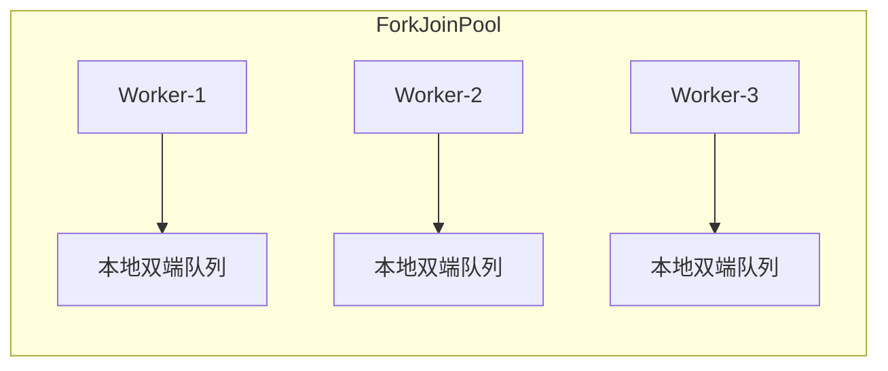
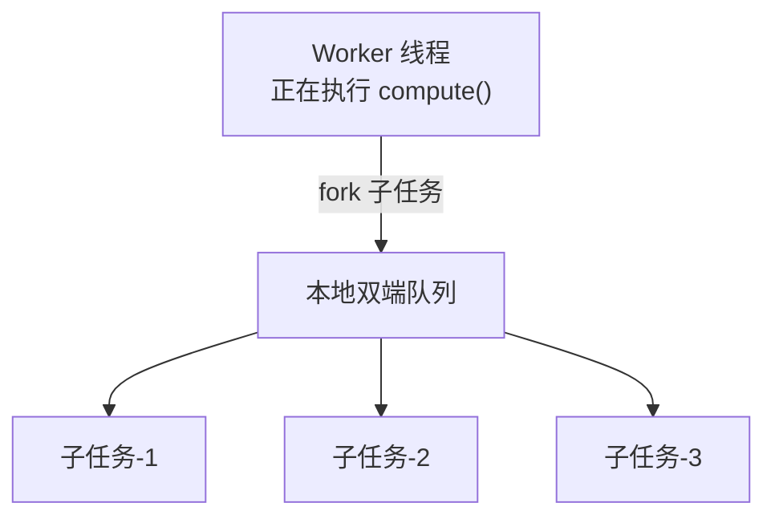
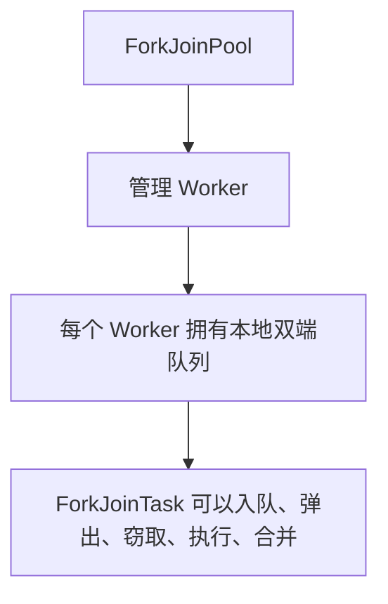
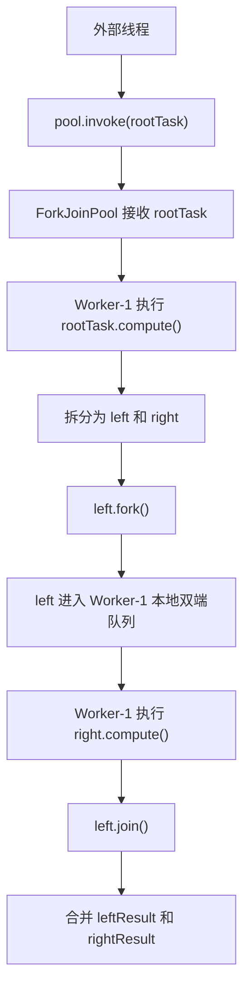
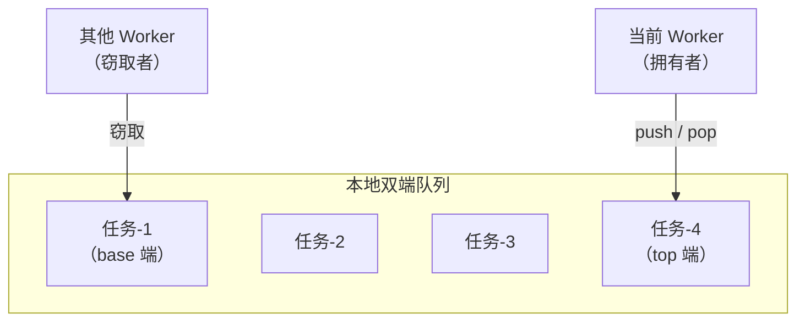
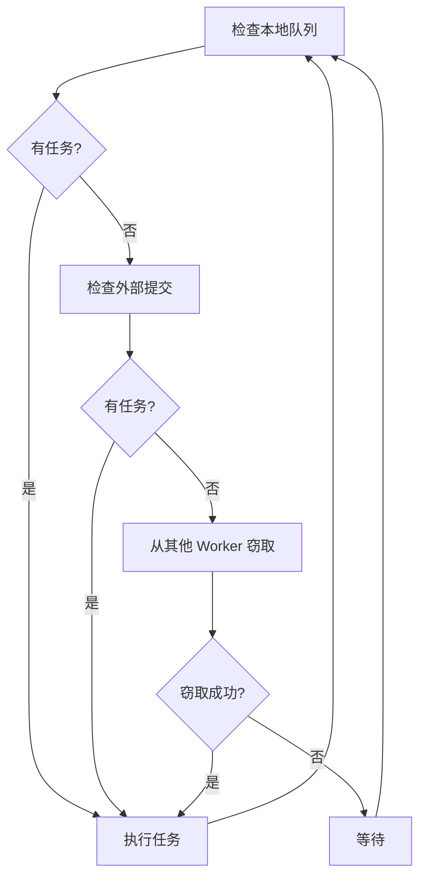
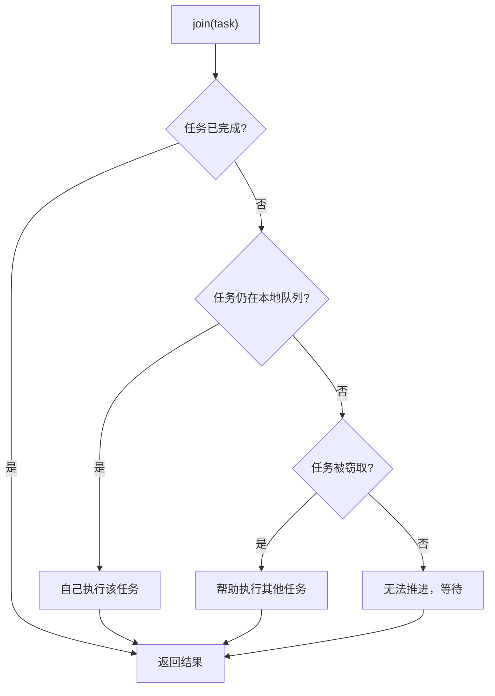
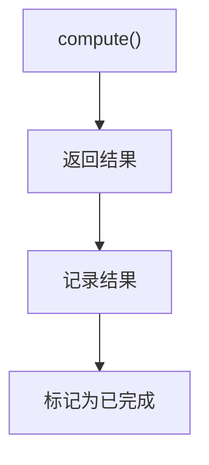
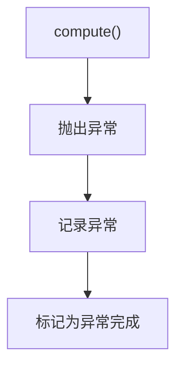
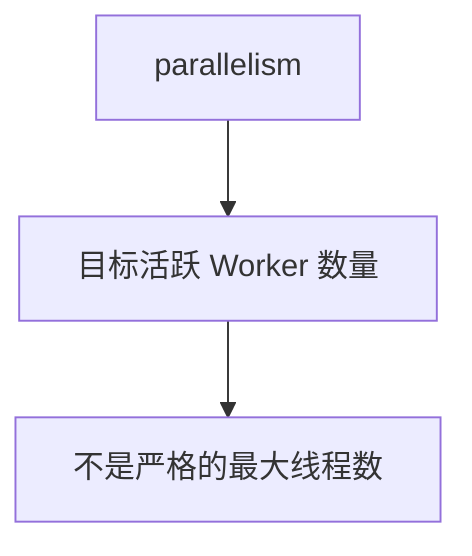

普通线程池更适合处理一个个相对独立的任务：任务提交到队列，工作线程从队列中取任务执行。ForkJoinPool 面向的是另一类任务：一个大任务可以拆成多个子任务，子任务继续拆分，最后把结果合并起来。

这类任务如果仍然只依赖一个共享队列，会遇到一个问题：某个线程在执行任务时继续拆出了很多子任务，而其他线程可能已经空闲。如果这些子任务只停留在当前线程的执行路径里，其他线程就没法帮忙；如果所有子任务都放进一个共享队列，又会让所有线程频繁竞争同一个队列。

ForkJoinPool 的核心思路是：每个 Worker 都有自己的本地双端队列。当前 Worker 拆出来的子任务先放到自己的队列里；当前 Worker 优先执行自己的任务；其他 Worker 空闲时，可以从它的队列中偷任务执行。这就是工作窃取。



本文先从执行模型讲起，再看 `invoke()`、`fork()`、`compute()`、`join()` 分别把任务推进到哪里。

## 1. ForkJoinPool 里面有哪些角色

理解 ForkJoinPool，先不要急着看 `fork()` 和 `join()`，而要先分清四个角色：ForkJoinPool、Worker、本地双端队列、ForkJoinTask。

ForkJoinPool 是整个执行器，负责管理 Worker、接收外部提交的任务，并协调 Worker 之间的任务窃取。Worker 是 ForkJoinPool 内部真正执行任务的工作线程。和普通线程池里的工作线程不同，ForkJoinPool 的每个 Worker 通常还关联着一个本地双端队列，用来保存这个 Worker 自己拆出来的子任务。

本地队列不是一个所有线程共同竞争的全局队列，而是某个 Worker 的“私有任务缓冲区”。当前 Worker 在执行任务时，如果调用 `fork()` 拆出子任务，这些子任务通常会进入当前 Worker 的本地队列。当前 Worker 后续可以自己取出来执行；其他 Worker 空闲时，也可以从这个队列的另一端偷走任务。



ForkJoinTask 是被执行的任务对象。它不只是一个 `Runnable` 式的代码片段，还会记录任务是否完成、完成后的结果以及异常状态。`RecursiveTask<V>`、`RecursiveAction` 都是 ForkJoinTask 的常用子类。

这里先建立一个基本关系：



这个结构决定了 ForkJoinPool 和普通线程池的差异。普通线程池的重点是多个线程从共享队列取任务；ForkJoinPool 的重点是 Worker 先执行自己的本地任务，空闲后再去偷别人的任务。

## 2. 外部线程提交任务和 Worker 内部 fork 不是一回事

ForkJoinPool 中任务进入池子有两条不同路径：一条是外部线程提交根任务，另一条是 Worker 在执行过程中 fork 子任务。很多理解上的混乱，都是因为把这两条路径混在了一起。

外部线程通常是 `main` 线程、业务线程或请求线程，它们不是 ForkJoinPool 的 Worker，没有本地双端队列。外部线程把根任务交给 ForkJoinPool，常用的是 `invoke()`、`submit()` 或 `execute()`：

```java
ForkJoinPool pool = new ForkJoinPool();

long result = pool.invoke(new SumTask(array, 0, array.length));
```

这段代码中，调用 `pool.invoke()` 的线程只是提交任务并等待结果。真正执行 `SumTask.compute()` 的，是 ForkJoinPool 里的某个 Worker。

`invoke()`、`submit()`、`execute()` 都是 Pool 级别的提交方法，但语义不同：

| 方法              | 是否等待完成 |              是否有返回值 | 常见用途                            |
| --------------- | -----: | ------------------: | ------------------------------- |
| `invoke(task)`  |      是 |          是，直接返回任务结果 | 外部线程同步提交根任务                     |
| `submit(task)`  |      否 | 是，返回 `ForkJoinTask` | 外部线程异步提交，之后再 `join()` 或 `get()` |
| `execute(task)` |      否 |                   否 | 提交不关心结果的任务                      |

例如异步提交可以写成：

```java
ForkJoinTask<Long> task =
        pool.submit(new SumTask(array, 0, array.length));

Long result = task.join();
```

而 Worker 内部调用的 `fork()` 不是 Pool 级别的外部提交 API。`fork()` 更适合出现在 `compute()` 内部，表示当前 Worker 把拆出来的子任务放进自己的本地队列。

```java
SumTask left = new SumTask(array, start, mid);
SumTask right = new SumTask(array, mid, end);

left.fork();

long rightResult = right.compute();
long leftResult = left.join();
```

这里的调用者已经不是外部业务线程，而是正在执行 `compute()` 的 ForkJoin Worker。因为它是 Worker，所以它有本地队列；因为它有本地队列，所以 `left.fork()` 才能把 `left` 放入当前 Worker 的本地队列。

这就是两条路径的核心区别：

| 场景                                         | 调用线程            | 线程是否有本地队列 | 任务进入哪里               |
| ------------------------------------------ | --------------- | --------: | -------------------- |
| `pool.invoke()` / `submit()` / `execute()` | 外部线程            |         否 | ForkJoinPool 的外部提交路径 |
| `task.fork()`                              | ForkJoin Worker |         是 | 当前 Worker 的本地队列      |

如果在外部线程中直接调用 `task.fork()`，当前线程不是 ForkJoin Worker，没有当前 Pool 的本地队列可用，任务会走公共池相关的外部提交路径。这通常不是我们想要的根任务提交方式。因此根任务应该通过指定的 `pool.invoke()`、`pool.submit()` 或 `pool.execute()` 进入池子；`fork()` 主要用于 Worker 内部拆分子任务。

## 3. 用数组求和建立主例子

下面用数组求和作为全文主例子。一个大数组可以拆成左右两段，左右两段继续拆分，直到区间足够小，再直接顺序求和。

```java
import java.util.concurrent.ForkJoinPool;
import java.util.concurrent.RecursiveTask;

public class ForkJoinSumDemo {

    public static void main(String[] args) {
        long[] array = new long[1_000_000];

        for (int i = 0; i < array.length; i++) {
            array[i] = i + 1;
        }

        ForkJoinPool pool = new ForkJoinPool();

        long result = pool.invoke(new SumTask(array, 0, array.length));

        System.out.println(result);
    }

    static class SumTask extends RecursiveTask<Long> {

        private static final int THRESHOLD = 10_000;

        private final long[] array;
        private final int start;
        private final int end;

        SumTask(long[] array, int start, int end) {
            this.array = array;
            this.start = start;
            this.end = end;
        }

        @Override
        protected Long compute() {
            if (end - start <= THRESHOLD) {
                long sum = 0;
                for (int i = start; i < end; i++) {
                    sum += array[i];
                }
                return sum;
            }

            int mid = (start + end) / 2;

            SumTask left = new SumTask(array, start, mid);
            SumTask right = new SumTask(array, mid, end);

            left.fork();

            long rightResult = right.compute();
            long leftResult = left.join();

            return leftResult + rightResult;
        }
    }
}
```

这段代码里有一条完整主线：外部线程通过 `pool.invoke()` 提交根任务；某个 Worker 取到根任务后执行 `compute()`；任务太大时拆成 `left` 和 `right`；`left.fork()` 把左任务放进当前 Worker 的本地队列；当前 Worker 继续执行 `right.compute()`；最后通过 `left.join()` 拿到左任务结果并合并。

用流程表示就是：



这条主线后文会反复复用，但不会再重新展开完整代码。

## 4. 为什么 fork 一个，compute 一个，最后 join

主例子中最关键的三行代码是：

```java
left.fork();

long rightResult = right.compute();
long leftResult = left.join();
```

这不是随便写的顺序。它背后的原则是：把一部分任务暴露给其他 Worker，同时让当前 Worker 继续干活。

`left.fork()` 只是把 `left` 放进当前 Worker 的本地队列，并不表示马上创建一个新线程执行它。放进队列后，`left` 有两种可能：如果其他 Worker 空闲，它可能被偷走；如果没有被偷走，当前 Worker 后面也可以自己执行它。

接着执行 `right.compute()`，表示当前 Worker 不等待 `left`，而是继续执行右半部分。这样当前 Worker 不会因为刚 fork 出一个任务就停下来。等右半部分算完后，再通过 `left.join()` 拿左半部分结果。

如果写成下面这样：

```java
left.fork();
right.fork();

long leftResult = left.join();
long rightResult = right.join();
```

逻辑上也可能得到结果，但当前 Worker 先把两个子任务都放进队列，然后马上进入等待或帮助执行的逻辑。相比之下，`fork 一个，compute 一个，最后 join` 更直接地利用了当前线程的执行能力。

所以这三行代码的真实含义是：

| 代码                | 含义                              |
| ----------------- | ------------------------------- |
| `left.fork()`     | 把一个子任务放入当前 Worker 的本地队列，让它可以被窃取 |
| `right.compute()` | 当前 Worker 继续执行另一个子任务            |
| `left.join()`     | 在需要结果时，再获取被 fork 任务的结果          |

这里的重点不是一定 fork 左边、compute 右边，也可以反过来。关键是不要把所有子任务都 fork 出去后立刻等待，而是让当前 Worker 保持执行状态。

## 5. 本地双端队列为什么两端操作

前文说过，每个 Worker 有自己的本地双端队列。它之所以是“双端”，是因为队列拥有者和偷任务的线程从不同方向操作。



当前 Worker 自己主要从 `top` 端压入和弹出任务。也就是说，当前 Worker 更倾向于执行最近 fork 出来的任务。这种顺序接近 LIFO。递归拆分任务时，最近产生的任务通常和当前执行路径更近，数据也更可能仍在 CPU Cache 中。

其他 Worker 来偷任务时，主要从 `base` 端偷。这样做有两个好处。第一，偷任务线程和队列拥有者操作不同端，竞争更少。第二，`base` 端的任务通常更早产生，拆分层级更浅，任务粒度可能更大。空闲 Worker 偷到较大的任务后，可以继续在自己的线程里拆分，形成新的本地工作量。

所以工作窃取不是多个线程随便抢一个任务，而是有明确方向：

```text
owner worker  : push/pop from top
stealer worker: steal from base
```

这条规则同时解决了两个问题：当前 Worker 保持局部性，空闲 Worker 获得足够大的任务。

## 6. Worker 是如何循环找任务的

ForkJoinPool 中的 Worker 不是执行完一个任务就结束，而是不断寻找任务、执行任务、再寻找任务。它找任务时，不是只盯着一个共享队列，而是会在多个来源之间切换。

可以先用伪代码理解：

```java
while (pool is running) {
    ForkJoinTask<?> task = findTask();

    if (task != null) {
        task.doExec();
    } else {
        waitForWork();
    }
}
```

`findTask()` 的执行模型可以理解为：先看自己的本地队列有没有任务；如果没有，再看外部提交的任务；如果还没有，再尝试从其他 Worker 的本地队列偷任务；都找不到，才进入等待。



这也是 ForkJoinPool 和普通线程池的关键差异。普通线程池的工作线程通常从共享队列取任务；ForkJoinPool 的 Worker 会优先处理本地任务，空闲后才扩展到外部提交和其他 Worker 的队列。

继续放回主例子：Worker-1 执行 `rootTask.compute()` 时调用了 `left.fork()`，于是 `left` 进入 Worker-1 的本地队列。如果 Worker-2 此时没有任务，它在扫描任务时可能发现 Worker-1 的队列里有任务，于是从 `base` 端偷走 `left`。这样 `right` 和 `left` 就可能并行执行。

## 7. join 为什么不是简单等待

`join()` 的目标是获取任务结果，但它不等于普通意义上的阻塞等待。ForkJoinPool 的任务会递归拆分，如果 Worker 一遇到 `join()` 就直接阻塞，很容易出现 Worker 数量还在，但真正执行任务的线程变少的问题。

继续沿用主例子：

```java
left.fork();

long rightResult = right.compute();
long leftResult = left.join();
```

当 Worker 执行到 `left.join()` 时，可能出现三种情况。

第一，`left` 已经被其他 Worker 偷走并执行完成。此时 `join()` 直接返回结果。

第二，`left` 还在当前 Worker 的本地队列里，没有被偷走。此时当前 Worker 可以把 `left` 从队列中取出来自己执行，而不是等待别人执行。

第三，`left` 已经被其他 Worker 偷走，但还没有执行完成。此时当前 Worker 会尝试寻找其他可执行任务，帮助推进整个计算过程，实在无法推进时才等待。

因此，`join()` 的执行逻辑可以这样理解：



这就是 ForkJoinPool 支撑大量递归拆分任务的重要原因。Worker 在等待结果时，不会轻易让自己闲置，而是尽量参与任务推进。

## 8. ForkJoinTask 如何记录结果和异常

ForkJoinTask 不只是一个要执行的任务，它还带有完成状态。对于 `RecursiveTask<V>` 来说，`compute()` 返回的值会被记录为任务结果；如果 `compute()` 抛异常，任务会进入异常完成状态。

主例子中，一个 `SumTask` 正常完成时，大致经历的是：



如果 `compute()` 抛出异常，则变成：



后续调用 `join()` 或 `get()` 的线程，会根据任务状态拿结果或感知异常。`join()` 更符合 ForkJoin 风格，通常直接返回结果或传播运行时异常；`get()` 更符合 Future 风格，需要处理 `InterruptedException` 和 `ExecutionException`。

| 方法       | 异常形式                                                 | 是否需要处理受检异常 | 常见场景                |
| -------- | ---------------------------------------------------- | ---------: | ------------------- |
| `join()` | 直接传播运行时异常或错误                                         |          否 | ForkJoin 任务内部合并结果   |
| `get()`  | 包装成 `ExecutionException`，也可能抛 `InterruptedException` |          是 | 外部线程按 Future 语义等待结果 |

如果子任务异常完成，父任务在 `join()` 该子任务时会感知异常；如果父任务没有捕获这个异常，父任务自己的 `compute()` 也会异常退出，并继续把异常传给更上层任务或外部提交者。

## 9. parallelism 控制的不是严格最大线程数

创建 ForkJoinPool 时可以指定并行度：

```java
ForkJoinPool pool = new ForkJoinPool(4);
```

这里的 `4` 不是普通线程池中严格意义上的最大线程数，而是 ForkJoinPool 期望维持的目标并行工作线程数。对于 CPU 密集型分治任务，`parallelism` 通常接近 CPU 可用核心数，因为线程数明显超过核心数后，不一定提升计算速度，反而可能增加上下文切换。

它不是严格最大线程数，是因为 ForkJoinPool 有阻塞补偿机制。当某些 Worker 因特殊原因阻塞时，ForkJoinPool 可能临时补充线程，尽量维持目标并行度。这个机制只是补救，不改变 ForkJoinPool 的主要适用场景。

所以更准确的理解是：



ForkJoinPool 希望维持的是一批正在积极执行计算任务的 Worker，而不是简单限制线程对象数量。

## 10. commonPool 为什么容易互相影响

JDK 提供了一个公共 ForkJoinPool：

```java
ForkJoinPool.commonPool();
```

这个公共池是 JVM 进程级别共享的。很多 API 在没有显式指定 Executor 时，可能默认使用 commonPool，例如 `parallelStream()` 和 `CompletableFuture.supplyAsync()`。

```java
list.parallelStream()
        .map(this::compute)
        .toList();
```

如果 `compute()` 是 CPU 计算，这和 ForkJoinPool 的模型比较匹配。但如果里面是阻塞远程调用：

```java
list.parallelStream()
        .map(this::callRemoteApi)
        .toList();
```

commonPool 的 Worker 可能被 I/O 卡住。此时另一个地方如果又写了：

```java
CompletableFuture<String> future =
        CompletableFuture.supplyAsync(() -> buildReport());
```

它也可能使用 commonPool，于是就会被前面的阻塞任务影响。表现上看是 `CompletableFuture` 变慢了，根因可能是公共池的 Worker 被别的阻塞任务占满。

对于阻塞 I/O，更推荐显式使用独立线程池：

```java
ExecutorService ioPool = Executors.newFixedThreadPool(50);

CompletableFuture<String> future =
        CompletableFuture.supplyAsync(() -> callRemoteApi(), ioPool);
```

这段代码中，`CompletableFuture` 负责编排异步流程，`ioPool` 负责执行阻塞任务。职责分开后，就不会轻易拖慢 commonPool。

## 11. RecursiveTask、RecursiveAction 和 CountedCompleter 怎么选

前文主例子使用的是 `RecursiveTask<V>`。它适合有返回值的分治任务：每个子任务产生局部结果，父任务通过 `join()` 拿到结果并合并。

如果任务只执行动作，不需要返回值，可以使用 `RecursiveAction`。比如并行修改数组、并行遍历树、批量处理对象时，每个子任务只要完成自己的那一段工作即可，不需要返回局部结果。

```java
import java.util.concurrent.RecursiveAction;

class DoubleTask extends RecursiveAction {

    private static final int THRESHOLD = 10_000;

    private final int[] array;
    private final int start;
    private final int end;

    DoubleTask(int[] array, int start, int end) {
        this.array = array;
        this.start = start;
        this.end = end;
    }

    @Override
    protected void compute() {
        if (end - start <= THRESHOLD) {
            for (int i = start; i < end; i++) {
                array[i] = array[i] * 2;
            }
            return;
        }

        int mid = (start + end) / 2;

        DoubleTask left = new DoubleTask(array, start, mid);
        DoubleTask right = new DoubleTask(array, mid, end);

        left.fork();
        right.compute();
        left.join();
    }
}
```

这段代码和主例子使用的是同一套执行模型，只是没有返回值，也不需要合并局部结果。

`CountedCompleter` 更适合复杂的完成触发模型。它不以父任务层层 `join()` 子任务为中心，而是通过 pending count 表示还有多少子任务没有完成。当计数归零时，再触发完成逻辑。入门阶段可以先知道它解决的是“基于完成计数的任务协调”，不必和 `fork/join` 主线混在一起展开。

| 类型                 |   是否有返回值 | 完成方式                     | 常见场景           |
| ------------------ | -------: | ------------------------ | -------------- |
| `RecursiveTask<V>` |        是 | 子任务返回结果，父任务 `join()` 后合并 | 求和、统计、查找、递归计算  |
| `RecursiveAction`  |        否 | 子任务完成即可，父任务等待结束          | 批量处理、原地修改、并行遍历 |
| `CountedCompleter` | 通常不依赖返回值 | 子任务完成后减少计数，计数归零触发完成逻辑    | 更复杂的任务协调       |

大多数场景先掌握 `RecursiveTask` 就够了。理解了有返回值的拆分、窃取和合并后，`RecursiveAction` 只是去掉返回值的同一套模型。

## 12. ForkJoinPool 的使用边界

ForkJoinPool 适合的任务通常满足三个条件：可以拆分，主要消耗 CPU，子任务之间尽量少共享状态。数组求和就是典型例子：每个子任务计算自己的局部区间，最后通过返回值合并结果。

第一个容易踩的坑是任务粒度太小。拆分任务、入队、窃取、合并都有成本。如果每个子任务只处理一两个元素，调度成本可能超过计算收益。因此主例子中使用了 `THRESHOLD`，让足够小的区间直接顺序计算。

第二个坑是大量阻塞 I/O。工作窃取解决的是 Worker 没任务时如何获得新任务；阻塞 I/O 的问题是 Worker 有任务，但线程被外部调用卡住，既不能继续执行本地任务，也不能去偷别人的任务。

第三个坑是共享状态竞争。如果多个子任务频繁更新同一个共享变量，即使用 `AtomicLong` 保证线程安全，也可能因为 CAS 竞争抵消并行收益。更适合 ForkJoinPool 的方式是每个子任务先计算局部结果，再由父任务合并。

| 问题     | 表现            | 后果             |
| ------ | ------------- | -------------- |
| 任务粒度太小 | 子任务数量过多       | 调度成本超过计算收益     |
| 阻塞 I/O | Worker 卡在外部调用 | 工作窃取无法发挥作用     |
| 共享状态竞争 | 多个任务频繁修改同一变量  | CAS 或锁竞争抵消并行收益 |

ForkJoinPool 不是为了把所有任务都并行化，而是为了让可拆分的计算任务在多个 Worker 之间更均衡地执行。

## 13. 和 ThreadPoolExecutor、CompletableFuture 的关系

`ThreadPoolExecutor` 是通用任务执行器，重点是核心线程数、最大线程数、任务队列和拒绝策略。它适合普通业务任务、消息消费、后台任务和大量 I/O 任务。

`ForkJoinPool` 是分治计算任务执行器，重点是本地队列、工作窃取和结果合并。它适合 CPU 密集型、可拆分、少共享的任务。

`CompletableFuture` 不是线程池，而是异步编排工具。它负责表达任务之间的依赖、组合和异常处理；真正执行任务的仍然是某个 Executor。如果没有显式指定 Executor，它可能使用 commonPool；如果任务会阻塞，应显式传入独立线程池。

| 工具                   | 核心职责     | 适合场景             |
| -------------------- | -------- | ---------------- |
| `ThreadPoolExecutor` | 执行普通异步任务 | 业务任务、I/O 任务、消息消费 |
| `ForkJoinPool`       | 执行分治计算任务 | CPU 计算、递归拆分、结果合并 |
| `CompletableFuture`  | 编排异步任务关系 | 并行查询、链式处理、结果组合   |

选择时先看任务形态：一个个独立业务任务优先用普通线程池；递归拆分并合并结果的计算任务考虑 ForkJoinPool；多个异步任务之间有依赖关系时，用 CompletableFuture 编排，并为阻塞任务指定合适的 Executor。

## 总结

本章的因果链条可以从 Worker 和本地队列的关系开始理解：因为 ForkJoinPool 面向的是递归拆分任务，所以不能只依赖一个共享队列；因为每个 Worker 都可能在执行过程中继续产生子任务，所以这些子任务先进入当前 Worker 的本地队列；因为其他 Worker 可能提前空闲，所以它们可以从别人的队列中窃取任务；因为父任务最终还要合并子任务结果，所以 ForkJoinTask 需要记录完成状态、结果和异常；因为 Worker 在 `join()` 时不能轻易闲置，所以 ForkJoinPool 会尽量让等待结果的 Worker 继续参与任务推进。

最终，ForkJoinPool 解决的是“可拆分计算任务如何在多个 Worker 之间高效流转和合并”的问题。它依赖的前提是任务主要消耗 CPU、粒度合适、共享状态少。如果任务主要阻塞在 I/O，或者多个子任务频繁竞争同一个共享变量，工作窃取并不能消除这些成本，反而可能让 commonPool 成为隐蔽的性能瓶颈。
