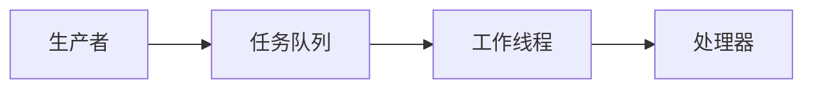
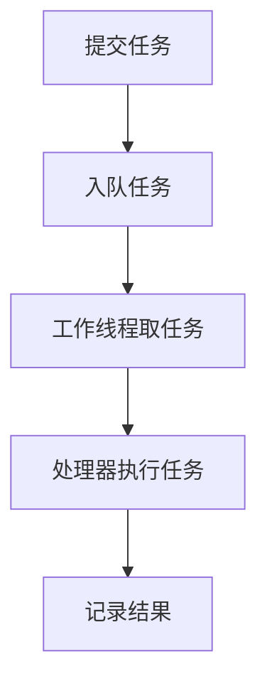
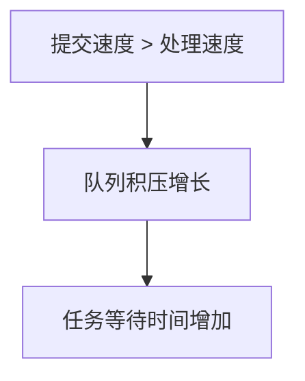
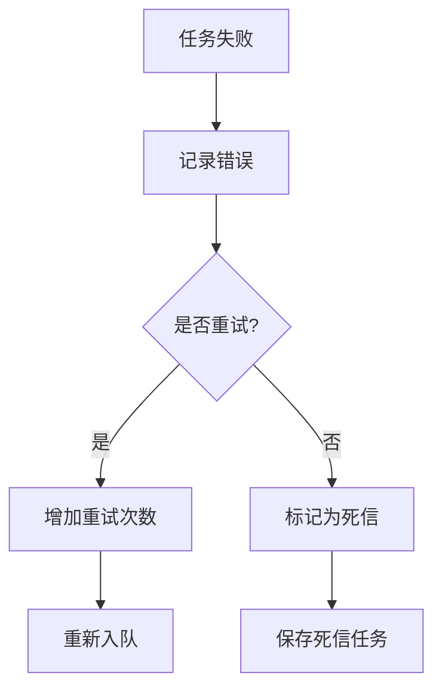
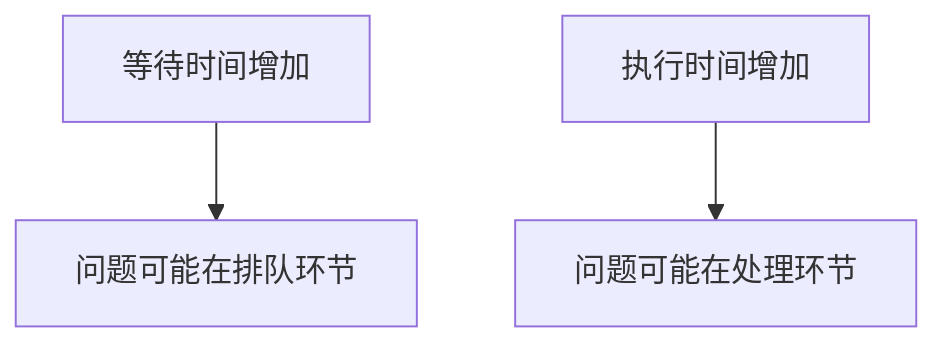
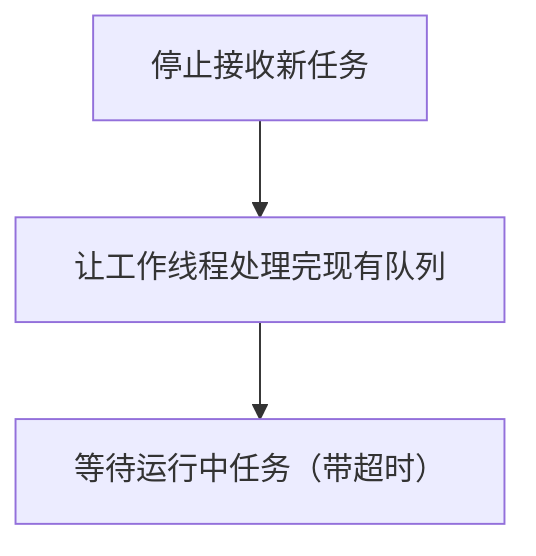
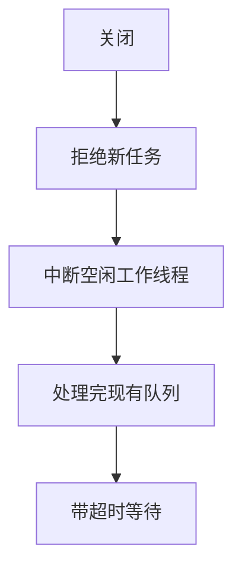

在后端系统中，并不是所有任务都适合放在请求线程里同步执行。文件解析、图片处理、用户通知、报表生成、缓存刷新这类任务，通常耗时较长，并且不一定要阻塞当前请求。如果它们全部压在请求线程里，接口响应会变慢，请求线程也会被长时间占用。

并发任务处理系统要解决的核心问题，不只是“开几个线程异步执行任务”，而是：当任务不断产生，而系统资源有限时，如何让任务有边界地排队、被工作线程处理，并在队列堆积、执行失败、系统关闭时保持可控。

本章先讨论单机内存版任务处理系统。它不引入数据库任务表，也不引入 MQ，而是先把最小模型讲清楚：任务如何建模，为什么需要有界队列，Worker 如何执行任务，队列满了怎么办，任务失败后如何重试，以及系统如何监控和关闭。

## 1、为什么不能在请求线程里直接处理任务

假设有一个文件上传接口。用户上传文件后，系统需要保存原文件、解析文件内容、生成预览图，并通知用户处理结果。最直接的写法是：

```java
public void upload(File file) {
    saveOriginalFile(file);
    parseFile(file);
    generatePreview(file);
    notifyUser(file);
}
```

这段代码的问题不是不能运行，而是所有工作都压在请求线程里。只要文件变大、解析变慢、通知接口超时，请求响应就会被拖慢。如果并发请求继续增加，请求线程会越来越多地阻塞在这些耗时逻辑上，最终可能导致 Web 容器的业务线程被占满。

更合理的方式是让请求线程只完成必要的前置动作，然后把后续任务交给后台系统处理：

```java
public void upload(File file) {
    saveOriginalFile(file);

    Task task = new Task(
            UUID.randomUUID().toString(),
            TaskType.FILE_PARSE,
            file.getId()
    );

    taskSubmitter.submit(task);
}
```

这段代码里，请求线程不再直接解析文件，而是创建一个 `Task` 并提交出去。后续由后台 Worker 线程执行解析、生成预览和通知。

这个变化的本质是：请求线程负责产生任务，后台 Worker 负责执行任务，两者通过任务队列解耦。解耦之后，请求线程不需要等待整个文件处理完成，后台处理能力也可以通过 Worker 数量、队列容量、拒绝策略来单独控制。

## 2、一个任务系统里有哪些关键角色

一个单机并发任务处理系统，最小可以拆成四个角色：



这几个角色分别承担不同职责：

| 角色 | 作用 | 在主例子中的对应 |
|---|---|---|
| Producer | 产生并提交任务 | 文件上传接口 |
| Task | 描述一个待处理任务 | 文件解析任务 |
| Task Queue | 暂存暂时处理不过来的任务 | 有界阻塞队列 |
| Workers | 从队列中取任务并执行 | 后台工作线程 |
| Processor | 封装具体业务逻辑 | 解析文件、生成预览、通知用户 |

这里要注意，任务处理系统不是只有 Worker。Worker 只是执行者，如果没有任务模型，系统不知道自己执行的是什么；如果没有队列，任务提交速度和任务处理速度无法解耦；如果没有 Processor，业务逻辑会散落在 Worker 中，后续扩展和测试都会变得困难。

所以第一步不是急着调线程数，而是先建立角色关系：



后面的设计，都是围绕这条主线展开。

## 3、为什么要把任务建模成 Task

最简单的异步写法是直接提交一个 `Runnable`：

```java
executor.execute(() -> {
    parseFile(fileId);
    generatePreview(fileId);
    notifyUser(fileId);
});
```

这种写法适合临时异步执行一段代码，但不适合设计一个可管理的任务系统。因为 `Runnable` 只表达了“要执行什么代码”，没有显式表达任务身份、任务类型、创建时间、重试次数和执行状态。

一旦系统需要追踪任务属于谁、已经等待多久、失败过几次、当前执行到哪一步，直接提交 `Runnable` 就不够了。因此，任务系统通常需要先定义一个显式的任务对象：

```java
import lombok.Getter;
import lombok.RequiredArgsConstructor;

@Getter
@RequiredArgsConstructor
public class Task {

    private final String taskId;
    private final TaskType type;
    private final String bizId;
    private final long createTime = System.currentTimeMillis();

    private int retryCount = 0;
    private TaskStatus status = TaskStatus.CREATED;
    private String lastError;

    public void increaseRetryCount() {
        this.retryCount++;
    }

    public void markRunning() {
        this.status = TaskStatus.RUNNING;
    }

    public void markSuccess() {
        this.status = TaskStatus.SUCCESS;
    }

    public void markFailed(String error) {
        this.status = TaskStatus.FAILED;
        this.lastError = error;
    }

    public void markDead(String error) {
        this.status = TaskStatus.DEAD;
        this.lastError = error;
    }
}
```

任务类型可以先包括 `FILE_PARSE`、`IMAGE_RESIZE`、`USER_NOTIFY`，任务状态可以先包括 `CREATED`、`RUNNING`、`SUCCESS`、`FAILED`、`DEAD`。

这里的 `bizId` 用来保存业务对象 ID。对于文件解析任务，它可以是 `fileId`；对于用户通知任务，它可以是 `userId`；对于订单同步任务，它可以是 `orderId`。

这样设计之后，任务不再只是一个代码片段，而是一个可以被系统识别、排队、执行、监控和重试的对象。

## 4、为什么任务要进入有界队列

有了 `Task` 之后，下一个问题是：任务提交后是否应该立刻执行？如果任务产生速度很慢，Worker 又刚好空闲，任务可以很快被执行。但系统设计不能只考虑空闲状态，还要考虑任务突然增多的情况。比如某一段时间用户集中上传文件，请求线程不断创建文件解析任务，而 Worker 一时处理不过来，这时就需要队列暂存任务。

在单机内存模型中，可以用 `BlockingQueue<Task>` 表示任务队列：

```java
BlockingQueue<Task> taskQueue = new ArrayBlockingQueue<>(1000);
```

这里使用 `ArrayBlockingQueue`，并且给定容量 `1000`。重点不是具体数字，而是队列必须有上限。如果使用无界队列：

```java
BlockingQueue<Task> taskQueue = new LinkedBlockingQueue<>();
```

表面上任务不会被拒绝，但压力只是被藏进内存里。只要任务提交速度长期大于处理速度，队列就会持续增长，最终带来内存压力、GC 压力，甚至 OOM。

所以队列不是为了无限缓存任务，而是为了提供一个有限缓冲区。Worker 短时间处理不过来时，任务可以先排队；队列满了以后，系统必须暴露过载信号，而不是继续无边界接收任务。

提交任务时，推荐用 `offer()` 而不是 `put()`：

```java
public class TaskSubmitter {

    private final BlockingQueue<Task> taskQueue;

    public TaskSubmitter(BlockingQueue<Task> taskQueue) {
        this.taskQueue = taskQueue;
    }

    public SubmitResult submit(Task task) {
        if (taskQueue.offer(task)) {
            return SubmitResult.ACCEPTED;
        }

        return SubmitResult.REJECTED;
    }
}
```

提交结果可以定义为：

```java
public enum SubmitResult {
    ACCEPTED,
    REJECTED,
    CALLER_RUN,
    DROPPED
}
```

`offer()` 的含义是：如果队列有空间，就放入任务；如果队列已经满了，马上返回 `false`。这适合请求线程，因为请求线程不能无限阻塞等待。

与之相比，`put()` 在队列满时会一直阻塞。如果在请求线程里使用 `put()`，系统过载时请求线程会被越阻塞越多，反而可能把入口线程池拖垮。

| 方法 | 队列满时的行为 | 更适合的位置 |
|---|---|---|
| `offer()` | 马上返回失败 | 请求线程提交任务 |
| `put()` | 阻塞等待空间 | 后台生产者，且允许等待 |
| `add()` | 队列满时抛异常 | 不适合作为过载分支 |

在任务系统中，队列满不是代码异常，而是一个明确的过载信号。

## 5、Worker 如何从队列中取任务并执行

任务进入队列之后，需要有后台线程不断从队列中取任务。这个角色就是 Worker。

Worker 的基本职责很简单：等待任务、取出任务、交给 Processor 执行，然后继续等待下一个任务。

```java
public class TaskWorker implements Runnable {

    private final BlockingQueue<Task> taskQueue;
    private final TaskProcessor processor;

    public TaskWorker(BlockingQueue<Task> taskQueue,
                      TaskProcessor processor) {
        this.taskQueue = taskQueue;
        this.processor = processor;
    }

    @Override
    public void run() {
        while (true) {
            try {
                Task task = taskQueue.take();
                processor.process(task);
            } catch (InterruptedException e) {
                Thread.currentThread().interrupt();
                break;
            } catch (Exception e) {
                e.printStackTrace();
            }
        }
    }
}
```

这里 Worker 使用的是 `take()`。它和提交端的 `offer()` 正好形成对应关系：

| 方法 | 使用方 | 队列满或空时的行为 |
|---|---|---|
| `offer(task)` | 提交线程 | 队列满了马上返回失败 |
| `take()` | Worker 线程 | 队列空了阻塞等待 |

Worker 可以用 `take()`，是因为 Worker 本来就是后台工作线程，它的职责就是等待任务。队列为空时，让 Worker 阻塞等待，比让它不停空转更合理。不推荐在死循环里不断 `poll()`，因为队列为空时它会马上返回 `null`，导致 Worker 空转消耗 CPU。

具体业务逻辑放在 `TaskProcessor` 中：

```java
public class TaskProcessor {

    public void process(Task task) {
        task.markRunning();

        if (task.getType() == TaskType.FILE_PARSE) {
            parseFile(task.getBizId());
            generatePreview(task.getBizId());
            notifyUser(task.getBizId());
            task.markSuccess();
            return;
        }

        throw new IllegalArgumentException("Unsupported task type");
    }

    private void parseFile(String fileId) {
        // parse file
    }

    private void generatePreview(String fileId) {
        // generate preview
    }

    private void notifyUser(String fileId) {
        // notify user
    }
}
```

这样 Worker 和 Processor 的职责是分开的：

| 对象 | 关心的问题 |
|---|---|
| Worker | 如何从队列取任务，如何循环执行 |
| Processor | 某类任务具体怎么处理 |
| Task | 当前任务是谁、是什么状态 |

启动多个 Worker 时，只需要按 `workerCount` 创建多个 `TaskWorker` 线程，并统一管理它们的启动和关闭即可。至此，单机任务系统的最小执行闭环已经形成：创建任务，放入队列，Worker 从队列取出任务，Processor 执行业务逻辑，最后更新任务状态。

## 6、Worker 数量和队列容量如何设计

Worker 数量决定系统同时执行多少个任务，队列容量决定系统最多允许多少任务等待。二者必须一起看，不能只调其中一个。

如果 Worker 太少，处理速度跟不上提交速度，队列会持续堆积：



如果 Worker 太多，也不一定更快。文件解析任务可能会读文件、写数据库、调用通知接口。Worker 太多时，任务虽然并发执行了，但数据库连接池、磁盘 I/O、HTTP 下游可能被打满，单个任务耗时反而变长。

所以 Worker 数量的上限不只由线程决定，还受任务类型和下游资源影响：

| 任务类型 | 主要瓶颈 | Worker 数量倾向 |
|---|---|---|
| CPU 密集型 | CPU 计算 | 接近 CPU 核数 |
| I/O 密集型 | 数据库、文件、HTTP | 可以大于 CPU 核数，但受下游限制 |
| 混合型 | CPU + I/O | 从保守值开始压测调整 |

文件解析任务通常是混合型任务。它既可能消耗 CPU，也可能访问文件系统和数据库。因此第一版不要开得过大，可以先从保守值开始：

```java
int workerCount = 8;
BlockingQueue<Task> queue = new ArrayBlockingQueue<>(500);

TaskProcessor processor = new TaskProcessor();
TaskWorkerPool workerPool = new TaskWorkerPool(queue, processor, workerCount);

workerPool.start();
```

队列容量也不是越大越好。队列越大，系统越能吸收短时流量波动，但任务等待时间也会变长。队列太大还会隐藏过载，让系统很晚才暴露问题。

队列容量更合理的估算方式，是从业务可接受等待时间倒推：

```text
queue capacity ≈ process speed × acceptable wait time
process speed ≈ worker count / average task cost
```

假设有 8 个 Worker，单个文件解析任务平均耗时 200ms，那么系统大约每秒处理：

```text
8 / 0.2 = 40 tasks / second
```

如果业务允许任务最多等待 10 秒，队列容量可以先估算为：

```text
40 × 10 = 400
```

这个数字不是最终答案，但它比随手写 `10000` 更有意义。因为它表达的是：系统最多缓存大约 10 秒的任务量。

Worker 数量和队列容量最终都要通过实际指标校准，重点观察队列长度、任务等待时间、任务执行时间、CPU 使用率、数据库连接池使用率、失败率和超时率。任务系统不能只靠经验参数，必须配合监控一起设计。

## 7、队列满了以后系统如何自保

有界队列一定会出现满队列的情况。队列满不是 bug，而是系统告诉调用方：当前处理能力已经达到边界。

如果 `taskQueue.offer(task)` 返回 `false`，系统必须做选择。这个选择就是拒绝策略。

最直接的策略是快速拒绝：队列满了就返回 `REJECTED`。这种策略适合用户可以稍后重试，或者任务时效性很强的场景。比如某些通知任务已经严重堆积，再继续接收只会让用户更晚收到通知，甚至失去业务意义。

另一种策略是调用方自己执行，也就是反压：队列满了就让提交线程直接调用 `processor.process(task)`，然后返回 `CALLER_RUN`。它的效果是提交线程被迫变慢，从源头减轻队列压力。

不过这个策略不能乱用。如果任务很慢，而调用方是请求线程，那么请求线程会被拖住，入口线程池可能也被影响。它更适合任务较短、调用方允许变慢、并且任务不希望轻易丢弃的场景。

不同任务不应该使用同一种过载策略：

| 任务类型 | 队列满后的策略 |
|---|---|
| 文件解析 | 可以拒绝，让用户稍后重试 |
| 用户通知 | 可以降级或延后 |
| 日志上报 | 可以采样或丢弃 |
| 核心状态同步 | 不适合只放内存队列 |

这里先不展开“不能丢”的任务如何处理，因为那已经超出单机内存队列的边界。只需要先记住：队列容量定义了系统的缓冲边界，拒绝策略定义了越过边界后的自保方式。

## 8、任务失败后如何重试和隔离

任务被 Worker 取出后，也可能执行失败。比如文件不存在、文件格式错误、数据库写入失败、通知接口超时等。

如果 Worker 只是打印异常：

```java
try {
    Task task = taskQueue.take();
    processor.process(task);
} catch (Exception e) {
    e.printStackTrace();
}
```

那么任务失败以后就没有后续处理。系统既不知道任务是否要重试，也不知道失败原因是否需要保留。

更合理的做法是把失败处理从 Worker 中拆出来：

```java
public class TaskWorker implements Runnable {

    private final BlockingQueue<Task> taskQueue;
    private final TaskProcessor processor;
    private final TaskFailureHandler failureHandler;

    @Override
    public void run() {
        while (true) {
            Task task = null;

            try {
                task = taskQueue.take();
                processor.process(task);
            } catch (InterruptedException e) {
                Thread.currentThread().interrupt();
                break;
            } catch (Exception e) {
                if (task != null) {
                    failureHandler.handle(task, e);
                }
            }
        }
    }
}
```

Worker 仍然只负责取任务和调用 Processor。任务失败后，是否重试、是否进入死信，由 `TaskFailureHandler` 决定。

一个简单的重试策略可以先只控制最大重试次数，例如 `task.getRetryCount() < maxRetryCount`。失败处理器可以这样写：

```java
public class TaskFailureHandler {

    private final BlockingQueue<Task> taskQueue;
    private final RetryPolicy retryPolicy;

    public void handle(Task task, Exception e) {
        String error = e.getMessage();
        task.markFailed(error);

        if (shouldRetry(e) && retryPolicy.canRetry(task)) {
            task.increaseRetryCount();

            if (!taskQueue.offer(task)) {
                task.markDead("queue full when retry: " + error);
                saveDeadTask(task);
            }

            return;
        }

        task.markDead(error);
        saveDeadTask(task);
    }

    private boolean shouldRetry(Exception e) {
        return e instanceof TimeoutException
                || e instanceof IOException;
    }

    private void saveDeadTask(Task task) {
        // save to log, local file, monitoring system, or later persistent storage
    }
}
```

这段逻辑表达的是：



重试必须有边界。不能因为任务失败就无限重试，否则失败任务会一直占用 Worker。尤其当下游服务已经异常时，无限重试会持续放大故障。

也不是所有异常都适合重试：

| 失败类型 | 是否适合重试 | 例子 |
|---|---|---|
| 临时失败 | 适合 | 网络抖动、HTTP 超时 |
| 资源繁忙 | 适合延迟重试 | 下游限流、连接池满 |
| 参数错误 | 不适合 | 文件 ID 不存在 |
| 业务规则失败 | 不适合 | 当前状态不允许处理 |
| 代码 Bug | 不适合盲目重试 | 空指针、类型转换错误 |

如果失败是临时性的，最好不要立刻重试。因为马上重试很可能再次失败。更合理的是延迟重试，比如第一次失败后 5 秒重试，第二次失败后 30 秒重试，第三次失败后 2 分钟重试。

本章不展开 `DelayQueue` 的实现，只需要先建立设计原则：重试用于恢复临时失败，死信用于隔离长期失败。重试不能无边界，死信也不是简单丢弃，而是为后续排查和补偿保留入口。

## 9、任务系统如何监控和优雅关闭

任务系统跑起来以后，还需要知道它是否健康。不能只看服务进程是否存活，因为任务系统最常见的问题不是立刻宕机，而是队列慢慢堆积、任务越等越久、失败率逐渐升高。

最核心的指标包括队列长度、队列容量使用率、任务等待时间、任务执行时间、成功数、失败数、重试次数、死信数量和 Worker 存活数。为了统计等待时间和执行时间，可以给 `Task` 增加时间字段：

```java
private final long createTime;
private long startTime;
private long finishTime;

public void markRunning() {
    this.status = TaskStatus.RUNNING;
    this.startTime = System.currentTimeMillis();
}

public void markSuccess() {
    this.status = TaskStatus.SUCCESS;
    this.finishTime = System.currentTimeMillis();
}

public long getWaitTime() {
    return startTime - createTime;
}

public long getExecuteTime() {
    return finishTime - startTime;
}
```

这两个指标能帮助定位问题：



如果等待时间变长，但执行时间正常，说明 Worker 处理能力可能不足，或者任务提交速度突然升高。如果执行时间变长，说明业务逻辑或下游资源变慢，Worker 被慢任务占住，后续等待时间也会跟着升高。

队列指标可以定期采集：

```java
int queueSize = taskQueue.size();
int remainingCapacity = taskQueue.remainingCapacity();
int capacity = queueSize + remainingCapacity;
double usage = queueSize * 1.0 / capacity;
```

除了运行时监控，还要考虑服务关闭。关闭时 Worker 可能正在等待任务，也可能正在执行任务，队列里也可能还有任务。如果直接停进程，内存队列里的任务会丢失，正在执行的任务也可能只执行一半。

单机内存任务系统的优雅关闭，至少要做到三步：



可以给 WorkerPool 增加运行状态：

```java
public class TaskWorkerPool {

    private volatile boolean running = true;

    public boolean isRunning() {
        return running;
    }

    public void shutdown() {
        running = false;

        for (Thread worker : workers) {
            worker.interrupt();
        }
    }
}
```

Worker 循环可以从永久 `take()` 改成带超时的 `poll()`，这样它能周期性检查关闭状态：

```java
public void run() {
    while (pool.isRunning() || !taskQueue.isEmpty()) {
        try {
            Task task = taskQueue.poll(1, TimeUnit.SECONDS);

            if (task == null) {
                continue;
            }

            processor.process(task);
        } catch (InterruptedException e) {
            Thread.currentThread().interrupt();
            break;
        } catch (Exception e) {
            // handle failure
        }
    }
}
```

关键在循环条件：

```java
while (pool.isRunning() || !taskQueue.isEmpty())
```

它的含义是：只要系统还在运行，就继续取任务；即使系统已经开始关闭，只要队列里还有任务，也尽量继续处理；只有系统已经关闭，并且队列也空了，Worker 才退出。

关闭后还需要等待 Worker 结束，但不能无限等。通常会用 `join(timeout)` 或线程池的 `awaitTermination` 给 Worker 一个有限的完成窗口。这样关闭流程就有了边界：



不过要注意，内存队列只能做到“尽量处理”。如果机器宕机、进程被强杀，内存里的任务仍然会丢失。正在执行的任务是否能恢复，也没有可靠记录。

这正是单机内存任务系统的边界：它可以解决并发执行和短暂缓冲，但不能保证任务在重启、宕机、多实例部署下仍然可靠。

## 总结

并发任务处理系统的起点，是请求线程不适合直接承担所有耗时工作。为了让请求处理和后台执行解耦，系统需要把业务动作抽象成 `Task`，再通过有界队列把任务提交速度和任务执行速度隔开。

有了任务和队列之后，Worker 负责从队列中取任务，Processor 负责执行具体业务逻辑。Worker 数量决定并发执行能力，队列容量决定短时缓冲能力。二者都不能无限放大，因为真正的限制往往来自 CPU、数据库、文件系统、HTTP 下游和业务可接受延迟。

当队列满了，系统必须通过拒绝、降级、调用方执行等策略保护自己；当任务失败了，系统必须通过有限重试和死信隔离让失败能够收敛；当系统运行起来以后，还需要通过队列长度、等待时间、执行时间、失败率和 Worker 存活数判断它是否健康；当服务关闭时，也要先停止接收新任务，再尽量处理完已进入队列的任务。

因此，单机内存任务系统解决的是“有限资源下如何有边界地并发处理任务”。它适合轻量异步、短暂削峰和允许一定丢失风险的任务。但如果任务不能丢，需要跨机器共享，或者服务重启后还要恢复执行，就必须继续引入数据库任务表或 MQ。那已经是可靠任务系统要解决的问题。
