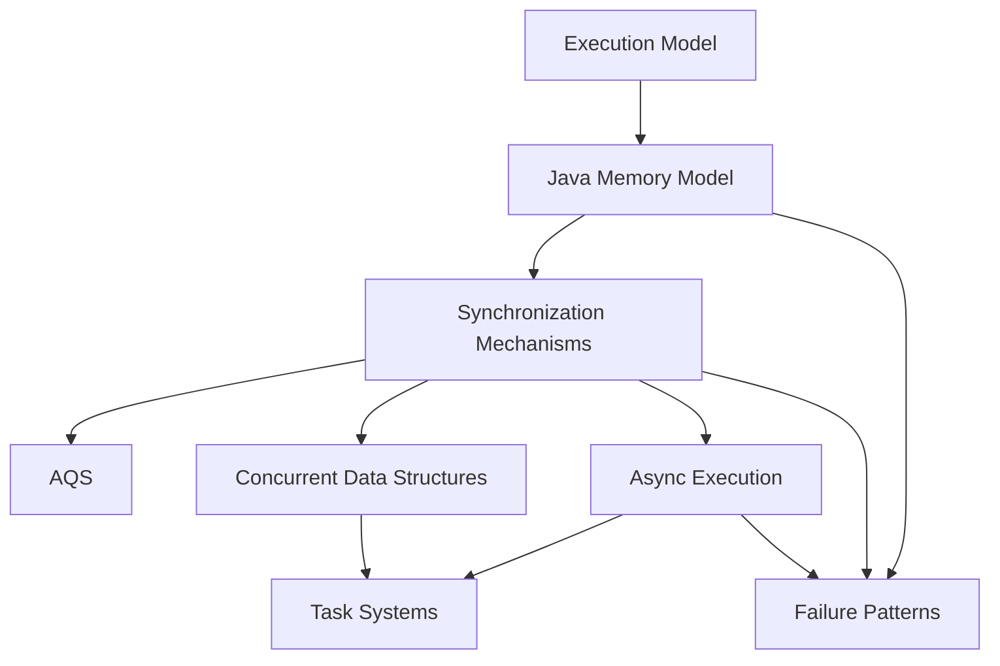

# Concurrency Map

[[wiki/series/concurrency|返回并发系列]]

## 这页解决什么问题

`concurrency` 这个系列很大，不能只按“API 清单”去看。

更自然的拆法是先回答：

> Java 并发系统到底由哪几层组成，这几层之间怎么咬合？

## 第一层拆解

这条知识树目前先拆成 6 个一级模块：

1. [[wiki/concepts/concurrency/执行模型|执行模型]]
2. [[wiki/concepts/concurrency/Java内存模型|Java Memory Model]]
3. [[wiki/concepts/concurrency/同步机制|同步机制]]
4. [[wiki/concepts/concurrency/异步执行|任务执行与异步编排]]
5. [[wiki/concepts/concurrency/并发容器|并发容器与数据结构]]
6. [[wiki/concepts/concurrency/任务系统|任务系统与系统边界]]

另外，还有一组横切问题：

- [[wiki/concepts/concurrency/故障模式|故障模式与安全停止]]

## 一张总图

## 怎么理解这个顺序

- `Execution Model` 解释程序、线程、CPU 到底怎么跑
- `Java Memory Model` 解释可见性、原子性、有序性靠什么成立
- `Synchronization Mechanisms` 解释锁、无锁、队列、唤醒这些基础构件
- `Async Execution` 解释线程池、Future、CompletableFuture、ForkJoinPool 如何把任务跑起来
- `Concurrent Data Structures` 解释高并发容器为什么安全、为什么快
- `Task Systems` 解释从单机并发走向可靠任务系统时，边界如何变化

## 第二层高频节点

这一版已经优先拆出了几个最值得继续下钻的高频节点：

- [[wiki/concepts/concurrency/CAS|CAS]]
- [[wiki/concepts/concurrency/volatile|volatile]]
- [[wiki/concepts/concurrency/ReentrantLock|ReentrantLock]]
- [[wiki/concepts/concurrency/ThreadLocal|ThreadLocal]]
- [[wiki/concepts/concurrency/ConcurrentHashMap|ConcurrentHashMap]]
- [[wiki/concepts/concurrency/ForkJoinPool|ForkJoinPool]]

这一层也已经补上了“同步协作与阻塞唤醒”相关节点：

- [[wiki/concepts/concurrency/对象监视器|Object Monitor]]
- [[wiki/concepts/concurrency/Condition|Condition]]
- [[wiki/concepts/concurrency/CountDownLatch|CountDownLatch]]
- [[wiki/concepts/concurrency/Semaphore|Semaphore]]
- [[wiki/concepts/concurrency/BlockingQueue|BlockingQueue]]
- [[wiki/concepts/concurrency/LockSupport|LockSupport]]

这一层继续补上的进阶节点包括：

- [[wiki/concepts/concurrency/synchronized|synchronized]]
- [[wiki/concepts/concurrency/Happens-Before|happens-before]]
- [[wiki/concepts/concurrency/FutureTask|FutureTask]]
- [[wiki/concepts/concurrency/CompletableFuture|CompletableFuture]]
- [[wiki/concepts/concurrency/ReentrantReadWriteLock|ReentrantReadWriteLock]]
- [[wiki/concepts/concurrency/StampedLock|StampedLock]]
- [[wiki/concepts/concurrency/LongAdder|LongAdder]]

为了让整棵树的挂点更完整，这一版也把剩下几类“原文已经明确讲到，但之前还没有独立节点”的主题补上了：

- [[wiki/concepts/concurrency/丢失更新|count++ 与丢失更新]]
- [[wiki/concepts/concurrency/锁竞争与性能开销|锁竞争与性能开销]]
- [[wiki/concepts/concurrency/缓存一致性|缓存一致性]]
- [[wiki/concepts/concurrency/ThreadPoolExecutor|ThreadPoolExecutor]]
- [[wiki/concepts/concurrency/Future|Future]]
- [[wiki/concepts/concurrency/CompletableFuture异常处理|CompletableFuture 异常处理]]
- [[wiki/concepts/concurrency/ABA|ABA]]
- [[wiki/concepts/concurrency/线程中断|线程中断与安全停止]]
- [[wiki/concepts/concurrency/死锁活锁与饥饿|死锁、活锁与饥饿]]
- [[wiki/concepts/concurrency/Worker执行模型|Worker 执行模型]]
- [[wiki/concepts/concurrency/可靠任务系统|可靠任务系统]]

## 推荐回看原文

- [[_posts/concurrency/01-计算机是如何执行Java程序的|01-计算机是如何执行 Java 程序的]]
- [[_posts/concurrency/08-Java内存到底规定什么|08-Java 内存模型到底规定了什么]]
- [[_posts/concurrency/19-AQS 独占与共享模式如何完成排队与唤醒|19-AQS 独占与共享模式如何完成排队与唤醒]]
- [[_posts/concurrency/14-线程池如何复用和调度线程|14-线程池如何复用和调度线程]]
- [[_posts/concurrency/29-从内存队列到可靠任务系统：数据库任务表与 MQ 如何选择|29-从内存队列到可靠任务系统]]

## 相关概念

- [[wiki/concepts/concurrency/执行模型|执行模型]]
- [[wiki/concepts/concurrency/丢失更新|count++ 与丢失更新]]
- [[wiki/concepts/concurrency/缓存一致性|缓存一致性]]
- [[wiki/concepts/concurrency/Java内存模型|Java Memory Model]]
- [[wiki/concepts/concurrency/Happens-Before|happens-before]]
- [[wiki/concepts/concurrency/同步机制|同步机制]]
- [[wiki/concepts/concurrency/AQS|AQS]]
- [[wiki/concepts/concurrency/synchronized|synchronized]]
- [[wiki/concepts/concurrency/CAS|CAS]]
- [[wiki/concepts/concurrency/volatile|volatile]]
- [[wiki/concepts/concurrency/ReentrantLock|ReentrantLock]]
- [[wiki/concepts/concurrency/对象监视器|Object Monitor]]
- [[wiki/concepts/concurrency/Condition|Condition]]
- [[wiki/concepts/concurrency/CountDownLatch|CountDownLatch]]
- [[wiki/concepts/concurrency/Semaphore|Semaphore]]
- [[wiki/concepts/concurrency/异步执行|任务执行与异步编排]]
- [[wiki/concepts/concurrency/ThreadPoolExecutor|ThreadPoolExecutor]]
- [[wiki/concepts/concurrency/Future|Future]]
- [[wiki/concepts/concurrency/FutureTask|FutureTask]]
- [[wiki/concepts/concurrency/CompletableFuture|CompletableFuture]]
- [[wiki/concepts/concurrency/CompletableFuture异常处理|CompletableFuture 异常处理]]
- [[wiki/concepts/concurrency/ThreadLocal|ThreadLocal]]
- [[wiki/concepts/concurrency/ForkJoinPool|ForkJoinPool]]
- [[wiki/concepts/concurrency/并发容器|并发容器与数据结构]]
- [[wiki/concepts/concurrency/ConcurrentHashMap|ConcurrentHashMap]]
- [[wiki/concepts/concurrency/BlockingQueue|BlockingQueue]]
- [[wiki/concepts/concurrency/ReentrantReadWriteLock|ReentrantReadWriteLock]]
- [[wiki/concepts/concurrency/StampedLock|StampedLock]]
- [[wiki/concepts/concurrency/LongAdder|LongAdder]]
- [[wiki/concepts/concurrency/任务系统|任务系统与系统边界]]
- [[wiki/concepts/concurrency/Worker执行模型|Worker 执行模型]]
- [[wiki/concepts/concurrency/可靠任务系统|可靠任务系统]]
- [[wiki/concepts/concurrency/LockSupport|LockSupport]]
- [[wiki/concepts/concurrency/故障模式|故障模式与安全停止]]
- [[wiki/concepts/concurrency/线程中断|线程中断与安全停止]]
- [[wiki/concepts/concurrency/死锁活锁与饥饿|死锁、活锁与饥饿]]
