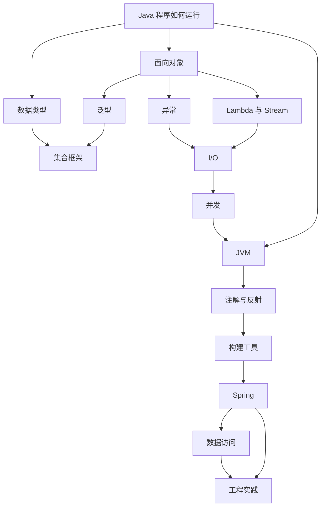

# Java-Basic 概念总图

[[wiki/series/java-basic|返回 Java 基础系列]]

## 这页解决什么问题

`Java-basic` 这个系列从基本类型一路到 Spring Boot 和 Kafka，跨度很大。

不能按"32 篇文章的目录"去看。更自然的拆法是先回答：

> Java 工程师的知识体系到底由哪些独立概念组成？它们之间怎么咬合？

## 第一层拆解

1. [[wiki/concepts/java-basic/Java-程序如何运行|Java 程序如何运行]]
2. [[wiki/concepts/java-basic/数据类型|数据类型]]
3. [[wiki/concepts/java-basic/面向对象|面向对象]]
4. [[wiki/concepts/java-basic/泛型|泛型]]
5. [[wiki/concepts/java-basic/集合框架|集合框架]]
6. [[wiki/concepts/java-basic/异常|异常]]
7. [[wiki/concepts/java-basic/Lambda与Stream|Lambda 与 Stream]]
8. [[wiki/concepts/java-basic/IO|I/O]]
9. [[wiki/concepts/java-basic/并发|并发]]
10. [[wiki/concepts/java-basic/JVM|JVM]]
11. [[wiki/concepts/java-basic/注解与反射|注解与反射]]
12. [[wiki/concepts/java-basic/构建工具|构建工具]]
13. [[wiki/concepts/java-basic/Spring|Spring]]
14. [[wiki/concepts/java-basic/数据访问|数据访问]]
15. [[wiki/concepts/java-basic/工程实践|工程实践]]

## 一张总图

## 怎么理解这个顺序

- `Java 程序如何运行` — 先理解 .java → .class → JVM 的全流程，这是所有知识的根
- `数据类型` + `面向对象` — 语言的两条腿：数据长什么样、代码怎么组织
- `泛型` + `集合框架` — 类型安全的数据容器
- `异常` + `Lambda 与 Stream` + `I/O` — 代码怎么处理错误、数据怎么流
- `并发` — 多线程编程的入口概括，深度内容桥接到独立的 [[wiki/concepts/concurrency/并发总图|并发知识库]]
- `JVM` — 上面所有代码的真实运行环境，也是线程调度和内存可见性的底层支撑
- `注解与反射` — "框架魔法"的底层积木
- `构建工具` — 从源码到可运行产物的工程化步骤
- `Spring` — Java 后端的事实标准骨架
- `数据访问` — 业务数据怎么存、怎么查、怎么缓存
- `工程实践` — 测试、Git、设计模式、消息队列等让代码走向生产的配套能力

## 相关概念

- [[wiki/concepts/java-basic/Java-程序如何运行|Java 程序如何运行]]
- [[wiki/concepts/java-basic/数据类型|数据类型]]
- [[wiki/concepts/java-basic/面向对象|面向对象]]
- [[wiki/concepts/java-basic/泛型|泛型]]
- [[wiki/concepts/java-basic/集合框架|集合框架]]
- [[wiki/concepts/java-basic/异常|异常]]
- [[wiki/concepts/java-basic/Lambda与Stream|Lambda 与 Stream]]
- [[wiki/concepts/java-basic/IO|I/O]]
- [[wiki/concepts/java-basic/并发|并发]]
- [[wiki/concepts/java-basic/JVM|JVM]]
- [[wiki/concepts/java-basic/注解与反射|注解与反射]]
- [[wiki/concepts/java-basic/构建工具|构建工具]]
- [[wiki/concepts/java-basic/Spring|Spring]]
- [[wiki/concepts/java-basic/数据访问|数据访问]]
- [[wiki/concepts/java-basic/工程实践|工程实践]]
