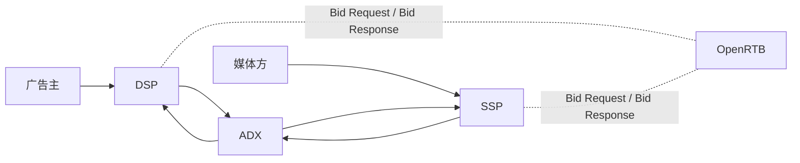

# programmatic-ads角色关系图

[[wiki/series/programmatic-ads|返回programmatic-ads系列]]

## 一句话总览

programmatic-ads的主链路可以先抓住 4 个核心角色：

- 广告主：出预算，关心效果
- [[DSP|DSP]]：站在需求方，决定“这次曝光值不值得买”
- [[SSP|SSP]]：站在供给方，决定“这个广告位怎么卖得更贵”
- [[ADX|ADX]]：站在交易中间层，负责标准化撮合和竞价规则

这些角色之间的通信语言，通常是 [[OpenRTB|OpenRTB]]。

## 关系图

## 怎么理解这张图

- DSP 的目标是帮广告主“更准地花钱”
- SSP 的目标是帮媒体方“更贵地卖流量”
- ADX 的目标是让 DSP 和 SSP 能在统一规则下完成实时交易
- OpenRTB 不是业务角色，而是这些系统之间常见的对接协议

## 从哪里继续读

- 想先看买方视角：[[DSP|DSP]]
- 想先看卖方视角：[[SSP|SSP]]
- 想先看交易所视角：[[ADX|ADX]]
- 想先看系统接口：[[OpenRTB|OpenRTB]]

## 延伸角色与规则

- 辅助 DSP 的平台体系：[[wiki/concepts/programmatic-ads/服务平台|广告服务平台]]
- programmatic-ads之前的重要中介：[[广告网盟|Ad Network]]
- 广告真正落地展示与记录的执行层：[[广告服务器|Ad Server]]
- 交易规则的整体地图：[[wiki/concepts/programmatic-ads/交易模式|交易模式框架]]
- 跨 SSP 竞争方式的关键节点：[[wiki/concepts/programmatic-ads/头部竞价|Header Bidding]]
- 衡量效果的指标体系：[[wiki/concepts/programmatic-ads/指标与归因|指标与归因]]

## 来源

- [[_posts/programmatic-ads/01-introduction|programmatic-ads (0)：先看清楚整个江湖]]
- [[_posts/programmatic-ads/02-DSP|programmatic-ads (1)：DSP——广告主的“代理人”]]
- [[_posts/programmatic-ads/04-SSP|programmatic-ads (3)：SSP 和 ADX——媒体方的“商业化中枢”与“交易所”]]
- [[_posts/programmatic-ads/09-openRTB|programmatic-ads (8)：OpenRTB 2.5 协议 & Native Ads Spec 学习笔记]]
