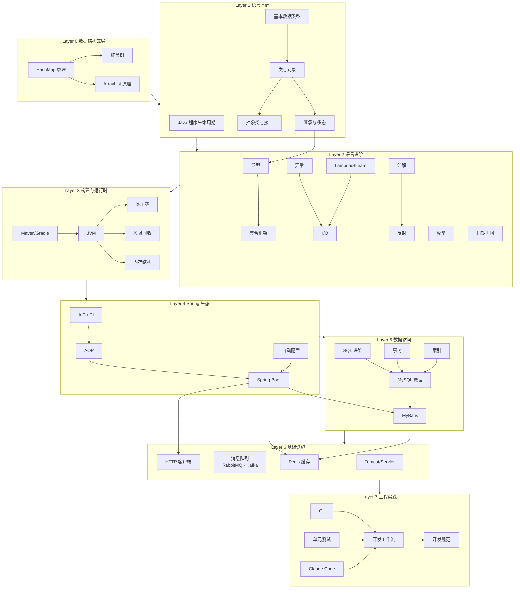

# Java 基础学习路径

[[wiki/index|返回 Wiki 首页]]

这是一张按**依赖关系**组织的 Java 基础知识学习地图。从语言基础到框架工程，每一层是上一层的基础，建议从下往上阅读。**点击 Mermaid 图中的节点可跳转到对应的概念页或词汇页。**

## 概念依赖图

## 推荐阅读路线

### 路线 A：系统学习（从底向上）

| 阶段 | 主题 | 核心概念 | 原始文章 |
| --- | --- | --- | --- |
| 0 底层 | 数据结构内部原理 | [[wiki/glossary/java-basic/HashMap\|HashMap]]、[[wiki/glossary/java-basic/红黑树\|红黑树]]、[[wiki/glossary/java-basic/ArrayList\|ArrayList]] | post 32 |
| 1 基础 | Java 语言基础 | [[wiki/glossary/java-basic/原始类型\|数据类型]]、[[wiki/concepts/java-basic/面向对象\|类与对象]]、[[wiki/glossary/java-basic/继承\|继承多态]] | post 01-05 |
| 2 进阶 | 语言进阶特性 | [[wiki/glossary/java-basic/泛型\|泛型]]、[[wiki/glossary/java-basic/Checked-Exception\|异常]]、[[wiki/glossary/java-basic/Lambda\|Lambda]]、[[wiki/glossary/java-basic/NIO\|I/O]]、[[wiki/glossary/java-basic/枚举\|枚举]]、[[wiki/glossary/java-basic/LocalDateTime\|日期]] | post 06-09, 13-14 |
| 3 运行时 | JVM 与构建 | [[wiki/glossary/java-basic/类加载\|类加载]]、[[wiki/glossary/java-basic/垃圾回收\|GC]]、[[wiki/glossary/java-basic/堆\|内存结构]]、[[wiki/glossary/java-basic/Maven\|Maven/Gradle]] | post 11, 15 |
| 4 反射 | 注解与反射 | [[wiki/glossary/java-basic/元注解\|元注解]]、[[wiki/glossary/java-basic/反射\|反射 API]]、[[wiki/glossary/java-basic/动态代理\|动态代理]] | post 12 |
| 5 Spring | Spring 核心 | [[wiki/glossary/java-basic/IoC\|IoC/DI]]、[[wiki/glossary/java-basic/AOP\|AOP]]、[[wiki/glossary/java-basic/SpringBoot\|Spring Boot]]、[[wiki/glossary/java-basic/自动配置\|自动配置]] | post 16-17 |
| 6 数据 | 数据访问层 | [[wiki/glossary/java-basic/SQL窗口函数\|SQL]]、[[wiki/concepts/java-basic/数据访问\|MySQL]]、[[wiki/glossary/java-basic/MyBatis\|MyBatis]]、[[wiki/glossary/java-basic/Redis\|Redis]] | post 18, 21, 23-24 |
| 7 网络 | HTTP 与 Servlet | [[wiki/glossary/java-basic/Tomcat\|Tomcat]]、[[wiki/glossary/java-basic/Servlet\|Servlet]] | post 22, 29 |
| 8 消息 | 消息队列 | [[wiki/glossary/java-basic/RabbitMQ\|RabbitMQ]]、[[wiki/glossary/java-basic/Kafka\|Kafka]] | post 30-31 |
| 9 工程 | 工程实践 | [[wiki/glossary/java-basic/设计模式\|设计模式]]、[[wiki/glossary/java-basic/JUnit-5\|测试]]、[[wiki/glossary/java-basic/Git\|Git]]、[[wiki/concepts/java-basic/工程实践\|工作流]] | post 19-20, 25-28 |

### 路线 B：问题驱动（按痛点跳读）

| 遇到的问题 | 直接跳到 |
| --- | --- |
| 泛型老是搞混 `? extends` 和 `? super` | [[wiki/glossary/java-basic/PECS\|PECS 原则]] |
| HashMap 底层到底怎么工作的 | [[wiki/glossary/java-basic/HashMap\|HashMap]] → [[wiki/glossary/java-basic/红黑树\|红黑树]] |
| Spring 的 @Autowired 怎么就能注入 | [[wiki/glossary/java-basic/IoC\|IoC]] → [[wiki/glossary/java-basic/DI\|依赖注入]] |
| JVM 内存不够了怎么办 | [[wiki/glossary/java-basic/堆\|堆内存]] → [[wiki/glossary/java-basic/垃圾回收\|GC]] |
| MyBatis 怎么写复杂查询 | [[wiki/glossary/java-basic/MyBatis\|MyBatis]] → [[wiki/glossary/java-basic/动态SQL\|动态 SQL]] |
| 事务什么时候会失效 | [[wiki/glossary/java-basic/事务\|事务]] |
| Redis 缓存怎么用才不踩坑 | [[wiki/glossary/java-basic/缓存穿透\|缓存穿透]] → [[wiki/glossary/java-basic/缓存雪崩\|缓存雪崩]] |
| Maven 依赖冲突了怎么排查 | [[wiki/glossary/java-basic/Maven\|Maven]] → [[wiki/glossary/java-basic/依赖冲突\|依赖冲突]] |
| Stream 操作链写出来不好读 | [[wiki/glossary/java-basic/Stream-API\|Stream API]] |

## Java 核心技术路线

```mermaid
graph LR
    subgraph LANG["Java 语言"]
        BASIC["基础语法<br/>类型·类·继承"]
        ADV["高级特性<br/>泛型·Lambda·异常"]
    end

    subgraph JVM_M["JVM 运行时"]
        MEM2["内存结构"]
        CL2["类加载"]
        GC2["垃圾回收"]
    end

    subgraph FW["框架生态"]
        SPRING["Spring<br/>IoC·AOP"]
        SB2["Spring Boot<br/>自动配置"]
    end

    subgraph DATA["数据层"]
        MYSQL2["MySQL"]
        REDIS2["Redis"]
        MYBATIS2["MyBatis"]
    end

    subgraph INFRA["基础设施"]
        TOMCAT2["Tomcat"]
        MQ2["消息队列"]
        HTTP2["HTTP 客户端"]
    end

    subgraph PRAC["工程实践"]
        TEST2["测试"]
        GIT2["Git"]
        DP["设计模式"]
    end

    LANG --> JVM_M --> FW --> DATA --> INFRA --> PRAC

    click BASIC "wiki/concepts/java-basic/面向对象编程.md"
    click ADV "wiki/concepts/java-basic/泛型与Lambda.md"
    click MEM2 "wiki/glossary/java-basic/堆.md"
    click CL2 "wiki/glossary/java-basic/类加载.md"
    click GC2 "wiki/glossary/java-basic/垃圾回收.md"
    click SPRING "wiki/concepts/java-basic/Spring-IoC-AOP.md"
    click SB2 "wiki/glossary/java-basic/SpringBoot.md"
    click MYSQL2 "wiki/concepts/java-basic/数据访问层.md"
    click REDIS2 "wiki/glossary/java-basic/Redis.md"
    click MYBATIS2 "wiki/glossary/java-basic/MyBatis.md"
    click TOMCAT2 "wiki/glossary/java-basic/Tomcat.md"
    click MQ2 "wiki/glossary/java-basic/Kafka.md"
    click HTTP2 "wiki/glossary/java-basic/Stream-API.md"
    click TEST2 "wiki/glossary/java-basic/JUnit-5.md"
    click GIT2 "wiki/glossary/java-basic/Git.md"
    click DP "wiki/glossary/java-basic/设计模式.md"
```

## 并发知识

Java-basic 系列的并发篇（post 10）是并发知识的入口概括篇，完整的并发知识体系请参考独立的并发知识库：

- [[wiki/maps/java-concurrency|Java 并发学习路径]] — 7 层概念依赖图
- [[wiki/series/concurrency|Java 高并发系列]] — 原始文章入口

## 相关入口

- [[wiki/series/java-basic|Java 基础系列（原始文章）]]
- [[wiki/glossary/java-basic/index|Java 基础词汇表]]
- [[wiki/maps/java-concurrency|Java 并发学习路径]]
- [[wiki/series/java-advanced|Java 进阶系列]]
