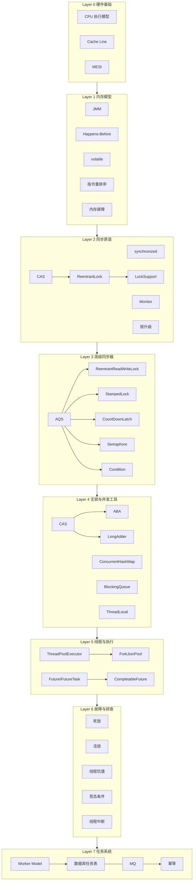
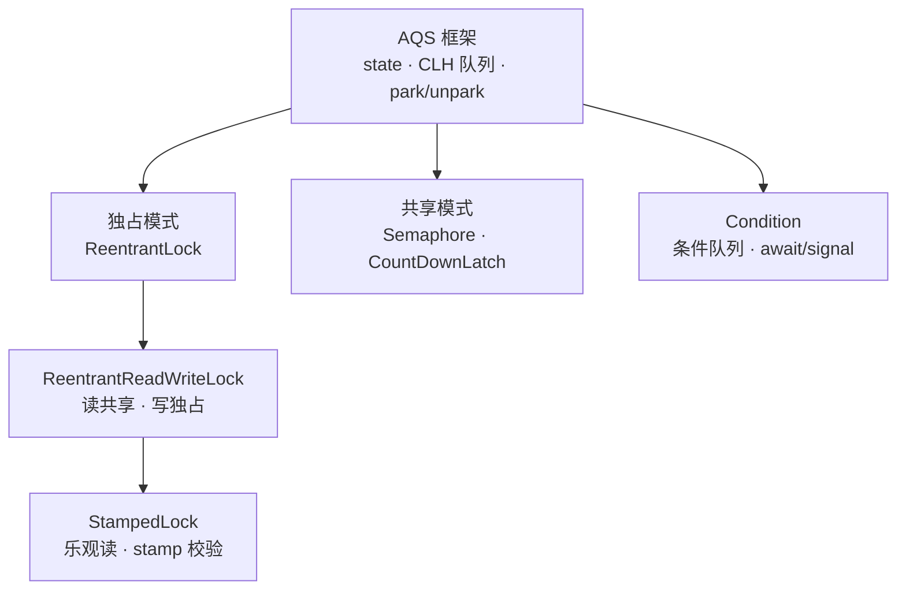
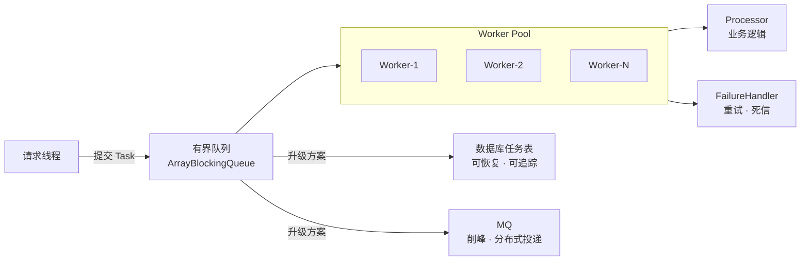
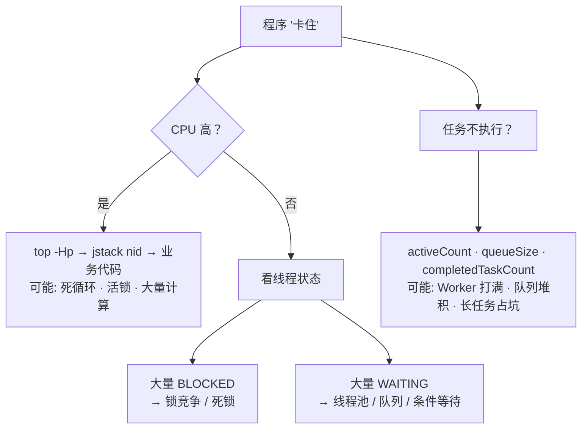

# Java 并发学习路径

[[wiki/index|返回 Wiki 首页]]

这是一张按**依赖关系**组织的学习地图——每一层概念是上一层的基础，建议从下往上阅读。

## 概念依赖图

## 推荐阅读路线

### 路线 A：系统学习（从底向上）

| 阶段   | 主题               | 核心概念                                                                  | 原始文章                       |
| ---- | ---------------- | --------------------------------------------------------------------- | -------------------------- |
| 0 硬件 | CPU 如何执行 Java 程序 | 执行模型、Cache Line、MESI                                                  | post 01, 06                |
| 1 内存 | Java 内存模型        | JMM、Happens-Before、volatile、重排序                                       | post 02, 07, 08            |
| 2 同步 | 锁与同步原语           | synchronized、Monitor、锁升级、ReentrantLock、AQS、LockSupport                | post 03-04, 09, 13, 19, 25 |
| 3 高级 | 高级同步器            | Condition、CountDownLatch、Semaphore、ReentrantReadWriteLock、StampedLock | post 10-12, 20             |
| 4 无锁 | 无锁与并发工具          | CAS、ABA、LongAdder、ConcurrentHashMap、BlockingQueue、ThreadLocal         | post 05, 18, 21-23         |
| 5 执行 | 线程池与异步           | ThreadPoolExecutor、Future/CompletableFuture、ForkJoinPool              | post 14-17, 26             |
| 6 故障 | 故障排查             | 死锁/活锁/饥饿、线程中断、jstack                                                  | post 24, 27                |
| 7 系统 | 任务系统设计           | Worker Model、有界队列、任务表、MQ、幂等                                           | post 28-29                 |

### 路线 B：问题驱动（按痛点跳读）

| 遇到的问题 | 直接跳到 |
| --- | --- |
| `count++` 结果不对 | [[wiki/concepts/concurrency/丢失更新\|Lost Update]] → [[wiki/glossary/concurrency/CAS\|CAS]] |
| 程序莫名卡住 | [[wiki/concepts/concurrency/死锁活锁与饥饿\|死锁/活锁/饥饿]] |
| 线程池怎么配都不对 | [[wiki/concepts/concurrency/ThreadPoolExecutor\|ThreadPoolExecutor]] → [[wiki/concepts/concurrency/BlockingQueue\|BlockingQueue]] |
| 服务重启后任务丢了 | [[wiki/concepts/concurrency/可靠任务系统\|可靠任务系统]] |
| 并发容器选哪个 | [[wiki/concepts/concurrency/ConcurrentHashMap\|ConcurrentHashMap]] → [[wiki/concepts/concurrency/BlockingQueue\|BlockingQueue]] |
| 异步任务怎么编排 | [[wiki/concepts/concurrency/CompletableFuture\|CompletableFuture]] |
| volatile 到底管不管用 | [[wiki/glossary/concurrency/volatile\|volatile]] → [[wiki/glossary/concurrency/JMM\|JMM]] |
| AQS 是什么为什么重要 | [[wiki/concepts/concurrency/AQS\|AQS]] |
| synchronized 和 ReentrantLock 怎么选 | [[wiki/glossary/concurrency/synchronized\|synchronized]] vs [[wiki/glossary/concurrency/ReentrantLock\|ReentrantLock]] |

## 同步机制层

## 执行与任务层

## 故障排查速查

## 相关入口

- [[wiki/series/concurrency\|Java 高并发系列（原始文章）]]
- [[wiki/glossary/concurrency/index\|Java 并发词汇表]]
- [[wiki/concepts/concurrency/并发总图\|并发概念总图]]

