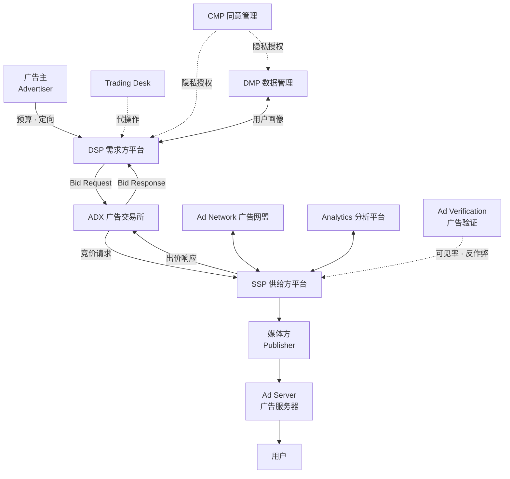
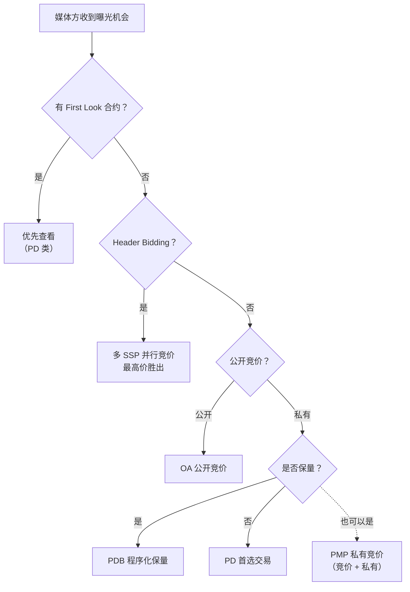
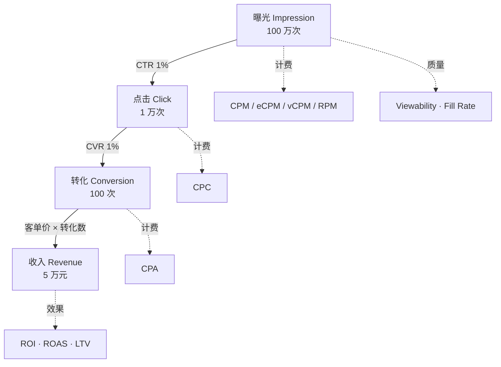
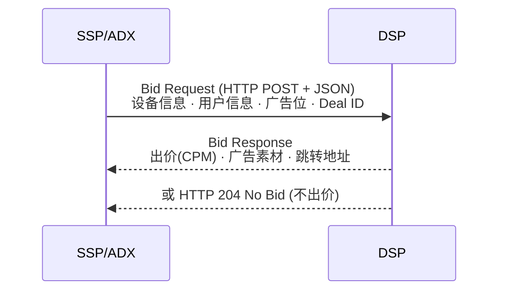

# programmatic-ads生态全景图

[[wiki/index|返回 Wiki 首页]]

一次广告曝光背后的完整链路——从用户打开页面到广告展示，涉及的角色、交易、协议和指标。

## 生态全景

## 角色关系

| 角色 | 一句话 | 概念页 | 词汇表 |
|------|--------|--------|--------|
| DSP | 广告主的自动出价代理人 | [[wiki/concepts/programmatic-ads/DSP\|概念]] | [[wiki/glossary/programmatic-ads/DSP\|词汇]] |
| SSP | 媒体方的流量变现平台 | [[wiki/concepts/programmatic-ads/SSP\|概念]] | [[wiki/glossary/programmatic-ads/SSP\|词汇]] |
| ADX | 连接买卖双方的交易所 | [[wiki/concepts/programmatic-ads/ADX\|概念]] | [[wiki/glossary/programmatic-ads/ADX\|词汇]] |
| Ad Network | 打包流量转售的网盟 | [[wiki/concepts/programmatic-ads/广告网盟\|概念]] | [[wiki/glossary/programmatic-ads/广告网盟\|词汇]] |
| Ad Server | 素材存储与投放服务 | [[wiki/concepts/programmatic-ads/广告服务器\|概念]] | [[wiki/glossary/programmatic-ads/广告服务器\|词汇]] |
| DMP | 数据管理平台 | [[wiki/concepts/programmatic-ads/DMP\|概念]] | [[wiki/glossary/programmatic-ads/DMP\|词汇]] |
| CMP | 用户隐私授权管理 | [[wiki/concepts/programmatic-ads/CMP\|概念]] | [[wiki/glossary/programmatic-ads/CMP\|词汇]] |
| Trading Desk | DSP 的专业操作服务商 | [[wiki/concepts/programmatic-ads/服务平台\|概念]] | [[wiki/glossary/programmatic-ads/交易桌面\|词汇]] |

## 交易模式决策树

| 交易模式 | 竞价 | 公开 | 保量 | 词汇表 |
|----------|------|------|------|--------|
| OA (Open Auction) | 是 | 公开 | 否 | [[wiki/glossary/programmatic-ads/OA\|OA]] |
| PMP (Private Marketplace) | 是 | 私有 | 否 | [[wiki/glossary/programmatic-ads/PMP\|PMP]] |
| PD (Preferred Deal) | 否 | 私有 | 否 | [[wiki/glossary/programmatic-ads/PD\|PD]] |
| PDB (Programmatic Direct) | 否 | 私有 | 是 | [[wiki/glossary/programmatic-ads/PDB\|PDB]] |
| Header Bidding | 是 | 跨 SSP | 否 | [[wiki/glossary/programmatic-ads/头部竞价\|词汇]] |
| Waterfall | 串行 | — | — | [[wiki/glossary/programmatic-ads/瀑布流\|词汇]] |

## 指标漏斗

| 层级 | 核心指标 | 计费方式 |
|------|----------|----------|
| 曝光层 | Impression、Viewability、Fill Rate | CPM、eCPM、vCPM、RPM |
| 点击层 | CTR | CPC |
| 转化层 | CVR | CPA |
| 效果层 | ROI、ROAS、LTV | — |

## 协议层

## 推荐阅读路线

| 阶段 | 主题 | 原始文章 |
|------|------|----------|
| 1 全景 | 生态总览 | [[_posts/programmatic-ads/01-introduction\|post 01]] |
| 2 需求方 | DSP + 服务平台 | [[_posts/programmatic-ads/02-DSP\|post 02]] · [[_posts/programmatic-ads/03-DSP-helper\|post 03]] |
| 3 供给方 | SSP/ADX + Ad Network/Server | [[_posts/programmatic-ads/04-SSP\|post 04]] · [[_posts/programmatic-ads/05-Ad network&server\|post 05]] |
| 4 交易 | 交易模式（上+下） | [[_posts/programmatic-ads/06-trading-mode-part1\|post 06]] · [[_posts/programmatic-ads/07-trading-mode-part2\|post 07]] |
| 5 指标 | 考核指标与归因 | [[_posts/programmatic-ads/08-key-metrics\|post 08]] |
| 6 协议 | OpenRTB 协议 | [[_posts/programmatic-ads/09-openRTB\|post 09]] |

## 相关入口

- [[wiki/series/programmatic-ads\|programmatic-ads系列]]
- [[wiki/glossary/programmatic-ads/index\|programmatic-ads词汇表]]
- [[wiki/concepts/programmatic-ads/角色总图\|角色关系图]]
- [[wiki/concepts/programmatic-ads/交易模式\|交易模式框架]]
- [[wiki/concepts/programmatic-ads/指标\|Metrics]]
